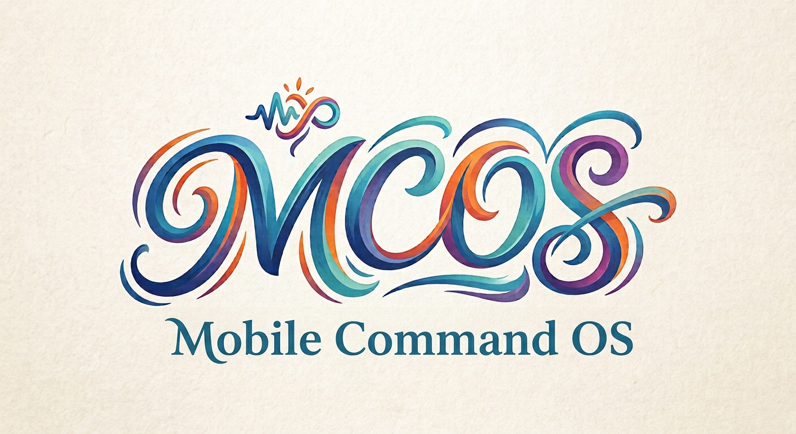

<div align="center">



# MCOS — 移动命令操作系统

**让手机上的每一个合作能力，都变成 AI 可以安全调用的命令。**

[](https://central.sonatype.com/artifact/io.github.morainet/mcos-bom/overview)
[](https://github.com/Morainet/mcos/actions/workflows/ci.yml)
[](https://github.com/Morainet/mcos/blob/main/LICENSE)
[](./CONTRIBUTING.md)

[](https://kotlinlang.org)
[](./mcos-android-sdk/README.md)
[](https://openjdk.org/projects/jdk/17/)
[](#构建)
[](https://github.com/Morainet/mcos/commits/main)

[快速开始](#快速开始) · [运行原理](#运行原理) · [模块组成](#模块组成) · [文档导航](#文档导航) · [反馈问题](https://github.com/Morainet/mcos/issues) · [English](./README.md)

*开源的**移动命令总线**——一句话类比：手机端的 Kubernetes + MCP + Claude Code Runtime。护城河是开放的命令协议本身，而不是某个模型或厂商。*

</div>

---

## 目录

- [为什么是 MCOS](#为什么是-mcos)
- [运行原理](#运行原理)
- [快速开始](#快速开始)
- [模块组成](#模块组成)
- [文档导航](#文档导航)
- [构建](#构建)
- [发布](#发布)
- [贡献与许可](#贡献与许可)

## 为什么是 MCOS

- 🧠 **AI 只生成命令，不直接触碰设备。** Intent、Accessibility、蓝牙、IoT 等真实操作一律由 Runtime 在权限校验后执行，AI 始终待在沙箱里。
- 🔒 **Runtime 掌管安全。** 权限、限流、确认策略、审计都在 Runtime 内核，不依赖插件的自觉。
- 🔀 **模型无关。** OpenAI、Gemini、Qwen、DeepSeek、Claude、端侧模型——换模型不换命令面。
- 📜 **协议即护城河。** 就像 HTTP 统一了 Web、SQL 统一了数据访问，MCOS 用开放 Command Protocol 统一移动应用能力。
- 🧱 **进程隔离（可选开启）。** 插件可在独立 `:mcos_plugin` 进程中运行，经 Binder RPC 与 stamp 域门实现强隔离。
- 🌍 **开放、可自托管。** 插件市场、配方商店、同步服务端、AI 规划——全部在仓库内、全部开源。

### 和现有项目的关系

| 层 | 代表项目 | 统一了什么 |
|------|----------|-----------|
| 代码工具 | Claude Code | 开发机上的操作 |
| 工具协议 | MCP（Model Context Protocol） | 桌面 / 服务端工具服务器 |
| 应用能力 | Android App Functions | App 内可调用函数 |
| 移动命令（OS 集成） | Google App Functions + Gemini；Apple App Intents + Apple Intelligence | OS 级命令总线——但各自锁定自身生态 |
| **移动命令（开放标准）** | **MCOS（本项目）** | **开放协议 + 可换模型 + 跨厂商插件生态** |

业界已经有了代码总线、工具总线、应用能力总线，也有了 OS 厂商内置的移动命令总线（Google / Apple）——**唯独缺一个开放的、模型无关的、不锁定单一 OS 厂商的移动命令总线标准**。

## 运行原理

自然语言进、可审计命令出——AI 负责规划，Runtime 负责执法，插件负责执行：

```text
   "把今天拍的照片压缩一下发给 Tom"
                      │
                      ▼
        ┌─────────────────────────┐
        │        AI 规划器         │  模型无关：OpenAI · Gemini · Qwen ·
        └───────────┬─────────────┘  Claude · DeepSeek · 端侧模型
                    ▼
              DSL ──► IR            类型化 · 可审计 · 可重放
                    ▼
        ┌─────────────────────────┐
        │      7 阶段执行器        │  权限 · 限流 · 确认 ·
        └───────────┬─────────────┘  stamp 域门 · 审计
                    ▼
        ┌─────────────────────────┐
        │   插件（可选隔离于        │  camera · files · iot · mcp · system …
        │   :mcos_plugin 进程）    │
        └───────────┬─────────────┘
                    ▼
               HostServices        net · files · ui · secureStore · clock
                    │
                    ▼
                 审计日志           每一个副作用都有据可查
```

示例交互（自然语言 → 编译出的命令）：

```text
> camera.scan          "帮我扫一下这个二维码"
> photo.compress       "把今天拍的照片压缩一下"
> home.scene.movie     "电影模式"
> iot.ac.set           "打开空调，24 度"
> home.light.set       "把客厅灯调到 50% 亮度"
```

以上都会被编译成**命令 DSL**，再经由 Runtime 在权限校验后执行。

## 快速开始

### Android 宿主 App

```kotlin
// settings.gradle.kts
dependencyResolutionManagement {
    repositories {
        google()   // mcos-android-sdk 依赖 androidx，必须声明
        mavenCentral()
    }
}
```

```kotlin
// build.gradle.kts —— 推荐走 BOM，保证各模块版本对齐
dependencies {
    implementation(platform("io.github.morainet:mcos-bom:0.0.3"))
    implementation("io.github.morainet:mcos-android-sdk")
}
```

```kotlin
class MyApplication : Application(), McosHostApp {
    override lateinit var deps: AppDeps
    override fun onCreate() {
        super.onCreate()
        deps = CompositionRoot.create(this)      // processIsolation = true 开启进程隔离
        RuntimeBootstrap.ensureRehydrated(deps)  // 恢复插件 + 重整备持久化调度
    }
}
```

三行即可启动——SDK 经 manifest merge 免费为你带来：调度/开机接收器、8 项权限、FileProvider，以及可选的 `:mcos_plugin` 隔离进程。完整集成见 [mcos-android-sdk/README.md](./mcos-android-sdk/README.md)。

### JVM 宿主与插件作者

```kotlin
dependencies {
    implementation(platform("io.github.morainet:mcos-bom:0.0.3"))
    implementation("io.github.morainet:mcos-runtime")   // JVM 宿主（服务端 / CLI / 桌面）
    // implementation("io.github.morainet:mcos-sdk")    // 插件作者：仅需契约层
}
```

## 模块组成

已实现的多模块 Gradle 工程（每个模块均有自己的 README）：

| 模块 | 内容 | 状态 |
|:------|:------|:----:|
| 📜 [`mcos-sdk`](./mcos-sdk/README.md) | 插件契约（`McosPlugin`、`CommandHandler`、`HostServices`、`ExecutionContext`、`AuthStamp`、`DirectorySandbox`） | ✅ |
| 🔒 [`mcos-security`](./mcos-security/README.md) | 权限内核（AuthStamp 铸造/签名）、限流、出网策略 + `DomainGlob`、企业策略、插件信任门、崩溃隔离、审计日志、Schema 校验 | ✅ |
| ⚙️ [`mcos-runtime-core`](./mcos-runtime-core/README.md) | DSL 解析器 → IR、命令注册中心（含 manifest-only 注册）、7 阶段执行器、隔离派发缝 + stamp 域门、事件总线、工作流引擎、记忆 | ✅ |
| 🧠 [`mcos-llm`](./mcos-llm/README.md) | AI 规划/对话、多 Provider 注册中心、语法约束解码、提示注入防护、多轮 Agent 循环 | ✅ |
| 🛒 [`mcos-marketplace`](./mcos-marketplace/README.md) | 索引客户端、安装流水线（含 manifest-only）、封禁清单验证、配方商店、依赖解析、用户举报、遥测、安装向导 | ✅ |
| 🚀 [`mcos-runtime`](./mcos-runtime/README.md) | 门面（`McosRuntime` builder、确认协调器、运行管理器、触发器协调器），组装各子模块 | ✅ |
| 🤖 [`mcos-android-sdk`](./mcos-android-sdk/README.md) | 无 UI Android 宿主 SDK：组合根、无头引导、调度/开机接收器、activity-result 与权限桥、MCP 服务器管理、动态 `.mcos` 加载、opt-in `:mcos_plugin` 进程隔离 | ✅ |
| 📱 [`mcos-android`](./mcos-android/README.md) | 基于 SDK 的 Compose 演示壳（可替换的参考 UI） | ✅ |
| 🖧 [`mcos-server`](./mcos-server/README.md) | 自托管同步端点：`SyncBlobTransport` REST 契约 + 强制 Bearer token 认证，不透明 blob 存储 | ✅ |

🔌 插件在 `plugins/` 下独立构建：`mcos-plugin-hello`、`mcos-plugin-system`、`mcos-plugin-camera`、`mcos-plugin-files`、`mcos-plugin-mcp`、`mcos-plugin-iot`（均带测试与 README）。

## 文档导航

设计 RFC 提供**中英双语**：中文见 `docs/zh/`，英文见 `docs/en/`。

| # | 文档 | 说明 |
|:--:|:------|:------|
| 00 | [愿景](./docs/zh/00-vision.md) | 为什么做 MCOS；原则；非目标 |
| 01 | [系统架构](./docs/zh/01-architecture.md) | 分层架构、请求生命周期、进程模型、IPC 契约、线程模型 |
| 02 | [命令协议（RFC）](./docs/zh/02-command-protocol.md) | **规范核心**：DSL / IR / 类型系统 / 错误码 |
| 03 | [运行时](./docs/zh/03-runtime.md) | 解析器、注册中心、执行器、权限内核、审计 |
| 04 | [插件 SDK](./docs/zh/04-plugin-sdk.md) | Manifest、Handler 契约、Host 服务 |
| 05 | [工作流引擎](./docs/zh/05-workflow.md) | 图 IR：顺序、并行、重试、补偿、触发器 |
| 06 | [AI 规划器](./docs/zh/06-agent.md) | AIProvider、命令编译器、修复循环 |
| 07 | [记忆](./docs/zh/07-memory.md) | 记忆分层、引用解析、隐私 |
| 08 | [安全](./docs/zh/08-security.md) | 威胁模型、纵深防御、确认 UX |
| 09 | [插件市场](./docs/zh/09-marketplace.md) | 签名、安装/更新、配方商店 |
| 10 | [路线图](./docs/zh/10-roadmap.md) | P0 → P4 路线图 |
| 11 | [实现状态](./docs/zh/11-implementation-status.md) | 文档 ↔ 代码实现对照（**先读这篇了解现状**） |
| — | [模块索引](./docs/zh/REPOSITORIES.md) | 模块依赖图与职责索引 |

黄金测试用例（DSL ↔ IR）：[`docs/fixtures/`](./docs/fixtures/)。变更记录：[`CHANGELOG.md`](./CHANGELOG.md)。

## 构建

本仓库 `gradlew` 无执行位，统一用 `sh gradlew`：

```bash
sh gradlew build                 # 全量门禁（JVM + Android + 测试）
sh gradlew test                  # 仅 JVM 模块测试
sh gradlew :mcos-android:assembleDebug   # 演示壳 APK
```

## 发布

制品发布到 Maven Central，坐标 `io.github.morainet`（通过 [Morainet](https://github.com/Morainet) GitHub 组织验证）。推送 `v<版本>` 标签即触发 [release workflow](./.github/workflows/release.yml)：构建门禁 → GPG 签名发布 → Central Portal 上传 → 附演示 APK 的 GitHub Release。本地演练：`sh gradlew publish` 填充 `build/central-bundle`（无签名、无需密钥）。

## 贡献与许可

[](./LICENSE)
[](./CONTRIBUTING.md)

[Apache License 2.0](./LICENSE) · [CONTRIBUTING.md](./CONTRIBUTING.md) · [CHANGELOG.md](./CHANGELOG.md)

---

<div align="center">

[English](./README.md) · **中文**

⭐ 如果 MCOS 正是你的 AI 应用缺的那一层，欢迎点个 Star。

</div>
