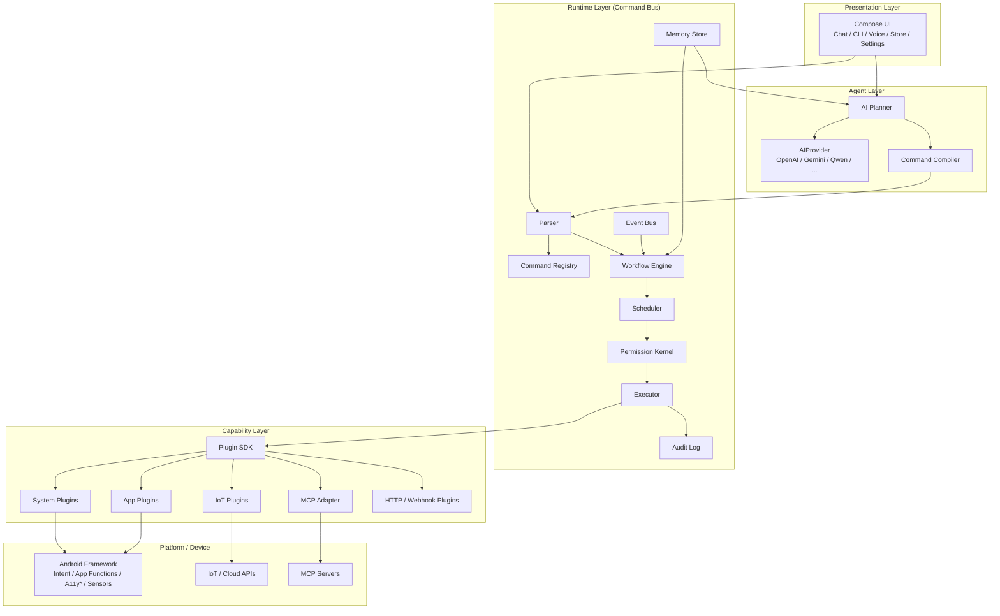
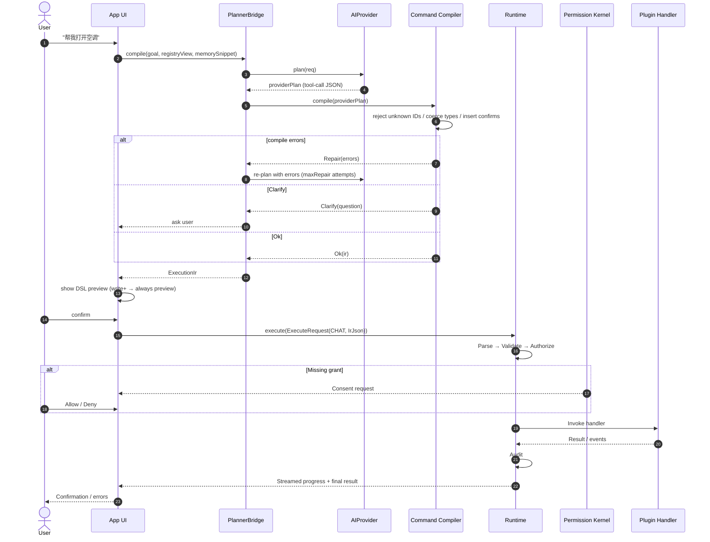
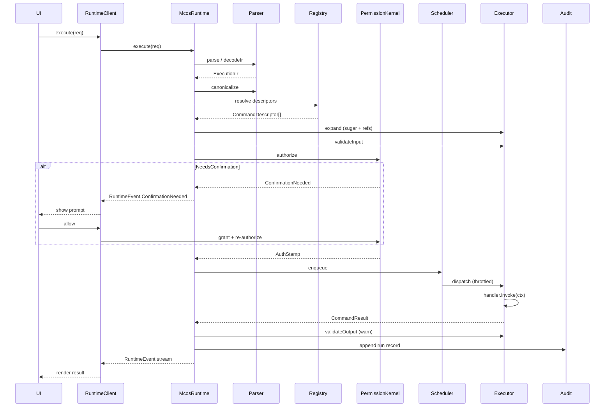
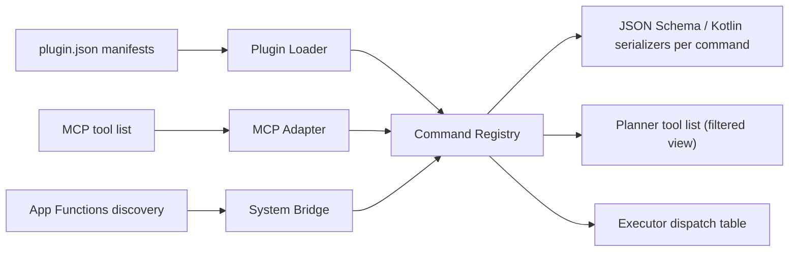
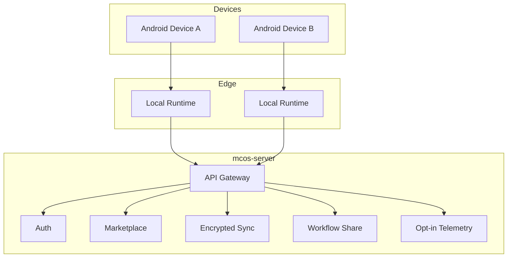

# MCOS System Architecture

> **Status:** Draft
> **Version:** 0.1.0
> **Last Updated:** 2026-08-06
> **Depends on:** [00-vision.md](./00-vision.md)
> **Normative companion:** [02-command-protocol.md](./02-command-protocol.md)

---

## 1. Goals of This Document

Define the **logical and physical architecture** of Mobile Command OS, from high-level layering down to implementation-level contracts:

- Layered system view
- Component responsibilities
- Data / control flows
- Process & process boundaries on Android, including the **App↔Runtime IPC contract**
- **Threading & coroutine model** (Dispatcher assignment, structured concurrency)
- **Runtime execution pipeline** (the 10 stages from parse to audit)
- **Core Kotlin types** (exact signatures an implementer writes)
- Cloud optional topology
- Cross-cutting concerns (security, observability, **unified error codes**, versioning)

This document is both descriptive (what the system is) and prescriptive (how to build it). Where it fills gaps that the normative RFCs ([02](./02-command-protocol.md), [08](./08-security.md)) left open, those gaps are tracked in [§18](#18-gap-closure-vs-normative-rfcs). **If this document conflicts with a normative RFC, the RFC wins.**

---

## 2. Architecture Principles Recap

1. **Protocol at the center** — all side effects go through Command DSL.
2. **Thin Runtime, fat Plugins** — domain logic stays out of the kernel.
3. **AI is a sidecar** — planners propose; Runtime disposes.
4. **Defense in depth** — App UI, Runtime policy, Android OS permissions.
5. **Replaceable edges** — LLM providers, IoT vendors, MCP servers, cloud backends.

Apache-style infrastructure mindset: **specs and kernels before skins**.

---

## 3. Logical Layer Diagram



\* Accessibility bridges are optional, highly restricted, and not the preferred integration path.

### 3.1 Package → module → phase

| Package | Gradle module | Phase |
|---------|---------------|-------|
| `com.mcos.android.ui` | `mcos-android` | P1 |
| `com.mcos.android.planner` | `mcos-android` | P1 |
| `com.mcos.runtime.api` | `mcos-runtime` | P1 |
| `com.mcos.runtime.parser` | `mcos-runtime` | P1 |
| `com.mcos.runtime.registry` | `mcos-runtime` | P1 |
| `com.mcos.runtime.permission` | `mcos-runtime` | P1 |
| `com.mcos.runtime.scheduler` | `mcos-runtime` | P1 |
| `com.mcos.runtime.executor` | `mcos-runtime` | P1 |
| `com.mcos.runtime.audit` | `mcos-runtime` | P1 |
| `com.mcos.runtime.eventbus` | `mcos-runtime` | P2 (seam now) |
| `com.mcos.runtime.memory` | `mcos-runtime` | P2 (seam now) |
| `com.mcos.runtime.workflow` | `mcos-runtime` | P2 (seam now) |
| `com.mcos.sdk` | `mcos-sdk` | P1 |

---

## 4. Control Plane vs Data Plane

| Plane | Responsibility | Examples |
|-------|----------------|----------|
| **Control plane** | Discover commands, load plugins, sync marketplace metadata, manage policies, update memory schemas | Registry refresh, plugin install, policy push |
| **Data / execution plane** | Accept DSL, authorize, schedule, invoke handlers, stream results | `camera.capture()`, workflow step run |

Keep marketplace and LLM config out of the hot path where possible. Execution must remain local-first.

---

## 5. End-to-End Request Lifecycle

### 5.1 Natural Language Path



### 5.2 Direct CLI / DSL Path

Power users and scripts skip Planner:

```text
Input: home.scene.movie
  → Parser
  → Registry resolve
  → Permission
  → Executor
  → Plugin(s)
  → Result
```

Same security path. No privilege escalation via "I typed DSL myself."

### 5.3 Event-Triggered Path (P2 seam)

```text
EventBus(WiFiConnected{ssid:"Office"})
  → Matching Workflow subscription
  → Scheduler
  → vpn.connect(profile="office")
```

Events never bypass Permission Kernel. Event→action rules containing `control`/`destructive` side effects must be pre-authorized at recipe install OR fire a high-priority notification confirmation.

---

## 6. Component Catalog

### 6.1 Presentation (`mcos-android`)

| Module | Responsibility |
|--------|----------------|
| Chat surface | Conversational goal entry, plan preview, confirmations |
| CLI surface | Line-oriented command entry, history, completion |
| Voice | STT → same planner path as text |
| Plugin Store UI | Browse / install / permissions review |
| Settings | Providers, policies, memory export, developer mode |
| History / Audit viewer | Past runs, diffs, re-run |

UI must be able to show **the compiled DSL** before destructive actions (policy-configurable).

### 6.2 AI Planner (`docs/06-agent.md`)

| Piece | Responsibility |
|-------|----------------|
| Goal understanding | Resolve references using Memory |
| Tool/schema prompting | Expose Registry subset to the model |
| Plan synthesis | Produce ordered / parallel steps |
| Command Compiler | Constrain output to Command DSL / Workflow IR |
| Repair loop | On validation failure, re-ask model with errors (maxRepair = 2 cloud / 1 on-device) |

Planner **proposes**. Runtime **validates and executes**.

### 6.3 Runtime (`mcos-runtime`)

| Subsystem | Responsibility |
|-----------|----------------|
| **Parser** | Lex/parse DSL text → AST; JSON IR support |
| **Command Registry** | Map `namespace.command` → plugin handler + schema |
| **Scheduler** | Queues, concurrency limits, priorities, cancellation |
| **Workflow Engine** | Graphs: seq, parallel, if, loop, retry, rollback |
| **Executor** | Invoke handlers with typed args + context; expand sugar/refs |
| **Permission Kernel** | Grants, scopes, one-shot confirmations, rate limits |
| **Memory** | Profiles, prefs, embeddings index (see `07`) |
| **Event Bus** | Device/system/plugin events → subscribers |
| **Audit Log** | Immutable-ish execution records for replay/debug |

### 6.4 Plugin SDK (`mcos-sdk`)

See [04-plugin-sdk.md](./04-plugin-sdk.md). Provides:

- Manifest schema
- Command handler interfaces
- Permission declaration helpers
- Result / progress / streaming types
- Test harness hooks

### 6.5 Plugins

| Class | Examples | Typical backends |
|-------|----------|------------------|
| System | `sys.notify`, `sys.intent`, `sys.share` | Android framework |
| Media | `camera.*`, `photo.*` | CameraX, MediaStore |
| Productivity | `note.*`, `mail.*`, `calendar.*` | Content providers / Intents |
| Dev | `github.*` | REST / MCP |
| IoT | `home.*`, `iot.*` | HA / Tuya / Matter |
| Bridge | `mcp.*` | MCP client |

### 6.6 Cloud (`mcos-server`, optional)

| Service | Responsibility |
|---------|----------------|
| Account & device sync | Encrypted settings, memory subsets |
| Marketplace index | Plugin metadata, signatures, versions |
| Workflow sharing | Community recipes (sanitized) |
| Remote policy (enterprise) | Optional MDM-like command allowlists |

Cloud is **not required** for local command execution.

---

## 7. Android Process Model & IPC Contract

### 7.1 Process topology

**MVP (P1): single process.** Runtime runs as an in-process singleton inside `:app`. `RuntimeClient` is a thin in-memory delegate — no Binder serialization overhead. This is deliberate: MVP scope (sequence-only workflows, no third-party plugins) does not need crash isolation.

**V1 (P2+): multi-process.** When third-party plugins or long-running background workflows land, Runtime moves to a dedicated `:runtime` process.

```text
┌─────────────────────────────────────────────┐
│  :app process                                │
│  Compose UI + thin Runtime client            │
└───────────────────┬─────────────────────────┘
                    │ Binder / AIDL / IPC
┌───────────────────▼─────────────────────────┐
│  :runtime process (isolated where possible)  │
│  Parser / Registry / Workflow / Executor     │
│  Permission Kernel / Audit                   │
└───────────────────┬─────────────────────────┘
                    │ Plugin host API
┌───────────────────▼─────────────────────────┐
│  Plugin hosts                                │
│  - Built-in (same or sibling process)        │
│  - Dynamic feature / DexClassLoader          │
│  - Bound services from partner apps          │
└─────────────────────────────────────────────┘
```

Rationale: crash isolation between UI and long-running workflows; clearer permission & audit boundary; foreground-service workflows without binding UI lifecycle.

**Migration seam:** `RuntimeClient` in `com.mcos.android` is the only App-side touchpoint. In MVP it holds a direct `McosRuntime` reference; in V1 it holds a Binder stub. The UI layer never knows which.

### 7.2 App↔Runtime contract (transport-agnostic)

The contract is defined once as a Kotlin interface in `mcos-sdk` (`com.mcos.sdk.runtime.RuntimeFacade`). Both the in-process delegate and the AIDL stub implement it:

```kotlin
package com.mcos.sdk.runtime

interface RuntimeFacade {
    suspend fun execute(request: ExecuteRequest): ExecuteHandle
    suspend fun preview(request: ExecuteRequest): PreviewResult
    suspend fun cancel(runId: RunId)
    fun observe(runId: RunId): kotlinx.coroutines.flow.Flow<RuntimeEvent>
    fun subscribe(listener: EventListener): Subscription           // EventBus subscription; see [03 §14](./03-runtime.md)
    suspend fun exportAudit(range: ClosedRange<Instant>?): Uri     // user-initiated JSONL export; see [03 §16](./03-runtime.md)
    suspend fun registrySnapshot(): List<CommandDescriptor>
    suspend fun resolveGrants(subject: String): List<Grant>
}
```

### 7.3 AIDL method table (V1 multi-process mode)

When the Binder transport is active, each `RuntimeFacade` method maps to an AIDL method. Parcelables carry the data; `JsonObject` (IR) is serialized as its canonical string form.

| `RuntimeFacade` method | AIDL method | In parcelable | Return / callback | Failure mapping |
|---|---|---|---|---|
| `execute` | `execute` | `ExecuteRequestParcel` | `ExecuteHandleParcel` + `IRuntimeCallback` (streaming events) | `SecurityException` → `PERMISSION_DENIED`; `RemoteException` → `UNAVAILABLE` |
| `preview` | `preview` | `ExecuteRequestParcel` | `PreviewResultParcel` (one-shot) | as above |
| `cancel` | `cancel` | `runId: String` | `void` | `RemoteException` → `UNAVAILABLE` |
| `observe` | (via callback registered at `execute`) | — | `onEvent(RuntimeEventParcel)` | callback dies → `RunCancelled` |
| `registrySnapshot` | `registrySnapshot` | — | `List<CommandDescriptorParcel>` | — |
| `resolveGrants` | `resolveGrants` | `subject: String` | `List<GrantParcel>` | — |

**Parcelable wrapping rules:**
- `JsonObject` IR → `String` field holding canonical JSON (keys sorted per [02 §7.4](./02-command-protocol.md)).
- `RuntimeEvent` → tagged union parcelable (`int type`, then type-specific fields).
- `CommandDescriptor` → flat parcelable; `inputSchema`/`outputSchema` as JSON strings.
- `Flow<RuntimeEvent>` over Binder → AIDL callback, bridged to a `callbackFlow` on the client side.

**V1 Service definition skeleton:**

```kotlin
// mcos-runtime/src/main/aidl/com/mcos/runtime/IRuntimeService.aidl
interface IRuntimeService {
    ExecuteHandleParcel execute(in ExecuteRequestParcel req, in IRuntimeCallback cb);
    PreviewResultParcel preview(in ExecuteRequestParcel req);
    void cancel(String runId);
    List<CommandDescriptorParcel> registrySnapshot();
    List<GrantParcel> resolveGrants(String subject);
}
```

The Android `Service` is foreground-pinned while any run is active.

---

## 8. Threading & Coroutine Model

| Component | Dispatcher | Rationale |
|-----------|-----------|-----------|
| `DslParser` | `Dispatchers.Default` | Untrusted input (Planner output / pasted DSL); off-main to protect UI from pathological nesting or oversized input. Input size caps enforced before parse ([02 §6.10](./02-command-protocol.md)). |
| `CommandRegistry` lookup | `Dispatchers.Default` | Pure O(1) hashmap; CPU-bound. |
| `PermissionKernel` | `Dispatchers.Default` | Pure computation + grant cache; CPU-bound. |
| `Scheduler` queue dispatch | custom `limitedParallelism(4)` on `Default` | Enforces global `maxParallel=4` via structured concurrency, not a lock. |
| `Executor` / plugin handler | per-descriptor: `Dispatchers.IO` (default) or `Dispatchers.Default` if `descriptor.tags` contains `"cpu-bound"` | Plugins vary; the hint lets CPU-heavy plugins not starve IO. |
| `AuditLog` write | `Dispatchers.IO.limitedParallelism(1)` | Single-writer channel → ordered, never blocks the success path (>20ms budget). |
| `EventBus` (P2 seam) | `Dispatchers.Default` | Pub/sub fan-out. |
| `PlannerBridge` client (App-side) | `Dispatchers.IO` | Network-bound LLM calls. |
| UI rendering | `Dispatchers.Main` | Compose contract. |

**Plugin override:** A plugin may declare `threadHint: "io" | "cpu" | "main"` in its manifest. The Executor honors it. `main` is restricted to plugins with `sideEffectClass: control` that need UI-thread Android APIs (e.g. CameraX) and is audited.

### 8.1 RunId scope & structured concurrency

Every `execute()` call creates a `CoroutineScope` rooted at a `SupervisorJob(runId)`:

```kotlin
class RunScope(val runId: RunId, parent: CoroutineScope) : CoroutineScope {
    override val coroutineContext =
        parent.coroutineContext + SupervisorJob(parent.job) + runIdMdc(runId)
}
```

- **Cancellation:** `cancel(runId)` cancels the SupervisorJob → all child step jobs cancel cooperatively → plugin `handler.cancel(ctx)` best-effort → audit `RunCancelled`.
- **Workflow steps (P2):** each step is a child `Job` of the run scope; a failed step does not cancel siblings unless the join policy requires it.
- **Failure isolation:** because the job is a `SupervisorJob`, one plugin's exception fails its step, not the whole Runtime process.

### 8.2 Timeout & cancellation semantics

| Trigger | Mechanism | Mapped error code |
|---|---|---|
| `descriptor.timeoutMs` elapsed | `withTimeout(timeoutMs)` around `handler.invoke` | `TIMEOUT` (retryable per workflow policy) |
| User `cancel(runId)` | `SupervisorJob.cancel()` | `CANCELLED` (never retryable) |
| Plugin throws `CancellationException` | propagates naturally | `CANCELLED` |
| Plugin throws other `Throwable` | caught by Executor, sanitized | `PLUGIN_ERROR` |
| Plugin host process death (V1) | Binder `DeadObjectException` | `UNAVAILABLE` + plugin marked unhealthy |

---

## 9. Runtime Execution Pipeline (10 Stages)

The Runtime pipeline is `parse → canonicalize → resolve → expand → validate → authorize → schedule → execute → validate-output → audit`.

### 9.1 Stage map

| # | Stage | Package | Input | Output | Failure code | Bypassable? | Audit event |
|---|-------|---------|-------|--------|--------------|-------------|-------------|
| 1 | Parse | `parser` | DSL text / IR JSON | `ExecutionIr` | `PARSE_ERROR` | no | — |
| 2 | Canonicalize | `parser` | `ExecutionIr` | `ExecutionIr` (normalized) | `PARSE_ERROR` | no | — |
| 3 | Resolve | `registry` | command IDs | resolved `CommandDescriptor`s | `UNKNOWN_COMMAND` | no | — |
| 4 | **Expand** | `executor` | `ExecutionIr` + Memory facade | expanded `ExecutionIr` | `SCHEMA_VIOLATION` | no | `sugarExpanded` |
| 5 | ValidateInput | `executor` | args + `inputSchema` | validated `JsonObject` args | `SCHEMA_VIOLATION` | no | — |
| 6 | Authorize | `permission` | descriptor + grants | `AuthStamp` or `ConfirmationNeeded` | `PERMISSION_DENIED` | no | `grantUsed` / `confirmRequested` |
| 7 | Schedule | `scheduler` | authorized run | enqueued job | `RATE_LIMITED` | no | — |
| 8 | Execute | `executor` | `ExecutionContext` | `CommandResult` | `PLUGIN_ERROR` / `TIMEOUT` / `UNAVAILABLE` | no | `stepExecuted` |
| 9 | ValidateOutput | `executor` | result + `outputSchema` | validated result | (warn) `INTERNAL` | yes (dev/strict only) | — |
| 10 | Audit | `audit` | full run record | append | — | no | `runRecorded` |

**The side-effect boundary:** Stages 1–7 perform **no side effects**. A failure in any of them is always recoverable and leaves the device untouched. Only Stage 8 (Execute) touches the world. This is the formal expression of [02 §9.1](./02-command-protocol.md)'s "Failure at any step before handler invocation MUST NOT cause side effects."

### 9.2 Stage details

**Stage 1 — Parse.** Conforms to all 8 golden fixtures in [`../fixtures/`](../fixtures/). Strict mode rejects unknown IR fields; lenient mode is dev-only.

**Stage 2 — Canonicalize.** Lowercase command IDs; sort object keys lexicographically (recursive); normalize numbers per schema type. Output is deterministic, suitable for hashing/audit.

**Stage 3 — Resolve.** Registry resolution policy: exact match preferred → else highest compatible minor/patch for same major → else `UNKNOWN_COMMAND`. Pinned workflows store resolved versions for reproducibility.

**Stage 4 — Expand** (sugar + Memory refs). Expands `date="today"` → RFC 3339 range; resolves `x-mcos-ref` (`name="空调"` → device id via `MemoryFacade.resolveRef`); injects `x-mcos-default-from-memory`. Order: sugar first (no Memory), then Memory refs. Records a `sugarExpanded` audit entry with before/after arg snapshots (redacted). MVP: Memory facade is a seam; sugar (dates) implemented in P1.

**Stage 5 — ValidateInput.** JSON Schema Draft 2020-12 + MCOS extensions. Path-qualified messages.

**Stage 6 — Authorize.** Permission Kernel: `required = descriptor.permissions ∪ pluginPermissions ∪ globalPolicy`; `missing = required − grants` → `ConfirmationNeeded` (if askable) or `Denied` (if sticky). On `Granted`, an `AuthStamp` is minted: short-lived, run-scoped, not forgeable by plugins.

**Stage 7 — Schedule.** Queues: `interactive` (CLI/Chat), `workflow` (P2), `background` (P2), `expedited` (cancels only). Global cap 4; per-plugin 2; `destructive` 1; IoT control serial per device id. Over-cap → `RATE_LIMITED`.

**Stage 8 — Execute.** Dispatches `handler.invoke(ctx)` on the descriptor-chosen Dispatcher with `withTimeout`. Exception mapping per [§10.3](#103-plugin-exception--code-mapping).

**Stage 9 — ValidateOutput.** Default: warn only. `RuntimeConfig.strictSchemaOutput = true` → fail with `INTERNAL`.

**Stage 10 — Audit.** Append to local store (Room/SQLCipher). Single-writer Dispatcher; write failure logs but does not fail the run (unless `auditFailClosed` for enterprise).

### 9.3 End-to-end pipeline diagram



---

## 10. Command Registry Architecture



Each registry entry (`CommandDescriptor`) includes at minimum:

| Field | Type | Required | Default | Constraint |
|-------|------|----------|---------|------------|
| `id` | string | yes | — | `namespace.name`, ≤128 chars, lowercase |
| `version` | string | yes | — | SemVer of command contract |
| `pluginId` | string | yes | — | reverse-DNS |
| `title` | string | yes | — | human-readable |
| `description` | string | yes | — | one-line |
| `inputSchema` | object | yes | — | JSON Schema 2020-12 |
| `outputSchema` | object | yes | — | JSON Schema 2020-12 |
| `permissions` | array | yes | `[]` | each `{type, name}` |
| `sideEffectClass` | enum | yes | — | `read` / `write` / `network` / `control` / `destructive` |
| `idempotent` | bool | no | `false` | gates retry |
| `timeoutMs` | int | no | `60000` | Executor deadline |
| `tags` | array | no | `[]` | may include `"cpu-bound"` thread hint |
| `examples` | array | no | `[]` | DSL strings |
| `deprecated` | bool | no | `false` | |
| `replacedBy` | string? | no | `null` | command-id |

**Registry views:** Full (developer tools), User-enabled (Planner + CLI completion), Policy-allowlisted (enterprise). The Planner never sees disabled or disallowed commands.

### 10.1 Side-effect classes & confirmation policy

| Class | Meaning | Default confirmation |
|-------|---------|----------------------|
| `read` | No lasting change | None |
| `write` | Creates/modifies data | First-run or policy |
| `destructive` | Deletes/irreversible | Always confirm |
| `network` | Leaves device boundary | Policy/first-run |
| `control` | Actuates device/IoT/VPN | Confirm unless trusted |

Policies may tighten; they must not loosen below user global settings. See [08-security.md](./08-security.md) for the full policy matrix.

### 10.2 Grant record

```json
{
  "subject": "command:camera.capture",
  "permissions": ["android:CAMERA", "mcos:command.camera.capture"],
  "state": "granted",
  "grantedAt": "2026-08-07T10:00:00Z",
  "expiresAt": null,
  "scope": "foreground_only"
}
```

**`state` values:** `granted` | `denied` | `ask_always` | `foreground_only`. Denial is **sticky** until user changes Settings — the Planner cannot override.

**`scope` vocabulary:**

| Scope value | Meaning |
|-------------|---------|
| `foreground_only` | Grant active only while app is in foreground |
| `session` | Grant active for the current app session |
| `persistent` | Grant survives until user revokes in Settings |
| `once` | Single-use, consumed after one invoke |

### 10.3 Plugin exception → code mapping

```kotlin
fun Throwable.toMcosError(): McosError = when (this) {
    is CancellationException -> McosError(CANCELLED, "cancelled")
    is TimeoutCancellationException -> McosError(TIMEOUT, "timeout")
    is McosException -> McosError(this.code, sanitize(this.message), this.retryable)
    else -> McosError(PLUGIN_ERROR, sanitize(this.message ?: "plugin error"))
}
```

Sanitization strips stack traces, file paths, and anything matching `x-mcos-secret` patterns. Full stack traces preserved only in `BuildConfig.DEBUG` audit records. Plugins may throw a typed `McosException(code, message, retryable)` to opt into a specific code.

---

## 11. Data Flow: Results, Streaming & Core Types

### 11.1 Execution context & host services

The SDK doc ([04 §6](./04-plugin-sdk.md)) historically called the plugin facade `PluginHost`; the Runtime doc called it `HostServices`. **This document standardizes on `HostServices`** as the single facade type:

```kotlin
package com.mcos.sdk

interface HostServices {
    fun files(): FileService
    fun net(): NetService
    fun ui(): UiService
    fun secureStore(): SecureStore
    fun clock(): Clock
    fun json(): kotlinx.serialization.json.Json
    fun memory(): MemoryFacade   // read-only view for plugins; P2
}
```

### 11.2 `ExecutionContext` & accessors

```kotlin
data class ExecutionContext(
    val runId: RunId,
    val stepId: StepId?,
    val commandId: CommandId,
    val args: JsonObject,            // validated, expanded
    val auth: AuthStamp,
    val deadline: kotlinx.datetime.Instant,
    val progress: ProgressEmitter,
    val services: HostServices,
) {
    // Typed accessors
    fun stringOrNull(key: String): String?
    fun intOrNull(key: String): Int?
    fun longOrNull(key: String): Long?
    fun boolOrNull(key: String): Boolean?
    fun doubleOrNull(key: String): Double?
    fun stringArrayOrNull(key: String): List<String>?
    fun refOrNull(key: String): String?          // pre-expanded by Stage 4
    suspend fun memoryDefault(keyPath: String): JsonElement?
}
```

### 11.3 `Artifact`

```kotlin
data class Artifact(
    val uri: String,        // content:// or file:// — never inline bytes
    val mime: String,       // e.g. "image/jpeg"
    val size: Long? = null, // bytes, if known
    val label: String? = null,  // human-readable
)
```

Artifacts are always URI-referenced. The Executor never serializes artifact bytes through the audit log.

### 11.4 Value classes & AuthStamp

```kotlin
@JvmInline value class RunId(val value: String)
@JvmInline value class StepId(val value: String)
@JvmInline value class CommandId(val value: String)

data class AuthStamp(
    val runId: RunId,
    val grantsUsed: List<String>,
    val expiresAt: kotlinx.datetime.Instant,  // run-scoped, short-lived
    val signature: ByteArray,                 // Runtime-signed; plugins cannot forge
)
```

### 11.5 `RuntimeEvent` (11 variants)

Plugins emit progress, logs, artifacts, results, and failures. UI and Audit subscribe to the same stream; UI may filter.

```kotlin
sealed class RuntimeEvent {
    abstract val runId: RunId
    abstract val timestamp: kotlinx.datetime.Instant

    data class RunStarted(…, val source: Source, val ir: ExecutionIr) : RuntimeEvent()
    data class StepStarted(…, val stepId: StepId, val commandId: CommandId) : RuntimeEvent()
    data class Progress(…, val stepId: StepId?, val percent: Int?, val message: String?) : RuntimeEvent()
    data class Artifact(…, val stepId: StepId?, val artifact: com.mcos.sdk.Artifact) : RuntimeEvent()
    data class Log(…, val stepId: StepId?, val level: LogLevel, val message: String) : RuntimeEvent()
    data class ConfirmationNeeded(…, val stepId: StepId?, val prompt: ConfirmationPrompt) : RuntimeEvent()
    data class StepSucceeded(…, val stepId: StepId, val value: JsonElement?, val durationMs: Long) : RuntimeEvent()
    data class StepFailed(…, val stepId: StepId, val error: McosError, val durationMs: Long) : RuntimeEvent()
    data class RunSucceeded(…, val totalDurationMs: Long) : RuntimeEvent()
    data class RunFailed(…, val error: McosError, val totalDurationMs: Long) : RuntimeEvent()
    data class RunCancelled(…, val reason: String) : RuntimeEvent()
}
```

### 11.6 `ExecuteRequest` / `PreviewResult`

```kotlin
data class ExecuteRequest(
    val source: Source,                                  // CLI, CHAT, VOICE, EVENT, API
    val payload: Payload,                                // DslText | IrJson | WorkflowRef
    val dryRun: Boolean = false,
    val confirmationMode: ConfirmationMode = ConfirmationMode.POLICY,
    val correlationId: String? = null,
)

enum class ConfirmationMode { POLICY, ALWAYS_CONFIRM, NEVER_CONFIRM }  // NEVER_CONFIRM only for read

sealed class PreviewResult {
    data class Ok(val ir: ExecutionIr, val descriptors: List<CommandDescriptor>, val wouldConfirm: Boolean) : PreviewResult()
    data class Err(val error: McosError) : PreviewResult()
}
```

---

## 12. Cloud Architecture (Optional)



Suggested stack (either is acceptable for V1):

- **Kotlin / Spring Boot** — if team is Android-heavy and wants shared DTOs
- **Go** — if marketplace + high QPS edge APIs are primary

Both must speak the same OpenAPI contracts for marketplace and sync.

---

## 13. Integration Surfaces

### 13.1 MCP

```text
MCP Server tools
  → MCP Adapter normalizes to Command descriptors
  → Registry registers as mcp.<server>.<tool>
  → Executor calls MCP client session
```

### 13.2 Android App Functions

Preferred for cooperating apps on modern Android:

```text
App Function discovery
  → sys.appfn.<pkg>.<function> or vendor alias
  → typed args bridge
```

### 13.3 Intent / Deep Link

Wrapped as commands with explicit extras schemas; never free-form Intent injection from model output without schema validation.

### 13.4 IoT

Plugins encapsulate vendor SDKs. Runtime only sees `home.light.on(id, ...)`.

---

## 14. Cross-Cutting Concerns

### 14.1 Security

See [08-security.md](./08-security.md).

Highlights:

- Capability-based grants per command / plugin
- Confirmation policies by `sideEffectClass`
- No raw shell / arbitrary Intent from untrusted DSL
- Plugin signature verification for marketplace installs

**Threat stance:** Planner output is untrusted; plugins are semi-trusted after install consent. Defense-in-depth layers: Android OS permissions → MCOS plugin install consent → `sideEffectClass` policies → Permission Kernel grants → user confirmation gates → audit & rate limits → enterprise allowlists (optional).

### 14.2 Observability

| Signal | Sink |
|--------|------|
| Structured audit events | Local encrypted DB |
| Metrics (optional) | Local + opt-in remote |
| Traces per `RunId` | Debug builds / developer mode |

**Trace spans** (per `RunId`): each pipeline stage emits a span (`parse`, `canonicalize`, `resolve`, `expand`, `validateInput`, `authorize`, `schedule`, `execute`, `validateOutput`, `audit`) with `durationMs` and `status`. Emitted to the Android system tracer in debug builds; aggregated into metrics counters in production.

**Metrics (local counters):** `mcos_run_total{source,terminal_status}`, `mcos_step_duration_ms{command_id,plugin_id}`, `mcos_step_errors_total{command_id,code}`, `mcos_planner_compile_total{provider,outcome}`, `mcos_plugin_health{plugin_id,state}`.

**Always-audited events:** `grantRequested`, `granted`/`denied`, `pluginInstalled`/`pluginUninstalled`, `policyUpdated`, `sugarExpanded`, `stepExecuted`, `runRecorded`, `destructiveExecuted`.

### 14.3 Versioning

| Artifact | Scheme |
|----------|--------|
| Command contracts | SemVer; breaking = major |
| Plugin manifests | SemVer |
| DSL language | `dslVersion` field in IR (`MAJOR.MINOR` shorthand, e.g. `"0.1"`) |
| Runtime API | SemVer; SDK compatibility matrix published |

### 14.4 Testing Strategy

| Layer | Tests |
|-------|-------|
| Protocol | Golden DSL parse / print fixtures |
| Runtime | Authorization matrix, scheduler cancellation |
| Plugins | Robolectric / instrumented per plugin |
| Planner | Offline fixtures: utterance → expected DSL |
| E2E | Compose UI + fake plugin host |

---

## 15. Unified Error Codes

> Error codes were previously scattered across [02](./02-command-protocol.md), [03](./03-runtime.md), [04](./04-plugin-sdk.md), [05](./05-workflow.md), [06](./06-agent.md). This section is the single source of truth.

### 15.1 `McosErrorCode` enum

```kotlin
package com.mcos.sdk

enum class McosErrorCode(val retryableDefault: Boolean) {
    PARSE_ERROR(false),
    UNKNOWN_COMMAND(false),
    SCHEMA_VIOLATION(false),
    PERMISSION_DENIED(false),
    CONFIRMATION_REQUIRED(false),
    TIMEOUT(true),
    CANCELLED(false),
    PLUGIN_ERROR(false),
    UNAVAILABLE(true),
    RATE_LIMITED(true),
    INTERNAL(false),
    COMPILE_FAILED(false),          // planner-side
    CONFLICT(false),                // resource contention (deadlock, duplicate manifest)
    WORKFLOW_INVALID(false),        // see 05-workflow.md §7.5
    MAX_ITERATIONS_EXCEEDED(false),
    COMPENSATION_FAILED(false),
    JOIN_FAILED(false),
    TRIGGER_MISFIRE(true);

    companion object {
        fun from(code: String): McosErrorCode? = entries.firstOrNull { it.name == code }
    }
}
```

### 15.2 Error code reference

| Code | Meaning | Triggered in stage | Retryable | HTTP analogue |
|------|---------|--------------------|-----------|---------------|
| `PARSE_ERROR` | DSL/IR syntax invalid | 1, 2 | no | 400 |
| `UNKNOWN_COMMAND` | command id not in Registry | 3 | no | 404 |
| `SCHEMA_VIOLATION` | args fail inputSchema; ref unresolvable | 4, 5 | no | 422 |
| `PERMISSION_DENIED` | sticky denial; missing perm unaskable | 6 | no | 403 |
| `CONFIRMATION_REQUIRED` | needs user consent (a pause, not an error) | 6 | — | 401 |
| `TIMEOUT` | descriptor.timeoutMs elapsed | 8 | yes (per policy) | 408 |
| `CANCELLED` | user/runtime cancelled | 8 | no | 499 |
| `PLUGIN_ERROR` | handler threw / returned Err | 8 | per policy | 500 |
| `UNAVAILABLE` | plugin process dead; transient | 8 | yes | 503 |
| `RATE_LIMITED` | over concurrency cap | 7 | yes | 429 |
| `INTERNAL` | Runtime bug; output schema mismatch (strict) | 9 | no | 500 |
| `COMPILE_FAILED` | planner repair loop exhausted | (planner) | no | 422 |
| `CONFLICT` | resource contention: per-device serial lock held ([03 §8.5](./03-runtime.md)) or duplicate manifest ID ([02 §4.4](./02-command-protocol.md)) | 7, 8 | no | 409 |
| `WORKFLOW_INVALID` | workflow IR schema/structural check failed at compile time | (workflow compile) | no | 422 |
| `MAX_ITERATIONS_EXCEEDED` | `loop` step hit `maxIterations` cap without exit | (workflow execute) | no | 408 |
| `COMPENSATION_FAILED` | a compensation step itself failed (best-effort, non-blocking) | (workflow compensate) | no | 500 |
| `JOIN_FAILED` | `parallel` join policy not satisfiable (e.g. child failed, no onError edge) | (workflow execute) | per child | 500 |
| `TRIGGER_MISFIRE` | schedule trigger missed fire window (Doze / device off) and no `fire-and-forget` policy | (workflow trigger) | yes | — |

### 15.3 Failure domain matrix

| Failure | Affects current run? | Affects other runs? | Plugin health? |
|---------|---------------------|--------------------|----|
| Plugin throws exception | step fails | no | mark 1 strike (circuit-break after N) |
| Plugin process dies (V1) | step → `UNAVAILABLE` | no | mark unhealthy; quarantine |
| LLM timeout | compile fails; no execute | no | n/a |
| Disk full (audit write) | run still succeeds (warn) | audit degraded | n/a |
| Disk full (audit, enterprise fail-closed) | run fails `INTERNAL` | all subsequent runs fail | n/a |
| Runtime OOM | run fails | process restart | all plugins reload |

**Plugin circuit breaker:** after 3 consecutive `PLUGIN_ERROR` from the same plugin within 60s, Scheduler marks the plugin unhealthy and returns `UNAVAILABLE` for new invokes until a cooldown (30s) or manual retry. Configurable via `RuntimeConfig`.

---

## 16. Deployment Topologies

| Topology | Description | Target user |
|----------|-------------|-------------|
| **Solo local** | App + Runtime + built-in plugins | Privacy-first individuals |
| **Local + cloud LLM** | Same, planner via network provider | Default consumers |
| **Local + marketplace** | Install signed third-party plugins | Power users |
| **Enterprise** | Policy server allowlists + managed plugins | Fleets / OEM |

---

## 17. Mapping to Repositories & P1 Implementation

> All code-side modules are **spec-only** (not yet implemented). The repository holds design docs and fixtures today.

| Architecture piece | Primary repo / package | Target phase |
|--------------------|------------------------|--------------|
| UI | `mcos-android` | P1 |
| Runtime kernel | `mcos-runtime` | P1 |
| SDK APIs | `mcos-sdk` | P1 |
| Reference plugin | `mcos-plugin-hello` | P1 |
| Built-in plugins | `mcos-plugin-system` · `mcos-plugin-camera` | P1 |
| Files plugin | `mcos-plugin-files` | P1 |
| IoT plugin | `mcos-plugin-iot` | P2 |
| MCP adapter | `mcos-plugin-mcp` | P2 spike / P3 production |
| Cloud | `mcos-server` | P3 |
| Specs | `docs/*` | ✅ Exists today |

See [REPOSITORIES.md](./REPOSITORIES.md) for the authoritative module dependency graph and [11-implementation-status.md](./11-implementation-status.md) for per-subsystem phasing.

### 17.1 P1 implementation checklist

Maps the 10-step P1 path from [11-implementation-status.md §6](./11-implementation-status.md) to the section in this document that specifies it:

| P1 step | This doc § |
|---------|-----------|
| 1. Gradle multi-module build | [§3.1](#31-package--module--phase) |
| 2. `DslParser` | [§9.2](#92-stage-details) Stage 1 |
| 3. `CommandRegistry` | [§10](#10-command-registry-architecture) |
| 4. `Executor` | [§9.2](#92-stage-details) Stage 8, [§11.2](#112-executioncontext--accessors) |
| 5. Schema validation | [§9.2](#92-stage-details) Stage 5 |
| 6. `PermissionKernel` | [§9.2](#92-stage-details) Stage 6, [§10.1](#101-side-effect-classes--confirmation-policy) |
| 7. Audit (basic) | [§9.2](#92-stage-details) Stage 10, [§14.2](#142-observability) |
| 8. Real plugin handlers | [§11](#11-data-flow-results-streaming--core-types) |
| 9. `files` plugin | [§11.1](#111-execution-context--host-services) |
| 10. One LLM provider | [§5.1](#51-natural-language-path) |

**MVP vertical slice to demo first:** `camera.capture()` → `photo.compress(quality=80)` → `sys.notify(...)`, end-to-end through the real Runtime, exercising all 10 stages.

---

## 18. Explicit Non-Architecture

Out of scope for the core architecture:

- Custom Android HAL / kernel modules
- Replacing Google Play as the only distribution (sideload + marketplace are enough)
- Guaranteeing control of non-cooperative closed apps
- Training a foundation model inside this org as a hard dependency

---

## 19. Open Questions (Track in Issues)

1. Single vs multi-process Runtime default on low-RAM devices
2. Whether Workflow IR is JSON, YAML, or binary CBOR on disk
3. How aggressively to mirror MCP tool names vs MCOS-native aliases
4. On-device model packaging strategy (MLC / MediaPipe / vendor NPU)
5. Cross-device command routing (phone → watch / tablet) timing for V1 vs V2

---

## 20. Gap Closure vs Normative RFCs

This document resolves several implementation gaps that the normative RFCs ([02](./02-command-protocol.md), [03](./03-runtime.md), [04](./04-plugin-sdk.md), [08](./08-security.md)) left open. The table tracks each so the RFCs can adopt the resolution at their next revision.

| # | Gap | Source RFC | Resolved in this doc § | Fold back to RFC? |
|---|-----|-----------|------------------------|-------------------|
| 1 | App↔Runtime IPC schema "implementation detail" | [01 §7](#7-android-process-model--ipc-contract) (prior) | [§7.2–7.3](#72-appruntime-contract-transport-agnostic) | yes — 03 |
| 2 | No Dispatcher assignment specified | (none) | [§8](#8-threading--coroutine-model) | yes — 03 §17 |
| 3 | `PluginHost` vs `HostServices` naming split | [04 §6](./04-plugin-sdk.md) vs [03 §9](./03-runtime.md) | [§11.1](#111-execution-context--host-services) — unified to `HostServices` | yes — 04 §6 rename |
| 4 | `ExecutionContext` accessors used but undeclared | [04 §7](./04-plugin-sdk.md) examples | [§11.2](#112-executioncontext--accessors) | yes — 04 §5 |
| 5 | Memory ref expansion stage ownership ambiguous | [02 §6.3](./02-command-protocol.md) vs [03 §5](./03-runtime.md) | [§9.2](#92-stage-details) Stage 4 — explicit | yes — 03 §5 |
| 6 | No unified error-code enum | scattered 02/03/04/05/06 | [§15.1](#151-mcoserrorcode-enum) | yes — 02 §10.3 |
| 7 | `Artifact` type never defined | [04 §5](./04-plugin-sdk.md) | [§11.3](#113-artifact) | yes — 04 §5 |
| 8 | Audit record shape + sugar diff field | [03 §13](./03-runtime.md) + [02 §6.3](./02-command-protocol.md) | [§9.2](#92-stage-details) Stage 10 + [§14.2](#142-observability) | yes — 03 §13 |
| 9 | Grant `scope` vocabulary undefined | [02 §11](./02-command-protocol.md) | [§10.2](#102-grant-record) | yes — 02 §11 |

**Conflict resolution rule:** Where this document and a normative RFC disagree, the RFC is authoritative. The items above are *additive* (this doc specifies what the RFC left open); they should be merged into the RFCs rather than left to live only here.

---

## 21. Summary

MCOS architecture is a **layered command bus**:

1. Presentation captures goals.
2. Planner compiles them into **Command DSL / Workflows**.
3. Runtime validates, authorizes, schedules, and audits through a deterministic **10-stage pipeline**.
4. Plugins perform real work against Android, IoT, and MCP via a scoped **`HostServices`** facade.
5. Cloud remains optional for sync and ecosystem scale.

The moat is **Command Protocol + Runtime + ecosystem** — not a single chat model.

Next: the normative heart of the system — [02-command-protocol.md](./02-command-protocol.md).
