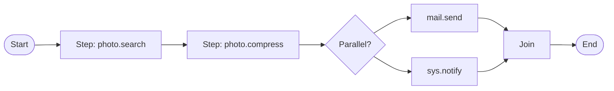
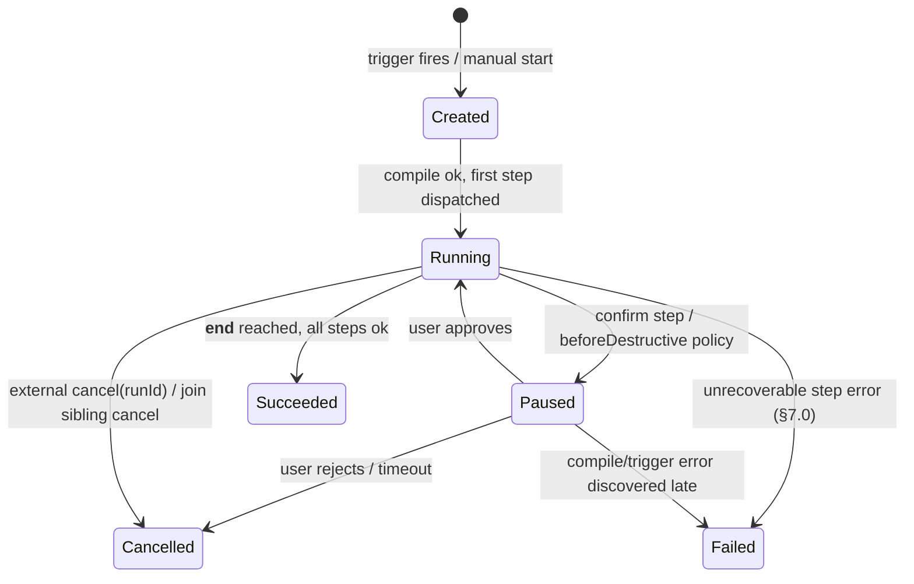

# MCOS Workflow Engine

> **Status:** Draft  
> **Version:** 0.1.0  
> **Last Updated:** 2026-08-06  
> **Depends on:** [02-command-protocol.md](./02-command-protocol.md), [03-runtime.md](./03-runtime.md)  
> **Inspiration:** Temporal · LangGraph · Claude Code tool loops — adapted to mobile constraints

> 🚧 **Implementation status:** the Workflow Engine is **not yet implemented** — it is a P2 deliverable per the [roadmap](./10-roadmap.md). The repository is currently design-only. The IR shapes below are the design contract the engine will interpret; a future `mcos-runtime` will model single-invocation and sequence IR first (see [fixtures](../fixtures/)), which is the trivial-workflow entry point.

---

## 1. Why Workflows

Single commands are not enough:

```text
home.movie =
  lights dim  +  TV on  +  curtains close  +  AC set
  (parallel)
```

```text
photo share =
  search today → compress → mail.send
  (sequence + artifacts)
```

```text
Wi‑Fi Office connected → vpn.connect
  (event trigger)
```

The Workflow Engine orchestrates **graphs of Command Protocol invocations** with control flow, retries, and policy hooks.

### 1.1 Engine positioning

The Workflow Engine is a **sub-component of the Runtime** ([01 §6.3](./01-architecture.md)), package `com.morainet.mcos.runtime.core.workflow` ([03 §3](./03-runtime.md)). It is **not** one of the 10 pipeline stages defined in [01 §9.2](./01-architecture.md); rather, it sits **above** the pipeline. Each workflow step is an individual command invocation that re-enters the pipeline.

This document owns the graph-level concerns (IR shape, step types, triggers, join policies, compensation, retry coordination). Single-command concerns (parsing, schema validation, authorization, execution) are owned by [02](./02-command-protocol.md) and [03](./03-runtime.md) and are cross-referenced, not redefined.

### 1.2 Compile-time / run-time separation

This is the central architectural decision of the engine. A workflow goes through two distinct passes:

```text
ExecuteRequest(payload = WorkflowRef)
  │
  ▼
┌──────────────────────────────────────────────┐
│  Compile Pass  (at load / first invocation)   │
│  1. Parse body JSON → Step[] + Edge[]         │
│  2. Validate IR (unique ids, known step types)│
│  3. Canonicalize compact → explicit (§4.3)    │
│  4. Resolve step → CommandDescriptor refs     │
│     (Registry lookup, 03 §6)                  │
│  5. Cycle detection + build step index        │
│  6. Bind trigger subscription                 │
│  Output: CompiledWorkflow (frozen, hashable)  │
└──────────────────────────────────────────────┘
  │
  ▼
┌──────────────────────────────────────────────┐
│  Execute Pass  (per step, at run time)        │
│  Re-enters the 10-stage pipeline at:          │
│    Stage 6  Authorize  (per-step AuthStamp)   │
│    Stage 7  Schedule   (workflow queue)       │
│    Stage 8  Execute    (handler.invoke)       │
│    Stage 9  ValidateOutput                    │
│    Stage 10 Audit      (step-level events)    │
└──────────────────────────────────────────────┘
```

**Why this split?**

- **Compile pass** does the expensive, deterministic work once: parsing the opaque `WorkflowRef.body` ([03 §5.1](./03-runtime.md) — the Parser layer treats it as opaque `JsonObject`), normalizing the two parallel forms into one ([§4.3](#43-parallel-form-canonicalization)), resolving command-id → descriptor references, and cycle-checking the graph. The output `CompiledWorkflow` is frozen and its hash is what audit records ([02 §7.5](./02-command-protocol.md) notes the canonicalizer skips the workflow body — canonicalization is this engine's job, done here).
- **Execute pass** re-enters the pipeline at **Stage 6 (Authorize)**, not Stage 1. Stages 1–5 (Parse, Canonicalize, Resolve, Expand, ValidateInput) were already done at compile time for the step's descriptor. Each step still gets its own Authorize (fresh `AuthStamp` per step, security boundary), Schedule (admission to the `workflow` queue, [01 §9.2](./01-architecture.md) Stage 7), Execute, ValidateOutput, and Audit. This is what [03 §10](./03-runtime.md) means by "each node execution re-enters Permission Kernel + Executor."

**Sequence sugar** (multi-line DSL, [02 §6.4](./02-command-protocol.md)) is compiled by the Parser into an `ExecutionIr.Sequence` ([03 §5.1](./03-runtime.md)), which the engine treats as a trivial single-edge `CompiledWorkflow` — no separate code path.

---

## 2. Design Goals

| Goal | Description |
|------|-------------|
| Command-native | Nodes invoke commands; no hidden side channels |
| Mobile-safe | Cancellation, timeouts, battery-aware concurrency |
| Auditable | Every edge transition logged under `RunId` |
| Deterministic enough | Replay from IR + recorded inputs for debugging |
| LLM-friendly | Planner emits Workflow IR, not proprietary glue code |

Non-goals:

- General Turing-complete scripting inside IR  
- Exactly-once distributed transactions across vendors  
- Replacing Android WorkManager for all OS jobs (we may integrate with it)

---

## 3. Conceptual Model



Core nouns:

| Noun | Meaning |
|------|---------|
| **Workflow** | Named graph definition |
| **Run** | One execution instance |
| **Step** | Node: invoke / control / wait |
| **Edge** | Transition with optional predicate |
| **Binding** | Passing outputs → later inputs |
| **Trigger** | Manual / event / schedule |

### 3.1 Run lifecycle state machine

Every Run (one execution instance of a workflow) moves through this state machine:



| State | Entry condition | Exit condition | Observable events |
|-------|-----------------|----------------|-------------------|
| **Created** | Trigger fires or manual `execute(WorkflowRef)` received | Compile pass succeeds | `RunStarted` ([01 §11.5](./01-architecture.md)) |
| **Running** | First step dispatched to Stage 6 | Reach `__end__`, unrecoverable error, or cancel | `StepStarted` / `StepSucceeded` / `StepFailed` per step |
| **Paused** | `confirm` step reached, or `beforeDestructive`/`beforeNetwork` confirmation policy gates a destructive/network step | User approves → resume; user rejects or confirm times out → Cancelled/Failed | `ConfirmationNeeded` ([01 §11.5](./01-architecture.md)) |
| **Succeeded** | `__end__` reached, all steps succeeded (join policies satisfied) | — (terminal) | `RunSucceeded` |
| **Failed** | Unrecoverable error after exhausting retry + onError + join policy (§7.0 decision tree) | — (terminal) | `RunFailed` |
| **Cancelled** | External `cancel(runId)` ([03 §8.3](./03-runtime.md)) or join-sibling cancellation (§8) | — (terminal) | `RunCancelled` |

**Persistence.** MVP: Run state is **in-memory only** — a process death loses in-flight runs. V1: each state transition is appended to a durable run log (best-effort replay on restart; not exactly-once). See [§15](#15-mvp-vs-v1-feature-gate) for the feature gate.

---

## 4. Workflow IR (JSON)

### 4.0 Normative Kotlin types

The JSON examples in §4.1–4.2 are illustrative; the **normative** types are these Kotlin data classes. The compile pass ([§1.2](#12-compile-time--run-time-separation)) produces a `CompiledWorkflow`; the JSON IR is the input to that pass.

```kotlin
package com.morainet.mcos.runtime.core.workflow

typealias StepId = String   // mirrors 01 §11.5

data class CompiledWorkflow(
    val id: String,                        // workflowId
    val version: String,                   // workflowVersion ("0.1")
    val trigger: Trigger?,                 // null = manual-only
    val steps: Map<StepId, Step>,          // explicit form only (after §4.3)
    val edges: List<Edge>,                 // includes implicit __start__/__end__ edges
    val join: JoinPolicy,                  // default join for the root graph
    val onFailure: WorkflowAction?,        // workflow-level fallback (§7.4)
    val confirmation: ConfirmationPolicy?, // workflow-level gate (§10)
    val meta: JsonObject,
) {
    val startStep: StepId get() = edges.first { it.from == "__start__" }.to
}

sealed class Step {
    abstract val id: StepId
    abstract val saveAs: String?           // key under __steps.<id>.value
    abstract val retry: RetryPolicy?
    abstract val compensate: WorkflowAction?  // step-level rollback (§7.3)
    abstract val requiresDevices: List<String> // IoT mutex (03 §8.5)

    data class Invoke(
        override val id: StepId,
        val command: String,               // command id, resolved to descriptor at compile
        val args: JsonObject,              // may contain $ref / $input bindings (§6)
        override val saveAs: String? = null,
        override val retry: RetryPolicy? = null,
        override val compensate: WorkflowAction? = null,
        override val requiresDevices: List<String> = emptyList(),
        val timeoutMs: Long? = null,       // overrides descriptor.timeoutMs
    ) : Step()

    data class Parallel(
        override val id: StepId,
        val children: List<StepId>,        // explicit form; §4.3 canonicalizes compact → this
        val join: JoinPolicy = JoinPolicy.All,
        override val saveAs: String? = null,
        override val retry: RetryPolicy? = null,
        override val compensate: WorkflowAction? = null,
        override val requiresDevices: List<String> = emptyList(),
    ) : Step()

    data class If(
        override val id: StepId,
        val predicate: JsonObject,         // §5.9 predicate language
        val thenStep: StepId,
        val elseStep: StepId?,
        override val saveAs: String? = null,
        override val retry: RetryPolicy? = null,
        override val compensate: WorkflowAction? = null,
        override val requiresDevices: List<String> = emptyList(),
    ) : Step()

    data class Switch(
        override val id: StepId,
        val on: String,                    // $ref path to the discriminant value
        val cases: Map<String, StepId>,    // value → target step
        val default: StepId?,
        override val saveAs: String? = null,
        override val retry: RetryPolicy? = null,
        override val compensate: WorkflowAction? = null,
        override val requiresDevices: List<String> = emptyList(),
    ) : Step()

    data class Loop(
        override val id: StepId,
        val mode: LoopMode,                // Over / While
        val over: String?,                 // $ref path to a list (mode = Over)
        val as_: String?,                  // binding name for current element (`as` is a Kotlin keyword)
        val while_: JsonObject?,           // predicate (mode = While)
        val body: StepId,                  // step to run per iteration
        val maxIterations: Int,            // mandatory (§5.2)
        override val saveAs: String? = null,
        override val retry: RetryPolicy? = null,
        override val compensate: WorkflowAction? = null,
        override val requiresDevices: List<String> = emptyList(),
    ) : Step()

    data class WaitEvent(
        override val id: StepId,
        val filter: JsonObject,            // event filter (07 §13 for $memory usage)
        val timeoutMs: Long,
        override val saveAs: String? = null,
        override val retry: RetryPolicy? = null,
        override val compensate: WorkflowAction? = null,
        override val requiresDevices: List<String> = emptyList(),
    ) : Step()

    data class WaitDelay(
        override val id: StepId,
        val durationMs: Long,
        override val saveAs: String? = null,
        override val retry: RetryPolicy? = null,
        override val compensate: WorkflowAction? = null,
        override val requiresDevices: List<String> = emptyList(),
    ) : Step()

    data class Confirm(
        override val id: StepId,
        val prompt: String,                // may contain $ref interpolation
        val thenStep: StepId,              // resumed after user approves
        override val saveAs: String? = null,
        override val retry: RetryPolicy? = null,
        override val compensate: WorkflowAction? = null,
        override val requiresDevices: List<String> = emptyList(),
    ) : Step()

    data class Noop(
        override val id: StepId,
        override val saveAs: String? = null,
        override val retry: RetryPolicy? = null,
        override val compensate: WorkflowAction? = null,
        override val requiresDevices: List<String> = emptyList(),
    ) : Step()
}

data class Edge(
    val from: StepId,                      // "__start__" for entry
    val to: StepId,                        // "__end__" for exit
    val onError: List<String>? = null,     // error codes that trigger this edge (§7.2)
)

enum class LoopMode { OVER, WHILE }

enum class JoinPolicy {                    // §8
    ALL,              // wait for all children; fail if any fail (default)
    ALL_OK_CONTINUE,  // fail-fast: cancel siblings on first failure
    ANY,              // first success cancels siblings
    QUORUM,           // N successes needed (details in §8)
}

data class RetryPolicy(                    // §7.1
    val maxAttempts: Int,
    val backoffMs: List<Long>,             // one per retry attempt; last repeats
    val retryOn: List<String>,             // McosErrorCode names (01 §15.1)
    val forceRetry: Boolean = false,       // override idempotency gate
)

data class WorkflowAction(                 // a single command invocation used by compensate/onFailure
    val command: String,
    val args: JsonObject,
)

data class ConfirmationPolicy(             // §10
    val beforeDestructive: Boolean = true,
    val beforeNetwork: Boolean = false,
    val previewPlan: Boolean = true,
)

sealed class Trigger {                     // §9
    data class Manual(val source: String? = null, val inputs: List<String> = emptyList()) : Trigger()
    data class Event(val filter: JsonObject) : Trigger()
    data class Schedule(val cron: String, val tz: String, val misfirePolicy: String = "skip") : Trigger()
}
```

**Type sources.** `StepId` mirrors [01 §11.5](./01-architecture.md). `RunId` is defined there and reused here unchanged. `requiresDevices` is the per-step IoT mutex field first specified in [03 §8.5](./03-runtime.md). `McosErrorCode` names in `RetryPolicy.retryOn` reference the enum in [01 §15.1](./01-architecture.md).

### 4.1 Minimal Sequence

```json
{
  "workflowVersion": "0.1",
  "id": "wf_photo_share",
  "name": "Compress today's photos and mail",
  "steps": [
    {
      "id": "s1",
      "type": "invoke",
      "command": "photo.search",
      "args": { "date": "today" },
      "saveAs": "photos"
    },
    {
      "id": "s2",
      "type": "invoke",
      "command": "photo.compress",
      "args": {
        "quality": 80,
        "uris": { "$ref": "photos.value.uris" }
      },
      "saveAs": "compressed"
    },
    {
      "id": "s3",
      "type": "invoke",
      "command": "mail.send",
      "args": {
        "to": "Tom",
        "subject": "Photos",
        "attachments": { "$ref": "compressed.value.uris" }
      }
    }
  ],
  "edges": [
    { "from": "s1", "to": "s2" },
    { "from": "s2", "to": "s3" }
  ]
}
```

If `edges` omitted and `steps` is an array, engine interprets as **implicit sequence**.

### 4.2 Parallel Fan-Out

```json
{
  "id": "wf_home_movie",
  "steps": [
    { "id": "lights", "type": "invoke", "command": "home.light.dim", "args": { "id": "living", "level": 20 } },
    { "id": "tv", "type": "invoke", "command": "home.tv.on", "args": { "id": "living-tv" } },
    { "id": "curtain", "type": "invoke", "command": "home.curtain.close", "args": { "id": "living" } },
    { "id": "ac", "type": "invoke", "command": "iot.ac.set", "args": { "name": "air-condition", "tempC": 26 } },
    { "id": "fork", "type": "parallel", "children": ["lights", "tv", "curtain", "ac"] }
  ],
  "edges": [
    { "from": "__start__", "to": "fork" }
  ]
}
```

Alternative compact form:

```json
{
  "type": "parallel",
  "steps": [
    { "command": "home.light.dim", "args": { "id": "living", "level": 20 } },
    { "command": "home.tv.on", "args": { "id": "living-tv" } },
    { "command": "home.curtain.close", "args": { "id": "living" } },
    { "command": "iot.ac.set", "args": { "name": "air-condition", "tempC": 26 } }
  ]
}
```

### 4.3 Parallel form canonicalization

The two forms above are **semantically equivalent**. The compile pass ([§1.2](#12-compile-time--run-time-separation)) canonicalizes the compact form into the explicit form, so the execute pass only ever sees explicit form. This follows the standard compiler pattern of normalizing syntactic sugar into a single canonical representation (cf. SQL optimizers, regex AST normalization).

**Canonicalization algorithm** (normative pseudocode):

```text
canonicalizeParallel(compactStep):
    let parentId = compactStep.id ?: syntheticId()
    let childIds = []
    for each innerStep in compactStep.steps:
        let childId = innerStep.id ?: syntheticId()
        childIds.add(childId)
        emit Step(innerStep with id = childId)        # hoist into steps[]
        emit Edge(parentId, childId)                   # implicit fan-out edge
        emit Edge(childId, parentId + "__join")        # implicit fan-in edge
    emit Step.Parallel(id = parentId, children = childIds, join = compactStep.join ?: ALL)
```

**Rules:**

1. The compact form's inner `steps[]` are hoisted into the workflow's top-level `steps` map with synthesized ids if none provided.
2. Implicit `__start__`→parent and parent→`__join__` edges are generated for each child.
3. After canonicalization, `CompiledWorkflow.steps` contains **only** explicit-form `Step.Parallel` entries (with `children: List<StepId>`); the execute pass rejects any compact-form parallel at runtime as `WORKFLOW_INVALID`.
4. [02 §7.5](./02-command-protocol.md) explicitly skips canonicalizing the workflow body at the Parser layer — this canonicalization is the Workflow Engine's responsibility, performed at compile time.

---

## 5. Step Types

| Type | Purpose |
|------|---------|
| `invoke` | Call a command |
| `parallel` | Run children concurrently; join policies |
| `if` | Conditional branch |
| `switch` | Multi-way branch |
| `loop` | Bounded iteration |
| `wait_event` | Pause until Event Bus match or timeout |
| `wait_delay` | Sleep duration |
| `confirm` | Force user confirmation gate |
| `compensate` | Register undo path |
| `noop` | Placeholder |

### 5.0 `invoke` — field reference

`invoke` is the only step type that actually calls a command. All other step types are control flow.

| Field | Type | Required | Default | Constraint |
|-------|------|----------|---------|------------|
| `id` | string | yes | — | Unique within workflow |
| `type` | `"invoke"` | yes | — | — |
| `command` | string | yes | — | Command id; resolved to descriptor at compile (§1.2) |
| `args` | object | no | `{}` | May contain `$ref`/`$input` bindings (§6); resolved at execute |
| `saveAs` | string | no | `null` | Key under `__steps.<id>.value` where output is stored |
| `retry` | object | no | `null` | `RetryPolicy` (§7.1) |
| `compensate` | object | no | `null` | Step-level rollback action (§7.3) |
| `requiresDevices` | string[] | no | `[]` | IoT device mutex keys ([03 §8.5](./03-runtime.md)) |
| `timeoutMs` | integer | no | descriptor's `timeoutMs` | Range 1000–300000 |

### 5.1 `if`

```json
{
  "id": "check",
  "type": "if",
  "predicate": { "$eq": [ { "$ref": "battery.value.percent" }, { "$lt": 20 } ] },
  "then": "enable_saver",
  "else": "skip"
}
```

Predicate language is intentionally small (JSONLogic-like subset). **No arbitrary JS.**

### 5.2 `loop`

```json
{
  "type": "loop",
  "over": { "$ref": "photos.value.uris" },
  "as": "uri",
  "maxIterations": 50,
  "body": {
    "type": "invoke",
    "command": "photo.compress",
    "args": { "quality": 80, "uris": [{ "$ref": "uri" }] }
  }
}
```

`maxIterations` is mandatory.

### 5.3 `wait_event`

```json
{
  "type": "wait_event",
  "filter": { "type": "connectivity.wifi.connected", "where": { "ssid": "Office" } },
  "timeoutMs": 3600000
}
```

Subscribes to the EventBus ([03 §11](./03-runtime.md)) with a filter. The step suspends until a matching event arrives or `timeoutMs` elapses (→ `TIMEOUT`). The matched event payload is saved to `__steps.<id>.value` if `saveAs` is set. `wait_event` has its own dedicated queue so it does not hold a Scheduler slot while suspended ([03 §11.4](./03-runtime.md)).

### 5.4 `switch`

```json
{
  "id": "route",
  "type": "switch",
  "on": { "$ref": "__input.intent" },
  "cases": {
    "share": "do_share",
    "save": "do_save",
    "print": "do_print"
  },
  "default": "do_nothing"
}
```

Multi-way branch. `on` is a `$ref` path to the discriminant value. The engine matches the value against `cases` keys (string equality); if none match and `default` is set, control flows to `default`; if no `default`, the step is a no-op and control flows to the next edge.

### 5.5 `wait_delay`

```json
{
  "id": "cooldown",
  "type": "wait_delay",
  "durationMs": 5000
}
```

Suspends for a fixed duration. Unlike `wait_event` (which waits for an external event), `wait_delay` is a pure timer. `durationMs` range: 1000–86400000 (24 h). For long delays (> 60 s) on Android, the engine SHOULD use `AlarmManager` to remain Doze-compliant rather than holding a wakelock. The delay is **not** a retry backoff — use `retry` ([§7.1](#71-per-step-retry)) for that.

### 5.6 `noop`

```json
{
  "id": "checkpoint",
  "type": "noop"
}
```

Does nothing. Use cases: explicit join node for multiple incoming edges, debug breakpoint (the engine can single-step here), or a stable anchor for `onError` edges to converge before `__end__`.

### 5.7 `confirm`

```json
{
  "id": "ask_user",
  "type": "confirm",
  "prompt": "Send {{__steps.photos.value.count}} photos to Tom?",
  "then": "do_send"
}
```

Forces a user-confirmation gate mid-workflow. The run enters the `Paused` state ([§3.1](#31-run-lifecycle-state-machine)) and emits `ConfirmationNeeded`. If the user approves, control flows to `then`; if the user rejects or the confirmation times out (default 120 s), the run transitions to `Cancelled`. This is distinct from the workflow-level `ConfirmationPolicy` ([§10](#10-confirmation-integration)), which auto-inserts gates before destructive/network steps without an explicit step.

**Field name:** the prompt text field is `prompt` (not `message`). The Planner and UI MUST use `prompt`. Inside the `prompt` string, `{{__steps.<id>.value.<path>}}` interpolation is supported for human-readable display ([§6.0](#60-ref-path-grammar)); for `args` binding, use the `$ref` object form, not `{{...}}`.

### 5.8 `compensate` (step-level rollback — relationship to `onFailure`)

This is **not a standalone step type** — it is a field declared on any `invoke` step. See [§7.3](#73-compensation-step-level) for the full semantics. Summary: `compensate` is a `WorkflowAction` (command + args) that the engine records when the step succeeds and executes in reverse order if the run fails. The workflow-level `onFailure` ([§7.4](#74-onfailure-workflow-level)) is a single fallback that runs once when the whole run fails — see the comparison table in §7.4.

### 5.9 Predicate language

`if.predicate`, `loop.while`, and `switch` matching use a deliberately small JSONLogic-like language. **No arbitrary expressions, no string interpolation, no `$eval`.** This keeps evaluation safe (no injection surface) and deterministic.

| Operator | Form | Semantics |
|----------|------|-----------|
| `$eq` | `{ "$eq": [a, b] }` | Deep equality (JSON value compare) |
| `$ne` | `{ "$ne": [a, b] }` | Negation of `$eq` |
| `$lt` / `$lte` / `$gt` / `$gte` | `{ "$lt": [a, b] }` | Numeric or lexicographic string compare |
| `$in` | `{ "$in": [a, list] }` | `a` is a member of `list` |
| `$not` | `{ "$not": expr }` | Logical negation |
| `$and` | `{ "$and": [expr, expr, ...] }` | All true → true |
| `$or` | `{ "$or": [expr, expr, ...] }` | Any true → true |
| `$ref` | `{ "$ref": "path" }` | Resolves to the value at `path` (§6) |
| `$exists` | `{ "$exists": "path" }` | True if `path` resolves to a non-null value |

**Typing rules:**

1. Comparison operators (`$lt`, `$gt`, etc.) require both operands to be the same JSON type (both number, or both string). If types differ, the predicate evaluates to **`false`** — it does **not** raise an error. This makes predicates safe for optional bindings where a path may resolve to `null`.
2. `$eq`/`$ne` accept any JSON types; cross-type comparison (e.g. number vs string) always returns `false` for `$eq`.
3. `$ref` to a missing path resolves to `null`; a `null` operand in a comparison yields `false` (per rule 1).
4. `$exists` is the explicit way to check whether a path resolves before using it in `$eq` etc.

**Security:** there is intentionally no `$eval`, no arithmetic operator (`$add`, `$concat`), and no function-call mechanism. Predicates are pure value comparisons over the run-scoped state map. This prevents injection from Planner-produced ([06](./06-agent.md)) or memory-sourced ([07](./07-memory.md)) values that flow into predicates.

---

## 6. Data Binding

### 6.0 `$ref` path grammar

A `$ref` path addresses a value in the run-scoped state map. The grammar (normative):

```text
path     ::= source? ( "." segment )+
source   ::= "__context" | "__input" | "__memory" | "__steps"
segment  ::= [a-zA-Z0-9_]+
```

| Source | What it addresses | Example |
|--------|-------------------|---------|
| `__context` | Run context: `user.locale`, `user.timezone`, `device.id` | `__context.user.locale` |
| `__input` | Inputs passed to the run at start (from trigger or manual call) | `__input.recipient` |
| `__memory` | Long-term memory (read-only view, [07 §13](./07-memory.md)) | `__memory.places.defaultCity` |
| `__steps` | Outputs of prior steps (via `saveAs`) | `__steps.photos.value.uris` |
| *(no source)* | Shorthand: first tries `__steps`, then `__input` | `photos.value.uris` |

**Missing-path behavior:**

- A `$ref` to a non-existent path resolves to `null`.
- In a **binding** context (e.g. `args: { "to": { "$ref": "missing.path" } }`), a `null` resolution flows into the command's `inputSchema` validation at Stage 5; if the field is required, the step fails with `SCHEMA_VIOLATION`.
- In a **predicate** context ([§5.9](#59-predicate-language)), a `null` operand makes comparisons evaluate `false` (no error).
- `$exists: "path"` explicitly checks resolvability before using a value.

### 6.1 `$ref`

References prior step outputs or run context. The shorthand form (no `__source` prefix) resolves against `__steps` first, then `__input`:

```text
photos.value.uris              # __steps.photos.value.uris
__context.user.locale          # run context
__memory.home.office.ssid      # long-term memory (read-only)
__input.recipient              # run input parameter
```

**Resolution algorithm:**

```text
resolveRef(path, stateMap):
    if path starts with "__": return stateMap[path]  # fully-qualified
    # shorthand: try __steps, then __input
    let s = stateMap["__steps." + path]; if s != null: return s
    let i = stateMap["__input." + path]; if i != null: return i
    return null
```

### 6.2 `$input`

Workflow parameters supplied at start (by the trigger or a manual `execute` call). The entire input object is available under `__input.*`:

```json
{
  "command": "mail.send",
  "args": { "to": { "$ref": "__input.recipient" } }
}
```

For event-triggered workflows, `__input` is the matched event payload. For schedule-triggered workflows, `__input` is empty (the workflow reads time-sensitive data from memory or commands at run time).

### 6.3 Artifact Passing

Step outputs are stored in the run-scoped state map under `__steps.<stepId>.value`. For large media (photos, audio), steps **SHOULD** return `content://` / `file://` URIs rather than base64-encoded bytes in the value ([04 §7.3](./04-plugin-sdk.md)); the engine passes URIs through verbatim and does not copy bytes into the state map. This keeps memory bounded for workflows that chain media-producing steps.

### 6.4 Three ref-token disambiguation

MCOS has three overlapping but distinct reference mechanisms. They operate at different layers and serve different purposes:

| Token | Layer | Where defined | What it references |
|-------|-------|---------------|--------------------|
| `$ref` | Workflow IR binding (this doc, §6.0) | 05 §6 | Step outputs, run context, run input, memory — resolved by the Workflow Engine at execute time |
| `$memory` | Event filter shorthand | [07 §13](./07-memory.md) | Memory paths inside `trigger.filter.where` — resolved at trigger arming/fire time |
| `x-mcos-ref` | Command argument schema extension | [02 §5.3](./02-command-protocol.md), [03 §9.2 Stage 4](./03-runtime.md) | Memory-backed default values in a command's `inputSchema` — resolved by the Runtime's Expand stage for single-command invocations |

**When to use which:**

- Writing a workflow step's `args` that need a prior step's output → `$ref` (this section).
- Writing an event trigger filter that matches against a stored memory value → `$memory` (07 §13).
- Writing a command descriptor whose argument has a memory-backed default (e.g. `places.defaultCity`) → `x-mcos-default-from-memory` in the `inputSchema` (02 §5.3).

A `$ref` to `__memory.*` in workflow args is the workflow-layer equivalent of `x-mcos-ref`, but resolved by the engine rather than the Expand stage — the two never interact.

---

## 7. Retry & Error Handling

### 7.0 Error handling decision tree

When a step's execution (Stage 8) produces an error, the engine evaluates four mechanisms in a **fixed priority order**. This resolves the previously-unspecified interaction between retry, on-error edges, join policy, and compensation:

```text
step throws McosException / returns Err
  │
  ├─ 1. Retry (§7.1)?
  │     retryOn matches the error code AND attempts < maxAttempts
  │     AND (descriptor.idempotent == true OR forceRetry == true)?
  │     → YES: wait backoffMs, re-execute step. Loop.
  │     → NO (exhausted or not retryable): fall through
  │
  ├─ 2. On-Error edge (§7.2)?
  │     Does an outgoing edge from this step have onError containing
  │     the error code (or "*")?
  │     → YES: jump to the edge's target step. Run continues.
  │     → NO: fall through
  │
  ├─ 3. Join policy (§8)?
  │     Is this step a child of a parallel node?
  │     → ALL: record failure, continue waiting for siblings;
  │             after all complete, if any failed → JOIN_FAILED
  │     → ALL_OK_CONTINUE: cancel in-flight siblings → JOIN_FAILED
  │     → ANY: record failure; if another sibling already succeeded,
  │             this is absorbed; if all siblings failed → JOIN_FAILED
  │     → QUORUM:N: record failure; if success count can't reach N → JOIN_FAILED
  │     If not in a parallel → fall through
  │
  └─ 4. Run failure (terminal)
        Transition run to Failed (§3.1):
        a. Execute onFailure (workflow-level, §7.4) once if declared
        b. Execute step-level compensate (§7.3) for all already-succeeded
           steps that declared compensate, in reverse execution order
        c. Best-effort: compensate failures → COMPENSATION_FAILED (audited,
           does not block run termination)
        d. Emit RunFailed with the originating error code
```

**Key principle:** retry and on-error edges are **step-local recovery** (the run continues); join-policy failure and the absence of recovery transitions the run to **terminal failure** (triggering compensation). A step that has neither retry, an on-error edge, nor a lenient join policy causes the run to fail on the first error.

### 7.1 Per-Step Retry

```json
{
  "command": "iot.ac.set",
  "args": { "name": "air-condition", "power": true },
  "retry": {
    "maxAttempts": 3,
    "backoffMs": [500, 2000, 5000],
    "retryOn": ["UNAVAILABLE", "TIMEOUT"]
  }
}
```

| Field | Type | Required | Default | Constraint |
|-------|------|----------|---------|------------|
| `maxAttempts` | integer | yes | — | Range 1–10 (includes the first attempt) |
| `backoffMs` | integer[] | yes | — | One entry per retry; if fewer than `maxAttempts-1`, the last value repeats |
| `retryOn` | string[] | yes | — | `McosErrorCode` names ([01 §15.1](./01-architecture.md)). Common: `TIMEOUT`, `UNAVAILABLE`, `RATE_LIMITED` |
| `forceRetry` | boolean | no | `false` | Overrides the idempotency gate (audited) |

**Idempotency gate** ([02 §9.4](./02-command-protocol.md), [04](./04-plugin-sdk.md) descriptor `idempotent` field): if the descriptor declares `idempotent: false` (or doesn't declare it), the engine **MUST NOT** retry unless `forceRetry: true` is set. A `forceRetry: true` on a non-idempotent command is audited with a warning so enterprise policy can review it. The default `retryOn` if omitted is `["TIMEOUT", "UNAVAILABLE", "RATE_LIMITED"]` — the codes marked `retryableDefault: true` in the `McosErrorCode` enum.

### 7.2 On-Error Edges

```json
{ "from": "s2", "to": "s2_fallback", "onError": ["PLUGIN_ERROR", "UNAVAILABLE"] }
```

An edge with an `onError` list is a **recovery edge**: when the source step fails with a code in the list, control flows to the target step instead of entering the join-policy/compensation path. `onError: ["*"]` matches any error code.

**Interaction with retry:** on-error edges are evaluated **only after retry is exhausted** (per the §7.0 decision tree). A step with both `retry` and an on-error edge will retry first; only when retries are exhausted does the on-error edge activate.

### 7.3 Compensation (step-level)

```json
{
  "id": "pay",
  "type": "invoke",
  "command": "wallet.hold",
  "saveAs": "pay",
  "compensate": {
    "command": "wallet.release",
    "args": { "holdId": { "$ref": "__steps.pay.value.holdId" } }
  }
}
```

**`compensate` is a field on a step** (not a step type). It declares the rollback action for the side effects that step performed. Semantics:

1. When a step with `compensate` **succeeds**, the engine records `(stepId, compensateAction)` in the run's compensation stack.
2. When the run transitions to **Failed** (after retry + on-error + join are all exhausted, per §7.0), the engine pops the compensation stack in **reverse execution order** and executes each recorded `compensate` action as a new invoke (re-entering Stage 6–10).
3. Compensation is **best-effort**: a compensation step that itself fails raises `COMPENSATION_FAILED` (audited) and the engine continues to the next compensation in the stack. A compensation failure does **not** change the run's terminal state — it's already `Failed`.
4. `compensate.args` may use `$ref` to the step's own saved output (as shown above), so the rollback knows what to undo.

**Scope:** `compensate` is per-step — it undoes one step's side effect. Compare `onFailure` ([§7.4](#74-onfailure-workflow-level)), which is per-workflow.

### 7.4 `onFailure` (workflow-level)

```json
{
  "id": "wf_checkout",
  "onFailure": {
    "command": "notify.user",
    "args": { "message": "Checkout workflow failed; partial changes may need manual review." }
  }
}
```

**`onFailure` is a field on `CompiledWorkflow` root** (not on a step). It declares a single fallback action that runs **once** when the entire run transitions to Failed. Semantics:

1. `onFailure` runs **before** step-level compensation (per §7.0 decision tree step 4a → 4b).
2. It runs exactly once per run, regardless of how many steps failed.
3. It is typically a notification ("workflow failed, review needed") rather than a rollback — use step-level `compensate` for targeted undo.

**`compensate` vs `onFailure` — comparison:**

| Aspect | `compensate` (step-level) | `onFailure` (workflow-level) |
|--------|---------------------------|------------------------------|
| Declared on | Individual `invoke` step | `CompiledWorkflow` root |
| When it runs | After run fails, for each already-succeeded step that declared it, in reverse order | After run fails, once |
| Purpose | Targeted undo of a specific step's side effect | Global fallback / notification |
| Failure code | `COMPENSATION_FAILED` (per-step, non-blocking) | Failure of `onFailure` action itself is audited but non-blocking |
| Relationship to [02 §9.6](./02-command-protocol.md) `onFailure` | — | Same concept; 02 §9.6 uses `onFailure` for the workflow-level field, 05 §7.3 uses `compensate` for the step-level field. The two names coexist with distinct scopes. |

### 7.5 Workflow error codes

The five workflow-specific error codes are normative in [01 §15.1](./01-architecture.md) (single source of truth for all `McosErrorCode` values). This section lists their `details` schemas, conforming to shape B of [02 §8.3](./02-command-protocol.md) (runtime errors with structured detail):

| Code | `details` fields | When |
|------|------------------|------|
| `WORKFLOW_INVALID` | `stepId?: string`, `reason: string` | Compile-time IR validation failure |
| `MAX_ITERATIONS_EXCEEDED` | `stepId: string`, `limit: int` | `loop` hit `maxIterations` without exit |
| `COMPENSATION_FAILED` | `stepId: string`, `innerError: object` (the compensating step's error) | A `compensate` action failed |
| `JOIN_FAILED` | `stepId: string` (the parallel node id), `failedChildren: string[]` (child step ids that failed) | Join policy unsatisfiable |
| `TRIGGER_MISFIRE` | `triggerId: string`, `scheduledAt: string` (ISO-8601) | Schedule trigger missed its window |

---

## 8. Join Policies (Parallel)

A `parallel` step declares a `join` policy that determines when the fan-out is considered "done" and how sibling cancellation propagates. The policy is attached to the `Step.Parallel` node (see [§4.0](#40-normative-kotlin-types)):

```json
{
  "id": "fan_out",
  "type": "parallel",
  "children": ["s1", "s2", "s3"],
  "join": "all"
}
```

| Policy | Success condition | Failure condition | Sibling cancellation on failure |
|--------|-------------------|-------------------|---------------------------------|
| `all` (default) | All children succeed | Any child fails (after retry + on-error exhausted) | **None** — siblings continue; failure recorded for join evaluation |
| `all_ok_continue` | All children succeed | Any child fails | **Immediate** — cancel all in-flight siblings, then `JOIN_FAILED` |
| `any` | First child succeeds | All children fail | On first success: cancel remaining siblings. On all-fail: `JOIN_FAILED` |
| `quorum:N` | N children succeed (e.g. `quorum:2`) | Impossible to reach N successes (remaining < needed) | When N reached: cancel remaining. When impossible: cancel remaining → `JOIN_FAILED` |

**Sibling cancellation mechanics.** Cancellation is cooperative ([04 §7.4](./04-plugin-sdk.md)): the engine calls `handler.cancel(ctx)` on each sibling, waits up to `cancelGraceMs` (default 2000 ms), then force-cancels the coroutine. Siblings in `wait_event` have their EventBus subscription released. Siblings holding IoT device mutexes ([03 §8.5](./03-runtime.md)) release them on cancel. The `expedited` Scheduler queue ([01 §9.2](./01-architecture.md) Stage 7) handles cancellation dispatch with priority.

**Concurrency admission.** A parallel node's children share the parent run's Scheduler quota — they do not get separate slots. If the run already holds one slot, its children compete within the global cap of 4 ([01 §9.2](./01-architecture.md) Stage 7). A parallel node with 4 children in a system already running 3 other runs will admit children incrementally as slots free up; over-cap children wait with `RATE_LIMITED` backoff, not rejection.

**`quorum:N` detail.** `N` is an integer literal in the policy string (e.g. `"quorum:2"`). It must satisfy `1 ≤ N ≤ children.size`. If N is unparseable or out of range, the compile pass rejects the workflow with `WORKFLOW_INVALID`.

---

## 9. Triggers

A trigger defines how a workflow starts. Workflows without a `trigger` field are **manual-only**. The three trigger types map to the `Trigger` sealed class in [§4.0](#40-normative-kotlin-types).

### 9.1 Manual

```json
{
  "trigger": {
    "type": "manual",
    "inputs": ["recipient", "message"]
  }
}
```

Manual triggers start from an explicit `execute(WorkflowRef, inputs)` call. Entry points: CLI, Chat, API, or Voice (see §9.4). The `inputs` array declares the input parameter names the caller must supply; at run time these populate `__input.*` ([§6.2](#62-input)).

### 9.2 Event

```json
{
  "trigger": {
    "type": "event",
    "filter": {
      "type": "connectivity.wifi.connected",
      "where": { "ssid": "Office" }
    }
  },
  "steps": [
    { "command": "vpn.connect", "args": { "profile": "office" } }
  ]
}
```

Event triggers subscribe to the EventBus ([03 §11](./03-runtime.md)) with a `filter`. The `where` clause supports literal values and `$memory` references ([07 §13](./07-memory.md)):

```json
"where": { "ssid": { "$memory": "places.office.wifiSsids" } }
```

**Arming-time vs fire-time resolution.** Memory values in the filter can be resolved at two points:
- **Arming time** (default): memory is read once when the trigger subscription is created (workflow install / Runtime startup). Faster matching but won't pick up memory changes until re-arm.
- **Fire time**: memory is read when an event arrives, before matching. Slower (one memory read per event) but always current.

The trigger declares `"resolveMemory": "fire"` or `"resolveMemory": "arm"` (default `"arm"`). For values that change rarely (office Wi-Fi SSID), arming time is preferred; for values that change often (battery threshold), fire time.

### 9.3 Schedule

```json
{
  "trigger": {
    "type": "schedule",
    "cron": "0 23 * * *",
    "tz": "Asia/Shanghai",
    "misfirePolicy": "fire-and-forget-if-window"
  },
  "steps": [
    { "command": "home.scene.sleep", "args": {} }
  ]
}
```

| Field | Type | Required | Default | Constraint |
|-------|------|----------|---------|------------|
| `cron` | string | yes | — | Standard 5-field cron, user's local tz |
| `tz` | string | yes | — | IANA timezone (e.g. `Asia/Shanghai`) |
| `misfirePolicy` | enum | no | `"skip"` | One of: `skip`, `fire-and-forget`, `fire-and-forget-if-window` |

**Misfire policies:**

| Policy | Behavior |
|--------|----------|
| `skip` (default) | If the scheduled time was missed (Doze, device off), skip it entirely. Next run at the next scheduled time. |
| `fire-and-forget` | Fire immediately on wake regardless of how late. May cause back-to-back runs if multiple were missed (only the latest fires). |
| `fire-and-forget-if-window` | Fire on wake only if still within the same cron window (e.g. for hourly cron, fire if within the same hour). Otherwise skip. |

If a schedule is missed and `misfirePolicy` is `"skip"`, the engine emits a `TRIGGER_MISFIRE` audit event (informational, not an error) so the user can see that an automation didn't run. Schedules integrate with `AlarmManager` / `WorkManager` for Doze compliance ([03 §15.1](./03-runtime.md) foreground-service rules apply to triggered workflows with `control`/`destructive` steps).

### 9.4 Voice

Voice is **not** a separate trigger type — it is a `source` variant of the `manual` trigger:

```json
{
  "trigger": {
    "type": "manual",
    "source": "voice",
    "inputs": ["intent"]
  }
}
```

When `source: "voice"`, the workflow is started by a voice interaction ([01 §11.6](./01-architecture.md) `Source.VOICE`). Voice-triggered workflows typically receive a natural-language `intent` string as input, which the Planner ([06](./06-agent.md)) resolves into structured `__input` parameters before the first step runs — the Planner acts as a pre-processor that turns `"把今天的照片发给Tom"` into `{ "recipient": "Tom", "dateRange": "today" }` and then starts the workflow with those inputs.

This avoids a dedicated voice trigger type and reuses the Planner's existing intent-resolution pipeline. Workflows that want to be voice-addressable SHOULD declare `source: "voice"` so the Planner and voice UI can discover them.

---

## 10. Confirmation Integration

Workflow-level policy:

```json
{
  "confirmation": {
    "beforeDestructive": true,
    "beforeNetwork": false,
    "previewPlan": true
  }
}
```

`confirm` steps force interactive gates even for `read` if author wants explicit UX.

Event-triggered workflows that include `control` / `destructive` **MUST** either:

- Have been pre-authorized by user when installing the recipe, or  
- Fire a high-priority notification confirmation  

Silent IoT actuation from background events without prior consent is a policy violation.

### 10.1 Concurrency model & cancellation propagation

**Run scope.** Each Run is a Kotlin `CoroutineScope` — specifically, a child `Job` of the Runtime's structured-concurrency hierarchy ([01 §8.1](./01-architecture.md): "Workflow steps (P2): each step is a child `Job` of the run scope; a failed step does not cancel siblings unless the join policy requires it"). Every step dispatched within the run is a child `Job` of that run scope.

```text
RuntimeJob
  └─ RunJob (runId)
       ├─ StepJob (stepId=s1)     ← child of RunJob
       ├─ StepJob (stepId=s2)     ← child of RunJob
       └─ ParallelJob (stepId=fork)
            ├─ StepJob (child=a)  ← child of ParallelJob
            └─ StepJob (child=b)  ← child of ParallelJob
```

**Cancellation propagation:**

1. **External `cancel(runId)`** ([03 §8.3](./03-runtime.md)): cancels the `RunJob`, which structurally cancels all child `StepJob`s. Each in-flight handler receives cooperative cancellation ([04 §7.4](./04-plugin-sdk.md) `ensureActive()` / `cancel(ctx)` grace period). `wait_event` subscriptions are released. IoT device mutexes ([03 §8.5](./03-runtime.md)) are freed. The run transitions to `Cancelled` ([§3.1](#31-run-lifecycle-state-machine)).
2. **Parallel sibling cancellation** (per join policy, [§8](#8-join-policies-parallel)): `all_ok_continue` / `any` / `quorum:N` cancel specific siblings by cancelling their `StepJob`s without cancelling the `RunJob`. The parent `ParallelJob` survives until the join policy resolves.
3. **A failed step does NOT cancel siblings** unless the join policy demands it ([01 §8.1](./01-architecture.md)). A step failure in an `all`-join parallel is recorded; siblings continue independently.

**Engine lifecycle.** The Workflow Engine is a **stateless component** — it holds no run state between invocations (all run state lives in the run-scoped state map and the audit log). Therefore:

- The engine is **not** in the Runtime startup sequence ([03 §3.1](./03-runtime.md) boot order: Audit→Registry→Permission→EventBus→Scheduler→McosRuntime — Workflow Engine is absent because it has no initialization step).
- It is instantiated per-run (or as a singleton with no mutable state) by `McosRuntime` when a `WorkflowRef` payload is received.
- On Runtime shutdown ([03 §3.1](./03-runtime.md)), in-flight runs are cancelled (transitioning to `Cancelled`); the engine itself has no drain step. Event-trigger subscriptions (registered with EventBus) are unregistered as part of EventBus shutdown.

---

## 11. Compile & Execute Algorithms

### 11.1 Compile algorithm (normative)

The compile pass ([§1.2](#12-compile-time--run-time-separation)) transforms an opaque `WorkflowRef.body` ([03 §5.1](./03-runtime.md)) into a frozen `CompiledWorkflow`. This runs at workflow load time or first invocation; the result is cached and hashed for audit.

```text
compile(body: JsonObject, registry: Registry) -> CompiledWorkflow:
    # 1. Parse + structural validate
    stepsJson = body["steps"] as List
    edgesJson = body["edges"] as List?
    steps = parseSteps(stepsJson)           # each step validated for required fields by type
    if any step missing "id": raise WORKFLOW_INVALID(reason="missing_step_id")

    # 2. Canonicalize parallel forms (§4.3)
    steps, implicitEdges = canonicalizeParallels(steps)

    # 3. Build edge list
    edges = edgesJson ?: inferSequenceEdges(steps)   # §4.1 implicit sequence
    edges.addAll(implicitEdges)
    edges.addAll([Edge("__start__", firstStepId), Edge(lastStepId, "__end__")])

    # 4. Resolve command references (Stage 3 equivalent)
    for step in steps where step is Invoke:
        descriptor = registry.resolve(step.command)   # 03 §6.4
        if descriptor == null: raise UNKNOWN_COMMAND(commandId=step.command)
        step.resolvedDescriptor = descriptor

    # 5. Cycle detection (DFS from __start__)
    if hasCycle(steps, edges): raise WORKFLOW_INVALID(reason="cycle_detected")

    # 6. Validate join policies
    for step in steps where step is Parallel:
        validateJoin(step.join, step.children)        # quorum:N range check, etc.

    # 7. Validate loop bounds
    for step in steps where step is Loop:
        if step.maxIterations == null: raise WORKFLOW_INVALID(reason="missing_maxIterations")

    # 8. Build trigger subscription
    trigger = parseTrigger(body["trigger"])

    # 9. Freeze + hash
    return CompiledWorkflow(steps, edges, trigger, ...).also { it.hash = sha256(canonicalJson(it)) }
```

**Compile-time failures** produce `WORKFLOW_INVALID` with `details.reason` indicating the cause. For Planner-produced workflows ([06](./06-agent.md)), a compile failure feeds back into the Planner's repair loop as `COMPILE_FAILED` ([01 §15.1](./01-architecture.md)).

### 11.2 Execute algorithm (normative)

The execute pass runs each step by re-entering the 10-stage pipeline at Stage 6 ([§1.2](#12-compile-time--run-time-separation)).

```text
execute(wf: CompiledWorkflow, inputs: JsonObject, runId: RunId):
    state = StateMap()
    state["__input"] = inputs
    state["__context"] = runContext(runId)
    compensationStack = []                  # (stepId, WorkflowAction) pairs
    runState = RUNNING
    emit RunStarted(runId, wf.id)

    frontier = { wf.startStep }             # steps ready to dispatch
    completed = {}
    failed = {}

    while frontier not empty and runState == RUNNING:
        # Admit steps per Scheduler policy (01 §9.2 Stage 7)
        admitted, deferred = admit(frontier, schedulerQuota)
        frontier = deferred

        launch parallel for step in admitted:    # each is a child Job of RunJob (§10.1)
            result = executeStep(step, state, runId)
            when result:
                is Ok:
                    if step.saveAs: state["__steps."+step.saveAs+".value"] = result.value
                    if step.compensate != null: compensationStack.push(step.id, step.compensate)
                    completed.add(step.id)
                    frontier += successors(step, wf.edges, onError=null)
                is Err:
                    handled = handleError(step, result.code, ...)   # §7.0 decision tree
                    if not handled:    # retry exhausted, no on-error edge, join failed
                        runState = FAILED
                        failureCode = result.code

        join on all admitted child Jobs     # wait for this batch before next frontier

    if runState == FAILED:
        run onFailure (§7.4) if declared
        while compensationStack not empty:
            (stepId, action) = compensationStack.pop()
            try: executeAction(action, state, runId)     # re-enters Stage 6-10
            catch e: emit COMPENSATION_FAILED(stepId, innerError=e)
        emit RunFailed(runId, failureCode)
    elif runState == RUNNING:   # frontier exhausted normally
        emit RunSucceeded(runId)
    # CANCELLED is set externally by cancel(runId); the while loop exits via the condition

executeStep(step, state, runId):
    # Control-flow steps are interpreted locally:
    if step is If:     return evaluatePredicate(step.predicate, state) ? goto(step.then) : goto(step.else)
    if step is Switch: return goto(matchCase(step, state) ?: step.default)
    if step is Loop:   return executeLoop(step, state, runId)
    if step is WaitEvent: return await eventBus.subscribe(step.filter, step.timeoutMs)
    if step is WaitDelay: return delay(step.durationMs)
    if step is Confirm: return await requestConfirmation(step.prompt)  # Paused state
    if step is Noop:   return Ok(null)
    # Invoke steps re-enter the pipeline:
    if step is Invoke:
        resolvedArgs = resolveBindings(step.args, state)    # §6 $ref resolution
        # Stage 6 Authorize → Stage 7 Schedule → Stage 8 Execute → Stage 9 ValidateOutput → Stage 10 Audit
        return runtime.executeCommand(step.resolvedDescriptor, resolvedArgs, runId, step.retry, step.timeoutMs)
```

**Key invariants:**

1. Only `invoke` steps re-enter the pipeline (Stages 6–10). Control-flow steps (`if`/`switch`/`loop`/`wait_*`/`confirm`/`noop`) are interpreted by the engine locally — they do not go through Authorize/Schedule/Execute because they perform no command.
2. Binding resolution (`$ref`) happens immediately before the pipeline re-entry, so the args reflect the latest state.
3. The `compensationStack` only records steps that **succeeded** — a step that failed never gets its compensation recorded.
4. The engine is an interpreter inside Runtime; it does not compile to Dalvik or generate bytecode.

---

## 12. Relationship to LangGraph / Temporal

| Concept | LangGraph | Temporal | MCOS |
|---------|-----------|----------|------|
| Node | Function / tool | Activity | Command invoke |
| State | Graph state | Workflow state | Run state map |
| Durability | Varies | Strong | Local durable run log (V1+) |
| Target | LLM apps | Distributed systems | Mobile command bus |

MCOS prioritizes **on-device permission UX** and **command protocol purity** over cluster-grade durability. Cloud durability can wrap device runs later for enterprise.

---

## 13. Planner Emission Rules

When the AI Planner ([06](./06-agent.md)) builds workflows:

1. **Prefer known recipes** from Memory / marketplace templates ([09 §8](./09-marketplace.md)) before synthesizing new IR.  
2. **Emit IR, not prose steps.** The output must be a valid `WorkflowRef.body` JSON object ([06 §5](./06-agent.md) Output Contract; workflow IR is one of the Planner's legal output forms).  
3. **Bound loops.** Every `loop` step MUST declare `maxIterations` (§5.2); unbounded loops are rejected at compile with `WORKFLOW_INVALID`.  
4. **Mark uncertainty with `confirm` steps** ([§5.7](#57-confirm)) when the plan involves destructive/network actions with low confidence.  
5. **Never invent command IDs** not in the Registry view provided to the Planner.  
6. **Compile-checkable.** The emitted IR MUST pass the compile algorithm ([§11.1](#111-compile-algorithm-normative)). A compile failure feeds into the Planner's repair loop as `COMPILE_FAILED` ([01 §15.1](./01-architecture.md); [06 §6](./06-agent.md) Command Compiler).  
7. **`debug.allowPartial` off (default).** When off, the Planner MUST NOT emit a workflow containing unresolved `$ref` paths or placeholder command IDs. Partial emission is a debug-only mode for development.

Runtime validates IR before start; invalid plans never partially execute.

---

## 14. Storage & Sharing

| Artifact | Store |
|----------|-------|
| Workflow definition | Local DB + optional cloud |
| Run state | Local encrypted |
| Shared recipes | Marketplace / community (sanitized, no secrets) |

Shared recipes must strip personal device IDs; use placeholders + setup wizard.

### 14.1 Recipe envelope schema

A **recipe** is a shareable workflow template published to the marketplace ([09 §8](./09-marketplace.md)). The full envelope:

```json
{
  "recipeId": "com.example.photo-share",
  "name": "Compress & Share Photos",
  "version": "1.2.0",
  "workflow": {
    "workflowVersion": "0.1",
    "id": "wf_photo_share",
    "steps": [
      { "id": "search", "type": "invoke", "command": "photo.search", "args": { "dateRange": "{{placeholder.dateRange}}" } },
      { "id": "compress", "type": "invoke", "command": "photo.compress", "args": { "quality": 80 } },
      { "id": "send", "type": "invoke", "command": "mail.send", "args": { "to": "{{placeholder.recipient}}" } }
    ]
  },
  "placeholders": [
    { "key": "recipient", "fromMemory": "contacts.frequentlyMessaged", "label": "Send to", "required": true },
    { "key": "dateRange", "fromMemory": null, "label": "Date range", "default": "today" }
  ],
  "requiredPlugins": [
    "com.example.photo@>=1.0.0",
    "com.example.mail@>=2.1.0"
  ],
  "triggerPreview": {
    "type": "manual",
    "inputs": ["recipient", "dateRange"]
  }
}
```

| Field | Type | Required | Purpose |
|-------|------|----------|---------|
| `recipeId` | string (reverse-DNS) | yes | Unique marketplace identifier |
| `name` | string | yes | Display name (localized via marketplace i18n) |
| `version` | SemVer string | yes | Recipe version, independent of workflow version |
| `workflow` | Workflow IR object | yes | The `CompiledWorkflow` body with `{{placeholder.*}}` tokens |
| `placeholders` | object[] | yes* | One per `{{placeholder.*}}` token used in `workflow` |
| `requiredPlugins` | string[] | yes | `pluginId@semverRange` constraints checked at install |
| `triggerPreview` | object | no | Summary of the trigger for marketplace display (no sensitive filter details) |

**Placeholder binding.** At install time, a setup wizard resolves each placeholder:
- `fromMemory`: suggests a value from the user's Memory ([07](./07-memory.md)) at the given path; the user confirms or overrides.
- `default`: used if the user skips the wizard prompt.
- `required`: if `true`, the wizard cannot be skipped.

The bound values are stored in Memory and substituted into the workflow at compile time — the installed `CompiledWorkflow` has no `{{placeholder.*}}` tokens remaining.

**Security constraints:**

1. Recipes MUST NOT contain secrets, API keys, or hardcoded personal IDs (marketplace CI rejects submissions with secret-like patterns).
2. `requiredPlugins` MUST be satisfiable from the marketplace; the installer refuses to install if a dependency is unavailable.
3. The marketplace signs the recipe envelope; the Runtime verifies the signature before compiling ([09](./09-marketplace.md)).

---

## 15. MVP vs V1 Feature Gate

Aligned with [03 §21](./03-runtime.md) ("Workflow: sequence only (MVP) / full graph (V1)").

| Feature | MVP | V1 |
|---------|-----|----|
| Implicit sequence | ✓ | ✓ |
| Parallel `all` join | ✓ | ✓ |
| `$ref` bindings (§6) | ✓ | ✓ |
| Per-step retry (§7.1) | basic (fixed backoff) | full (`backoffMs[]`, `retryOn[]`, `forceRetry`) |
| `if` / `switch` | — | ✓ |
| `loop` | — | ✓ (with `maxIterations`) |
| `wait_event` / `wait_delay` | — | ✓ |
| `confirm` step (§5.7) | — | ✓ |
| On-error edges (§7.2) | — | ✓ |
| Step-level `compensate` (§7.3) | — | ✓ |
| Workflow-level `onFailure` (§7.4) | — | ✓ |
| Join: `any` / `quorum:N` / `all_ok_continue` (§8) | — | ✓ |
| Event trigger with `$memory` filter (§9.2) | — | ✓ |
| Schedule trigger + `misfirePolicy` (§9.3) | — | ✓ |
| Voice `source` (§9.4) | — | ✓ |
| Compile-time validation (§11.1) | sequence-only schema | full graph schema |
| Durable run log / replay (§3.1) | — | best-effort |
| Predicate language (§5.9) | `$eq`, `$ref` | full operator set |
| Recipe marketplace (§14.1) | — | ✓ |

---

## 16. Example: Battery Saver Recipe

```json
{
  "id": "wf_battery_saver",
  "trigger": {
    "type": "event",
    "filter": { "type": "battery.low" }
  },
  "confirmation": { "beforeNetwork": true },
  "steps": [
    { "id": "notify", "command": "sys.notify", "args": { "title": "Battery low", "text": "Enable saver?" } },
    { "id": "gate", "type": "confirm", "message": "Switch to battery saver scene?" },
    { "id": "scene", "command": "home.scene.battery_saver", "args": {} }
  ],
  "edges": [
    { "from": "notify", "to": "gate" },
    { "from": "gate", "to": "scene" }
  ]
}
```

---

## 17. Testing Matrix

Testing uses the same `mcos-sdk-testing` infrastructure as plugin tests ([04 §14.1](./04-plugin-sdk.md)) — `FakeRuntime` with a deterministic fake clock, in-memory EventBus, and fake PermissionKernel. Workflow-specific test harness additions: `FakeWorkflowEngine`, `compileWorkflow(body)`, `executeWorkflow(wfId, inputs)`.

| Category | Test cases |
|----------|-----------|
| **Compile-time** | IR schema validation (golden fixtures); missing `step.id` → `WORKFLOW_INVALID`; unknown step type → `WORKFLOW_INVALID`; compact→explicit canonicalization (§4.3); cycle detection; `quorum:N` range validation; `loop` without `maxIterations` → `WORKFLOW_INVALID` |
| **Sequence** | Happy path (search→compress→send); `saveAs` chaining; `$ref` to prior step output; implicit sequence edge inference |
| **Parallel + join** | `all` with one failure → `JOIN_FAILED`; `all_ok_continue` cancels siblings; `any` first-success cancels rest; `quorum:2` with 3 children; concurrency admission respects global cap |
| **Retry** | Retry succeeds on 2nd attempt; retry exhausted → falls through to on-error/join; `forceRetry` on non-idempotent; `retryOn` code filtering |
| **On-error edges** | Matched code → jumps to fallback; `"*"` wildcard; no match → join evaluation |
| **Compensation** | Reverse-order execution; `compensate.args` `$ref` to step output; compensation failure → `COMPENSATION_FAILED` (non-blocking); `onFailure` runs before `compensate` stack |
| **Control flow** | `if` predicate true/false branches; `switch` case matching + default; `loop` over list; `loop` hitting `maxIterations` → `MAX_ITERATIONS_EXCEEDED`; `wait_event` match + timeout; `wait_delay` with fake clock; `confirm` approve + reject |
| **Triggers** | Manual with inputs; event filter match; event filter with `$memory` at arm/fire time; schedule `misfirePolicy` variants |
| **Cancellation** | `cancel(runId)` mid-step → cooperative cancel → `Cancelled`; parallel sibling cancel; `wait_event` subscription released on cancel |
| **Predicates** | Each operator (`$eq`/`$lt`/`$in`/`$and`/`$or`/`$not`/`$exists`); type mismatch → `false`; `$ref` to missing path → `null` |
| **Bindings** | `$ref` shorthand resolution (`__steps` then `__input`); `$input` injection; artifact URI passthrough; `$exists` guard |
| **Property** | Cancel always terminates within `cancelGraceMs`; loop never exceeds `maxIterations`; compensation stack depth = succeeded-steps count |

---

## 18. Summary

Workflows turn MCOS from a command clicker into an **orchestration layer**:

- Graphs of **validated commands**  
- Parallel home scenes, sequential content pipelines, event automations  
- Retries and compensation without giving the LLM raw device power  

Next: how goals become these graphs — [06-agent.md](./06-agent.md).
