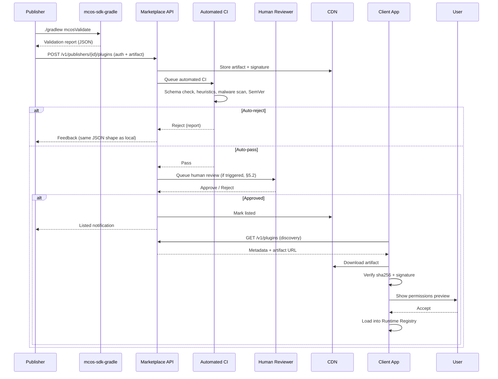
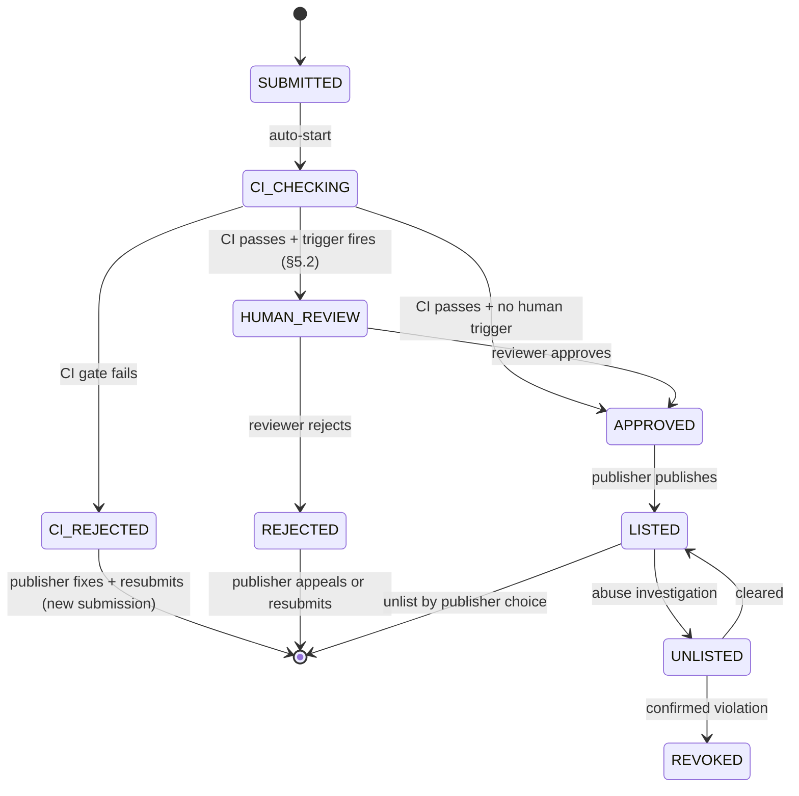
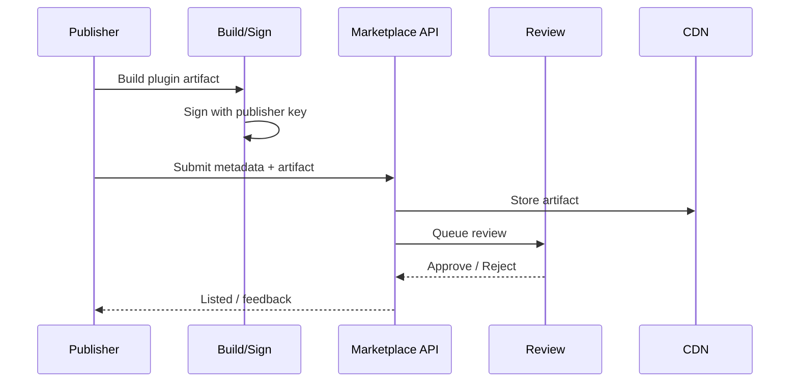
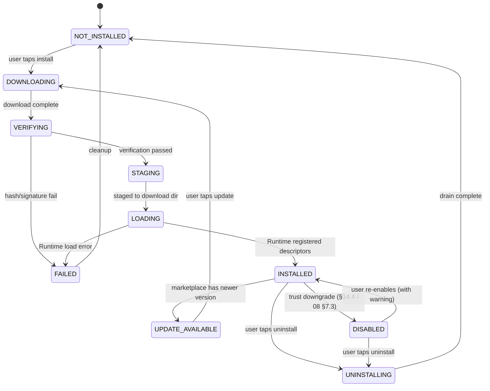

# MCOS Plugin Marketplace

> **Status:** Draft  
> **Version:** 0.1.0  
> **Last Updated:** 2026-08-06  
> **Depends on:** [01-architecture.md](./01-architecture.md), [02-command-protocol.md](./02-command-protocol.md), [03-runtime.md](./03-runtime.md), [04-plugin-sdk.md](./04-plugin-sdk.md), [05-workflow.md](./05-workflow.md), [07-memory.md](./07-memory.md), [08-security.md](./08-security.md)  
> **Service:** `mcos-server` marketplace module

> **Inspiration:** npm registry · PyPI · Homebrew · Apple App Store review process · Certificate Transparency · VS Code Marketplace · F-Droid

> 🚧 **Implementation status:** The Marketplace is a **P3 deliverable** ([11 §5](./11-implementation-status.md)) — it is the capstone of the Ecosystem phase. P1 ships with built-in plugins only; P2 adds sideload debug; P3 delivers the public index, signing, and recipe store. This document is written now (not deferred) so that P1–P2 designs that must interoperate with the marketplace — signature verification caching ([03 §16.2](./03-runtime.md)), `TrustLevel.MARKETPLACE_VERIFIED` ([08 §7](./08-security.md)), plugin download directory layout ([03 §16.1](./03-runtime.md)) — have a concrete P3 target to align with.

---

## 1. Purpose

### 1.0 Core Purpose

The Marketplace turns MCOS from an app into an **ecosystem**:

- Discover plugins & workflow recipes  
- Verify publisher identity & signatures  
- Install / update / revoke  
- Share sanitized automations  

Local execution remains possible **without** Marketplace (built-ins only).

### 1.1 Marketplace Phasing in the MCOS Roadmap

| Phase | Distribution capability | What works without marketplace |
|--------|------------------------|--------------------------------|
| **P1 (MVP)** | Built-in plugins only (shipped in APK) | Full local execution; sideload via developer mode |
| **P2** | Sideload debug install (`SIDELOAD_DEBUG` trust level, [08 §7](./08-security.md)) | All P1 + unsigned developer installs |
| **P3 (Ecosystem)** | Public index + signing + recipe store + private registries | All P2 + third-party distribution at scale |

The marketplace is not a runtime dependency — the Runtime ([03](./03-runtime.md)) loads plugins from the download directory regardless of whether the marketplace client is installed. The marketplace is the **trusted supply channel** that populates that directory with verified artifacts.

---

## 2. Design Goals

### 2.0 Five Core Goals

1. **Safety over growth hacking** — review + signatures before wide distribution  
2. **Open APIs** — third clients can query the index  
3. **Offline-friendly metadata cache**  
4. **Clear permissions preview** before install  
5. **Revocation** when a plugin is compromised  

### 2.1 Goal Trade-offs

Each goal involves an explicit trade-off. The table makes these visible so contributors understand why a seemingly obvious feature (e.g. "auto-approve all submissions") is not present:

| Goal | Trade-off | MCOS position |
|------|-----------|---------------|
| Safety over growth | Review friction slows supply | Accept slower supply; a 5-day review SLA ([§5.3](#53-review-sla)) is the ceiling, not the floor |
| Open APIs | Third-party clients bypass review UI | APIs are read-only for discovery; install always goes through the Runtime's verification gate, even if a third-party client downloaded the artifact |
| Offline-friendly cache | Stale metadata | Cache TTL 24h ([§4.4](#44-metadata-cache-strategy)); user can force-refresh; critical updates (blocklist, revocation) are push-notified |
| Clear permissions preview | Overwhelming the user | Group permissions by risk tier (normal/elevated/destructive, [08 §6.0](./08-security.md)); show summary by default, details on tap |
| Revocation | Already-installed plugins keep running | Blocklist fetch at startup ([§14.3](#143-blocklist-distribution)) force-disables revoked plugins before they can run |

---

## 3. Actors

### 3.0 Actor Table

| Actor | Role |
|-------|------|
| Publisher | Develops & signs plugins |
| Reviewer | Human / automated pipeline |
| Index | Catalog + download URLs + signatures |
| Client App | Browse, install, update |
| User | Consent to permissions |

### 3.1 Actor Interaction (Publishing Flow)

The end-to-end flow from a publisher's laptop to a user's device, expanded from the §5 sequence diagram:



---

## 4. Package Metadata

### 4.0 Normative Type

This document is the normative source for the marketplace-facing package metadata type. The plugin manifest (internal contract) is defined in [04 §4](./04-plugin-sdk.md); this is the **index-facing** metadata that the marketplace API serves and the client renders.

```kotlin
data class PackageMetadata(
    val packageId: String,              // reverse-DNS, e.g. "mcos.plugin.iot.tuya"
    val name: String,                   // display name (localized via marketplace i18n)
    val version: String,                // SemVer
    val minRuntimeVersion: String,      // SemVer — Runtime version required
    val publisherId: String,            // marketplace publisher ID
    val publisherName: String,          // display name (localized)
    val categories: List<String>,       // e.g. ["iot", "home"]
    val summary: String,                // one-line description
    val description: String?,           // long-form (markdown, optional)
    val permissionsPreview: List<PermissionEntry>,
    val commandsPreview: List<String>,  // command IDs this plugin provides
    val artifact: ArtifactRef,
    val privacyPolicyUrl: String?,
    val homepage: String?,
    val publishedAt: kotlinx.datetime.Instant,
    val updatedAt: kotlinx.datetime.Instant,
    val downloadCount: Long,            // all-time, for ranking
    val safetyScore: Float,             // 0.0–1.0, computed from permissions + review (§9.1)
)

data class PermissionEntry(
    val type: String,                   // "android" | "mcos"
    val name: String,                   // scope string, e.g. "CAMERA" or "network.api.tuya.com"
    val riskTier: String,               // "normal" | "elevated" | "destructive" (aligned with [08 §6.0](./08-security.md))
    val justification: String?,         // publisher-provided explanation for high-risk scopes
)

data class ArtifactRef(
    val url: String,                    // CDN download URL (HTTPS)
    val sha256: String,                 // hex-encoded SHA-256 of the artifact bytes
    val signature: String,              // publisher signature (base64)
    val signingKeyId: String,           // which publisher key signed this
    val sizeBytes: Long,
)
```

### 4.1 JSON Example

```json
{
  "packageId": "mcos.plugin.iot.tuya",
  "name": "Tuya Home",
  "version": "1.2.0",
  "minRuntimeVersion": "0.1.0",
  "publisherId": "pub_tuya_community",
  "publisherName": "Tuya Community",
  "categories": ["iot", "home"],
  "summary": "Control Tuya devices via MCOS commands",
  "permissionsPreview": [
    { "type": "android", "name": "INTERNET", "riskTier": "normal", "justification": null },
    { "type": "mcos", "name": "network.openapi.tuya.com", "riskTier": "elevated", "justification": "Cloud API for device control" }
  ],
  "commandsPreview": ["iot.ac.set", "home.scene.movie"],
  "artifact": {
    "url": "https://cdn.example/plugins/tuya-1.2.0.aar",
    "sha256": "...",
    "signature": "...",
    "signingKeyId": "key_2026_01",
    "sizeBytes": 1234567
  },
  "privacyPolicyUrl": "https://...",
  "homepage": "https://...",
  "publishedAt": "2026-08-01T00:00:00Z",
  "updatedAt": "2026-08-01T00:00:00Z",
  "downloadCount": 0,
  "safetyScore": 0.85
}
```

Client **MUST** show `permissionsPreview` and command list before install proceeds.

### 4.2 `permissionsPreview` Specification

The `permissionsPreview` array is derived from the plugin manifest's declared permissions ([04 §4.4](./04-plugin-sdk.md)) and is the **authoritative** list the client shows at install time. Rules:

- Every entry corresponds to a `PermissionScope` ([08 §3.0](./08-security.md)). The `type` + `name` fields reconstruct the scope string: `android:CAMERA` or `mcos:network.openapi.tuya.com`.
- The `riskTier` is computed by the marketplace CI ([§5.1](#51-automated-ci-gates)) from the scope's `sideEffectClass`, not self-declared by the publisher. A plugin cannot declare its own permissions as "normal" to hide a `destructive` scope.
- The `justification` field is **required** for `elevated` and `destructive` tiers. CI rejects submissions where a high-risk scope lacks justification.
- The preview is a **superset** of what any single command needs — the plugin may provide multiple commands with different permission subsets. The install-time preview shows the union; per-command confirmation happens at runtime ([08 §6](./08-security.md)).

### 4.3 `commandsPreview` Specification

The `commandsPreview` array lists the command IDs this plugin provides, derived from the manifest's `commands[].id` field ([01 §10](./01-architecture.md)). Rules:

- Each ID follows `namespace.name` format ([02 §4.3](./02-command-protocol.md)).
- The marketplace CI verifies namespace ownership ([04 §13.1](./04-plugin-sdk.md)): the first segment of each command ID must match one of the plugin's declared `namespaces[]`.
- Reserved namespaces (`mcos.*`, `sys.*`, `mcp.*`, `std.*`) are rejected for third-party plugins ([02 §4.3](./02-command-protocol.md)).
- This preview drives the "Commands used by you" recommendation engine ([§9.2](#92-recommendation-strategy)): if the Planner or user references a command ID not installed, the client can suggest plugins that provide it.

### 4.4 Metadata Cache Strategy

The client caches package metadata locally for offline browsing (design goal 3). The cache strategy:

| Cache entry | TTL | Invalidation trigger |
|-------------|-----|----------------------|
| Search results (page) | 24 hours | Force-refresh on user pull, or push notification for new listings |
| Single package detail | 24 hours | Force-refresh on user open, or version-update push |
| Category listing | 24 hours | Same as search results |
| Blocklist | 1 hour (but usable if stale) | Push notification on revocation ([§14.3](#143-blocklist-distribution)) |
| Publisher signing keys | Indefinite (until rotated) | Push notification on key rotation ([§6.3](#63-key-rotation--revocation)) |

**Stale-cache fallback:** if the marketplace is unreachable, the client serves the cached metadata with a "last updated X hours ago" badge. Install of a cached plugin proceeds if the artifact is already downloaded; new downloads fail with a clear "marketplace offline" message. The blocklist is usable even when stale — a cached "revoked" entry stays revoked (safer to over-block than under-block).

---

## 5. Publishing Flow

### 5.0 Normative Review State Machine

```kotlin
enum class ReviewState {
    SUBMITTED,          // publisher uploaded, awaiting CI
    CI_CHECKING,        // automated CI pipeline running
    CI_REJECTED,        // CI failed — publisher can fix and resubmit
    HUMAN_REVIEW,       // CI passed, human review triggered (§5.2)
    APPROVED,           // review passed — ready to list
    REJECTED,           // human review failed — publisher can appeal or resubmit
    LISTED,             // publicly visible in the index
    UNLISTED,           // temporarily hidden (abuse investigation, §14)
    REVOKED,            // permanently removed (publisher banned, §14)
}
```



**Key transitions:**
- `CI_REJECTED` is not terminal — the publisher fixes issues locally and submits a new version. The old submission stays in `CI_REJECTED` for audit.
- `CI_CHECKING → APPROVED` (skipping human review) happens when no human-review trigger fires ([§5.2](#52-human-review-triggers)). This is the fast path for trusted publishers' routine updates.
- `LISTED → UNLISTED` is reversible; `→ REVOKED` is terminal. A revoked package is added to the blocklist ([§14](#14-abuse--takedown)).

### 5.1 Automated CI Gates

The marketplace CI pipeline runs the same checks as the local `mcos-sdk-gradle` validator ([04 §13.2](./04-plugin-sdk.md)), plus marketplace-specific gates. Authors who pass local validation should pass CI — the report format is identical.

| # | Gate | Source | Failure mode |
|---|------|--------|--------------|
| 1 | **Manifest schema** — parses against JSON Schema from [01 §10](./01-architecture.md) | [04 §13.2](./04-plugin-sdk.md) check 1 | `CI_REJECTED` |
| 2 | **Reserved namespace** — `mcos.*`, `sys.*`, `mcp.*`, `std.*` rejected | [04 §13.2](./04-plugin-sdk.md) check 2 | `CI_REJECTED` |
| 3 | **Duplicate ID** — no collisions within or across dependencies | [04 §13.2](./04-plugin-sdk.md) check 3 + [02 §4.4](./02-command-protocol.md) | `CI_REJECTED` |
| 4 | **sideEffectClass honesty** — heuristics flag mismatches | [04 §13.2](./04-plugin-sdk.md) check 4 | Warning (tolerance in [§5.2](#52-human-review-triggers)) |
| 5 | **SemVer compliance** — version regex + coupling + monotonicity | [04 §13.1](./04-plugin-sdk.md) rules | `CI_REJECTED` |
| 6 | **i18n completeness** — title/description for every locale | [04 §13.2](./04-plugin-sdk.md) check 6 | `CI_REJECTED` |
| 7 | **Secret containment** — no `{{secret.*}}` in bodyTemplate | [04 §13.2](./04-plugin-sdk.md) check 7 | `CI_REJECTED` |
| 8 | **Signature verification** — artifact signed by registered publisher key | Marketplace-specific | `CI_REJECTED` |
| 9 | **Malware scan** — artifact scanned by AV engine | Marketplace-specific | `CI_REJECTED` + flag for human review |
| 10 | **Namespace arbitration** — no collision with existing marketplace plugins | [02 §4.4](./02-command-protocol.md) | `CI_REJECTED` (first-published wins) |
| 11 | **Min runtime version** — `minRuntimeVersion` ≤ current runtime release | Marketplace-specific | `CI_REJECTED` (plugin targets future runtime) |

Gates 1–7 mirror `mcos-sdk-gradle` exactly. Gates 8–11 are marketplace-only (require the central index state). Gate 4 (honesty heuristics) produces **warnings**, not hard rejections — see [§5.2](#52-human-review-triggers) for how warnings escalate to human review.

### 5.2 Human Review Triggers

Human review is triggered when the submission matches any of these rules. Each rule has a **severity** that determines the review depth:

| Trigger | Severity | Review action |
|---------|----------|---------------|
| First publish by new publisher | High | Full manual review of manifest, permissions, and artifact decompilation |
| New `destructive` sideEffectClass usage | High | Manual review of the destructive command's handler logic |
| Accessibility or notification-listener usage | High | Manual review + screenshot of the UX warning the user will see |
| Large permission expansion on update (≥2 new elevated/destructive scopes) | Medium | Diff review of added permissions vs justification |
| `sideEffectClass` honesty warning (CI gate 4) | Medium | Manual check: does the declared class match actual behavior? |
| User abuse reports ≥ threshold (3+ reports in 7 days) | High | Full re-review; may `UNLIST` pending investigation |
| Publisher with prior `REJECTED` or `REVOKED` history | Medium | Mandatory review (no fast path) |

**Fast path:** a trusted publisher (≥5 approved submissions, no `REJECTED` in 90 days) submitting a routine update (no new permissions, no new commands, SemVer MINOR/PATCH) skips human review entirely (`CI_CHECKING → APPROVED`).

### 5.3 Review SLA

| Stage | Target | Ceiling |
|-------|--------|---------|
| Automated CI (gates 1–11) | < 5 minutes | 15 minutes |
| Human review (high severity) | < 3 business days | 5 business days |
| Human review (medium severity) | < 5 business days | 10 business days |
| Appeal decision | < 5 business days | 10 business days |

If a review exceeds the ceiling, the submission is auto-listed with a "pending extended review" badge (not blocked indefinitely). This prevents the marketplace from becoming a bottleneck for legitimate publishers.

### 5.4 Rejection Feedback Format

The rejection feedback uses the **same JSON shape** as the `mcos-sdk-gradle` validator report ([04 §13.2](./04-plugin-sdk.md)), so the publisher can paste the marketplace's response into their local CI to reproduce and fix:

```json
{
  "overall": "CI_REJECTED",
  "checks": [
    {
      "gate": 5,
      "rule": "SemVer compliance",
      "status": "fail",
      "severity": "error",
      "message": "Plugin version MAJOR bump (2.0.0) must be accompanied by a MAJOR bump on at least one command; all commands are still at 1.x",
      "location": { "field": "version", "line": 3 }
    },
    {
      "gate": 4,
      "rule": "sideEffectClass honesty",
      "status": "warning",
      "severity": "warning",
      "message": "Command 'iot.ac.set' declares sideEffectClass 'write' but manifest references http object; flagged for human review",
      "location": { "commandId": "iot.ac.set" }
    }
  ]
}
```

Errors (`severity: "error"`) cause `CI_REJECTED`; warnings (`severity: "warning"`) do not block but trigger human review ([§5.2](#52-human-review-triggers)).

### 5.5 Publishing Flow (Original Mermaid, Retained)



> **Review pipeline summary:** automated checks are the 11 CI gates in [§5.1](#51-automated-ci-gates); human review triggers are the severity-graded rules in [§5.2](#52-human-review-triggers).

---

## 6. Signing & Trust

### 6.0 Normative Key Types

```kotlin
data class PublisherKey(
    val keyId: String,                  // e.g. "key_2026_01" — unique per publisher
    val publisherId: String,            // marketplace publisher ID
    val publicKeyFingerprint: String,   // SHA-256 of the public key (hex)
    val algorithm: String,              // "Ed25519" (preferred) or "RSA-PSS-4096" (legacy)
    val createdAt: kotlinx.datetime.Instant,
    val rotatedFrom: String?,           // previous keyId this replaced (for audit chain)
    val status: KeyStatus,              // ACTIVE / REVOKED
)

enum class KeyStatus { ACTIVE, REVOKED }

data class SigningResult(
    val keyId: String,                  // which key signed
    val signature: ByteArray,           // signature bytes
    val algorithm: String,
    val signedAt: kotlinx.datetime.Instant,
)
```

**Algorithm preference (normative):** Ed25519 is preferred for all new publisher keys. RSA-PSS-4096 is supported for legacy publishers migrating from existing infra. ECDSA is not supported (Ed25519 is strictly better for new keys). The `algorithm` field in `PublisherKey` tells the client which verification path to use.

### 6.1 Publisher Key Registration

```text
1. Publisher generates an Ed25519 key pair locally (or in their HSM/KMS)
2. Publisher registers on the marketplace:
   a. Creates publisher account (publisherId, display name, contact)
   b. Uploads the public key (or just the fingerprint + public key bytes)
   c. Marketplace verifies the publisher's identity (email, domain, or org)
   d. Marketplace assigns keyId and stores PublisherKey in the index
3. Publisher keeps the private key secret:
   a. Preferred: HSM (YubiKey, cloud KMS) — key never leaves the device
   b. Acceptable: encrypted local file (passphrase-protected)
   c. Never: plaintext file, git repo, or CI env var without secrets management
4. The CI build signs the artifact with the private key:
   a. ./gradlew mcosSign (uses configured key source)
   b. Outputs SigningResult { keyId, signature, algorithm, signedAt }
5. Marketplace CI (gate 8) verifies the signature against the registered public key
```

### 6.2 Signature Verification Algorithm (Client-Side)

The client verifies a downloaded artifact before loading it into the Runtime. This aligns with the Runtime's signature verification cache ([03 §16.2](./03-runtime.md)):

```text
function verifyArtifact(metadata: PackageMetadata, artifactBytes: ByteArray): VerifyResult {
    // 1. Check SHA-256 integrity
    val computedHash = sha256(artifactBytes)
    if (computedHash != metadata.artifact.sha256) {
        return REJECT("hash_mismatch", expected=metadata.artifact.sha256, actual=computedHash)
    }

    // 2. Fetch publisher public key (from cache or marketplace)
    val pubKey = keyCache.get(metadata.artifact.signingKeyId)
        ?: fetchFromMarketplace(metadata.artifact.signingKeyId)
    if (pubKey == null) {
        return REJECT("key_not_found", keyId=metadata.artifact.signingKeyId)
    }

    // 3. Check key status (not revoked)
    if (pubKey.status == REVOKED) {
        return REJECT("key_revoked", keyId=pubKey.keyId)
    }

    // 4. Verify signature
    val valid = verifySignature(
        publicKey = pubKey,
        data = artifactBytes,
        signature = metadata.artifact.signature,
        algorithm = pubKey.algorithm,
    )
    if (!valid) {
        return REJECT("signature_invalid", keyId=pubKey.keyId)
    }

    // 5. Check blocklist (§14)
    if (blocklist.contains(metadata.packageId, metadata.version)) {
        return REJECT("blocklisted", packageId=metadata.packageId)
    }

    // 6. Cache the verification result (aligned with 03 §16.2)
    keyCache.put(metadata.artifact.signingKeyId, pubKey)
    verificationCache.put(
        key = (metadata.artifact.signingKeyId, computedHash),
        value = VerifyCacheEntry(verifiedAt = now(), trusted = true),
    )

    return ACCEPT(TrustLevel.MARKETPLACE_VERIFIED, pubKey)
}
```

**Offline behavior (aligned with [03 §16.2](./03-runtime.md)):** step 6 caches `(keyId, hash) → verifiedAt`. On subsequent loads, if the cache entry exists and is within the revocation TTL (default 7 days), the artifact loads without re-contacting the marketplace. A cache entry older than the TTL is re-verified on the next online opportunity; if the marketplace is unreachable and the TTL is exceeded, the plugin loads with a "verification expired" warning (not blocked — the user may need the plugin offline; the risk is surfaced).

### 6.3 Key Rotation & Revocation

| Scenario | Action | Client effect |
|----------|--------|---------------|
| Routine rotation (publisher's choice) | Publisher generates new key, registers it with `rotatedFrom: oldKeyId`, signs next release with new key | Old key remains `ACTIVE` for a grace period (90 days) so already-installed plugins keep loading; new installs use the new key |
| Key suspected compromised | Publisher requests emergency revocation → marketplace sets old key `status: REVOKED`, pushes blocklist entry | Client receives blocklist push → re-verifies all plugins signed by the revoked key → force-disables those that cannot be re-verified with a new key ([§14.4](#144-force-disable-of-installed-revoked-plugins)) |
| Publisher banned | Marketplace revokes all keys for the publisher, pushes blocklist for all their packages | All plugins by that publisher are force-disabled on next blocklist fetch |
| Key expiry (if publisher set an expiry) | Marketplace sets `status: REVOKED` at expiry | Same as compromised — plugins need re-signing or are disabled |

**Grace period rationale:** routine rotation must not break already-installed plugins. The 90-day overlap lets publishers re-sign existing versions with the new key and push updates before the old key is fully revoked.

### 6.4 Transparency Log (V1+)

To detect a malicious or compromised marketplace server that silently serves different artifacts to different clients, the marketplace maintains a **transparency log** — an append-only Merkle tree of all published (packageId, version, sha256, signingKeyId) entries, modeled on Certificate Transparency (RFC 6962).

```text
1. Every published version is appended as a leaf to the Merkle tree
2. The marketplace returns a Signed Tree Head (STH) with each metadata response:
   { treeSize, timestamp, rootHash, marketplaceSignature }
3. The client can verify (out-of-band, via a third-party monitor) that its
   received metadata appears in the publicly-auditable tree
4. A "gossip" protocol (V2+) lets clients compare STHs to detect split-view attacks
```

This is a V1+ feature — the MVP marketplace (P3) ships without it, relying on the marketplace operator's integrity. The transparency log is the path to a fully trustless distribution channel.

### 6.5 Trust Level Integration

The marketplace signature is the source of `TrustLevel.MARKETPLACE_VERIFIED` ([08 §7](./08-security.md)):

| Verification outcome | `TrustLevel` assigned |
|----------------------|----------------------|
| Signature valid + key ACTIVE + not blocklisted | `MARKETPLACE_VERIFIED` |
| Signature valid but key REVOKED | `UNTRUSTED` (force-disabled, [§14.4](#144-force-disable-of-installed-revoked-plugins)) |
| Signature invalid or missing | `UNTRUSTED` (load refused in production) |
| Blocklisted | `UNTRUSTED` (force-disabled) |
| Built-in plugin (shipped with Runtime) | `BUILTIN` (skips marketplace verification, [03 §16.2](./03-runtime.md)) |
| Sideload (debug builds only) | `SIDELOAD_DEBUG` (no marketplace signature, [08 §7](./08-security.md)) |

### 6.6 Original Signing Rules (Retained)

1. Publishers register and obtain / upload signing keys  
2. Artifacts signed; index stores signature + cert fingerprint  
3. Client verifies signature before load  
4. Optional **transparency log** of published hashes (V1+)  

Compromised keys: revoke publisher, push kill-switch to clients.

---

## 7. Install / Update / Uninstall

### 7.0 Normative Install State Machine

```kotlin
enum class InstallState {
    NOT_INSTALLED,          // plugin not on device
    DOWNLOADING,            // artifact download in progress
    VERIFYING,              // sha256 + signature verification
    STAGING,                // copying to Runtime download dir
    LOADING,                // Runtime registering descriptors
    INSTALLED,              // active and ready
    UPDATE_AVAILABLE,       // newer version in marketplace
    DISABLED,               // installed but trust-downgraded / quarantined
    UNINSTALLING,           // drain in progress (canceling running steps)
    FAILED,                 // download/verify/load error (cleanup needed)
}
```



**Key transitions:**
- `VERIFYING → FAILED` triggers cleanup (delete partial download, clear staging).
- `LOADING → FAILED` means the Runtime rejected the plugin (e.g. namespace conflict, [02 §4.4](./02-command-protocol.md)). The artifact is valid but incompatible — the user sees a specific error message.
- `INSTALLED → DISABLED` is triggered by blocklist fetch ([§14](#14-abuse--takedown)) or quarantine ([08 §15.3](./08-security.md)). The plugin stays on disk but is not loaded.

### 7.1 Install Flow (Normative Algorithm)

```text
function installPackage(metadata: PackageMetadata):
    state = DOWNLOADING
    1. Download artifact from metadata.artifact.url (HTTPS, resumable)
       on progress: emit InstallProgress(percent)
       on network error: state = FAILED, return

    state = VERIFYING
    2. Verify artifact:
       result = verifyArtifact(metadata, artifactBytes)   // §6.2
       if result is REJECT:
           state = FAILED
           show error with reason (hash_mismatch / signature_invalid / blocklisted)
           delete downloaded file
           return

    state = STAGING
    3. Stage artifact to Runtime download dir:
       path = downloadDir / "${metadata.packageId}-${metadata.version}.aar"
       write artifactBytes to path

    state = LOADING
    4. Trigger Runtime to load the new plugin:
       runtime.loadPlugin(path)   // 03 §16.3 classloader isolation
       this calls onLoad(services) → registers descriptors → RegistryChanged

    5. Check Runtime load result:
       if load failed (namespace conflict, schema error, etc.):
           state = FAILED
           show error
           delete staged file
           return

    state = INSTALLED
    6. Show permissions preview to user (if not already shown pre-download):
       - List all permissionsPreview entries grouped by riskTier
       - Highlight elevated/destructive with justification
       - User taps "Accept" or "Cancel"
       if Cancel: state = UNINSTALLING (undo install), return

    7. Grant defaults:
       - Do NOT pre-grant any permissions
       - Each command's permissions will be requested at first invoke via
         Stage 6 Authorize (08 §3.4) + ConfirmationPrompt (08 §6.0)
       - This is "install consent" (layer 2, 08 §2.0), not "runtime grant"

    8. Post-install telemetry (opt-in, §11.3):
       if user opted in:
           POST /v1/telemetry/install { packageId, version, anonymized }
```

**Install consent ≠ runtime grant.** Step 7 is critical: installing a plugin does not grant it any runtime permissions. The user consents to *what the plugin may ask for* (layer 2); each actual command invocation still goes through Stage 6 confirmation (layer 5). This is defense-in-depth: even if the user blindly installs, each destructive action still requires per-action confirmation.

### 7.2 Update Flow & Permission Diff Algorithm

When a new version is available, the client computes a **permission diff** between the installed version and the new version. The diff determines whether the update requires fresh consent or can proceed silently.

```kotlin
data class PermissionDiff(
    val added: List<PermissionEntry>,      // scopes in new version not in old
    val removed: List<PermissionEntry>,    // scopes in old not in new
    val changed: List<PermissionChange>,   // same scope, riskTier or justification changed
    val consentRequired: Boolean,          // true if added/changed contains elevated/destructive
)

data class PermissionChange(
    val scope: String,                     // the permission scope that changed
    val oldEntry: PermissionEntry,
    val newEntry: PermissionEntry,
    val changeType: ChangeType,            // RISK_TIER_ESCALATED / JUSTIFICATION_CHANGED
)

enum class ChangeType { RISK_TIER_ESCALATED, JUSTIFICATION_CHANGED }
```

**Diff computation algorithm (normative):**

```text
function computePermissionDiff(oldMeta, newMeta): PermissionDiff {
    oldScopes = setOf(oldMeta.permissionsPreview.map { it.type + ":" + it.name })
    newScopes = setOf(newMeta.permissionsPreview.map { it.type + ":" + it.name })

    added = newMeta.permissionsPreview.filter { entry ->
        (entry.type + ":" + entry.name) !in oldScopes
    }
    removed = oldMeta.permissionsPreview.filter { entry ->
        (entry.type + ":" + entry.name) !in newScopes
    }
    changed = newMeta.permissionsPreview.filter { newEntry ->
        val key = newEntry.type + ":" + newEntry.name
        val oldEntry = oldMeta.permissionsPreview.find { (it.type + ":" + it.name) == key }
        oldEntry != null && (
            oldEntry.riskTier != newEntry.riskTier ||
            oldEntry.justification != newEntry.justification
        )
    }.map { newEntry ->
        PermissionChange(
            scope = newEntry.type + ":" + newEntry.name,
            oldEntry = oldMeta.permissionsPreview.find { ... },
            newEntry = newEntry,
            changeType = if (oldEntry.riskTier != newEntry.riskTier)
                RISK_TIER_ESCALATED else JUSTIFICATION_CHANGED,
        )
    }

    consentRequired = added.any { it.riskTier in setOf("elevated", "destructive") }
        || changed.any { it.changeType == RISK_TIER_ESCALATED }

    return PermissionDiff(added, removed, changed, consentRequired)
}
```

**Update UI behavior:**

| Diff result | UI behavior |
|-------------|-------------|
| `added` is empty (same or fewer permissions) | Silent update — proceeds without prompt |
| `added` contains only `normal` tier | Lightweight prompt: "Update adds: [list]. Allow?" |
| `added` or `changed` contains `elevated`/`destructive` | Full permission preview (same as install, [§7.1](#71-install-flow-normative-algorithm) step 6) — `consentRequired = true` |
| Major command contract breaks (SemVer MAJOR on a command) | Warning: "This update may break existing workflows using [command IDs]" ([05](./05-workflow.md) pinned-workflow resolution) |
| `removed` permissions | No prompt needed (plugin is asking for less) |

### 7.3 Uninstall Flow

```text
function uninstallPackage(packageId):
    state = UNINSTALLING
    1. Trigger Runtime drain (03 §6.5):
       a. Stop accepting new invocations for this plugin's commands
       b. Cancel running steps (cooperative → forced, 03 §9.4)
       c. Wait for drain grace period (default 5s)
       d. Force-cancel remaining runs
       e. Unregister descriptors from all three Registry indices
       f. Release plugin classloader
       g. Emit RegistryChanged event
       h. Audit: plugin.uninstalled

    2. Revoke all grants for this plugin (08 §5):
       a. Delete GrantRecords where subject matches "plugin:<packageId>.*"
       b. This prevents stale grants if the plugin is reinstalled later

    3. Clean up SecureStore (optional, user choice):
       - Default: wipe SecureStore namespace for this pluginId (secrets are gone)
       - User can opt to "keep credentials for reinstall" (secrets preserved)

    4. Delete artifact from download dir

    5. Memory aliases:
       - Leave user Memory aliases intact (places, people, devices — user's data)
       - Unless user opts to "clean associated Memory" (removes episodic records
         referencing this plugin's commands)

    state = NOT_INSTALLED
```

**Memory preservation rationale:** the user's Memory (preferences, places, people) is their data, not the plugin's. Uninstalling a camera plugin should not delete the user's stored places. Episodic records referencing the plugin's commands are kept by default (they are historical fact); the user can opt to clean them.

### 7.4 Dependency Resolution (Recipe Install)

When installing a recipe ([§8](#8-workflow-recipe-store)), the installer resolves `requiredPlugins` constraints. The recipe envelope ([05 §14.1](./05-workflow.md)) declares dependencies as `pluginId@semverRange`:

```text
function resolveRecipeDependencies(recipe: RecipeEnvelope): ResolveResult {
    missing = []
    for each dep in recipe.requiredPlugins:   // e.g. "com.example.photo@>=1.0.0"
        (pluginId, range) = parseSemverRange(dep)
        installed = runtime.findInstalledPlugin(pluginId)
        if installed != null && installed.version satisfies range:
            continue   // already installed and compatible
        else:
            // Look up in marketplace
            available = marketplace.findPlugin(pluginId, range)
            if available == null:
                missing.add(MissingDependency(pluginId, range, reason="not_in_marketplace"))
            else:
                missing.add(MissingDependency(pluginId, range, suggestedVersion=available.version))

    if missing.isEmpty():
        return RESOLVED   // all deps satisfied
    else:
        return UNRESOLVED(missing)   // installer refuses; user sees what's missing
}
```

**SemVer range syntax:** `>=1.0.0` (minimum), `>=1.0.0 <2.0.0` (range), `^1.0.0` (compatible, same major), `~1.0.0` (approximately, same minor). The parser is the standard semver-spec implementation. Unparseable ranges fail the recipe installation with `SCHEMA_VIOLATION`.

If dependencies are satisfiable but not yet installed, the installer offers a **batch install** screen: "This recipe requires [plugin A v1.2+] and [plugin B v2.0+]. Install all?" The user consents once for the batch; each plugin still goes through its own permission preview ([§7.1](#71-install-flow-normative-algorithm) step 6).

### 7.5 Original Install/Update/Uninstall (Retained Summary)

### Install

```text
Fetch metadata → show permissions → user accepts
  → download → verify sha256 + signature
  → stage → load into Runtime Registry
  → grant default asks (still runtime-gated per command)
```

### Update

- Show permission **diff**  
- Major command contract breaks → warn workflows may fail  
- Support staged rollout percentages server-side  

### Uninstall

- Unregister commands  
- Cancel running steps from plugin  
- Optionally wipe plugin-local SecureStore  
- Leave user Memory aliases intact unless user opts to clean  

---

## 8. Workflow Recipe Store

### 8.0 Schema Owner Relationship

The **recipe envelope schema** (`recipeId`/`name`/`version`/`workflow`/`placeholders`/`requiredPlugins`/`triggerPreview` + field table + security constraints) is defined normatively in [05 §14.1](./05-workflow.md). This section does **not** redefine it. Instead, it specifies the **marketplace-specific** concerns: publishing, signing, search, and the install-time setup wizard.

### 8.1 Recipe Publishing Flow

Recipes go through the same review pipeline as plugins ([§5](#5-publishing-flow)), with recipe-specific CI gates:

| Gate | Recipe-specific check |
|------|----------------------|
| Workflow IR validation | The `workflow` field parses as a valid `CompiledWorkflow` ([05 §4.0](./05-workflow.md)) |
| Placeholder completeness | Every `{{placeholder.*}}` token in the workflow has a corresponding entry in `placeholders[]` |
| `requiredPlugins` satisfiability | Every `pluginId@semverRange` references a plugin that exists in the marketplace |
| No embedded secrets | The workflow body is scanned for secret-like patterns (CI rejects submissions with hardcoded tokens/passwords, [05 §14.1](./05-workflow.md) security constraint 1) |
| No hardcoded personal IDs | No specific device IDs, user IDs, or contact references (must use placeholders) |

Recipes do **not** require a human review trigger for routine updates (they contain no executable code — only declarative IR). The automated CI gates suffice unless the recipe is flagged by user abuse reports.

### 8.2 Recipe Search & Discovery

Recipes are searchable alongside plugins in the marketplace. The discovery UX:

| Surface | How recipes appear |
|---------|-------------------|
| Full-text search | Recipe `name` and `summary` are indexed; queries like "photo compress" match relevant recipes |
| Category browse | Recipes appear in the same categories as plugins (a recipe using `photo.*` commands appears under "Media") |
| Plugin detail page | "Recipes using this plugin" — shows recipes that declare this plugin in `requiredPlugins` |
| Command detail page | "Recipes using this command" — shows recipes whose workflow invokes this command ID |
| Planner suggestion | When the Planner encounters a goal matching a known recipe pattern, it can suggest the recipe ([05 §13](./05-workflow.md) Planner emission rules: "prefer known recipes before synthesizing new IR") |

### 8.3 Recipe Install Wizard

Installing a recipe runs a **setup wizard** that binds placeholders to concrete values. This is specified in [05 §14.1](./05-workflow.md) ("Placeholder binding"); the marketplace client implements it as follows:

```text
function installRecipe(recipe: RecipeEnvelope):
    1. Resolve dependencies (§7.4):
       result = resolveRecipeDependencies(recipe)
       if result is UNRESOLVED:
           show missing plugins, offer batch install
           if user declines: abort

    2. For each placeholder in recipe.placeholders:
       a. If placeholder.fromMemory is non-null:
          - Query Memory at the given path (e.g. "contacts.frequentlyMessaged")
          - Suggest the top value to the user
          - User confirms or overrides
       b. If placeholder.required is true:
          - Wizard cannot be skipped until the user provides a value
       c. If placeholder.default is set and user skips:
          - Use the default value
       d. Store the bound value in Memory at a recipe-scoped path:
          "recipes.{recipeId}.placeholders.{key}"

    3. Compile the workflow with bound placeholders:
       - The Runtime compiles the workflow IR, substituting {{placeholder.*}} tokens
         with the bound values from Memory (05 §14.1 "placeholder binding")
       - The resulting CompiledWorkflow has no {{placeholder.*}} tokens remaining

    4. Register the compiled workflow:
       - Stored in local workflow DB (05 §14)
       - Trigger registered (if recipe has a trigger, e.g. "on wifi connect")

    5. Sign the recipe envelope (marketplace signature, §6):
       - The marketplace signs the recipe at publish time
       - The Runtime verifies the signature before compiling (05 §14.1 constraint 3)
```

**Memory binding is the key UX innovation.** A recipe like "Office Wi-Fi → VPN" with `fromMemory: "places.office.wifiSsids"` automatically suggests the user's stored office Wi-Fi SSIDs — the user does not type anything. This makes recipes feel "smart" while remaining transparent (the user sees and confirms every binding).

### 8.4 Original Recipe Example (Retained)

Alongside plugins, distribute **recipes**:

```json
{
  "recipeId": "recipe.office.vpn",
  "name": "Office Wi‑Fi → VPN",
  "workflow": { "...": "IR with placeholders" },
  "placeholders": [
    { "key": "ssid", "fromMemory": "places.office.wifiSsids" }
  ],
  "requiredPlugins": ["mcos.plugin.system", "mcos.plugin.vpn"]
}
```

Rules:

- No embedded secrets  
- Placeholders for personal IDs  
- Setup wizard binds Memory on install  

---

## 9. Search & Discovery

### 9.0 Discovery Mechanisms

| Mechanism | Notes |
|-----------|-------|
| Full-text | Name, summary, command IDs |
| Category browse | IoT, Media, Productivity, Developer, MCP |
| "Commands used by you" | Recommend plugins providing missing IDs |
| Editor's choice | Curated, clearly labeled |

Ranking must not hide permission severity.

### 9.1 Search Ranking Algorithm (Normative)

Search results are ranked by a composite score that balances relevance, popularity, and safety. The **safety weight** ensures high-permission plugins are not artificially boosted to the top:

```text
function rank(query, package: PackageMetadata): Float {
    // 1. Text relevance (BM25-style, 0.0–1.0)
    textScore = bm25(query, [package.name, package.summary, package.commandsPreview])

    // 2. Category match bonus (0.0 or 0.2)
    categoryBonus = if (query.category in package.categories) 0.2 else 0.0

    // 3. Popularity (log-scaled download count, 0.0–1.0)
    popularity = min(1.0, log10(package.downloadCount + 1) / 6.0)

    // 4. Safety weight (0.0–1.0) — computed from permissions
    safetyWeight = computeSafetyWeight(package.permissionsPreview)

    // 5. Composite: relevance + category + popularity, then dampened by safety
    rawScore = (textScore * 0.5) + (categoryBonus * 0.2) + (popularity * 0.3)
    return rawScore * safetyWeight
}

function computeSafetyWeight(permissions: List<PermissionEntry>): Float {
    // More high-risk permissions → lower safety weight → lower rank
    val destructive = permissions.count { it.riskTier == "destructive" }
    val elevated = permissions.count { it.riskTier == "elevated" }
    val normal = permissions.count { it.riskTier == "normal" }

    val penalty = destructive * 0.15 + elevated * 0.05 + normal * 0.01
    return max(0.3, 1.0 - penalty)   // floor at 0.3 — never fully hides a plugin
}
```

**Design intent:**
- `safetyWeight` **dampens** but never fully hides a plugin (floor 0.3). A user searching for a photo plugin will still find a photo plugin that needs camera access — it just ranks below a photo plugin that needs less.
- The `safetyScore` in `PackageMetadata` ([§4.0](#40-normative-type)) is the stored form of `computeSafetyWeight`, pre-computed at index time so search is fast.
- "Editor's choice" curated listings bypass this ranking — they are shown in a separate section, clearly labeled "Curated" so users know the ranking is editorial, not algorithmic.

### 9.2 Recommendation Strategy ("Commands used by you")

The "Commands used by you" mechanism recommends plugins that provide command IDs the user has referenced but does not have installed:

```text
function recommendPlugins(userMemory: MemorySnapshot): List<PackageMetadata> {
    1. Extract command IDs the user has used or referenced:
       - From episodic memory: commands invoked in the last 30 days (07 §8)
       - From pinned workflows: commands in saved workflow IR (05 §14)
       - From Planner clarification history: commands the Planner offered
         in Clarify options that the user did not have installed

    2. Find which of those are NOT currently installed:
       installed = runtime.getAllInstalledCommandIds()
       missing = referencedCommands - installed

    3. For each missing command ID:
       candidates = marketplace.searchByCommandId(commandId)
       // Returns packages whose commandsPreview contains this ID

    4. Rank candidates by:
       - Safety weight (§9.1)
       - Whether the user already has other plugins from the same publisher
         (familiarity bonus, +0.1)

    5. Return top-N (default 5) recommendations with explanation:
       "You recently tried to use 'photo.compress' — this plugin provides it."
}
```

This is **privacy-preserving**: the recommendation runs client-side from the user's local Memory. The client sends only the missing command IDs to the marketplace (not the full usage history). The marketplace does not learn *which* commands the user uses — only *which plugins* the client is searching for.

### 9.3 Metadata Cache (Offline Browse)

The client caches search results and category listings ([§4.4](#44-metadata-cache-strategy)) so the user can browse the marketplace while offline:

- The last-searched query's results are cached for 24 hours.
- "Home" / "Popular" / category pages are cached and served stale with a "last updated" badge.
- Install is possible only if the artifact is already downloaded — a cached listing with no cached artifact shows "Download requires network."
- The blocklist is always available (cached, usable when stale — over-blocking is safer than under-blocking).

---

## 10. MCP Catalog Bridge

### 10.0 Overview

Marketplace may list **MCP server templates**:

- Config stub (URL, auth type)  
- Suggested command namespace  
- Not the MCP server binary itself (unless packaged)  

Enabling still goes through MCP adapter + user secrets.

### 10.1 MCP Template Publishing

An MCP server author can publish a "template" that makes their MCP server discoverable as an MCOS plugin, without writing native Kotlin code. The template is a declarative config that the MCP Adapter ([04 §10](./04-plugin-sdk.md)) turns into `CommandDescriptor`s at runtime:

```json
{
  "templateType": "mcp-bridge",
  "mcpServer": {
    "url": "https://mcp.example.com/sse",
    "transport": "sse",
    "authType": "bearer"
  },
  "suggestedNamespace": "example",
  "description": "Example MCP server — tools auto-discovered via MCP ListTools"
}
```

| Field | Purpose |
|-------|---------|
| `templateType` | Always `"mcp-bridge"` — distinguishes from native plugin packages |
| `mcpServer.url` | The MCP server endpoint (HTTPS required) |
| `mcpServer.transport` | `"sse"` (Server-Sent Events) or `"stdio"` (local binary) |
| `mcpServer.authType` | `"none"` / `"bearer"` / `"oauth"` — determines the user setup flow |
| `suggestedNamespace` | The MCOS command namespace (e.g. `example` → commands become `example.*`) |

### 10.2 MCP Template → MCOS Command Conversion

At install time, the client connects to the MCP server, calls `ListTools`, and converts each MCP tool into an MCOS `CommandDescriptor` per the conversion table in [02 §12.4](./02-command-protocol.md). The conversion is fail-closed: any MCP tool whose schema cannot be mapped to MCOS types is skipped (not silently coerced), and the user sees which tools were excluded.

The resulting commands have `sideEffectClass` inferred from the MCP tool's annotations (or defaulting to `network` if the MCP server is remote). The MCP adapter ([04 §10](./04-plugin-sdk.md)) handles the runtime translation between MCOS IR and MCP protocol.

**User setup:** the user must provide credentials for `authType: bearer` or `authType: oauth` — these go into `SecureStore` ([08 §9.1](./08-security.md)), never into the template or the IR. The template only declares the auth *type*; the *value* is user-supplied at install.

---

## 11. API Surface

### 11.0 Normative REST Endpoint Table

| Method | Path | Auth | Purpose |
|--------|------|------|---------|
| `GET` | `/v1/plugins` | none | Search/list packages ([§11.1](#111-search-parameters)) |
| `GET` | `/v1/plugins/{packageId}` | none | Get single package metadata (latest version) |
| `GET` | `/v1/plugins/{packageId}/versions` | none | List all versions |
| `GET` | `/v1/plugins/{packageId}/versions/{version}` | none | Get specific version metadata |
| `GET` | `/v1/plugins/{packageId}/artifact` | none | Redirect to CDN download URL (302) |
| `GET` | `/v1/plugins/by-command/{commandId}` | none | Find packages providing a command ID (for recommendations, [§9.2](#92-recommendation-strategy-commands-used-by-you)) |
| `POST` | `/v1/publishers/{id}/plugins` | publisher token | Submit new plugin version ([§11.2](#112-publish-endpoint)) |
| `GET` | `/v1/publishers/{id}` | none | Publisher profile + published packages |
| `POST` | `/v1/publishers/{id}/keys` | publisher token | Register a new signing key ([§6.1](#61-publisher-key-registration)) |
| `DELETE` | `/v1/publishers/{id}/keys/{keyId}` | publisher token | Revoke a signing key ([§6.3](#63-key-rotation--revocation)) |
| `GET` | `/v1/recipes` | none | Search/list recipes |
| `GET` | `/v1/recipes/{recipeId}` | none | Get recipe envelope ([05 §14.1](./05-workflow.md)) |
| `GET` | `/v1/blocklist` | none | Signed blocklist ([§14.3](#143-blocklist-distribution)) |
| `GET` | `/v1/keys/revoked` | none | List of revoked signing keys (for client-side verification, [§6.3](#63-key-rotation--revocation)) |
| `POST` | `/v1/telemetry/install` | client (opt-in) | Anonymous install event ([§11.3](#113-telemetry-endpoint)) |
| `POST` | `/v1/reports` | client | Report abuse ([§14.1](#141-user-reporting-flow)) |
| `GET` | `/v1/transparency/sth` | none | Signed Tree Head (V1+, [§6.4](#64-transparency-log-v1)) |

All endpoints return JSON. All `GET` endpoints are cacheable (ETag + Cache-Control). The API is versioned (`/v1/`) — breaking changes require a new major version.

### 11.1 Search Parameters

```
GET /v1/plugins?query=photo&category=media&sort=safety&page=1&pageSize=20
```

| Parameter | Type | Default | Constraint |
|-----------|------|---------|------------|
| `query` | string | — | Full-text search on name, summary, command IDs; URL-encoded |
| `category` | string | — | One of: `iot`, `media`, `productivity`, `developer`, `mcp`, `home`, `system` |
| `sort` | enum | `relevance` | `relevance` / `safety` / `popularity` / `newest` |
| `page` | int | 1 | ≥1 |
| `pageSize` | int | 20 | 1–100 |
| `minRuntimeVersion` | string | — | SemVer; filters out packages requiring a newer runtime |

**Response:**

```json
{
  "results": [PackageMetadata, ...],
  "total": 42,
  "page": 1,
  "pageSize": 20,
  "cacheTtlSeconds": 86400
}
```

When `sort=safety`, results are ordered by `safetyScore` descending (safest first). When `sort=popularity`, by `downloadCount` descending. The `relevance` sort uses the composite ranking ([§9.1](#91-search-ranking-algorithm-normative)).

### 11.2 Publish Endpoint

```
POST /v1/publishers/{id}/plugins
Authorization: Bearer {publisherToken}
Content-Type: multipart/form-data
```

**Multipart parts:**

| Part | Content | Required |
|------|---------|----------|
| `metadata` | JSON `PackageMetadata` (without `downloadCount`/`safetyScore` — server computes) | yes |
| `artifact` | Binary `.aar` file | yes |
| `signature` | Binary `SigningResult` (signature bytes + keyId) | yes |

The server responds with the review state:

```json
{
  "submissionId": "sub_abc123",
  "state": "CI_CHECKING",
  "submittedAt": "2026-08-01T10:00:00Z",
  "estimatedDecision": "2026-08-01T10:05:00Z"
}
```

The publisher can poll `GET /v1/publishers/{id}/plugins/{packageId}/submissions/{submissionId}` for status updates, or receive a webhook (if registered) when the state transitions.

### 11.3 Telemetry Endpoint (Opt-In)

```
POST /v1/telemetry/install
Authorization: Bearer {clientToken}   // anonymous, not user-linked
Content-Type: application/json
```

```json
{
  "packageId": "mcos.plugin.iot.tuya",
  "version": "1.2.0",
  "event": "install",                 // "install" | "update" | "uninstall"
  "anonymizedClientId": "hash:...",   // SHA-256 of device-bound ID, not reversible
  "timestamp": "2026-08-01T10:00:00Z"
}
```

This is **opt-in** — the client only sends telemetry if the user explicitly enabled "Help improve the marketplace" in Settings. The data is used solely for `downloadCount` aggregation and popularity ranking. It MUST NOT include ([06 §15.2](./06-agent.md)):

- User utterances or goals
- Memory contents (places, people, preferences)
- Command arguments or results
- Anything that could identify the user beyond the anonymized hash

### 11.4 Error Response Format

All errors use a consistent JSON shape. The `code` field uses HTTP-layer codes for the marketplace REST API (distinct from the DSL command-execution `McosErrorCode` enum in [01 §15](./01-architecture.md), which governs the in-app command bus); the two vocabularies are intentionally separate namespaces. Some codes appear in both vocabularies by coincidence of naming (e.g. `SCHEMA_VIOLATION`, `PERMISSION_DENIED`, `RATE_LIMITED`, `INTERNAL`) — in this table they describe HTTP-layer conditions, not DSL command execution. The codes `UNAUTHENTICATED`, `NOT_FOUND`, and `ALREADY_EXISTS` exist **only** in the HTTP vocabulary and are never produced by the runtime DSL `McosErrorCode` enum.

```json
{
  "error": {
    "code": "NOT_FOUND",
    "message": "Package 'mcos.plugin.unknown' not found",
    "details": {
      "packageId": "mcos.plugin.unknown"
    }
  }
}
```

| HTTP status | `code` | Meaning |
|-------------|--------|---------|
| 400 | `SCHEMA_VIOLATION` | Malformed query / bad SemVer range |
| 401 | `UNAUTHENTICATED` | Missing or invalid publisher token |
| 403 | `PERMISSION_DENIED` | Publisher token valid but not authorized for this action |
| 404 | `NOT_FOUND` | Package/recipe/key not found |
| 409 | `ALREADY_EXISTS` | Duplicate submission / namespace conflict |
| 429 | `RATE_LIMITED` | Too many requests (retry after `details.retryAfterMs`) |
| 500 | `INTERNAL` | Server error |

### 11.5 OpenAPI Spec Location

The normative OpenAPI 3.1 specification lives in the `mcos-server` repository at `api/openapi.yaml`. This document is the human-readable design reference; the OpenAPI spec is the machine-checkable contract that the `mcos-server` implementation must satisfy. Clients (including third-party clients, per design goal 2) can generate type-safe bindings from the OpenAPI spec.

---

## 12. Monetization (Non-Normative)

### 12.0 Statement

Possible future models — **not required for V1 open source**:

- Free listing  
- Paid plugins via mutual agreement with stores  
- Enterprise private registries  

Core protocol & Runtime stay open regardless.

### 12.1 Model Trade-offs

| Model | Pro | Con | MCOS position |
|-------|-----|-----|---------------|
| **Free listing (all)** | Maximizes supply; lowest friction; aligns with open-source ethos | No revenue for publishers or marketplace operator | Default for P3 public index |
| **Paid plugins** | Incentivizes high-quality plugins; sustains professional publishers | Adds payment infra; review must verify "paid" claims; price opacity hurts trust | Future (post-P3); would require escrow + refund policy |
| **Enterprise private registry** | Organizations can distribute internal plugins privately; recurring revenue from enterprise contracts | Smaller audience; enterprise features (SSO, audit) add complexity | Supported from P3 via [§13](#13-private--enterprise-registry); monetization via `mcos-server` enterprise license |
| **Marketplace operator fee** | Sustainable funding for review infra + CDN | May discourage publishers if too high | If adopted: ≤5% of paid transactions (aligned with app store norms, lower than 30%) |

**Core invariant:** the MCOS Command Protocol ([02](./02-command-protocol.md)), Runtime ([03](./03-runtime.md)), and Plugin SDK ([04](./04-plugin-sdk.md)) remain open-source and free regardless of marketplace monetization. A plugin distributed outside the marketplace (sideload, private registry) incurs no marketplace fee — the monetization is for the *distribution and review service*, not for the *right to run*.

---

## 13. Private / Enterprise Registry

### 13.0 Overview

Same metadata format, different base URL:

```text
marketplaceBaseUrl = https://mcos.corp.example/api
```

Clients can pin corp CA / require VPN. Public index disabled by policy if needed.

### 13.1 Private Registry Configuration

```kotlin
data class RegistryConfig(
    val baseUrl: String,                    // e.g. "https://mcos.corp.example/api"
    val caPin: String?,                     // SHA-256 of the server's TLS certificate (for pinning)
    val requiresVpn: Boolean,               // if true, client checks VPN before connecting
    val allowPublicIndex: Boolean,          // if false, only this registry is queried
    val authType: RegistryAuth,             // how the client authenticates
    val priority: Int,                      // lower = higher priority (for multi-registry resolution)
)

enum class RegistryAuth {
    NONE,                                   // open registry (read-only, no auth)
    BEARER,                                 // bearer token from enterprise SSO
    CLIENT_CERT,                            // mutual TLS (enterprise PKI)
    OAUTH,                                  // OAuth2 (enterprise IdP)
}
```

**Configuration delivery:** the registry config is delivered via enterprise policy ([08 §13](./08-security.md) `EnterprisePolicy`) or set manually by the user in Settings. When delivered via enterprise policy, `allowPublicIndex` is typically `false` (the organization wants all plugins to come from its controlled registry) and `requiresVpn` is `true` (the registry is internal).

### 13.2 Enterprise Policy Integration

The enterprise registry config integrates with the `EnterprisePolicy` defined in [08 §13.1](./08-security.md):

| EnterprisePolicy field | Registry effect |
|------------------------|-----------------|
| `allowCommands: ["camera.*"]` | Only packages whose `commandsPreview` match these globs appear in search |
| `denyCommands: ["mcp.*"]` | Packages providing denied commands are filtered out of results |
| `disableSideload: true` | Client refuses to install from any source other than the configured registry |
| `forceConfirm` | Applied per-command at runtime ([08 §4.3](./08-security.md)), not at marketplace level |

The enterprise registry enforces its own review pipeline ([§5](#5-publishing-flow)) — internal plugins go through the same CI gates and human review triggers, but the reviewers are the organization's own staff, not the public marketplace team.

### 13.3 Public + Private Registry Coexistence

A client can be configured to query **multiple registries** simultaneously:

```text
1. For each search/discovery request:
   a. Query all configured registries in parallel
   b. Merge results by packageId
   c. If the same packageId exists in multiple registries:
      - The higher-priority registry (lower priority number) wins
      - This lets an enterprise override a public package with an internal fork
   d. Deduplicate versions (show the union of available versions)

2. For install:
   a. The artifact is downloaded from the registry that served the metadata
   b. Signature verification uses that registry's signing keys
   c. If an enterprise registry serves a modified version of a public plugin,
      it MUST have a different signing key (the enterprise's key, not the
      original publisher's) — signature mismatch is caught by §6.2
```

**Override use case:** an enterprise may fork a public plugin (e.g. to add SSO or remove a telemetry call) and publish it in their private registry under the same `packageId`. Because the private registry has higher priority, their employees see the enterprise version, not the public one. The enterprise version is signed with the enterprise's key, which the client trusts via the registry's CA pin.

---

## 14. Abuse & Takedown

### 14.0 Normative Blocklist Type

```kotlin
data class BlocklistEntry(
    val packageId: String,              // the package to block
    val versionRange: String,           // SemVer range affected, or "*" for all
    val reason: BlocklistReason,        // why it was blocked
    val detailUrl: String?,             // link to public incident report (if any)
    val blockedAt: kotlinx.datetime.Instant,
    val expiresAt: kotlinx.datetime.Instant?,  // null = permanent
)

enum class BlocklistReason {
    MALWARE,                             // confirmed malware in artifact
    SIGNATURE_KEY_COMPROMISED,           // publisher key compromised (§6.3)
    POLICY_VIOLATION,                    // review-policy violation (e.g. hidden destructive)
    PUBLISHER_BANNED,                    // publisher account terminated
    SECURITY_VULNERABILITY,              // exploitable bug, pending fix
    LEGAL_TAKEDOWN,                      // DMCA or similar
}

data class Blocklist(
    val entries: List<BlocklistEntry>,
    val version: String,                 // monotonic version string for change detection
    val issuedAt: kotlinx.datetime.Instant,
    val signature: String,               // marketplace signature (client verifies)
)
```

### 14.1 User Reporting Flow

```text
1. User taps "Report" on a plugin detail page or in Settings → Installed → [Plugin] → Report
2. Client shows a report form:
   - Reason (enum: malware / privacy violation / broken / abusive behavior / other)
   - Description (free text, optional)
   - Whether to include anonymized device info (crash logs, plugin version)
3. POST /v1/reports { packageId, version, reason, description, anonymizedInfo? }
4. Marketplace acknowledges receipt; user gets a tracking ID
5. If ≥3 reports in 7 days for the same package → triggers human review (§5.2)
```

Reports are **confidential** — the publisher does not see who reported or the exact report text (only aggregated counts and categories after review).

### 14.2 Publisher Suspension Flow

| Trigger | Action |
|---------|--------|
| Confirmed malware in any artifact | Immediate `REVOKED` for the artifact + `BlocklistEntry(MALWARE)` + publisher account flagged |
| ≥3 confirmed policy violations in 90 days | Publisher account suspended (all packages `UNLISTED`) pending appeal |
| Signing key compromise reported by publisher | Key revoked ([§6.3](#63-key-rotation--revocation)); packages need re-signing |
| Publisher found impersonating another | Immediate ban + all packages `REVOKED` + `BlocklistEntry(PUBLISHER_BANNED)` |

**Appeal:** a suspended publisher can appeal via `POST /v1/appeals`. Appeals are reviewed by a different reviewer than the original decision (segregation of duties).

### 14.3 Blocklist Distribution

The blocklist is fetched by every client at startup and periodically (default every 1 hour, push-notified on urgent updates):

```text
function fetchBlocklist(): Blocklist {
    1. GET /v1/blocklist (returns signed Blocklist JSON)
    2. Verify marketplace signature over the blocklist bytes
       (uses the marketplace's well-known public key, bundled with the client)
    3. If signature invalid: refuse to update (keep previous blocklist)
    4. If signature valid: replace cached blocklist
    5. Apply blocklist to installed plugins (§14.4)
}
```

**Why signed:** the blocklist is a high-value attack target. A malicious actor who could inject a fake blocklist could disable legitimate plugins (denial of service) or — worse — remove a real blocklist entry to re-enable a revoked malicious plugin. The signature prevents both.

**Push notification:** for urgent revocations (malware, key compromise), the marketplace sends a push notification triggering an immediate blocklist fetch. The client does not wait for the hourly poll. If push is unavailable (no Google Play Services, FCM blocked), the hourly poll catches it within the TTL window.

### 14.4 Force-Disable of Installed Revoked Plugins

When the blocklist is updated and an installed plugin matches a new entry:

```text
function applyBlocklist(blocklist: Blocklist) {
    for each installedPlugin in runtime.getInstalledPlugins():
        for each entry in blocklist.entries:
            if installedPlugin.packageId == entry.packageId &&
               installedPlugin.version satisfies entry.versionRange:

                1. Transition TrustLevel → UNTRUSTED (08 §7.3)
                2. Drain the plugin (03 §6.5):
                   - Cancel running steps
                   - Unregister descriptors
                   - Release classloader
                3. Transition InstallState → DISABLED (§7.0)
                4. Notify user:
                   "Plugin '{name}' has been disabled.
                    Reason: {entry.reason}.
                    {entry.detailUrl ? 'Learn more' : ''}
                    Tap to remove or appeal."
                5. Audit: plugin.force_disabled { packageId, version, reason }
}
```

**The plugin stays on disk** (`DISABLED`, not `NOT_INSTALLED`) so the user can appeal or wait for a fixed version. The user can choose to fully uninstall ([§7.3](#73-uninstall-flow)) or wait for an update that clears the blocklist entry.

A plugin disabled due to `SECURITY_VULNERABILITY` is automatically re-enabled when the user installs a version that does not match the blocklist's `versionRange` (i.e. a patched version). A plugin disabled due to `MALWARE` or `PUBLISHER_BANNED` stays disabled regardless of version — the user must manually override with a typed acknowledgment.

---

## 15. MVP vs V1

| Feature | P1 (MVP) | P2 | P3 (Ecosystem) |
|---------|----------|----|----------------|
| Built-in plugins (classpath) | ✅ | ✅ | ✅ |
| Sideload debug install | ✅ | ✅ (dev) | ✅ (dev) |
| `mcos-sdk-gradle` local validator | ✅ | ✅ | ✅ |
| Public index + search API | — | — | ✅ |
| Publisher signing (Ed25519) | — | — | ✅ |
| Signature verification (cached) | — | — | ✅ |
| Automated CI gates (11 checks) | — | — | ✅ |
| Human review pipeline | — | — | ✅ |
| Recipe store + install wizard | — | — | ✅ |
| MCP catalog bridge | — | — | ✅ |
| Private / enterprise registry | — | — | ✅ |
| Blocklist + force-disable | — | — | ✅ |
| Transparency log | — | — | optional (V1+) |
| Paid plugins | — | — | future (post-P3) |

**P1 and P2 work without a marketplace.** The Runtime loads built-in plugins from the classpath and sideloaded plugins from the download dir — no marketplace server is needed. The marketplace (P3) is the *trusted supply channel* that populates the download dir with verified artifacts. This phasing lets the core MCOS experience (P1–P2) ship and stabilize before the ecosystem infrastructure is built.

---

## 16. Testing Matrix

The marketplace server and client must pass these test classes before the P3 release. Tests for the client-side install/verify flow use the `mcos-sdk-testing` harness ([04 §14.1](./04-plugin-sdk.md)) with a mock marketplace server.

### 16.1 CI Gate Tests

| Test class | Scenario | Expected |
|------------|----------|----------|
| `SchemaValid_Passes` | Well-formed manifest | All 11 gates pass → `APPROVED` |
| `ReservedNamespace_Rejected` | Third-party plugin uses `mcos.*` | Gate 2 fails → `CI_REJECTED` |
| `DuplicateId_Rejected` | Command ID collides with dependency | Gate 3 fails → `CI_REJECTED` |
| `SemViolations_Rejected` | MAJOR bump without command MAJOR | Gate 5 fails → `CI_REJECTED` |
| `MissingLocale_Rejected` | i18n key absent for declared locale | Gate 6 fails → `CI_REJECTED` |
| `SecretInBody_Rejected` | `{{secret.token}}` in bodyTemplate | Gate 7 fails → `CI_REJECTED` |
| `UnsignedArtifact_Rejected` | No publisher signature | Gate 8 fails → `CI_REJECTED` |
| `MalwareDetected_Rejected` | AV engine flags artifact | Gate 9 fails → `CI_REJECTED` + human-review flag |
| `HonestyWarning_DoesNotBlock` | sideEffectClass heuristic mismatch | Gate 4 produces warning, not rejection |

### 16.2 Signature Verification Tests

| Test class | Scenario | Expected |
|------------|----------|----------|
| `ValidSignature_Accepts` | Correct Ed25519 signature | `ACCEPT(MARKETPLACE_VERIFIED)` |
| `InvalidSignature_Rejects` | Tampered artifact bytes | `REJECT("signature_invalid")` |
| `HashMismatch_Rejects` | sha256 does not match metadata | `REJECT("hash_mismatch")` |
| `RevokedKey_Rejects` | `PublisherKey.status == REVOKED` | `REJECT("key_revoked")` |
| `Blocklisted_Rejects` | Package in blocklist | `REJECT("blocklisted")` |
| `OfflineCache_LoadsWithinTtl` | Cache entry < 7 days old, marketplace offline | Loads with no re-verification |
| `OfflineCache_ExpiredTtl_LoadsWithWarning` | Cache entry > 7 days, marketplace offline | Loads with "verification expired" warning |

### 16.3 Install / Update / Uninstall State Machine Tests

| Test class | Scenario | Expected state transition |
|------------|----------|--------------------------|
| `HappyPath_Install` | Valid package, user accepts | NOT_INSTALLED → DOWNLOADING → VERIFYING → STAGING → LOADING → INSTALLED |
| `DownloadFails` | Network error mid-download | → FAILED, partial file deleted |
| `VerifyFails` | Bad signature | VERIFYING → FAILED, download deleted |
| `LoadFails` | Namespace conflict at Runtime | LOADING → FAILED, staged file deleted |
| `Update_NoPermissionChange` | New version, same permissions | Silent update (no consent prompt) |
| `Update_AddsNormal` | New version adds `normal` tier scope | Lightweight prompt |
| `Update_AddsDestructive` | New version adds `destructive` scope | Full permission preview, `consentRequired = true` |
| `Update_RiskEscalated` | Same scope, tier normal→destructive | Full preview, `consentRequired = true` |
| `Uninstall_Drains` | Running steps during uninstall | Drain grace → force-cancel → NOT_INSTALLED |

### 16.4 Permission Diff Tests

| Test class | Old permissions | New permissions | `consentRequired` |
|------------|-----------------|-----------------|-------------------|
| `NoChange` | `[INTERNET]` | `[INTERNET]` | `false` |
| `AddedNormal` | `[INTERNET]` | `[INTERNET, VIBRATE]` | `false` |
| `AddedElevated` | `[INTERNET]` | `[INTERNET, network.api.x.com]` | `true` |
| `AddedDestructive` | `[INTERNET]` | `[INTERNET, file.delete]` | `true` |
| `RemovedOnly` | `[INTERNET, file.delete]` | `[INTERNET]` | `false` (fewer permissions) |
| `RiskEscalated` | `[{READ_MEDIA, normal}]` | `[{READ_MEDIA, destructive}]` | `true` |

### 16.5 Blocklist Tests

| Test class | Scenario | Expected |
|------------|----------|----------|
| `BlocklistFetch_ValidSignature` | Correctly signed blocklist | Replaces cache |
| `BlocklistFetch_InvalidSignature` | Tampered blocklist | Keeps previous cache (no update) |
| `ForceDisable_InstalledMatches` | Installed plugin matches new entry | `DISABLED`, user notified |
| `ForceDisable_VersionOutOfRange` | Installed version outside `versionRange` | No action (not affected) |
| `AutoReenable_PatchedVersion` | `SECURITY_VULNERABILITY` entry, user installs patched version | Re-enabled (version no longer matches range) |
| `NoAutoReenable_Malware` | `MALWARE` entry, user installs any version | Stays disabled (requires manual typed override) |

### 16.6 Search Ranking Tests

| Test class | Scenario | Expected |
|------------|----------|----------|
| `SafetyWeight_DampensNotHides` | High-permission plugin with high text score | Ranks below low-permission with same text score, but still appears (floor 0.3) |
| `ExactMatch_BeforeWildcard` | Search "camera.capture", plugin A has it in commandsPreview | Plugin A ranks above plugins that merely mention "camera" in summary |
| `Recommendation_MissingCommand` | User used `photo.compress` (not installed) | Plugin providing `photo.compress` appears in recommendations |

---

## 17. Summary

Marketplace is how Command Protocol gains **supply**:

- Signed plugins with honest permission previews  
- Shareable workflow recipes  
- Revocation and enterprise mirrors  

Without it, MCOS is a product. With it, MCOS can become infrastructure.

Next: how we build toward that — [10-roadmap.md](./10-roadmap.md).
