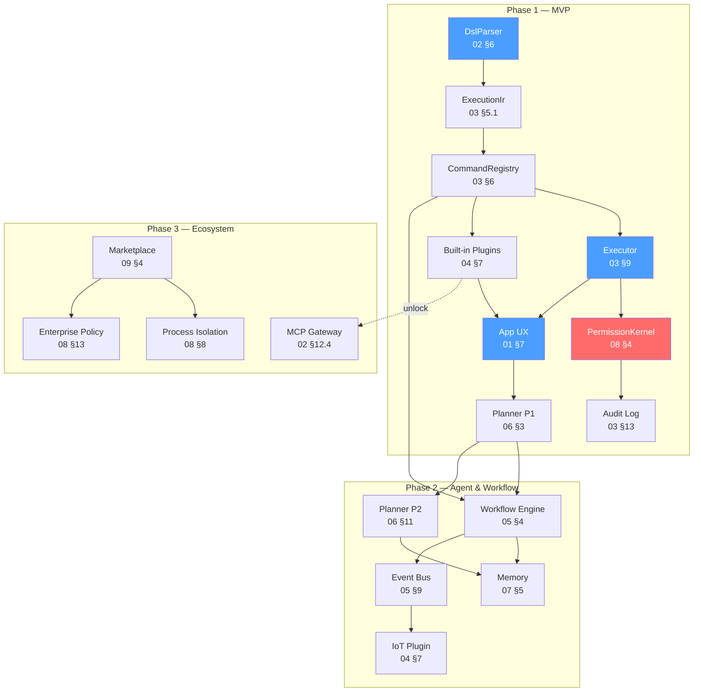
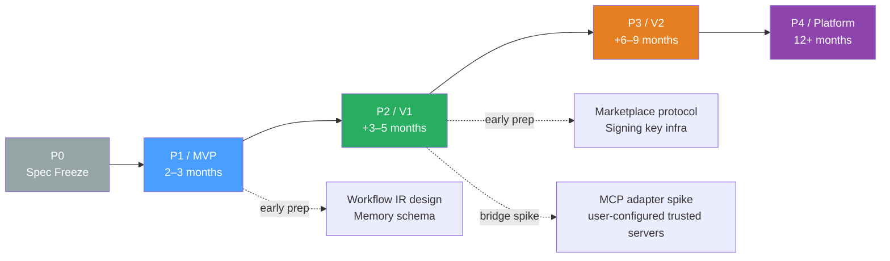
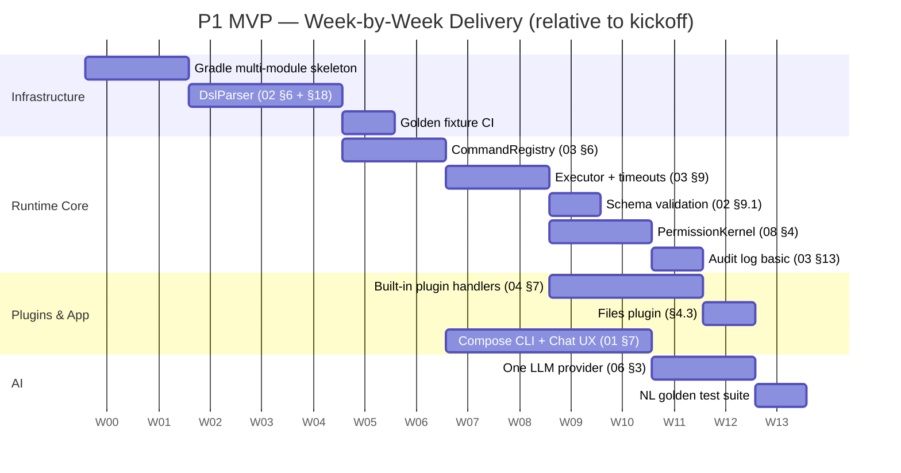
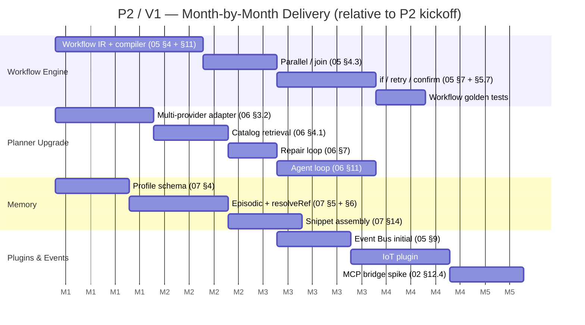

# MCOS Roadmap

> **Status:** Draft  
> **Version:** 0.1.0  
> **Last Updated:** 2026-08-25  
> **Depends on:** [00-vision.md](./00-vision.md), [01-architecture.md](./01-architecture.md), [02-command-protocol.md](./02-command-protocol.md), [03-runtime.md](./03-runtime.md), [04-plugin-sdk.md](./04-plugin-sdk.md), [05-workflow.md](./05-workflow.md), [06-agent.md](./06-agent.md), [07-memory.md](./07-memory.md), [08-security.md](./08-security.md), [09-marketplace.md](./09-marketplace.md), [11-implementation-status.md](./11-implementation-status.md)

> **Inspiration:** Apache infrastructure maturity model · Kubernetes phased delivery (alpha → beta → GA) · Rust edition roadmap · Stripe annual user-facing roadmap · TypeScript evolving-spec-with-code approach

> ✅ **Implementation status:** P1 (MVP) is complete and **all P2 exit criteria have landed** ([§5.6.1](#561-p2-exit-criteria-checklist)) — 12 Gradle source modules, 1067 tests, four built-in plugins, the marketplace client and `mcos-server` (see [11-implementation-status.md](./11-implementation-status.md)). The last two open criteria — the multi-turn Agent loop and event-triggered recipes — shipped on 2026-08-24/25; remaining P2 rows (IoT / Intent plugin ecosystem) are ecosystem work, not exit criteria. Horizons below remain indicative, not contractual.

---

## 1. Guiding Strategy

### 1.0 Build Order

Build in this order:

```text
Protocol → Runtime → Built-in Plugins → App UX → Planner → Workflow → Memory → Marketplace
```

Not:

```text
Pretty chat UI → hard-code a few Intents → call it an Agent
```

Apache-style infrastructure mindset: **specs and kernels before skins**.

### 1.1 Design Principles

Every scheduling and scoping decision in this roadmap derives from five principles:

| # | Principle | Meaning | Why |
|---|-----------|---------|-----|
| 1 | **Spec-first** | The design doc is the source of truth; code is a derivation. Any code–spec divergence is a bug in the code, not the spec, until a spec revision is explicitly published. | Eliminates "the code drifted from the docs" rot that kills long-lived infra. Each spec change bumps the RFC version ([02 §14](./02-command-protocol.md)) so drift is auditable. |
| 2 | **Vertical-slice-demoable** | Every 2-week sprint must produce at least one end-to-end demoable slice (user types something → device does something → result shown). No "foundation sprint" that produces only internal plumbing. | Keeps the project honest — if you can't demo it, you don't understand it yet. Forces integration early instead of a big-bang integration at phase end. |
| 3 | **Safety floor every phase** | Every phase ships a complete (if minimal) safety story: P1 = `decideConfirmation` + audit + prompt-injection compiler check ([08 §17](./08-security.md)); P2 = process isolation + enterprise policy; P3 = marketplace signing + crash quarantine. No phase ships "we'll add security later." | Security retrofitting is 10× harder than building it in. A command execution OS without a permission kernel from day one is a liability. |
| 4 | **Protocol before platform** | The Command Protocol ([02](./02-command-protocol.md)) and Runtime API ([03](./03-runtime.md)) freeze before the marketplace ([09](./09-marketplace.md)) or enterprise features ([08 §13](./08-security.md)) layer on top. The protocol is the contract; everything else is an implementation. | A protocol that changes under its ecosystem destroys trust. P1 freezes the parser, IR, and error codes; P2 freezes the workflow IR; P3 freezes the marketplace metadata schema. |
| 5 | **Docs follow code, not vice-versa** — *after* freeze | Before a spec section is frozen (P0), docs lead. After freeze (P1+), any behavioral change in code MUST be accompanied by a spec revision + CHANGELOG entry. Code never silently diverges. | This is the difference between "living docs" and "historical fiction." The spec is a contract, not a suggestion. |

### 1.2 Dependency Topology

The build order above is not linear — it is a DAG. The diagram below shows which subsystems block which, and which phase each edge unlocks:



**Reading guide:** Blue nodes are P1 hard blockers — nothing demos without them. Red node (`PermissionKernel`) is the safety floor. Arrows mean "blocks" — the target cannot start until the source is functional. The dotted edge (`Builtin → MCP`) means P3's MCP gateway depends on the P1 plugin loader being mature enough to host adapter plugins.

---

## 2. Phase Overview

### 2.0 Phase Summary

| Phase | Horizon | Theme | Outcome |
|-------|---------|-------|---------|
| **P0** | 2–4 weeks | Spec freeze + skeletons | Design docs + golden fixtures (code deferred to P1) |
| **P1** | 2–3 months | **MVP Mobile CLI** | Local DSL executes real device actions |
| **P2** | +3–5 months | Agent + Workflow | Multi-step NL goals work reliably |
| **P3** | +6–9 months | Ecosystem | Marketplace, MCP, sharing |
| **P4** | 12 months+ | Platform | Enterprise, multi-device, standards push |

Horizons are indicative, not contractual.

### 2.1 Terminology Alignment

MCOS uses three overlapping vocabulary sets for the same timeline. The table below states the canonical mapping explicitly — every doc in the set ([06 §17](./06-agent.md), [07 §16](./07-memory.md), [08 §17](./08-security.md), [09 §1.1](./09-marketplace.md), [11 §5](./11-implementation-status.md)) follows this convention:

| Phase label | Release label | Meaning |
|-------------|---------------|---------|
| **P1** | **MVP** | Minimum viable product — DSL executes on-device, one LLM provider, built-in plugins |
| **P2** | **V1** | First full release — multi-step goals via Workflow + Memory + multi-provider Planner |
| **P3** | **V2** | Ecosystem release — marketplace, third-party plugins, MCP, enterprise |
| **P4** | — (directional) | Platform bets — not a labeled release, just directional R&D |

> ⚠️ **Notation convention:** `P1`/`P2`/`P3` in this repository refer exclusively to **implementation phases** (P1 = MVP, P2 = V1, P3 = V2), as defined in the table above. [00-vision.md](./00-vision.md) §4 previously used `P1`–`P8` for design principles, which collided with phase labels — it has been renamed to **Principle 1–8** to eliminate the ambiguity. If you encounter a stale `P1`–`P8` reference in 00-vision that appears to mean a principle (not a phase), it is a leftover and should read "Principle N."

### 2.2 Phase Dependency Graph

Phases are sequential at the macro level, but subsystems within a phase can be parallelized once their P-level blockers are resolved:



The dotted edges represent **early prep** — design work that can begin in the prior phase without blocking it. For example, the Workflow IR schema ([05 §4](./05-workflow.md)) can be designed during P1 even though the Workflow Engine itself is a P2 deliverable; this avoids a "blank page" start at phase boundaries. The `bridge spike` edge is a scoped exception: a minimal MCP adapter ([02 §12.4](./02-command-protocol.md) schema conversion only, user-configured trusted servers) validates the ecosystem-adoption thesis during P2 without waiting for the full P3 production adapter — see [§5.7](#57-explicit-non-goals-for-v1) for the scope guardrails.

### 2.3 Success Gates

Each phase has a **single primary metric** that serves as its exit gate. The phase is not done until this metric is met, regardless of how many features are "mostly working":

| Phase | Primary metric | Target | Measured by |
|-------|---------------|--------|-------------|
| **P0** | Spec completeness | All 12 RFCs (00–11) at "implementable" detail level + golden fixture CI green | Spec review + [11 §4](./11-implementation-status.md) fixture coverage |
| **P1** | DSL round-trip reliability | 100% of golden fixtures parse → execute → produce expected IR; ≥1 external `hello.world` plugin | [02 §16](./02-command-protocol.md) conformance matrix + [11 §6](./11-implementation-status.md) dev path step 4 |
| **P2** | NL→goal accuracy | p85 utterance-to-correct-IR accuracy ≥ 80% on golden NL test set | [06 §16](./06-agent.md) evaluation suite |
| **P3** | Ecosystem adoption | ≥ 10 external plugins or MCP servers installable by dogfooders; cold install → run < 10 min | Marketplace telemetry + manual install timing |
| **P4** | Platform traction | ≥ 1 OEM preload OR ≥ 1 standard-body proposal submitted | Partnership milestone (non-code) |

---

## 3. Phase 0 — Foundations

### 3.0 Goals & Deliverables

**Goals**

- Freeze Command Protocol v0.1 draft  
- Repo layout: `docs/` design set (source modules deferred to Phase 1)  
- CI: doc publish  

**Deliverables**

- [x] Architecture docs set (`docs/00`–`10`)
- [x] Golden DSL fixtures directory (`docs/fixtures/01`–`08`, positive + negative)
- [x] CONTRIBUTING + LICENSE (Apache-2.0)
- [x] Kotlin multi-module skeleton — **delivered in P1** (12 source modules matching [REPOSITORIES.md](./REPOSITORIES.md))

> Phase 0 design is complete, and Phase 1 has since shipped the skeleton, the DSL parser and the full MVP pipeline — see [11-implementation-status.md](./11-implementation-status.md) §6 for the delivered list.

### 3.1 P0 Deliverable Inventory

| Item | Status | Location |
|------|--------|----------|
| 12 RFC design docs (00–11) | ✅ Complete | `docs/en/00-vision.md` – `docs/en/11-implementation-status.md` |
| Bilingual mirror (EN + ZH) | ✅ Complete | `docs/en/` + `docs/zh/` |
| Golden DSL fixtures (positive + negative) | ✅ Complete | `docs/fixtures/01`–`08` |
| Repository README + Chinese README | ✅ Complete | `README.md`, `README.zh-CN.md` |
| REPOSITORIES module index | ✅ Complete | `docs/en/REPOSITORIES.md` |
| CONTRIBUTING (bilingual sync rules) | ✅ Complete | `CONTRIBUTING.md` |
| CHANGELOG (expansion history) | ✅ Complete | `CHANGELOG.md` |
| Implementation status matrix | ✅ Complete | [11-implementation-status.md](./11-implementation-status.md) |
| Kotlin multi-module skeleton | ✅ Delivered in P1 | 12 modules — [REPOSITORIES.md](./REPOSITORIES.md) |
| Reference DSL parser | ✅ Delivered in P1 | `mcos-runtime-core` `parse/` (DslParser) |

### 3.2 P0 → P1 Transition Gates

P1 implementation does not begin until all three gates pass:

1. **Spec review pass** — every RFC (01–09) has been read end-to-end by ≥ 2 reviewers; no open "TBD" or "to be defined" markers remain in normative sections.
2. **Fixture CI green** — the 8 golden fixtures (5 positive round-trip + 3 negative must-reject) parse/reject correctly in a lightweight validation script. This validates the grammar before any Kotlin code exists.
3. **Bilingual parity verified** — EN and ZH versions of every doc have matching section counts, code block counts, and byte-for-byte identical code content (verified via automated parity check).

---

## 4. Phase 1 — MVP (2–3 months)

> **Goal:** A runnable Mobile CLI that executes **validated DSL** on-device.

### 4.0 P1 Milestone Gantt

The 10-step development path from [11 §6](./11-implementation-status.md) mapped onto a week-by-week schedule. Items within the same week can be parallelized across team members. **Note:** the dates in the Gantt below are illustrative relative week offsets (Week 1 = project kickoff), not calendar dates — the schedule starts when P1 development begins, not on the date shown.



Critical path: **skeleton → parser → registry → executor → plugins → app → planner**. The parser is the single longest pole — nothing downstream can start until DSL→IR works.

### 4.1 App (`mcos-android`)

The App is the user-facing shell that hosts the Runtime via AIDL IPC ([01 §7](./01-architecture.md)). P1 scope:

| Deliverable | Spec reference | Exit criteria |
|-------------|---------------|---------------|
| Jetpack Compose shell with CLI input + history | [01 §7](./01-architecture.md) (App↔Runtime IPC) | User can type a DSL command and see result |
| Chat pane (thin — can render NL + DSL preview) | [06 §8](./06-agent.md) (confirmation heuristics) | NL input produces DSL preview before execution |
| Settings: API keys, enabled plugins | [04 §6](./04-plugin-sdk.md) (`HostServices`) | User can enter OpenAI key; toggle plugins on/off |
| Run progress + error surface | [03 §11.5](./03-runtime.md) (`RuntimeEvent`) | In-flight command shows progress; errors display `McosErrorCode` |
| Runtime binding (AIDL service connection) | [01 §7](./01-architecture.md) | App binds to Runtime service on launch; unbinds on destroy |

### 4.2 Runtime

The Runtime is the on-device kernel. P1 scope — each subsystem with its spec cross-reference:

| Subsystem | Spec reference | P1 scope | Explicitly NOT in P1 |
|-----------|---------------|----------|----------------------|
| Parser (DSL ↔ IR) | [02 §6](./02-command-protocol.md), [03 §5.1](./03-runtime.md) | Full grammar: commands, multi-statement | Pipelines `a() \| b()` ([02 §17](./02-command-protocol.md) Future Extensions) |
| CommandRegistry | [03 §6](./03-runtime.md) | By-id lookup, version coexistence, namespace check | Hot-reload ([03 §6.5](./03-runtime.md)) |
| Executor | [03 §9](./03-runtime.md) | Dispatch, cooperative cancel, watchdog | Rate limiting ([08 §10](./08-security.md)) |
| PermissionKernel | [08 §4](./08-security.md) | `decideConfirmation` algorithm, `ConfirmationPrompt`, grant cache | Enterprise policy ([08 §13](./08-security.md)) |
| Audit Log | [03 §13](./03-runtime.md) | Basic append-only local log | Encrypted export, HMAC signing ([08 §14](./08-security.md)) |
| Workflow (sequence only) | [05 §4](./05-workflow.md) | Multi-line scripts: `a(); b(); c()` | Parallel, `if`, `loop`, `confirm` ([05 §15](./05-workflow.md)) |

### 4.3 SDK + Built-ins

> The authoritative command list is [04 §17](./04-plugin-sdk.md) (single source of truth). The table below is a summary for P1 planning; any discrepancy resolves in favor of 04 §17.

| Plugin | Commands |
|--------|----------|
| System | `sys.notify`, `sys.share`, `sys.clipboard`, `sys.openUrl`, `sys.vibrate` |
| System (device queries) | `sys.device.battery`, `sys.device.wifi`, `sys.device.screen`, `sys.device.volume`, `sys.device.location`, `sys.device.brightness` |
| Camera | `camera.capture`, `camera.scan` |
| Files | `file.list`, `file.search`, `photo.search`, `photo.compress` |
| Hello (reference sample) | `hello.world` |
| Weather (optional) | `weather.today` (network) |

#### 4.3.1 Command Count Budget

The success metric "≥15 documented built-in commands" ([§11.1](#111-mvp-metrics)) breaks down as:

| Plugin | Commands | Count |
|--------|----------|-------|
| System | `sys.notify`, `sys.share`, `sys.clipboard`, `sys.openUrl`, `sys.vibrate` | 5 |
| System (device queries) | `sys.device.battery`, `sys.device.wifi`, `sys.device.screen`, `sys.device.volume`, `sys.device.location`, `sys.device.brightness` | 6 |
| Camera | `camera.capture`, `camera.scan` | 2 |
| Files | `file.list`, `file.search`, `photo.search`, `photo.compress` | 4 |
| Hello (sample) | `hello.world` | 1 |
| Weather (optional) | `weather.today` | 1 |
| **Total** | | **19 (18 core + 1 optional)** |

> The 6 `sys.device.*` commands are thin wrappers around Android system APIs. They are easy to implement but provide the "it feels like a real OS" demo density. They live under the reserved `sys` root namespace (owned by `mcos.plugin.system`, see [04 §17](./04-plugin-sdk.md)) — `device` is not a reserved namespace root.

### 4.4 AI (minimal)

P1 ships the **Planner only** — a stateless one-shot compiler (`utterance → IR`). The multi-turn Agent loop is P2 ([06 §11](./06-agent.md)).

| Capability | P1 scope | P2+ (deferred) |
|------------|----------|----------------|
| Provider | One OpenAI-compatible provider (chat → DSL) | Multi-provider ([06 §3.2](./06-agent.md)) |
| Output | Single command or short sequence | Workflow IR, structured Clarify/Refuse |
| Catalog retrieval | Keyword match only | Embedding-based ([06 §4.1](./06-agent.md)) |
| Confirmation | `sideEffectClass ≥ write` → show DSL preview before execute | Full confidence heuristics ([06 §8](./06-agent.md)) |
| Repair loop | — (one-shot: if compile fails, show error) | `maxRepair = 2` ([06 §7](./06-agent.md)) |

### 4.5 Explicit Non-Goals for MVP

| Non-goal | Why deferred |
|----------|-------------|
| Marketplace | P3 deliverable — needs signing infrastructure + review pipeline that doesn't exist yet. P1 uses sideload debug install. |
| Full Workflow graph (parallel, loop, switch) | P2 deliverable — the P1 sequence-only path covers the majority of single-step and short-chain use cases. Parallel/conditional adds compile-time complexity. |
| Accessibility RPA | Not in any phase's scope ([00 §6](./00-vision.md) Non-Goals) — prefer App Functions bridge over screen-scraping. |
| Cloud sync | P3 deliverable — Memory cloud sync requires a backend that doesn't exist. P1 Memory is local-only. |
| Perfect NL | Never a goal — MCOS is a Command OS, not a chatbot. The Planner is a convenience layer; DSL is always available as fallback. |

### 4.6 MVP Demo Script

```text
> camera.capture()
> photo.search(date="today")
> photo.compress(quality=80)
> sys.notify(title="MCOS", text="MVP works")

NL: 帮我拍张照
→ camera.capture()
```

#### 4.6.1 MVP Exit Criteria Checklist

The phase exits only when **all** boxes are checked — not when the demo script "works on my machine":

- [ ] **Fixture pass** — 100% of golden fixtures (positive + negative) pass through `DslParser` ([02 §16](./02-command-protocol.md))
- [ ] **External plugin** — an external developer (not the core team) can implement `hello.world` via SDK and invoke it from CLI ([04](./04-plugin-sdk.md))
- [ ] **DSL preview** — any `sideEffectClass ≥ write` command shows its DSL form before execution ([06 §8](./06-agent.md))
- [ ] **Permission flow** — `camera.capture` triggers a `ConfirmationPrompt`; granting/denying works end-to-end ([08 §6](./08-security.md))
- [ ] **Audit log** — every executed command (success + failure) appears in the local audit log with timestamp + args + result ([03 §13](./03-runtime.md))
- [ ] **NL single-command** — `帮我拍张照` → `camera.capture()` works via at least one LLM provider ([06 §3](./06-agent.md))

---

## 5. Phase 2 — Agent & Orchestration (3–5 months)

> **Goal:** AI completes **multi-step** tasks with Workflow + Memory.

### 5.0 P2 Milestone Gantt

> **Note:** dates are illustrative relative month offsets (Month 1 = P2 kickoff), not calendar dates. The schedule starts when P2 development begins.



### 5.1 Workflow Engine

| Feature | Spec reference | P2 scope | Deferred to later |
|---------|---------------|----------|-------------------|
| Sequence | [05 §4.2](./05-workflow.md) | ✓ (shipped in P1) | — |
| Parallel `all` join | [05 §4.3](./05-workflow.md) | ✓ | — |
| `$ref` bindings | [05 §6](./05-workflow.md) | ✓ | — |
| Per-step retry | [05 §7.1](./05-workflow.md) | ✓ basic (fixed backoff) | Full `backoffMs[]`/`retryOn[]` |
| `confirm` gates | [05 §5.7](./05-workflow.md) | ✓ | — |
| `if` / `switch` | [05 §15](./05-workflow.md) | ✓ basic `if` | `switch` + `loop` + `wait_event` |

> Aligned with [05 §15](./05-workflow.md) "MVP vs V1 Feature Gate". P2 = V1.

### 5.2 Planner

| Feature | Spec reference | P2 scope | Deferred to P3 |
|---------|---------------|----------|----------------|
| Multi-provider | [06 §3.2](./06-agent.md) | ✓ (≥ 3 providers) | — |
| Catalog retrieval | [06 §4.1](./06-agent.md) | ✓ embedding-based | + constrained decoding |
| Repair loop | [06 §7](./06-agent.md) | ✓ `maxRepair = 2` | — |
| Structured Clarify/Refuse | [06 §5.5](./06-agent.md) | ✓ | — |
| Multi-turn Agent loop | [06 §11](./06-agent.md) | ✓ (`maxProbeSteps = 3`) | — |
| Voice STT | [06 §12](./06-agent.md) | ✓ | + partial-hypothesis UX (P3) |
| On-device model | [06 §13](./06-agent.md) | — | experimental → supported (P3) |

### 5.3 Memory

| Feature | Spec reference | P2 scope | Deferred to P3 |
|---------|---------------|----------|----------------|
| Profile (places/people/devices) | [07 §4](./07-memory.md) | ✓ | — |
| Explicit "记住" + episodic | [07 §7](./07-memory.md) + [§8](./07-memory.md) | ✓ | — |
| `resolveRef` (fuzzy/embedding) | [07 §6](./07-memory.md) | ✓ | — |
| Snippet assembly | [07 §14](./07-memory.md) | ✓ | — |
| Cloud sync | [07 §11](./07-memory.md) | — | ✓ P3 |

### 5.4 Plugins

| Plugin | Commands | Spec reference |
|--------|----------|---------------|
| Intent / Deep Link | `intent.start`, `deeplink.open` | [02 §12.5](./02-command-protocol.md) |
| App Functions bridge | `appfn.invoke` | [02 §12.5](./02-command-protocol.md) |
| IoT (Home Assistant / Tuya) | `home.light.*`, `home.ac.*`, `home.curtain.*` | [04 §7](./04-plugin-sdk.md) |
| Connectivity recipes | `wifi.connect`, `vpn.connect` | [08 §12](./08-security.md) (egress) |

### 5.5 Event Bus (initial)

| Event | Trigger | Workflow use |
|-------|---------|-------------|
| `battery.low` | Android `ACTION_BATTERY_LOW` broadcast | Suggest power-saving mode |
| `wifi.connected` | SSID change detection | Auto-run pre-authorized recipe (e.g., VPN at office) |
| `screen.on` / `screen.off` | Display state broadcast | Gate expensive sync operations |

> Events wire into Workflow triggers via `$memory` event filters ([05 §9.2](./05-workflow.md)). Background event triggers with `sideEffectClass ≥ write` require escalated confirmation ([08 §6.3](./08-security.md)).

### 5.6 Exit Criteria

```text
NL: 打开观影模式
→ parallel home.light.dim + tv.on + curtain.close + ac.set

NL: 导航回公司
→ resolves Memory office

Event: SSID=Office → suggest/run vpn.connect (pre-authorized recipe)
```

#### 5.6.1 P2 Exit Criteria Checklist

- [x] **NL→goal accuracy** — p85 accuracy ≥ 80% on golden NL test set ([06 §16](./06-agent.md)) — NL→IR golden suite green (100% structural accuracy on the shipped fixture set)
- [x] **Workflow parallel** — the "movie mode" multi-device parallel scene executes correctly — `WorkflowEngineTest` W21 home-movie scenario
- [x] **Memory resolution** — `导航回公司` resolves "office" from Memory without user re-specifying — `resolveRef` fuzzy + §8.3 named-entity merge
- [x] **Multi-provider** — ≥ 3 LLM providers interchangeable via Settings — `LlmProviderRegistry` + health/fallback chain
- [x] **Agent loop** — multi-turn probe→replan→execute works for ≥ 3-step goals ([06 §11](./06-agent.md)) — `McosAgent` (2026-08-24)
- [x] **Event trigger** — `wifi.connected` event triggers a pre-authorized recipe end-to-end — `EventTriggerManager` + pre-auth stamps + Android arm-on-install (2026-08-25)

### 5.7 Explicit Non-Goals for V1

Mirrors [§4.5](#45-explicit-non-goals-for-mvp) (MVP non-goals). V1 adds Workflow + Memory + Events, but deliberately defers the ecosystem layer. The MCP bridge spike ([§5.0](#50-p2-milestone-gantt) task `p2-14`) is the **only** cross-phase exception — a controlled spike, not a production feature:

| Non-goal | Why deferred |
|----------|-------------|
| Production MCP adapter (connection management, reconnect, per-server secrets UI) | P3 deliverable — remote MCP servers are network tools; safe egress enforcement ([08 §12](./08-security.md)) requires process isolation ([08 §8](./08-security.md)) which is P3. The P2 spike validates schema conversion + the adoption thesis, not production-grade connection handling. |
| MCP public directory / marketplace browse | P3 deliverable — depends on marketplace signing infrastructure ([09 §6](./09-marketplace.md)) + public index. The P2 spike is user-manually-configured trusted servers only (no directory, no discovery). |
| Third-party plugin process isolation | P3 deliverable — V1 ships only builtin + sideloaded-debug plugins. The permission kernel decision algorithms (`decideConfirmation`, `decideEgress`) are unchanged from P1; P3 adds enforcement *strength* (process boundaries), not new logic. |
| Cloud memory sync | P3 deliverable — V1 Memory is local-only. Cloud sync requires a backend + auth that doesn't exist yet. |
| On-device foundation model | P3+ — V1 uses cloud LLM providers (≥ 3 interchangeable). On-device model is a battery/latency optimization for later. |

> **Spike scope guardrail:** the P2 MCP bridge spike is limited to (a) [02 §12.4](./02-command-protocol.md) schema conversion (normative, already specified), (b) connecting to **user-configured trusted servers** (no public directory), (c) secrets injected via config/env (no per-server secrets UI), (d) invoked manually (no auto-discovery). Its purpose is to answer the strategic question "will the protocol be adopted?" ([00 §2](./00-vision.md)) *before* P3 — not to ship a production MCP client. If the spike reveals the thesis is wrong, P3 MCP investment can be reconsidered.

---

## 6. Phase 3 — Ecosystem (6–9 months)

> **Goal:** Third parties ship capabilities; MCP becomes first-class.

### 6.0 P3 Critical Path

The P3 critical path is: **marketplace signing infrastructure → public index → third-party plugin onboarding**. Without signed package verification ([09 §6](./09-marketplace.md)), the Runtime cannot safely load third-party code, so process isolation ([08 §8](./08-security.md)) and enterprise policy ([08 §13](./08-security.md)) both depend on the marketplace key infrastructure being live first.

### 6.1 Marketplace

| Feature | Spec reference | P3 scope |
|---------|---------------|----------|
| Public index + signing | [09 §6](./09-marketplace.md) | Publisher key registration, Ed25519 signing, signature verification on install |
| Install / update / permission diffs | [09 §7](./09-marketplace.md) | `InstallState` machine, `PermissionDiff` algorithm, user consent per update |
| Recipe store | [09 §8](./09-marketplace.md) | Recipe publishing, search, install wizard with placeholder binding |

> P3 distribution model: public index for community plugins, private registry for enterprise. See [09 §1.1](./09-marketplace.md) for the P1/P2/P3 marketplace phasing table and [09 §15](./09-marketplace.md) for the P1/P2/P3 feature gate.

### 6.2 MCP Gateway

| Feature | Spec reference | P3 scope |
|---------|---------------|----------|
| `mcos.plugin.mcp` adapter | [04 §10](./04-plugin-sdk.md) | Mature adapter: per-server enablement, secrets via `SecureStore` |
| MCP tool → MCOS schema mapping | [02 §12.4](./02-command-protocol.md) | Conversion table with fails-closed on unmapped types (validated by P2 spike) |
| Per-server secrets | [04 §6.4](./04-plugin-sdk.md) | API keys stored in `SecureStore`, injected via `{{secret.*}}` templates |

> **Why this is P3, not P2:** the P2 bridge spike ([§5.7](#57-explicit-non-goals-for-v1)) validated the schema conversion + ecosystem thesis using user-configured trusted servers. The production adapter here adds three things the spike deliberately omits — robust connection management (reconnect/backoff), per-server secrets UI via `SecureStore`, and egress enforcement on remote MCP servers — all of which depend on process isolation ([08 §8](./08-security.md), P3) to be trustworthy rather than "security theater" for network-reaching tools.

### 6.3 Platform Hardening

| Feature | Spec reference | P3 scope |
|---------|---------------|----------|
| Third-party plugin process isolation | [08 §8](./08-security.md) | Bound-service isolation for non-builtin plugins (P3 default) |
| Encrypted audit export | [08 §14](./08-security.md) | HMAC-signed JSONL export for enterprise compliance |
| Enterprise allowlist | [08 §13](./08-security.md) | `EnterprisePolicy` data class (12 fields), most-restrictive-wins merge |
| Crash quarantine | [08 §15.3](./08-security.md) | 3 crashes in 60s → quarantine + rollback or disable |

> Aligned with [08 §17](./08-security.md) security phasing: P3 = third-party isolation + encrypted audit + enterprise policy + crash quarantine. The P1/P2 decision algorithms (`decideConfirmation`, `decideEgress`) are unchanged — P3 adds *enforcement strength*, not new decision logic.

### 6.4 Community

- **Plugin templates** — starter repo with `mcos-sdk-gradle` pre-wired ([04 §13.2](./04-plugin-sdk.md))
- **Conformance test suite** — published as executable artifact; marketplace CI gate mirrors it ([09 §5.1](./09-marketplace.md))
- **Public roadmap issues** — community can see and vote on upcoming features
- **Developer documentation** — getting-started guide, cookbook, API reference generated from spec

### 6.5 Exit Criteria

- ≥ 10 external plugins or MCP servers in use by dogfooders  
- Cold install → browse → install IoT plugin → run scene in < 10 minutes  

---

## 7. Phase 4 — Platform (12+ months)

### 7.0 Directional Bets

Directional bets:

| Bet | Description |
|-----|-------------|
| Multi-device | Phone plans; tablet/watch execute subsets |
| OEM partnership | Preload Runtime + OEM command packs |
| Standards | Push Command Protocol toward wider adoption |
| On-device models | Strong offline planner SKUs |
| Durable cloud runs | Enterprise orchestration wrappers |
| iOS exploration | If protocol succeeds — separate runtime study |

Do not block P1–P3 on these.

### 7.1 Trigger Conditions

Each directional bet has a precondition that must be met before investment begins. These are not deadlines — they are readiness signals:

| Bet | Trigger condition | Dependency |
|-----|-------------------|------------|
| Multi-device | P3 marketplace stable + ≥ 1 OEM expression of interest | Needs cross-device Memory sync ([07 §11](./07-memory.md)) |
| OEM partnership | Protocol frozen at v1.0 + ≥ 5k active dogfooders | Needs enterprise policy ([08 §13](./08-security.md)) + crash quarantine ([08 §15.3](./08-security.md)) |
| Standards push | Protocol spec adopted by ≥ 2 independent implementations | Needs public conformance suite ([§6.4](#64-community)) |
| On-device models | On-device model latency < 800ms p95 for simple intents ([06 §15.1](./06-agent.md)) | Needs P2 on-device experimental → production |
| Durable cloud runs | Enterprise demand for long-running (hours) workflows | Needs durable Workflow run log ([05 §15](./05-workflow.md)) |
| iOS exploration | Command Protocol proves portable (≥ 1 non-Android proof-of-concept) | Separate codebase; protocol-level investment only |

---

## 8. Repository Delivery Order

### 8.0 Timeline

```text
Week 0–2     docs + skeletons
Week 2–6     runtime parser/registry/executor + system/camera plugins
Week 6–10    Compose CLI/Chat + permissions UX + audit
Week 10–12   first LLM provider + golden NL tests
Month 4–6    workflow parallel + memory + IoT
Month 6–9    MCP + marketplace beta
```

Adjust with team size; keep **vertical slices** demoable every 2 weeks.

### 8.1 Vertical Slice Demo Cadence

Every 2-week sprint ships a demoable end-to-end slice. A slice is not "feature X is implemented" — it is "a user can do Y from the app and see a result":

| Sprint | Slice | Demo command | Unblocks |
|--------|-------|-------------|----------|
| S1 (P1 wk 2) | Skeleton + `hello.world` | `hello.world()` → "Hello, MCOS!" | Plugin loader |
| S2 (P1 wk 4) | Parser + `sys.notify` | `sys.notify(title="Hi", text="It works")` | DSL→IR path |
| S3 (P1 wk 6) | `camera.capture` + Executor | `camera.capture()` → photo saved | Real Android API integration |
| S4 (P1 wk 8) | Permission flow + `photo.compress` | Confirm prompt → compress → result | Safety floor |
| S5 (P1 wk 10) | Compose CLI + audit | Full CLI session with history | User-facing app |
| S6 (P1 wk 12) | NL → DSL (1 provider) | `帮我拍张照` → `camera.capture()` | MVP exit gate |
| S7 (P2 wk 8) | Workflow parallel + Memory | "Movie mode" multi-device scene | V1 core gate |
| S8 (P2 wk 12) | MCP bridge spike | `mcp.<server>.<tool>()` runs against a trusted server | Ecosystem thesis signal |

### 8.2 Dependency Unlock Map

Derived from [11 §6](./11-implementation-status.md) Recommended Development Path. Each row shows what a step unblocks:

| Step ([11 §6](./11-implementation-status.md)) | Unlocks |
|------|---------|
| 1. Gradle skeleton | Everything |
| 2. `DslParser` | Steps 3–6, all plugins, Planner |
| 3. `CommandRegistry` | Step 4 (Executor), Step 8 (plugin handlers) |
| 4. `Executor` | Step 6 (PermissionKernel), Step 7 (Audit), Step 8 (plugins) |
| 5. Schema validation | Planner (compile correctness) |
| 6. `PermissionKernel` | Step 7 (Audit records grants/confirms), real device commands |
| 7. Audit (basic) | Compliance demo, P2 encrypted audit |
| 8. Real plugin handlers | Demo-able slices (camera, system) |
| 9. `files` plugin | `photo.search` / `photo.compress` demo |
| 10. One LLM provider | NL path, MVP exit gate |

> **Parser is the single longest pole.** Steps 3–10 all depend on step 2. If the parser slips by 1 week, the entire P1 schedule slips by 1 week.

---

## 9. Staffing Sketch (Informative)

### 9.0 Role Matrix

| Role | Focus |
|------|-------|
| Runtime lead | Protocol, executor, security kernel |
| Android app | Compose UX, voice, store UI |
| Plugin eng | Camera/files/IoT/MCP |
| AI eng | Providers, compiler, eval sets |
| Backend | Marketplace/sync (from P3) |
| Tech writer | Keep RFCs honest |

Small team (3–5) can reach MVP if scope discipline holds.

### 9.1 Phase Staffing Ramp

| Phase | Team size | Additions | Rationale |
|-------|-----------|-----------|-----------|
| **P0** | 1–2 (part-time) | — | Design + spec writing; no code yet |
| **P1** | 3–5 | Runtime lead, Android app, plugin eng (shared AI) | Core path: parser → executor → app |
| **P2** | 4–6 | + dedicated AI eng | Multi-provider + Agent loop + Workflow needs focused AI expertise |
| **P3** | 5–7 | + backend eng (marketplace/sync) | Marketplace server, signing infra, enterprise features |
| **P4** | Variable | + partnership / standards roles | Non-code roles dominate; team size depends on bets |

> These numbers assume experienced engineers who can own a subsystem end-to-end. A larger junior team will need more time per phase.

---

## 10. Risk Register

### 10.0 Core Risks

| Risk | Mitigation |
|------|------------|
| NL expectations exceed MVP | Market as Command OS; CLI-first demos |
| Accessibility temptation | Document as non-goal; prefer App Functions |
| LLM cost / latency | Cache plans; on-device for simple intents |
| Store policy (Play) | Declare permissions clearly; avoid deceptive automation |
| Fragmentation of command IDs | Reserved namespaces + review in marketplace |
| Security incident via plugin | Signing, isolation, revoke channel |
| Platform competition (Google App Functions + Gemini / Apple App Intents + Apple Intelligence) | OS vendors have structural advantages (pre-install, OS-level permissions, mandated app-vendor cooperation). MCOS differentiates on open standard + cross-platform + model-replaceable. Move early on MCP bridge spike (§5.7) + dogfood to prove adoption before OS consolidation closes the window. |

### 10.1 Risk Severity × Probability Matrix

| Risk | Severity | Probability | Priority |
|------|----------|-------------|----------|
| NL expectations exceed MVP | High | High | 🔴 Critical — manage via positioning |
| Store policy (Play) | High | Medium | 🟡 Watch — monitor Play policy changes |
| Security incident via plugin | High | Low | 🟡 Prepare — defense-in-depth from P1 |
| LLM cost / latency | Medium | High | 🟡 Manage — on-device routing (P3) |
| Accessibility temptation | Medium | Medium | 🟢 Documented — non-goal is explicit |
| Fragmentation of command IDs | Medium | Low | 🟢 Marketplace CI gate (P3) |
| Platform competition (Google/Apple) | High | High | 🔴 Critical — differentiate on open standard; MCP spike + dogfood early |

### 10.2 Additional Risks

| Risk | Mitigation |
|------|------------|
| LLM provider lock-in | Multi-provider abstraction from P2 ([06 §3.2](./06-agent.md)); on-device model as P3 fallback ([06 §13](./06-agent.md)) |
| On-device model fragmentation | Target only ≥ 2 Android versions initially; document NPU/GPU requirements; degrade gracefully to cloud |
| Regulatory (AI Act / GDPR automated decisions) | All `sideEffectClass ≥ write` commands require explicit user confirmation ([08 §4](./08-security.md)); audit log is the compliance record ([08 §14](./08-security.md)); enterprise policy supports region-specific restrictions ([08 §13](./08-security.md)) |

---

## 11. Success Metrics Recap

### 11.0 Terminology

This section uses the canonical phase↔release mapping established in [§2.1](#21-terminology-alignment): **P1 = MVP**, **P2 = V1**, **P3 = V2**. This replaces the earlier ambiguous "V1 (end of P2/P3 bridge)" label — V1 is P2, not a bridge.

### 11.1 MVP Metrics

| Metric | Target | Measurement |
|--------|--------|-------------|
| Built-in commands | ≥ 15 documented | Command count in registry ([§4.3.1](#431-command-count-budget)) |
| DSL round-trip reliability | 100% golden fixture pass | [02 §16](./02-command-protocol.md) conformance matrix |
| Cold start | < 2s to CLI ready | Benchmark suite (`mcos-runtime/benchmarks`) |
| Command execute p95 | < 500ms (excluding plugin I/O) | Benchmark suite |
| External sample plugin | ≥ 1 (`hello.world`) | Published to marketplace sideload or repo |

### 11.2 V1 (P2) Metrics

| Metric | Target | Measurement |
|--------|--------|-------------|
| NL→IR accuracy | p85 ≥ 80% on golden NL test set | [06 §16](./06-agent.md) evaluation suite |
| Workflow parallel scene | "Movie mode" executes correctly | E2E test: `home.light.dim + tv.on + curtain.close + ac.set` |
| LLM providers | ≥ 3 interchangeable | Provider adapter test |
| Memory-resolved NL | `导航回公司` resolves "office" | E2E test with Memory seeded |
| MCP adapter | Usable (≥ 1 MCP server) | Manual install + invoke |

### 11.3 V2 (P3 / Ecosystem) Metrics

| Metric | Target | Measurement |
|--------|--------|-------------|
| External plugins / MCP servers | ≥ 10 in use by dogfooders | Marketplace install telemetry |
| Cold install → run | < 10 minutes | Manual timing: install app → browse → install IoT plugin → run scene |
| Conformance suite adoption | Used by ≥ 1 external contributor | GitHub stars / forks of conformance repo |
| Signed third-party installs | ≥ 5 distinct publishers | Marketplace publisher count |

---

## 12. Documentation Maintenance

### 12.0 Cadence

| Cadence | Action |
|---------|--------|
| Every protocol change | Bump RFC version + fixtures |
| Every release | Update roadmap checkboxes |
| Quarterly | Architecture review vs code reality |

Docs lie when not enforced by tests — golden fixtures are mandatory companions.

### 12.1 Bilingual Sync Rules

MCOS maintains two language trees:

| Tree | Role | Path |
|------|------|------|
| **English** | Authoritative source of truth | `docs/en/` |
| **Chinese** | Mirror translation | `docs/zh/` |

Rules (enforced by [CONTRIBUTING.md](../../CONTRIBUTING.md)):

1. **EN leads, ZH follows.** Any spec change is written in EN first, then mirrored to ZH.
2. **Code is identical.** All code blocks, JSON, type names, field names, enum values, ABNF, mermaid diagrams, and cross-reference links are byte-for-byte identical between EN and ZH. Only prose is translated.
3. **First-use glossary.** When a concept appears for the first time in ZH, it uses the "中文（English）" format.
4. **CHANGELOG records every expansion.** Each doc expansion gets a `### Docs — <Topic> expansion` entry in `CHANGELOG.md` documenting what was added and why.
5. **Parity is verified.** Before merging any doc change, run the parity check: H2/H3 counts, code fence counts, and mermaid counts must match between EN and ZH.

---

## 13. Immediate Next Actions

### 13.0 Action List

1. ✅ Choose LICENSE (Apache-2.0) — committed as `LICENSE`
2. ✅ Create Gradle multi-module skeleton matching repo topology — 12 modules live (see [REPOSITORIES.md](./REPOSITORIES.md))
3. ✅ Implement reference DSL parser + golden tests — `DslParser` + 8 golden fixtures green ([02 §16](./02-command-protocol.md))
4. ✅ Ship `hello.world` + `camera.capture` vertical slice — four built-in plugins run end-to-end on the Android shell with audit logging
5. 🟡 Dogfood daily CLI for one real personal workflow — the Android demo covers the full flow; sustained daily dogfooding is the ongoing part

### 13.1 Acceptance Criteria

| # | Action | Done when… |
|---|--------|-----------|
| 1 | LICENSE | `LICENSE` file committed; `build.gradle.kts` references Apache-2.0 |
| 2 | Gradle skeleton | `./gradlew projects` lists all modules from [REPOSITORIES.md](./REPOSITORIES.md); empty modules compile |
| 3 | DSL parser | `./gradlew :mcos-runtime:test` passes all golden fixtures ([02 §16](./02-command-protocol.md)) |
| 4 | Vertical slice | `hello.world()` and `camera.capture()` execute end-to-end from CLI with audit log entry |
| 5 | Daily dogfood | At least 1 core team member uses the CLI daily for ≥ 1 week; issues filed for every friction point |

---

## 14. Summary

MCOS ships as infrastructure:

| Phase | One-liner |
|-------|-----------|
| P1 MVP | **DSL runs on phone** |
| P2 | **Goals become workflows** |
| P3 | **Others publish commands** |
| P4 | **Protocol becomes a platform** |

The moat is **Command Protocol + Runtime + ecosystem** — not a single chat model.

---

## 15. Cross-Reference Index

This roadmap section-level index maps each roadmap section to the detailed spec that defines it. Use this table to jump from "what we're building" to "how it's specified":

| Roadmap § | Topic | Detailed spec |
|-----------|-------|---------------|
| §4.1 | App deliverables | [01 §7](./01-architecture.md) (App↔Runtime IPC), [04 §6](./04-plugin-sdk.md) (`HostServices`) |
| §4.2 | Runtime P1 scope | [03 §5–§9](./03-runtime.md), [11 §6](./11-implementation-status.md) |
| §4.3 | SDK + built-in plugins | [04 §7](./04-plugin-sdk.md), [04 §13](./04-plugin-sdk.md) (`mcos-sdk-gradle`) |
| §4.4 | Planner P1 scope | [06 §3](./06-agent.md), [06 §17](./06-agent.md) (P1/P2/P3 table) |
| §4.6 | MVP exit criteria | [02 §16](./02-command-protocol.md), [11 §6](./11-implementation-status.md) step 4 |
| §5.1 | Workflow P2 scope | [05 §15](./05-workflow.md) (MVP/V1 gate) |
| §5.2 | Planner P2 scope | [06 §17](./06-agent.md) (P1/P2/P3 table) |
| §5.3 | Memory P2 scope | [07 §16](./07-memory.md) (P1/P2/P3 table) |
| §5.5 | Event Bus | [05 §9](./05-workflow.md) (`$memory` event filters) |
| §5.7 | V1 non-goals + MCP spike guardrails | [08 §8](./08-security.md) (process isolation), [08 §12](./08-security.md) (egress), [09 §6](./09-marketplace.md) (marketplace deps) |
| §6.1 | Marketplace P3 scope | [09 §15](./09-marketplace.md) (P1/P2/P3 table) |
| §6.2 | MCP Gateway (P3 production; P2 spike see §5.7) | [02 §12.4](./02-command-protocol.md), [04 §10](./04-plugin-sdk.md) |
| §6.3 | Platform hardening P3 | [08 §17](./08-security.md) (security phasing) |
| §7.1 | Phase 4 trigger conditions | [07 §11](./07-memory.md), [08 §13](./08-security.md), [05 §15](./05-workflow.md) |
| §8.2 | Dependency unlock map | [11 §6](./11-implementation-status.md) (dev path) |
| §10 | Risk register | [08 §4](./08-security.md) (safety floor), [06 §13](./06-agent.md) (on-device) |
| §11 | Success metrics | [06 §16](./06-agent.md) (eval suite), [09 §6.5](./09-marketplace.md) (adoption) |

---

## 16. Testing & Validation Strategy

### 16.0 Golden Fixture CI Gate

Every protocol change — from P1 through P3 — must pass the full golden fixture suite before merging:

| Fixture type | Location | Count | Spec |
|-------------|----------|-------|------|
| Positive (round-trip DSL → IR) | `docs/fixtures/01`–`05` | 5 | [02 §16](./02-command-protocol.md) |
| Negative (must reject) | `docs/fixtures/06`–`08` | 3 | [02 §16](./02-command-protocol.md), [11 §4](./11-implementation-status.md) |

The fixture CI runs `DslParser` against each fixture and asserts parse success/failure + IR equality. This is the **first line of defense** against protocol drift.

### 16.1 End-to-End Demo Validation

Each phase's exit criteria include a runnable demo script (not "it feels right" but "this script passes"):

| Phase | Demo script | Pass condition |
|-------|------------|----------------|
| P1 | `camera.capture() → photo.compress() → sys.notify()` | Runs end-to-end with audit log entries |
| P2 | `打开观影模式 → parallel home.light.dim + tv.on + ...` | All parallel commands succeed within 10s |
| P3 | Cold install → browse marketplace → install IoT plugin → run scene | < 10 minutes wall clock |

### 16.2 Performance Regression Gate

Performance budgets are enforced via a benchmark suite (`mcos-runtime/benchmarks`). Regression beyond thresholds blocks the merge:

| Metric | P1 target | P2 target | Measurement |
|--------|-----------|-----------|-------------|
| Command execute p95 | < 500ms | < 500ms | Benchmark (excluding plugin I/O) |
| Cold start → CLI ready | < 2s | < 2s | Instrumented startup trace |
| NL → IR compile p95 | — (P1 is one-shot) | < 3s | [06 §15.1](./06-agent.md) planner budget |
| On-device model p95 | — | < 800ms | [06 §15.1](./06-agent.md) (P3 target) |
| Memory snippet assembly | — | < 100ms | [07 §14](./07-memory.md) assembly algorithm |

---

## Document Index

| # | Doc |
|---|-----|
| 00 | [Vision](./00-vision.md) |
| 01 | [Architecture](./01-architecture.md) |
| 02 | [Command Protocol RFC](./02-command-protocol.md) |
| 03 | [Runtime](./03-runtime.md) |
| 04 | [Plugin SDK](./04-plugin-sdk.md) |
| 05 | [Workflow Engine](./05-workflow.md) |
| 06 | [AI Planner](./06-agent.md) |
| 07 | [Memory](./07-memory.md) |
| 08 | [Security](./08-security.md) |
| 09 | [Marketplace](./09-marketplace.md) |
| 10 | [Roadmap](./10-roadmap.md) (this file) |
| 11 | [Implementation Status](./11-implementation-status.md) |
