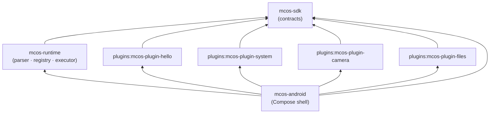

# MCOS Repositories & Module Index

> **Status:** Reference (target design)  
> **Last Updated:** 2026-08-06  
> **Authoritative for:** the module topology a future implementation must create.

MCOS is currently a **design-only** repository — no build or source modules exist yet. This document specifies the intended module breakdown, dependency graph, and conventions so that when implementation begins (P1), the Gradle multi-module layout matches the spec.

For per-subsystem implementation phasing, see [11-implementation-status.md](./11-implementation-status.md).

---

## 1. Dependency Graph (Target)

Read bottom-up: `mcos-sdk` is the leaf contract layer; everything depends on it. `mcos-android` aggregates the runtime, the SDK, and all plugins.

---

## 2. Module Reference (Target)

### `mcos-sdk` — Plugin contracts (leaf)

| | |
|---|---|
| Path | `mcos-sdk/` |
| Package | `com.mcos.sdk` |
| Role | The host-facing contract layer: `McosPlugin`, `CommandHandler`, `CommandDescriptor`, `SideEffectClass`, `CommandResult`, `ExecutionContext`. |
| Depends on | (none — leaf) `api` kotlinx-serialization-json, kotlinx-coroutines-core |
| Stack | Kotlin/JVM · JDK 17 · kotlinx.serialization |
| Spec | [04-plugin-sdk.md](./04-plugin-sdk.md) §5 |

### `mcos-runtime` — Command Bus kernel

| | |
|---|---|
| Path | `mcos-runtime/` |
| Package | `com.mcos.runtime.*` (`ir`, `parse`, `registry`, `permission`, `scheduler`, `executor`, …) |
| Role | Parse DSL → IR; Registry, Permission Kernel, Scheduler, Workflow Engine, Executor, Audit. |
| Depends on | `api(project(":mcos-sdk"))`; serialization-json, coroutines-core |
| Stack | Kotlin/JVM · JDK 17 · kotlinx.serialization |
| Spec | [02-command-protocol.md](./02-command-protocol.md), [03-runtime.md](./03-runtime.md) |

### `mcos-android` — Compose client shell

| | |
|---|---|
| Path | `mcos-android/` |
| Package | `com.mcos.android` |
| Role | Jetpack Compose client: DSL/Chat input, plan preview, confirmation UX, plugin store, settings, audit viewer. |
| Depends on | `:mcos-runtime`, `:mcos-sdk`, plugins; AndroidX (core-ktx, lifecycle, activity-compose), Compose BOM |
| Stack | Kotlin/Android · Compose · compileSdk 35 / minSdk 26 · JDK 17 |
| Spec | [01-architecture.md](./01-architecture.md) §6.1, [10-roadmap.md](./10-roadmap.md) §4.1 |

### `plugins:mcos-plugin-hello` — Reference sample

| | |
|---|---|
| Path | `plugins/mcos-plugin-hello/` |
| Package | `com.mcos.plugin.hello` |
| Role | The canonical example plugin. `hello.world(name)` returns a greeting. Ships a `plugin.json` manifest. |
| Depends on | `api(project(":mcos-sdk"))`; serialization-json, coroutines-core |
| Stack | Kotlin/JVM · JDK 17 |
| Spec | [04-plugin-sdk.md](./04-plugin-sdk.md) §16 |

### `plugins:mcos-plugin-system` — System commands

| | |
|---|---|
| Path | `plugins/mcos-plugin-system/` |
| Package | `com.mcos.plugin.system` |
| Role | `sys.notify` / `sys.share` / `sys.intent.start` commands. |
| Depends on | `api(project(":mcos-sdk"))` |
| Stack | Kotlin/JVM · JDK 17 |
| Spec | [04-plugin-sdk.md](./04-plugin-sdk.md) §17 |

### `plugins:mcos-plugin-camera` — Camera commands

| | |
|---|---|
| Path | `plugins/mcos-plugin-camera/` |
| Package | `com.mcos.plugin.camera` |
| Role | `camera.capture` / `camera.scan` commands. |
| Depends on | `api(project(":mcos-sdk"))` |
| Stack | Kotlin/JVM · JDK 17 |
| Spec | [04-plugin-sdk.md](./04-plugin-sdk.md) §4.1, §17 |

### `plugins:mcos-plugin-files` — File / media commands

| | |
|---|---|
| Path | `plugins/mcos-plugin-files/` |
| Package | `com.mcos.plugin.files` |
| Role | `file.list` / `file.search` / `photo.search` / `photo.compress` commands. |
| Depends on | `api(project(":mcos-sdk"))` |
| Stack | Kotlin/JVM · JDK 17 |
| Spec | [04-plugin-sdk.md](./04-plugin-sdk.md) §17 |

---

## 3. Planned Modules (later phases)

| Module | Role | Target phase |
|--------|------|--------------|
| `mcos-plugin-iot` | `home.*`, `iot.*` (Home Assistant / Tuya / Matter) | P2 |
| `mcos-plugin-mcp` | MCP client adapter → `mcp.*` commands | P2 spike / P3 production |
| `mcos-server` | Sync, marketplace index, remote policy | P3 |

---

## 4. Recommended Build Coordinates

For the eventual Gradle build (to be created in P1). A version catalog (`gradle/libs.versions.toml`) is recommended.

| Coordinate | Suggested value |
|------------|-----------------|
| Kotlin | 2.0.21+ |
| AGP | 8.7.3+ |
| Compose BOM | 2024.12.01+ |
| compileSdk / minSdk / targetSdk | 35 / 26 / 35 |
| JVM toolchain | 17 |
| kotlinx.serialization | 1.7.3+ |
| kotlinx.coroutines | 1.9.0+ |
| group (JVM modules) | `com.mcos` |
| version (JVM modules) | `0.1.0-SNAPSHOT` |

> These are recommendations, not commitments; the first real build may pin different compatible versions.

---

## 5. Conventions

- **Package roots:** `com.mcos.<module>` — Android, runtime, sdk; `com.mcos.plugin.<name>` for plugins.
- **First-party plugin IDs:** `mcos.plugin.<name>` (except the sample `example.hello`).
- **Manifest convention:** each plugin **should** ship a `plugin.json` matching [04-plugin-sdk.md](./04-plugin-sdk.md) §4.
- **DSL / IR / Workflow versions:** see [02-command-protocol.md](./02-command-protocol.md) §14 (`dslVersion` is `MAJOR.MINOR`; command contracts are SemVer).
