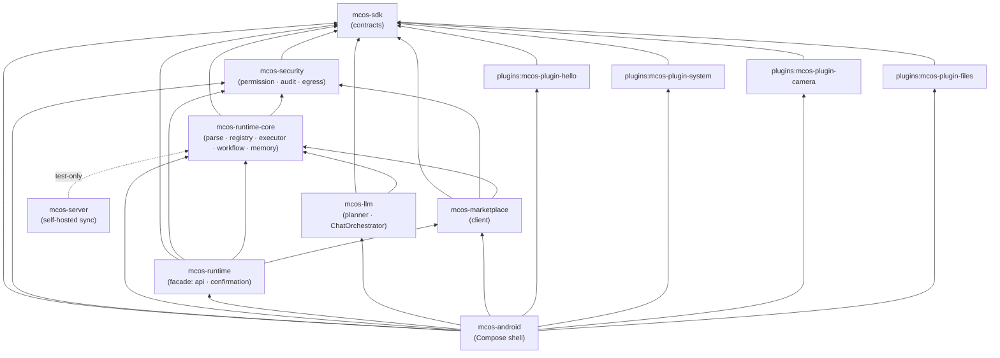

# MCOS Repositories & Module Index

> **Status:** Reference (as-built)  
> **Last Updated:** 2026-08-24  
> **Authoritative for:** the module topology the implementation follows; boundary changes must update this doc together with [01-architecture.md](./01-architecture.md).

MCOS is an **implemented** multi-module repository — the Gradle layout below is the *actual* structure (the P1 first-batch modules, the later `mcos-runtime` / `mcos-runtime-core` split with `mcos-security` / `mcos-llm` / `mcos-marketplace`, and `mcos-server`), not a proposal. This document remains the normative reference for module boundaries, the dependency graph, and naming conventions.

For per-subsystem implementation phasing, see [11-implementation-status.md](./11-implementation-status.md).

---

## 1. Dependency Graph (as-built)

Read bottom-up: `mcos-sdk` is the leaf contract layer; everything depends on it. `mcos-runtime-core` (with `mcos-security`) holds the kernel subsystems; `mcos-runtime` is the facade that `api`-exports `sdk`/`security`/`runtime-core`/`marketplace`; `mcos-llm` deliberately depends **only** on `sdk` + `runtime-core` (never the facade — the Planner must be usable headless, see [01 §7](./01-architecture.md)); `mcos-server` has no compile-time project dependencies (runtime-core appears in tests only, dashed); `mcos-android` aggregates the facade, the SDK, llm, marketplace, and all plugins.

---

## 2. Module Reference (as-built)

### `mcos-sdk` — Plugin contracts (leaf)

| | |
|---|---|
| Path | `mcos-sdk/` |
| Package | `com.morainet.mcos.sdk` |
| Role | The host-facing contract layer: `McosPlugin`, `CommandHandler`, `CommandDescriptor`, `SideEffectClass`, `CommandResult`, `ExecutionContext`. |
| Depends on | (none — leaf) `api` kotlinx-serialization-json, kotlinx-coroutines-core |
| Stack | Kotlin/JVM · JDK 17 · kotlinx.serialization |
| Spec | [04-plugin-sdk.md](./04-plugin-sdk.md) §5 |

### `mcos-runtime` — Runtime facade

| | |
|---|---|
| Path | `mcos-runtime/` |
| Package | Facade `com.morainet.mcos.runtime` (`api`: `McosRuntime`, `RunManager`, `ConfirmationCoordinator`); kernel subsystems live in `mcos-runtime-core` under `runtime.core.*` (`ir`, `parse`, `registry`, `memory`, `executor`, `workflow`, …) |
| Role | The host-facing entry point: wires the kernel into a usable `McosRuntime`, owns run lifecycle (`RunManager`) and confirmation coordination. `api`-exports `sdk`/`security`/`runtime-core`/`marketplace` so hosts need only this one dependency. Also hosts the `PackageBoundariesTest` guard. |
| Depends on | `api(project(":mcos-sdk"))`, `api(project(":mcos-security"))`, `api(project(":mcos-runtime-core"))`, `api(project(":mcos-marketplace"))`; serialization-json, coroutines-core |
| Stack | Kotlin/JVM · JDK 17 · kotlinx.serialization |
| Spec | [02-command-protocol.md](./02-command-protocol.md), [03-runtime.md](./03-runtime.md) |

### `mcos-security` — Security kernel

| | |
|---|---|
| Path | `mcos-security/` |
| Package | `com.morainet.mcos.security` (`audit`, `validate`, `permission`, …) |
| Role | Permission Kernel (`decideConfirmation`), `AuthStampSigner` (HMAC), `SchemaValidator` (Draft 2020-12 + MCOS extensions), `RateLimiter` (Stage 5.5), egress policy (`decideEgress`, Stage 6.5), `FileGrantStore` (persisted grants, HMAC tamper-proofing), `FileAuditLog` + redaction walker, `CrashQuarantine`, `Canonicalizer`. |
| Depends on | `api(project(":mcos-sdk"))`; serialization-json (public signatures expose `JsonObject`) |
| Stack | Kotlin/JVM · JDK 17 · kotlinx.serialization |
| Spec | [08-security.md](./08-security.md) |

### `mcos-runtime-core` — Kernel subsystems

| | |
|---|---|
| Path | `mcos-runtime-core/` |
| Package | `com.morainet.mcos.runtime.core` — `core.api` (`RuntimeGateway`, types), `core.ir`, `core.parse` (`DslParser`), `core.registry`, `core.executor` (pipeline: Resolve → Validate → **5.5 Rate Limit** → Authorize → **6.5 Egress** → Invoke → Audit), `core.workflow`, `core.memory`, `core.events`, `core.plugin`, `core.error` |
| Role | The Command Bus kernel: DSL→IR parsing, Registry with version selection, Executor pipeline, WorkflowEngine (sequential/parallel/if/loop/retry/compensation), memory subsystem (`MemoryStore`, episodic memory, vector-clock sync). |
| Depends on | `api(project(":mcos-sdk"))`, `api(project(":mcos-security"))`; coroutines-core |
| Stack | Kotlin/JVM · JDK 17 · kotlinx.serialization |
| Spec | [02-command-protocol.md](./02-command-protocol.md), [03-runtime.md](./03-runtime.md), [05-workflow.md](./05-workflow.md), [07-memory.md](./07-memory.md) |

### `mcos-llm` — Planner stack

| | |
|---|---|
| Path | `mcos-llm/` |
| Package | `com.morainet.mcos.llm` |
| Role | `ChatOrchestrator` (multi-provider, health probing, privacy gate, event timeouts), PlanModes, NL→IR plan evaluation, trigger recipes. Deliberately does **not** depend on the `mcos-runtime` facade — the Planner must stay usable headless (see [01 §7](./01-architecture.md)). |
| Depends on | `api(project(":mcos-sdk"))`, `api(project(":mcos-runtime-core"))` |
| Stack | Kotlin/JVM · JDK 17 · kotlinx.serialization |
| Spec | [06-agent.md](./06-agent.md) |

### `mcos-marketplace` — Marketplace client

| | |
|---|---|
| Path | `mcos-marketplace/` |
| Package | `com.morainet.mcos.marketplace` |
| Role | Client side of the plugin marketplace: index fetch/parse, signature-chain verification (`TrustAnchors`, fail-closed placeholders for real operator keys), package download + install into the plugin registry. |
| Depends on | `api(project(":mcos-sdk"))`, `api(project(":mcos-security"))`, `api(project(":mcos-runtime-core"))` |
| Stack | Kotlin/JVM · JDK 17 · kotlinx.serialization |
| Spec | [09-marketplace.md](./09-marketplace.md) |

### `mcos-android` — Compose client shell

| | |
|---|---|
| Path | `mcos-android/` |
| Package | `com.morainet.mcos.android` |
| Role | Jetpack Compose client: DSL/Chat input, plan preview, confirmation UX, plugin store, settings, audit viewer. |
| Depends on | `:mcos-sdk`, `:mcos-security`, `:mcos-runtime-core`, `:mcos-runtime`, `:mcos-llm`, `:mcos-marketplace`, the four plugins; AndroidX (core-ktx, lifecycle, activity-compose), Compose BOM |
| Stack | Kotlin/Android · Compose · compileSdk 35 / minSdk 26 · JDK 17 |
| Spec | [01-architecture.md](./01-architecture.md) §6.1, [10-roadmap.md](./10-roadmap.md) §4.1 |

### `plugins:mcos-plugin-hello` — Reference sample

| | |
|---|---|
| Path | `plugins/mcos-plugin-hello/` |
| Package | `com.morainet.mcos.plugin.hello` |
| Role | The canonical example plugin. `hello.world(name)` returns a greeting. Ships a `plugin.json` manifest. |
| Depends on | `api(project(":mcos-sdk"))`; serialization-json, coroutines-core |
| Stack | Kotlin/JVM · JDK 17 |
| Spec | [04-plugin-sdk.md](./04-plugin-sdk.md) §16 |

### `plugins:mcos-plugin-system` — System commands

| | |
|---|---|
| Path | `plugins/mcos-plugin-system/` |
| Package | `com.morainet.mcos.plugin.system` |
| Role | `sys.notify` / `sys.share` / `sys.intent.start` commands. |
| Depends on | `api(project(":mcos-sdk"))` |
| Stack | Kotlin/JVM · JDK 17 |
| Spec | [04-plugin-sdk.md](./04-plugin-sdk.md) §17 |

### `plugins:mcos-plugin-camera` — Camera commands

| | |
|---|---|
| Path | `plugins/mcos-plugin-camera/` |
| Package | `com.morainet.mcos.plugin.camera` |
| Role | `camera.capture` / `camera.scan` commands. |
| Depends on | `api(project(":mcos-sdk"))` |
| Stack | Kotlin/JVM · JDK 17 |
| Spec | [04-plugin-sdk.md](./04-plugin-sdk.md) §4.1, §17 |

### `plugins:mcos-plugin-files` — File / media commands

| | |
|---|---|
| Path | `plugins/mcos-plugin-files/` |
| Package | `com.morainet.mcos.plugin.files` |
| Role | `file.list` / `file.search` / `photo.search` / `photo.compress` commands. |
| Depends on | `api(project(":mcos-sdk"))` |
| Stack | Kotlin/JVM · JDK 17 |
| Spec | [04-plugin-sdk.md](./04-plugin-sdk.md) §17 |

### `mcos-server` — Self-hosted sync endpoint

| | |
|---|---|
| Path | `mcos-server/` |
| Package | `com.morainet.mcos.server` |
| Role | Standalone self-hosted sync endpoint: `SyncBlobTransport` REST contract (`PUT|GET|DELETE /blobs/{id}`) + mandatory Bearer-token auth; stores opaque (already-encrypted) blobs on disk and never parses them. |
| Depends on | none (JDK `com.sun.net.httpserver`); tests use `:mcos-runtime-core` for real-transport interop (memory package lives there after the runtime split) |
| Stack | Kotlin/JVM · JDK 17 · zero third-party runtime deps |
| Spec | [07-memory.md](./07-memory.md) §11.0 |

---

## 3. Planned Modules (later phases)

| Module | Role | Target phase |
|--------|------|--------------|
| `mcos-plugin-iot` | `home.*`, `iot.*` (Home Assistant / Tuya / Matter) | P2 |
| `mcos-plugin-mcp` | MCP client adapter → `mcp.*` commands | P2 spike / P3 production |

`mcos-server` shipped as `mcos-server/` (see §2) covering the **sync** role; marketplace index and remote policy remain P3.

---

## 4. Build Coordinates (as-built)

The Gradle build exists and pins these coordinates via the version catalog (`gradle/libs.versions.toml`).

| Coordinate | Value |
|------------|-----------------|
| Kotlin | 2.0.21+ |
| AGP | 8.7.3+ |
| Compose BOM | 2024.12.01+ |
| compileSdk / minSdk / targetSdk | 35 / 26 / 35 |
| JVM toolchain | 17 |
| kotlinx.serialization | 1.7.3+ |
| kotlinx.coroutines | 1.9.0+ |
| group (JVM modules) | `com.morainet.mcos` |
| version (JVM modules) | `0.1.0-SNAPSHOT` |

> These are recommendations, not commitments; the first real build may pin different compatible versions.

---

## 5. Conventions

- **Package roots:** every module exclusively owns `com.morainet.mcos.<module>.*` (sdk, security, llm, marketplace, android, server, …); the runtime kernel pair uses `com.morainet.mcos.runtime` (facade) and `com.morainet.mcos.runtime.core.*` (core); plugins use `com.morainet.mcos.plugin.<name>`. The mapping is enforced by `PackageBoundariesTest`.
- **First-party plugin IDs:** `mcos.plugin.<name>` (except the sample `example.hello`).
- **Manifest convention:** each plugin **should** ship a `plugin.json` matching [04-plugin-sdk.md](./04-plugin-sdk.md) §4.
- **DSL / IR / Workflow versions:** see [02-command-protocol.md](./02-command-protocol.md) §14 (`dslVersion` is `MAJOR.MINOR`; command contracts are SemVer).
