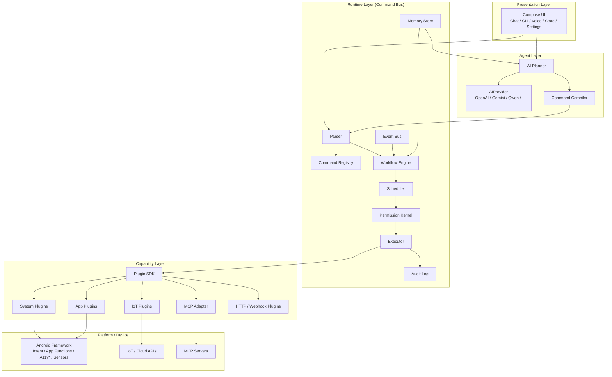
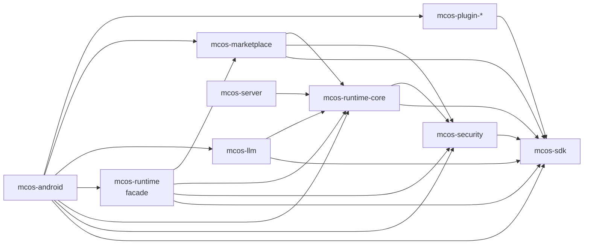
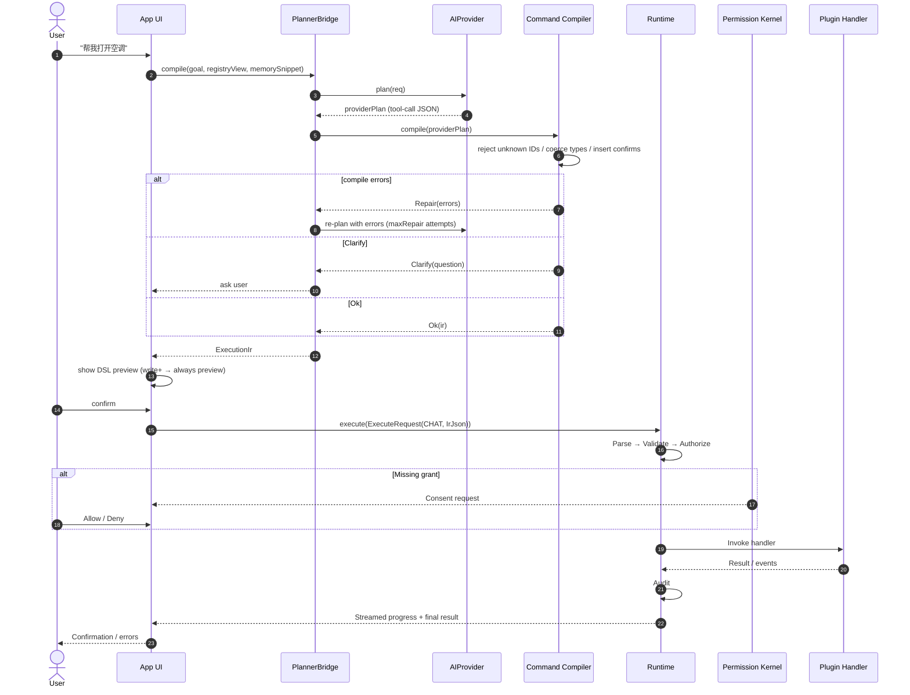
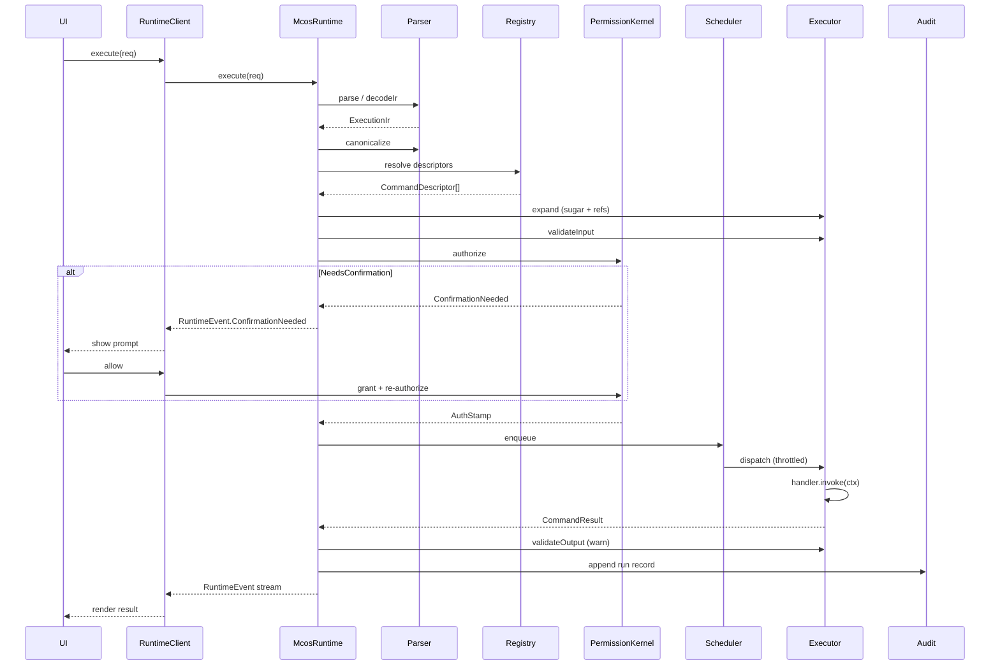
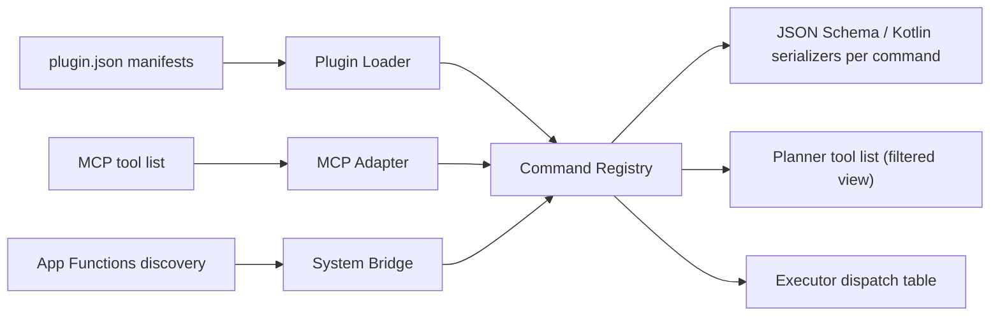
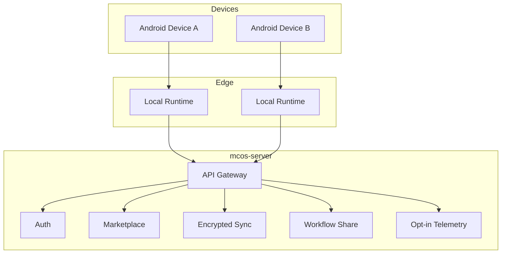

# MCOS 系统架构

> **语言:** [English](../en/01-architecture.md) · 中文（当前）
> **Status:** Draft
> **Version:** 0.1.0
> **Last Updated:** 2026-08-06
> **Depends on:** [00-vision.md](./00-vision.md)
> **Normative companion:** [02-command-protocol.md](./02-command-protocol.md)

---

## 1. 本文档的目标

定义 Mobile Command OS 的**逻辑与物理架构**，从高层分层一直到实现级别的契约：

- 分层系统视图
- 组件职责
- 数据 / 控制流
- Android 上的进程与进程边界，包括 **App↔Runtime IPC 契约**
- **线程与协程模型**（Dispatcher 分配、结构化并发（structured concurrency））
- **运行时执行管线（execution pipeline）**（从解析到审计的 10 个阶段）
- **核心 Kotlin 类型**（实现者需要书写的确切签名）
- 云端可选拓扑
- 横切关注点（安全、可观测性、**统一错误码**、版本管理）

本文档既是描述性的（系统是什么），也是规范性的（如何构建它）。对于规范类 RFC（[02](./02-command-protocol.md)、[08](./08-security.md)）遗留的空白，本文档进行了填补，这些空白记录在 [§18](#18-gap-closure-vs-normative-rfcs) 中。**当本文档与规范类 RFC 冲突时，以 RFC 为准。**

---

## 2. 架构原则回顾

1. **协议居中** —— 所有副作用都经过 Command DSL。
2. **精简 Runtime，丰满 Plugin** —— 领域逻辑不进入内核。
3. **AI 是 sidecar（辅助）** —— Planner 负责提议；Runtime 负责裁决。
4. **纵深防御（Defense in depth）** —— App UI、Runtime 策略、Android OS 权限三层。
5. **可替换的边缘** —— LLM 提供商、IoT 厂商、MCP 服务器、云端后端均可替换。

Apache 风格的基础设施思维：**specs and kernels before skins（规范与内核先于外壳）**。

---

## 3. 逻辑分层图



\* 无障碍（Accessibility）桥接是可选的、受到高度限制，并且不是首选的集成路径。

### 3.1 包 → 模块对照（按实际实现）

运行时族已拆分为职责聚焦的 Gradle 模块。自 2026-08-17 起每个模块独占
`com.morainet.mcos.<module>.*` 根命名空间：`runtime.` 前缀仅保留给运行时
内核（门面 `mcos-runtime` 与 `mcos-runtime-core`），security / llm /
marketplace 等其余模块各自以模块名为根（见 §3.3）。映射由
`PackageBoundariesTest` 强制执行。

| 包 | Gradle 模块 | 依赖 |
|----|------------|------|
| `com.morainet.mcos.sdk` | `mcos-sdk` | — |
| `com.morainet.mcos.security`（安全内核）· `security.audit` · `security.validate` · `security.permission` | `mcos-security` | sdk |
| `com.morainet.mcos.runtime.core`：`core.api`（RuntimeGateway、RuntimeTypes、StubHostServices）及 `core.error` · `core.ir` · `core.events` · `core.registry` · `core.plugin` · `core.memory` · `core.executor` · `core.workflow` · `core.parse` | `mcos-runtime-core` | sdk、security |
| `com.morainet.mcos.llm` | `mcos-llm` | sdk、runtime-core |
| `com.morainet.mcos.marketplace` | `mcos-marketplace` | sdk、security、runtime-core |
| `com.morainet.mcos.runtime`（bare）· `com.morainet.mcos.runtime.api`（McosRuntime facade、ConfirmationCoordinator、RunManager） | `mcos-runtime` | sdk、security、runtime-core、marketplace |
| `com.morainet.mcos.android`（含 `host`） | `mcos-android` | sdk、security、runtime-core、runtime（facade）、llm、marketplace、plugins |
| `com.morainet.mcos.server` | `mcos-server` | runtime-core（仅 test） |
| `com.morainet.mcos.plugin.*` | `plugins:mcos-plugin-*` | sdk |

### 3.2 模块依赖图



值得注意的边：

- `mcos-llm` 与门面**互不依赖**：`ChatOrchestrator` 经 `runtime.core.api`
  的 `RuntimeGateway` 端口（`execute()` + `observe()`，门面 `McosRuntime`
  为规范实现）驱动内核——llm 与门面是内核的两个对等客户端，装配发生在
  消费侧（如 `McosViewModel`），模块层面单向无环。
- `mcos-android` 声明了全部直接边（sdk、security、core、facade、llm、
  marketplace、plugins），不依赖任何 `api` 透传；`mcos-server` 仅在
  test 中依赖 core。

### 3.3 模块边界规则

**`internal` 可见性按模块生效。** 拆分后，某个 Gradle 模块内标记为
`internal` 的声明对其他所有模块都不可见——包括共享同一包前缀的
运行时族模块，也包括其他模块的测试源集。经验规则：

- 跨模块的测试替身必须走公开 API 面（例如实现 `EventBus` 接口并
  构造公开的 `EventSubscription`）。
- 过去依赖同包 `internal` 的辅助耦合（如 `RateLimitKind.maxTokens`）
  收进实现类所在的模块。
- 与其把整个模块声明为 `api` 导出，不如把成员提升为 public；`api`
  只用于出现在公开签名中的类型（`EventBus.observe` 的 `Flow`、
  校验器的 `JsonObject`、`Executor` 构造器的 `SecurityConfig`）。

**跨模块的 split-package 禁止。**
历史上 `com.morainet.mcos.runtime.api` 曾横跨 `mcos-runtime-core`
（RuntimeTypes——核心管线发布的事件与请求类型）与 `mcos-runtime`
（McosRuntime facade），`runtime.memory` 也曾被门面模块的测试目录借用；
两处均已迁移（2026-08-17）：核心管线类型现位于
`com.morainet.mcos.runtime.core.api`（仅 `mcos-runtime-core`），
`runtime.api` 仅保留门面（`mcos-runtime`）。任何包不得跨模块分布——
由 `mcos-runtime` 的 `PackageBoundariesTest` 防护测试强制执行。

**包名与模块一一对齐。**
同日完成全量对齐：core 九个子系统包迁入 `runtime.core.*`；
security 四包改挂 `com.morainet.mcos.security.*`（原 `runtime.security`
扁平展开为模块根）；`runtime.llm` → `com.morainet.mcos.llm`、
`runtime.marketplace` → `com.morainet.mcos.marketplace`。`runtime.` 前缀
自此仅属于运行时内核两模块（门面 + core），其余模块独占
`com.morainet.mcos.<module>.*`——该映射同样由 `PackageBoundariesTest`
的 longest-prefix 规则表强制，新模块必须显式注册自己的根包。

---

## 4. 控制面 vs 数据面

| 面 | 职责 | 示例 |
|-------|----------------|----------|
| **控制面（Control plane）** | 发现命令、加载插件、同步市场元数据、管理策略、更新记忆 schema | Registry 刷新、插件安装、策略下发 |
| **数据 / 执行面（Data / execution plane）** | 接收 DSL、授权、调度、调用 handler、流式返回结果 | `camera.capture()`、工作流步骤执行 |

尽量把市场和 LLM 配置移出热路径。执行必须保持本地优先（local-first）。

---

## 5. 端到端请求生命周期

### 5.1 自然语言路径



### 5.2 直接 CLI / DSL 路径

高级用户和脚本跳过 Planner：

```text
Input: home.scene.movie
  → Parser
  → Registry resolve
  → Permission
  → Executor
  → Plugin(s)
  → Result
```

安全路径完全相同。不能通过"我自己手写了 DSL"来提升权限。

### 5.3 事件触发路径（P2 seam）

```text
EventBus(WiFiConnected{ssid:"Office"})
  → Matching Workflow subscription
  → Scheduler
  → vpn.connect(profile="office")
```

事件永远不会绕过权限内核（Permission Kernel）。包含 `control`/`destructive` 副作用的事件→动作规则，必须在 recipe 安装时预先授权，或者触发一个高优先级的确认通知。

---

## 6. 组件目录

### 6.1 表示层（`mcos-android`）

| 模块 | 职责 |
|--------|----------------|
| Chat 界面 | 对话式目标输入、计划预览、确认 |
| CLI 界面 | 行式命令输入、历史、补全 |
| Voice | STT → 与文本相同的 planner 路径 |
| 插件商店 UI | 浏览 / 安装 / 权限审查 |
| 设置 | 提供商、策略、记忆导出、开发者模式 |
| 历史 / 审计查看器 | 历史运行、diff、重跑 |

UI 必须能在破坏性动作前展示**编译后的 DSL**（可由策略配置）。

### 6.2 AI Planner（`docs/06-agent.md`）

| 部分 | 职责 |
|-------|----------------|
| 目标理解 | 利用 Memory 解析引用 |
| 工具 / schema 提示 | 向模型暴露 Registry 子集 |
| 计划合成 | 产出有序 / 并行的步骤 |
| Command Compiler | 将输出约束到 Command DSL / Workflow IR |
| 修复循环 | 校验失败时，带着错误重新询问模型（maxRepair = 云端 2 次 / 端侧 1 次） |

Planner **负责提议**。Runtime **负责校验并执行**。

### 6.3 运行时（`mcos-runtime`）

| 子系统 | 职责 |
|-----------|----------------|
| **Parser（解析器）** | 对 DSL 文本进行词法/语法分析 → AST；支持 JSON IR |
| **Command Registry（命令注册表）** | 将 `namespace.command` 映射到插件 handler + schema |
| **Scheduler（调度器）** | 队列、并发限制、优先级、取消 |
| **Workflow Engine（工作流引擎）** | 图：顺序、并行、条件、循环、重试、回滚 |
| **Executor（执行器）** | 带类型参数 + context 调用 handler；展开语法糖/引用 |
| **Permission Kernel（权限内核）** | 授权、范围、一次性确认、速率限制 |
| **Memory（记忆）** | 配置画像、偏好、embedding 索引（见 `07`） |
| **Event Bus（事件总线）** | 设备/系统/插件事件 → 订阅者 |
| **Audit Log（审计日志）** | 不可变（ish）的执行记录，用于回放/调试 |

### 6.4 Plugin SDK（`mcos-sdk`）

见 [04-plugin-sdk.md](./04-plugin-sdk.md)。提供：

- Manifest schema
- 命令 handler 接口
- 权限声明辅助工具
- 结果 / 进度 / 流式类型
- 测试工具钩子

### 6.5 Plugins

| 类别 | 示例 | 典型后端 |
|-------|----------|------------------|
| System | `sys.notify`, `sys.intent`, `sys.share` | Android 框架 |
| Media | `camera.*`, `photo.*` | CameraX, MediaStore |
| Productivity | `note.*`, `mail.*`, `calendar.*` | Content providers / Intents |
| Dev | `github.*` | REST / MCP |
| IoT | `home.*`, `iot.*` | HA / Tuya / Matter |
| Bridge | `mcp.*` | MCP 客户端 |

### 6.6 云端（`mcos-server`，可选）

| 服务 | 职责 |
|---------|----------------|
| 账号与设备同步 | 加密的设置、记忆子集 |
| 市场索引 | 插件元数据、签名、版本 |
| 工作流分享 | 社区 recipe（已做净化处理） |
| 远程策略（企业） | 可选的 MDM 式命令允许列表 |

云端对本地命令执行**不是必需的**。

---

## 7. Android 进程模型与 IPC 契约

### 7.1 进程拓扑

**MVP（P1）：单进程。** Runtime 作为 `:app` 内的进程内单例运行。`RuntimeClient` 是一个轻量的内存 delegate —— 没有 Binder 序列化开销。这是有意为之：MVP 范围（仅顺序工作流、无第三方插件）不需要崩溃隔离。

**V1（P2+）：多进程。** 当引入第三方插件或长时间运行的后台工作流时，Runtime 迁移到独立的 `:runtime` 进程。

```text
┌─────────────────────────────────────────────┐
│  :app process                                │
│  Compose UI + thin Runtime client            │
└───────────────────┬─────────────────────────┘
                    │ Binder / AIDL / IPC
┌───────────────────▼─────────────────────────┐
│  :runtime process (isolated where possible)  │
│  Parser / Registry / Workflow / Executor     │
│  Permission Kernel / Audit                   │
└───────────────────┬─────────────────────────┘
                    │ Plugin host API
┌───────────────────▼─────────────────────────┐
│  Plugin hosts                                │
│  - Built-in (same or sibling process)        │
│  - Dynamic feature / DexClassLoader          │
│  - Bound services from partner apps          │
└─────────────────────────────────────────────┘
```

理由：UI 与长时间运行的工作流之间的崩溃隔离；更清晰的权限与审计边界；前台服务工作流不必绑定 UI 生命周期。

**迁移 seam：** `com.morainet.mcos.android` 中的 `RuntimeClient` 是 App 侧唯一的接触点。在 MVP 中它持有直接的 `McosRuntime` 引用；在 V1 中它持有一个 Binder stub。UI 层对此完全无感。

### 7.2 App↔Runtime 契约（传输无关）

该契约在 `mcos-sdk`（`com.morainet.mcos.sdk.runtime.RuntimeFacade`）中定义为一个 Kotlin 接口。进程内 delegate 与 AIDL stub 都实现它：

```kotlin
package com.morainet.mcos.sdk.runtime

interface RuntimeFacade {
    suspend fun execute(request: ExecuteRequest): ExecuteHandle
    suspend fun preview(request: ExecuteRequest): PreviewResult
    suspend fun cancel(runId: RunId)
    fun observe(runId: RunId): kotlinx.coroutines.flow.Flow<RuntimeEvent>
    fun subscribe(listener: EventListener): Subscription           // EventBus 订阅；见 [03 §14](./03-runtime.md)
    suspend fun exportAudit(range: ClosedRange<Instant>?): Uri     // 用户发起的 JSONL 导出；见 [03 §16](./03-runtime.md)
    suspend fun registrySnapshot(): List<CommandDescriptor>
    suspend fun resolveGrants(subject: String): List<Grant>
}
```

### 7.3 AIDL 方法表（V1 多进程模式）

当 Binder 传输启用时，每个 `RuntimeFacade` 方法映射到一个 AIDL 方法。Parcelable 承载数据；`JsonObject`（IR）以规范化字符串形式序列化。

| `RuntimeFacade` 方法 | AIDL 方法 | 入参 parcelable | 返回 / 回调 | 失败映射 |
|---|---|---|---|---|
| `execute` | `execute` | `ExecuteRequestParcel` | `ExecuteHandleParcel` + `IRuntimeCallback`（流式事件） | `SecurityException` → `PERMISSION_DENIED`；`RemoteException` → `UNAVAILABLE` |
| `preview` | `preview` | `ExecuteRequestParcel` | `PreviewResultParcel`（一次性） | 同上 |
| `cancel` | `cancel` | `runId: String` | `void` | `RemoteException` → `UNAVAILABLE` |
| `observe` | （通过在 `execute` 时注册的回调） | — | `onEvent(RuntimeEventParcel)` | 回调死亡 → `RunCancelled` |
| `registrySnapshot` | `registrySnapshot` | — | `List<CommandDescriptorParcel>` | — |
| `resolveGrants` | `resolveGrants` | `subject: String` | `List<GrantParcel>` | — |

**Parcelable 包装规则：**
- `JsonObject` IR → `String` 字段，持有规范化 JSON（键按 [02 §7.4](./02-command-protocol.md) 排序）。
- `RuntimeEvent` → 带标签的联合 parcelable（`int type`，然后是类型特定字段）。
- `CommandDescriptor` → 扁平 parcelable；`inputSchema`/`outputSchema` 作为 JSON 字符串。
- Binder 上的 `Flow<RuntimeEvent>` → AIDL 回调，在客户端桥接为 `callbackFlow`。

**V1 Service 定义骨架：**

```kotlin
// mcos-runtime/src/main/aidl/com/morainet/mcos/runtime/IRuntimeService.aidl
interface IRuntimeService {
    ExecuteHandleParcel execute(in ExecuteRequestParcel req, in IRuntimeCallback cb);
    PreviewResultParcel preview(in ExecuteRequestParcel req);
    void cancel(String runId);
    List<CommandDescriptorParcel> registrySnapshot();
    List<GrantParcel> resolveGrants(String subject);
}
```

当有任何 run 处于活跃状态时，Android `Service` 都会以前台方式被钉住。

---

## 8. 线程与协程模型

| 组件 | Dispatcher | 理由 |
|-----------|-----------|-----------|
| `DslParser` | `Dispatchers.Default` | 不可信输入（Planner 输出 / 粘贴的 DSL）；离开主线程以保护 UI 免受病态嵌套或超长输入的影响。输入规模上限在解析前强制执行（[02 §6.10](./02-command-protocol.md)）。 |
| `CommandRegistry` 查找 | `Dispatchers.Default` | 纯 O(1) 哈希表；CPU 密集。 |
| `PermissionKernel` | `Dispatchers.Default` | 纯计算 + 授权缓存；CPU 密集。 |
| `Scheduler` 队列分发 | 在 `Default` 上自定义 `limitedParallelism(4)` | 通过结构化并发而非锁来强制全局 `maxParallel=4`。 |
| `Executor` / 插件 handler | 按 descriptor：`Dispatchers.IO`（默认）或当 `descriptor.tags` 包含 `"cpu-bound"` 时用 `Dispatchers.Default` | 插件各异；该提示让 CPU 密集型插件不会饿死 IO。 |
| `AuditLog` 写入 | `Dispatchers.IO.limitedParallelism(1)` | 单写者 channel → 有序，永不阻塞成功路径（>20ms 预算）。 |
| `EventBus`（P2 seam） | `Dispatchers.Default` | 发布/订阅扇出。 |
| `PlannerBridge` 客户端（App 侧） | `Dispatchers.IO` | 网络密集的 LLM 调用。 |
| UI 渲染 | `Dispatchers.Main` | Compose 契约。 |

**插件覆盖：** 插件可在其 manifest 中声明 `threadHint: "io" | "cpu" | "main"`。Executor 会尊重它。`main` 仅限带有 `sideEffectClass: control` 且需要 UI 线程 Android API（如 CameraX）的插件，并且需要审计。

### 8.1 RunId 作用域与结构化并发

每次 `execute()` 调用都会创建一个以 `SupervisorJob(runId)` 为根的 `CoroutineScope`：

```kotlin
class RunScope(val runId: RunId, parent: CoroutineScope) : CoroutineScope {
    override val coroutineContext =
        parent.coroutineContext + SupervisorJob(parent.job) + runIdMdc(runId)
}
```

- **取消：** `cancel(runId)` 取消 SupervisorJob → 所有子步骤 job 协作式取消 → 插件 `handler.cancel(ctx)` 尽力执行 → 审计 `RunCancelled`。
- **工作流步骤（P2）：** 每个步骤是 run 作用域的子 `Job`；一个步骤失败不会取消兄弟步骤，除非 join 策略要求。
- **故障隔离：** 因为 job 是 `SupervisorJob`，一个插件的异常只会让它的步骤失败，而不会影响整个 Runtime 进程。

### 8.2 超时与取消语义

| 触发 | 机制 | 映射的错误码 |
|---|---|---|
| `descriptor.timeoutMs` 到期 | 在 `handler.invoke` 外层 `withTimeout(timeoutMs)` | `TIMEOUT`（按工作流策略可重试） |
| 用户 `cancel(runId)` | `SupervisorJob.cancel()` | `CANCELLED`（永远不可重试） |
| 插件抛出 `CancellationException` | 自然传播 | `CANCELLED` |
| 插件抛出其他 `Throwable` | 被 Executor 捕获并净化 | `PLUGIN_ERROR` |
| 插件宿主进程死亡（V1） | Binder `DeadObjectException` | `UNAVAILABLE` + 插件被标记为不健康 |

---

## 9. 运行时执行管线（10 个阶段）

Runtime 管线为 `parse → canonicalize → resolve → expand → validate → authorize → schedule → execute → validate-output → audit`。

### 9.1 阶段映射

| # | 阶段 | 包 | 输入 | 输出 | 失败码 | 可跳过？ | 审计事件 |
|---|-------|---------|-------|--------|--------------|-------------|-------------|
| 1 | Parse | `parser` | DSL 文本 / IR JSON | `ExecutionIr` | `PARSE_ERROR` | 否 | — |
| 2 | Canonicalize | `parser` | `ExecutionIr` | `ExecutionIr`（规范化） | `PARSE_ERROR` | 否 | — |
| 3 | Resolve | `registry` | 命令 ID | 已解析的 `CommandDescriptor`s | `UNKNOWN_COMMAND` | 否 | — |
| 4 | **Expand** | `executor` | `ExecutionIr` + Memory facade | 展开后的 `ExecutionIr` | `SCHEMA_VIOLATION` | 否 | `sugarExpanded` |
| 5 | ValidateInput | `executor` | 参数 + `inputSchema` | 校验后的 `JsonObject` 参数 | `SCHEMA_VIOLATION` | 否 | — |
| 6 | Authorize | `permission` | descriptor + 授权 | `AuthStamp` 或 `ConfirmationNeeded` | `PERMISSION_DENIED` | 否 | `grantUsed` / `confirmRequested` |
| 7 | Schedule | `scheduler` | 已授权的 run | 入队的 job | `RATE_LIMITED` | 否 | — |
| 8 | Execute | `executor` | `ExecutionContext` | `CommandResult` | `PLUGIN_ERROR` / `TIMEOUT` / `UNAVAILABLE` | 否 | `stepExecuted` |
| 9 | ValidateOutput | `executor` | 结果 + `outputSchema` | 校验后的结果 | (告警) `INTERNAL` | 是（仅 dev/strict） | — |
| 10 | Audit | `audit` | 完整 run 记录 | 追加 | — | 否 | `runRecorded` |

**副作用边界：** 阶段 1–7 不产生任何副作用。其中任何一个失败都是可恢复的，不会触碰设备。只有阶段 8（Execute）才会接触外部世界。这是对 [02 §9.1](./02-command-protocol.md) "handler 调用之前任何步骤的失败都不得造成副作用"的形式化表达。

### 9.2 阶段细节

**阶段 1 —— Parse（解析）。** 遵守 [`../fixtures/`](../fixtures/) 中全部 8 个黄金 fixture。Strict 模式拒绝未知 IR 字段；lenient 模式仅限开发使用。

**阶段 2 —— Canonicalize（规范化）。** 命令 ID 转小写；按字典序排序对象键（递归）；按 schema 类型规范化数字。输出是确定性的，适合哈希/审计。

**阶段 3 —— Resolve（解析）。** Registry 解析策略：优先精确匹配 → 否则同一 major 下最高的兼容 minor/patch → 否则 `UNKNOWN_COMMAND`。已固定的工作流会存储已解析版本以保证可复现。

**阶段 4 —— Expand（展开）（语法糖 + Memory 引用）。** 将 `date="today"` 展开为 RFC 3339 区间；解析 `x-mcos-ref`（`name="空调"` → 通过 `MemoryFacade.resolveRef` 得到设备 id）；注入 `x-mcos-default-from-memory`。顺序：先展开语法糖（不涉及 Memory），再展开 Memory 引用。记录一条 `sugarExpanded` 审计条目，含前/后参数快照（已脱敏）。MVP：Memory facade 是一个 seam；语法糖（日期）在 P1 实现。

**阶段 5 —— ValidateInput（输入校验）。** JSON Schema Draft 2020-12 + MCOS 扩展。带路径限定的错误消息。

**阶段 5.5 —— Rate Limit（限流）。** ✅ 已实现（`mcos-security` 的 `RateLimiter`，由 Executor 在校验与授权之间调用）。以 `(pluginId, sideEffectClass)` 为键；超限 → `RATE_LIMITED`，携带 `details.retryAfterMs` + `details.kind`。`UnlimitedRateLimiter` 是命名的退出选项。完整规范性参数集见 [08 §10](./08-security.md)。

**阶段 6 —— Authorize（授权）。** 权限内核：`required = descriptor.permissions ∪ pluginPermissions ∪ globalPolicy`；`missing = required − grants` → `ConfirmationNeeded`（可询问时）或 `Denied`（粘性时）。在 `Granted` 时，铸造一个 `AuthStamp`：短生命周期、run 作用域、插件无法伪造。

**阶段 6.5 —— Egress（出网检查，授权后）。** ✅ 已实现。对 `network` 副作用类的命令，invoke 之前对参数树中任意位置的 URL 字符串逐一经 `decideEgress`（[08 §12](./08-security.md)）检查。该阶段刻意排在**阶段 6 之后**，从而只从签名与权限覆盖均已验证过的戳中读取 `grantsUsed`——若放在授权之前，调用方可伪造携带 `network.<attacker-domain>` 作用域的戳通过出网检查（即 P0-S1 发现）。拒绝 → `PERMISSION_DENIED`，携带 `details.url` / `details.egressReason`。

**阶段 7 —— Schedule（调度）。** 队列：`interactive`（CLI/Chat）、`workflow`（P2）、`background`（P2）、`expedited`（仅可被取消）。全局上限 4；每插件 2；`destructive` 1；IoT 控制按设备 id 串行。超上限 → `RATE_LIMITED`。

**阶段 8 —— Execute（执行）。** 在 descriptor 选定的 Dispatcher 上，以 `withTimeout` 分发 `handler.invoke(ctx)`。异常映射见 [§10.3](#103-plugin-exception--code-mapping)。

**阶段 9 —— ValidateOutput（输出校验）。** 默认：仅告警。`RuntimeConfig.strictSchemaOutput = true` → 以 `INTERNAL` 失败。

**阶段 10 —— Audit（审计）。** 追加到本地存储（Room/SQLCipher）。单写者 Dispatcher；写入失败仅记录日志，不会让 run 失败（除非企业场景的 `auditFailClosed`）。

### 9.3 端到端管线图



---

## 10. Command Registry 架构



每个 registry 条目（`CommandDescriptor`）至少包含：

| 字段 | 类型 | 必需 | 默认值 | 约束 |
|-------|------|----------|---------|------------|
| `id` | string | 是 | — | `namespace.name`，≤128 字符，小写 |
| `version` | string | 是 | — | 命令契约的 SemVer |
| `pluginId` | string | 是 | — | reverse-DNS |
| `title` | string | 是 | — | 人类可读 |
| `description` | string | 是 | — | 单行 |
| `inputSchema` | object | 是 | — | JSON Schema 2020-12 |
| `outputSchema` | object | 是 | — | JSON Schema 2020-12 |
| `permissions` | array | 是 | `[]` | 每项 `{type, name}` |
| `sideEffectClass` | enum | 是 | — | `read` / `write` / `network` / `control` / `destructive` |
| `idempotent` | bool | 否 | `false` | 控制是否重试 |
| `timeoutMs` | int | 否 | `60000` | Executor 截止时间 |
| `tags` | array | 否 | `[]` | 可包含 `"cpu-bound"` 线程提示 |
| `examples` | array | 否 | `[]` | DSL 字符串 |
| `deprecated` | bool | 否 | `false` | |
| `replacedBy` | string? | 否 | `null` | command-id |

**Registry 视图：** 完整视图（开发者工具）、用户启用视图（Planner + CLI 补全）、策略允许列表视图（企业）。Planner 永远看不到已禁用或未获准许的命令。

### 10.1 副作用类别与确认策略

| 类别 | 含义 | 默认确认 |
|-------|---------|----------------------|
| `read` | 无持久化变更 | 无 |
| `write` | 创建/修改数据 | 首次运行或按策略 |
| `destructive` | 删除/不可逆 | 总是确认 |
| `network` | 离开设备边界 | 按策略/首次运行 |
| `control` | 驱动设备/IoT/VPN | 除非可信，否则确认 |

策略可以收紧；但不得低于用户全局设置而放松。完整策略矩阵见 [08-security.md](./08-security.md)。

### 10.2 授权（Grant）记录

```json
{
  "subject": "command:camera.capture",
  "permissions": ["android:CAMERA", "mcos:command.camera.capture"],
  "state": "granted",
  "grantedAt": "2026-08-07T10:00:00Z",
  "expiresAt": null,
  "scope": "foreground_only"
}
```

**`state` 取值：** `granted` | `denied` | `ask_always` | `foreground_only`。拒绝是**粘性**的，直到用户在设置中更改 —— Planner 无法覆盖。

**`scope` 词表：**

| scope 值 | 含义 |
|-------------|---------|
| `foreground_only` | 仅当应用在前台时授权生效 |
| `session` | 当前应用会话期间授权生效 |
| `persistent` | 授权持续有效，直到用户在设置中撤销 |
| `once` | 一次性使用，一次调用后即消耗 |

### 10.3 插件异常 → 错误码映射

```kotlin
fun Throwable.toMcosError(): McosError = when (this) {
    is CancellationException -> McosError(CANCELLED, "cancelled")
    is TimeoutCancellationException -> McosError(TIMEOUT, "timeout")
    is McosException -> McosError(this.code, sanitize(this.message), this.retryable)
    else -> McosError(PLUGIN_ERROR, sanitize(this.message ?: "plugin error"))
}
```

净化（Sanitization）会剥离堆栈跟踪、文件路径，以及任何匹配 `x-mcos-secret` 模式的内容。完整堆栈跟踪仅在 `BuildConfig.DEBUG` 的审计记录中保留。插件可以抛出带类型的 `McosException(code, message, retryable)` 来选择特定的错误码。

---

## 11. 数据流：结果、流式传输与核心类型

### 11.1 执行上下文与宿主服务

SDK 文档（[04 §6](./04-plugin-sdk.md)）曾把插件 facade 称为 `PluginHost`；Runtime 文档称之为 `HostServices`。**本文档统一采用 `HostServices`** 作为唯一的 facade 类型：

```kotlin
package com.morainet.mcos.sdk

interface HostServices {
    fun files(): FileService
    fun net(): NetService
    fun ui(): UiService
    fun secureStore(): SecureStore
    fun clock(): Clock
    fun json(): kotlinx.serialization.json.Json
    fun memory(): MemoryFacade   // 插件的只读视图；P2
}
```

### 11.2 `ExecutionContext` 与访问器

```kotlin
data class ExecutionContext(
    val runId: RunId,
    val stepId: StepId?,
    val commandId: CommandId,
    val args: JsonObject,            // 已校验、已展开
    val auth: AuthStamp,
    val deadline: kotlinx.datetime.Instant,
    val progress: ProgressEmitter,
    val services: HostServices,
) {
    // 类型化访问器
    fun stringOrNull(key: String): String?
    fun intOrNull(key: String): Int?
    fun longOrNull(key: String): Long?
    fun boolOrNull(key: String): Boolean?
    fun doubleOrNull(key: String): Double?
    fun stringArrayOrNull(key: String): List<String>?
    fun refOrNull(key: String): String?          // 由阶段 4 预先展开
    suspend fun memoryDefault(keyPath: String): JsonElement?
}
```

### 11.3 `Artifact`

```kotlin
data class Artifact(
    val uri: String,        // content:// 或 file:// —— 绝不内联字节
    val mime: String,       // 例如 "image/jpeg"
    val size: Long? = null, // 字节数（如已知）
    val label: String? = null,  // 人类可读
)
```

Artifact 始终通过 URI 引用。Executor 永远不会把 artifact 的字节序列化进审计日志。

### 11.4 值类与 AuthStamp

```kotlin
@JvmInline value class RunId(val value: String)
@JvmInline value class StepId(val value: String)
@JvmInline value class CommandId(val value: String)

data class AuthStamp(
    val runId: RunId,
    val grantsUsed: List<String>,
    val expiresAt: kotlinx.datetime.Instant,  // run 作用域、短生命周期
    val signature: ByteArray,                 // Runtime 签名；插件无法伪造
)
```

### 11.5 `RuntimeEvent`（11 个变体）

插件发出进度、日志、artifact、结果和失败。UI 与 Audit 订阅同一流；UI 可过滤。

```kotlin
sealed class RuntimeEvent {
    abstract val runId: RunId
    abstract val timestamp: kotlinx.datetime.Instant

    data class RunStarted(…, val source: Source, val ir: ExecutionIr) : RuntimeEvent()
    data class StepStarted(…, val stepId: StepId, val commandId: CommandId) : RuntimeEvent()
    data class Progress(…, val stepId: StepId?, val percent: Int?, val message: String?) : RuntimeEvent()
    data class Artifact(…, val stepId: StepId?, val artifact: com.morainet.mcos.sdk.Artifact) : RuntimeEvent()
    data class Log(…, val stepId: StepId?, val level: LogLevel, val message: String) : RuntimeEvent()
    data class ConfirmationNeeded(…, val stepId: StepId?, val prompt: ConfirmationPrompt) : RuntimeEvent()
    data class StepSucceeded(…, val stepId: StepId, val value: JsonElement?, val durationMs: Long) : RuntimeEvent()
    data class StepFailed(…, val stepId: StepId, val error: McosError, val durationMs: Long) : RuntimeEvent()
    data class RunSucceeded(…, val totalDurationMs: Long) : RuntimeEvent()
    data class RunFailed(…, val error: McosError, val totalDurationMs: Long) : RuntimeEvent()
    data class RunCancelled(…, val reason: String) : RuntimeEvent()
}
```

### 11.6 `ExecuteRequest` / `PreviewResult`

```kotlin
data class ExecuteRequest(
    val source: Source,                                  // CLI, CHAT, VOICE, EVENT, SCHEDULE, API (SCHEDULE is runtime-produced only, 05 §9.3)
    val payload: Payload,                                // DslText | IrJson | WorkflowRef
    val dryRun: Boolean = false,
    val confirmationMode: ConfirmationMode = ConfirmationMode.POLICY,
    val correlationId: String? = null,
)

enum class ConfirmationMode { POLICY, ALWAYS_CONFIRM, NEVER_CONFIRM }  // NEVER_CONFIRM 仅用于 read

sealed class PreviewResult {
    data class Ok(val ir: ExecutionIr, val descriptors: List<CommandDescriptor>, val wouldConfirm: Boolean) : PreviewResult()
    data class Err(val error: McosError) : PreviewResult()
}
```

---

## 12. 云端架构（可选）



建议的技术栈（V1 任选其一即可）：

- **Kotlin / Spring Boot** —— 如果团队以 Android 为主，且希望共享 DTO
- **Go** —— 如果市场 + 高 QPS 边缘 API 是主要场景

两者必须为市场和同步使用相同的 OpenAPI 契约。

---

## 13. 集成面

### 13.1 MCP

```text
MCP Server tools
  → MCP Adapter normalizes to Command descriptors
  → Registry registers as mcp.<server>.<tool>
  → Executor calls MCP client session
```

### 13.2 Android App Functions

在现代 Android 上，对于协作型应用这是首选方式：

```text
App Function discovery
  → sys.appfn.<pkg>.<function> or vendor alias
  → typed args bridge
```

### 13.3 Intent / Deep Link

被包装为带有显式 extras schema 的命令；绝不接受来自模型输出的未经 schema 校验的自由格式 Intent 注入。

### 13.4 IoT

插件封装厂商 SDK。Runtime 只看到 `home.light.on(id, ...)`。

---

## 14. 横切关注点

### 14.1 安全

见 [08-security.md](./08-security.md)。

要点：

- 按命令 / 插件的能力型（capability-based）授权
- 按 `sideEffectClass` 的确认策略
- 来自不可信 DSL 的原始 shell / 任意 Intent 一律拒绝
- 市场安装时的插件签名校验

**威胁姿态：** Planner 输出是不可信的；插件在安装同意之后是半可信的。纵深防御分层：Android OS 权限 → MCOS 插件安装同意 → `sideEffectClass` 策略 → 权限内核授权 → 用户确认关卡 → 审计与速率限制 → 企业允许列表（可选）。

### 14.2 可观测性

| 信号 | 落地处 |
|--------|------|
| 结构化审计事件 | 本地加密数据库 |
| 指标（可选） | 本地 + opt-in 远程 |
| 按 `RunId` 的 trace | Debug 构建 / 开发者模式 |

**Trace span（每个 `RunId`）：** 每个管线阶段发出一个 span（`parse`、`canonicalize`、`resolve`、`expand`、`validateInput`、`authorize`、`schedule`、`execute`、`validateOutput`、`audit`），带 `durationMs` 与 `status`。在 debug 构建中发到 Android 系统 tracer；在生产环境聚合为指标计数器。

**指标（本地计数器）：** `mcos_run_total{source,terminal_status}`、`mcos_step_duration_ms{command_id,plugin_id}`、`mcos_step_errors_total{command_id,code}`、`mcos_planner_compile_total{provider,outcome}`、`mcos_plugin_health{plugin_id,state}`。

**始终审计的事件：** `grantRequested`、`granted`/`denied`、`pluginInstalled`/`pluginUninstalled`、`policyUpdated`、`sugarExpanded`、`stepExecuted`、`runRecorded`、`destructiveExecuted`。

### 14.3 版本管理

| 制品 | 方案 |
|----------|--------|
| 命令契约 | SemVer；破坏性变更 = major |
| 插件 manifest | SemVer |
| DSL 语言 | IR 中的 `dslVersion` 字段（`MAJOR.MINOR` 简写，如 `"0.1"`） |
| Runtime API | SemVer；发布 SDK 兼容性矩阵 |

### 14.4 测试策略

| 层 | 测试 |
|-------|-------|
| 协议 | 黄金 DSL 解析 / 打印 fixture |
| Runtime | 授权矩阵、调度器取消 |
| 插件 | 每插件 Robolectric / instrumented 测试 |
| Planner | 离线 fixture：话术 → 预期 DSL |
| E2E | Compose UI + 假插件宿主 |

---

## 15. 统一错误码

> 错误码此前散落在 [02](./02-command-protocol.md)、[03](./03-runtime.md)、[04](./04-plugin-sdk.md)、[05](./05-workflow.md)、[06](./06-agent.md) 中。本节是唯一的事实来源。

### 15.1 `McosErrorCode` enum

```kotlin
package com.morainet.mcos.sdk

enum class McosErrorCode(val retryableDefault: Boolean) {
    PARSE_ERROR(false),
    UNKNOWN_COMMAND(false),
    SCHEMA_VIOLATION(false),
    PERMISSION_DENIED(false),
    CONFIRMATION_REQUIRED(false),
    TIMEOUT(true),
    CANCELLED(false),
    PLUGIN_ERROR(false),
    UNAVAILABLE(true),
    RATE_LIMITED(true),
    INTERNAL(false),
    COMPILE_FAILED(false),          // planner 侧
    CONFLICT(false),                // 资源争用（死锁、清单 ID 重复）
    WORKFLOW_INVALID(false),        // 见 05-workflow.md §7.5
    MAX_ITERATIONS_EXCEEDED(false),
    COMPENSATION_FAILED(false),
    JOIN_FAILED(false),
    TRIGGER_MISFIRE(true);

    companion object {
        fun from(code: String): McosErrorCode? = entries.firstOrNull { it.name == code }
    }
}
```

### 15.2 错误码参考

| 码 | 含义 | 触发阶段 | 可重试 | HTTP 类比 |
|------|---------|--------------------|-----------|---------------|
| `PARSE_ERROR` | DSL/IR 语法无效 | 1, 2 | 否 | 400 |
| `UNKNOWN_COMMAND` | 命令 id 不在 Registry 中 | 3 | 否 | 404 |
| `SCHEMA_VIOLATION` | 参数未通过 inputSchema；引用无法解析 | 4, 5 | 否 | 422 |
| `PERMISSION_DENIED` | 粘性拒绝；缺少不可询问的权限 | 6 | 否 | 403 |
| `CONFIRMATION_REQUIRED` | 需要用户同意（是一次次暂停，不是错误） | 6 | — | 401 |
| `TIMEOUT` | descriptor.timeoutMs 到期 | 8 | 是（按策略） | 408 |
| `CANCELLED` | 用户/runtime 取消 | 8 | 否 | 499 |
| `PLUGIN_ERROR` | handler 抛出 / 返回 Err | 8 | 按策略 | 500 |
| `UNAVAILABLE` | 插件进程死亡；暂时性 | 8 | 是 | 503 |
| `RATE_LIMITED` | 超出并发上限 | 7 | 是 | 429 |
| `INTERNAL` | Runtime bug；输出 schema 不匹配（strict） | 9 | 否 | 500 |
| `COMPILE_FAILED` | planner 修复循环耗尽 | (planner) | 否 | 422 |
| `CONFLICT` | 资源争用：设备串行锁被占用（[03 §8.5](./03-runtime.md)）或清单 ID 重复（[02 §4.4](./02-command-protocol.md)） | 7, 8 | 否 | 409 |
| `WORKFLOW_INVALID` | 工作流 IR schema/结构校验在编译期失败 | (workflow compile) | 否 | 422 |
| `MAX_ITERATIONS_EXCEEDED` | `loop` 步骤达到 `maxIterations` 上限仍未退出 | (workflow execute) | 否 | 408 |
| `COMPENSATION_FAILED` | 补偿步骤自身失败（best-effort，不阻塞） | (workflow compensate) | 否 | 500 |
| `JOIN_FAILED` | `parallel` join 策略不可满足（如子步失败且无 onError 边） | (workflow execute) | 按子步 | 500 |
| `TRIGGER_MISFIRE` | schedule trigger 错过触发窗口（Doze/设备关机）且未配置 `fire-and-forget` | (workflow trigger) | 是 | — |

### 15.3 故障域矩阵

| 故障 | 影响当前 run？ | 影响其他 run？ | 插件健康？ |
|---------|---------------------|--------------------|----|
| 插件抛出异常 | 步骤失败 | 否 | 记 1 次故障（N 次后熔断） |
| 插件进程死亡（V1） | 步骤 → `UNAVAILABLE` | 否 | 标记不健康；隔离 |
| LLM 超时 | 编译失败；不执行 | 否 | 不适用 |
| 磁盘满（审计写入） | run 仍成功（告警） | 审计降级 | 不适用 |
| 磁盘满（审计，企业 fail-closed） | run 失败 `INTERNAL` | 之后所有 run 失败 | 不适用 |
| Runtime OOM | run 失败 | 进程重启 | 所有插件重载 |

**插件熔断器：** 同一插件在 60 秒内连续产生 3 次 `PLUGIN_ERROR`，Scheduler 会将其标记为不健康，对新调用返回 `UNAVAILABLE`，直到冷却（30s）或手动重试。可通过 `RuntimeConfig` 配置。

---

## 16. 部署拓扑

| 拓扑 | 描述 | 目标用户 |
|----------|-------------|-------------|
| **Solo local** | App + Runtime + 内置插件 | 隐私优先的个人 |
| **Local + cloud LLM** | 同上，planner 走网络提供商 | 默认消费者 |
| **Local + marketplace** | 安装已签名的第三方插件 | 高级用户 |
| **Enterprise** | 策略服务器允许列表 + 受管插件 | 设备群 / OEM |

---

## 17. 与代码仓库及 P1 实现的映射

> 下表中的 P1 模块已在仓库内**实现**（运行时族、Android 壳、server、参考插件），CI 按模块测试任务分片；P2/P3 行仍为规格。各子系统状态见 [11-implementation-status.md](./11-implementation-status.md)。

| 架构部分 | 主要仓库 / 包 | 目标阶段 |
|--------------------|------------------------|--------------|
| UI | `mcos-android` | P1 |
| Runtime 内核 | `mcos-security` · `mcos-runtime-core` · `mcos-llm` · `mcos-marketplace` · `mcos-runtime`（facade） | P1 |
| SDK API | `mcos-sdk` | P1 |
| 参考插件 | `mcos-plugin-hello` | P1 |
| 内置插件 | `mcos-plugin-system` · `mcos-plugin-camera` | P1 |
| 文件插件 | `mcos-plugin-files` | P1 |
| IoT 插件 | `mcos-plugin-iot` | P2 |
| MCP 适配器 | `mcos-plugin-mcp` | P2 spike / P3 production |
| 云端 | `mcos-server` | P3 |
| 规格 | `docs/*` | ✅ 今日已存在 |

模块依赖图的权威来源见 [REPOSITORIES.md](./REPOSITORIES.md)，各子系统分阶段见 [11-implementation-status.md](./11-implementation-status.md)。

### 17.1 P1 实现清单

将 [11-implementation-status.md §6](./11-implementation-status.md) 中的 10 步 P1 路径映射到本文档中规定它的章节：

| P1 步骤 | 本文档 § |
|---------|-----------|
| 1. Gradle 多模块构建 | [§3.1](#31-包--模块对照按实际实现) |
| 2. `DslParser` | [§9.2](#92-stage-details) 阶段 1 |
| 3. `CommandRegistry` | [§10](#10-command-registry-architecture) |
| 4. `Executor` | [§9.2](#92-stage-details) 阶段 8、[§11.2](#112-executioncontext--accessors) |
| 5. Schema 校验 | [§9.2](#92-stage-details) 阶段 5 |
| 6. `PermissionKernel` | [§9.2](#92-stage-details) 阶段 6、[§10.1](#101-side-effect-classes--confirmation-policy) |
| 7. 审计（基础） | [§9.2](#92-stage-details) 阶段 10、[§14.2](#142-observability) |
| 8. 真实插件 handler | [§11](#11-data-flow-results-streaming--core-types) |
| 9. `files` 插件 | [§11.1](#111-execution-context--host-services) |
| 10. 一个 LLM 提供商 | [§5.1](#51-natural-language-path) |

**优先演示的 MVP 垂直切片：** `camera.capture()` → `photo.compress(quality=80)` → `sys.notify(...)`，端到端走通真实 Runtime，覆盖全部 10 个阶段。

---

## 18. 显式的非架构范畴

核心架构之外的内容：

- 自定义 Android HAL / 内核模块
- 以替代 Google Play 作为唯一分发渠道为目标（侧载 + 市场已足够）
- 保证控制不合作的封闭应用
- 在本组织内训练基础模型作为硬依赖

---

## 19. 开放问题（在 Issues 中跟踪）

1. 低内存设备上 Runtime 的默认进程数：单进程 vs 多进程
2. Workflow IR 在磁盘上是 JSON、YAML 还是二进制 CBOR
3. 在多大程度上镜像 MCP 工具名 vs MCOS 原生别名
4. 端侧模型的打包策略（MLC / MediaPipe / 厂商 NPU）
5. 跨设备命令路由（手机 → 手表 / 平板）放在 V1 还是 V2

---

## 20. 与规范类 RFC 的空白弥合

本文档解决了规范类 RFC（[02](./02-command-protocol.md)、[03](./03-runtime.md)、[04](./04-plugin-sdk.md)、[08](./08-security.md)）遗留的若干实现空白。下表逐项跟踪，以便 RFC 在下次修订时采用相应结论。

| # | 空白 | 来源 RFC | 本文档解决于 § | 是否回填 RFC？ |
|---|-----|-----------|------------------------|-------------------|
| 1 | App↔Runtime IPC schema 被标为"实现细节" | [01 §7](#7-android-process-model--ipc-contract)（先前） | [§7.2–7.3](#72-appruntime-contract-transport-agnostic) | 是 —— 03 |
| 2 | 未指定 Dispatcher 分配 | （无） | [§8](#8-threading--coroutine-model) | 是 —— 03 §17 |
| 3 | `PluginHost` 与 `HostServices` 命名分裂 | [04 §6](./04-plugin-sdk.md) vs [03 §9](./03-runtime.md) | [§11.1](#111-execution-context--host-services) —— 统一为 `HostServices` | 是 —— 04 §6 重命名 |
| 4 | `ExecutionContext` 访问器被使用但未声明 | [04 §7](./04-plugin-sdk.md) 示例 | [§11.2](#112-executioncontext--accessors) | 是 —— 04 §5 |
| 5 | Memory 引用展开阶段归属不清 | [02 §6.3](./02-command-protocol.md) vs [03 §5](./03-runtime.md) | [§9.2](#92-stage-details) 阶段 4 —— 明确 | 是 —— 03 §5 |
| 6 | 没有统一的错误码 enum | 散落在 02/03/04/05/06 | [§15.1](#151-mcoserrorcode-enum) | 是 —— 02 §10.3 |
| 7 | `Artifact` 类型从未定义 | [04 §5](./04-plugin-sdk.md) | [§11.3](#113-artifact) | 是 —— 04 §5 |
| 8 | 审计记录形态 + 语法糖 diff 字段 | [03 §13](./03-runtime.md) + [02 §6.3](./02-command-protocol.md) | [§9.2](#92-stage-details) 阶段 10 + [§14.2](#142-observability) | 是 —— 03 §13 |
| 9 | Grant `scope` 词表未定义 | [02 §11](./02-command-protocol.md) | [§10.2](#102-grant-record) | 是 —— 02 §11 |

**冲突解决规则：** 当本文档与规范类 RFC 不一致时，以 RFC 为权威。上表各项均为*增量的*（本文档规定了 RFC 留白处的内容）；它们应被合并进 RFC，而不是仅留在这里。

---

## 21. 小结

MCOS 架构是一个**分层的命令总线（command bus）**：

1. 表示层捕获目标。
2. Planner 将其编译为 **Command DSL / Workflow**。
3. Runtime 通过确定性的 **10 阶段管线**完成校验、授权、调度与审计。
4. 插件通过受限的 **`HostServices`** facade，对 Android、IoT 和 MCP 执行真实工作。
5. 云端对同步和生态规模化保持可选。

护城河是 **Command Protocol + Runtime + 生态** —— 而不是单一的聊天模型。

下一步：系统的规范核心 —— [02-command-protocol.md](./02-command-protocol.md)。
