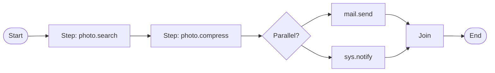
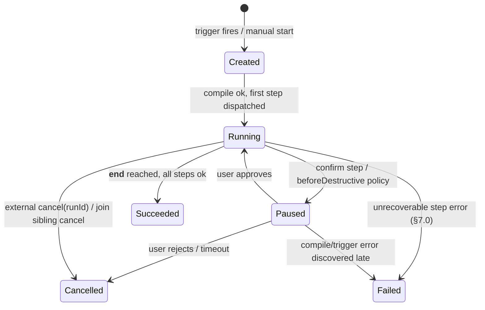

# MCOS 工作流引擎（Workflow Engine）

> **语言:** [English](../en/05-workflow.md) · 中文（当前）

> **状态:** Draft  
> **版本:** 0.1.0  
> **最后更新:** 2026-08-24  
> **依赖:** [02-command-protocol.md](./02-command-protocol.md), [03-runtime.md](./03-runtime.md)  
> **灵感来源:** Temporal · LangGraph · Claude Code 工具循环 —— 针对移动端约束做了适配

> ✅ **实现状态:** 工作流引擎**已实现**于 `mcos-runtime-core`（`workflow/WorkflowEngine`）——sequential / parallel（`cancelOnFailure`）/ if / loop / retry / try-补偿 / confirm，以及命名工作流存储与 JSON 解码——已接入 `McosRuntime`。状态见 [11-implementation-status.md](./11-implementation-status.md) §3。

---

## 1. 为什么需要工作流

单条命令是不够的：

```text
home.movie =
  lights dim  +  TV on  +  curtains close  +  AC set
  (parallel)
```

```text
photo share =
  search today → compress → mail.send
  (sequence + artifacts)
```

```text
Wi‑Fi Office connected → vpn.connect
  (event trigger)
```

工作流引擎负责编排**由命令协议调用组成的图（graphs of Command Protocol invocations）**，并提供控制流、重试和策略钩子。

### 1.1 引擎定位

工作流引擎是 **Runtime 的一个子组件**（[01 §6.3](./01-architecture.md)），位于包 `com.morainet.mcos.runtime.core.workflow`（[03 §3](./03-runtime.md)）。它**不是** [01 §9.2](./01-architecture.md) 中定义的 10 个流水线阶段之一，而是位于流水线**之上**。每个工作流步骤都是一次单独的命令调用，会重新进入流水线。

本文档负责图层面的事务（IR 形态、步骤类型、触发器、连接策略（join policy）、补偿、重试协调）。单命令层面的事务（解析、schema 校验、授权、执行）由 [02](./02-command-protocol.md) 和 [03](./03-runtime.md) 负责，本文档以交叉引用方式引用，不再重新定义。

### 1.2 编译期 / 运行期分离（compile-time / run-time separation）

这是引擎的核心架构决策。一个工作流会经过两个独立的阶段：

```text
ExecuteRequest(payload = WorkflowRef)
  │
  ▼
┌──────────────────────────────────────────────┐
│  Compile Pass  (at load / first invocation)   │
│  1. Parse body JSON → Step[] + Edge[]         │
│  2. Validate IR (unique ids, known step types)│
│  3. Canonicalize compact → explicit (§4.3)    │
│  4. Resolve step → CommandDescriptor refs     │
│     (Registry lookup, 03 §6)                  │
│  5. Cycle detection + build step index        │
│  6. Bind trigger subscription                 │
│  Output: CompiledWorkflow (frozen, hashable)  │
└──────────────────────────────────────────────┘
  │
  ▼
┌──────────────────────────────────────────────┐
│  Execute Pass  (per step, at run time)        │
│  Re-enters the 10-stage pipeline at:          │
│    Stage 6  Authorize  (per-step AuthStamp)   │
│    Stage 7  Schedule   (workflow queue)       │
│    Stage 8  Execute    (handler.invoke)       │
│    Stage 9  ValidateOutput                    │
│    Stage 10 Audit      (step-level events)    │
└──────────────────────────────────────────────┘
```

**为什么这样切分？**

- **编译阶段（compile pass）** 一次性完成昂贵且确定性的工作：解析不透明的 `WorkflowRef.body`（[03 §5.1](./03-runtime.md) —— Parser 层将其视为不透明的 `JsonObject`），把两种并行形式归一化为单一形式（[§4.3](#43-parallel-form-canonicalization)），将 command-id 解析为描述符引用，并对图做环检测。输出的 `CompiledWorkflow` 是冻结的，其哈希值即是审计记录的内容（[02 §7.5](./02-command-protocol.md) 指出 canonicalizer 会跳过工作流体 —— 规范化是本引擎的职责，在此处完成）。
- **执行阶段（execute pass）** 在 **Stage 6（Authorize）** 而非 Stage 1 处重新进入流水线。Stages 1–5（Parse、Canonicalize、Resolve、Expand、ValidateInput）在该步骤的描述符上已在编译期完成。每个步骤仍然各自走一遍 Authorize（每个步骤一个新的 `AuthStamp`，作为安全边界）、Schedule（准入到 `workflow` 队列，[01 §9.2](./01-architecture.md) Stage 7）、Execute、ValidateOutput 和 Audit。这正是 [03 §10](./03-runtime.md) 所说的“每个节点执行会重新进入 Permission Kernel + Executor”。

**序列语法糖（sequence sugar）**（多行 DSL，[02 §6.4](./02-command-protocol.md)）由 Parser 编译为 `ExecutionIr.Sequence`（[03 §5.1](./03-runtime.md)），引擎将其视为一个单边的平凡 `CompiledWorkflow` —— 没有单独的代码路径。

---

## 2. 设计目标

| 目标 | 说明 |
|------|-------------|
| 命令原生（Command-native） | 节点调用命令；不存在隐藏的旁路通道 |
| 移动端安全（Mobile-safe） | 支持取消、超时、感知电量的并发 |
| 可审计（Auditable） | 每次边转换都记录在 `RunId` 下 |
| 足够确定（Deterministic enough） | 可基于 IR 和记录的输入进行重放以供调试 |
| 对 LLM 友好（LLM-friendly） | 规划器输出 Workflow IR，而非私有胶水代码 |

非目标：

- 在 IR 中提供通用的图灵完备脚本能力  
- 跨厂商的精确一次（exactly-once）分布式事务  
- 替代 Android WorkManager 处理所有 OS 作业（我们可能会与其集成）

---

## 3. 概念模型



核心名词：

| 名词 | 含义 |
|------|---------|
| **Workflow**（工作流） | 命名的图定义 |
| **Run**（运行） | 一次执行实例 |
| **Step**（步骤） | 节点：调用 / 控制 / 等待 |
| **Edge**（边） | 带可选谓词的转换 |
| **Binding**（绑定） | 把输出传递给后续输入 |
| **Trigger**（触发器） | 手动 / 事件 / 调度 |

### 3.1 运行生命周期状态机

每个 Run（工作流的一次执行实例）都会经历如下状态机：



| 状态 | 进入条件 | 退出条件 | 可观察事件 |
|-------|-----------------|----------------|-------------------|
| **Created** | 触发器触发，或收到手动 `execute(WorkflowRef)` | 编译阶段成功 | `RunStarted`（[01 §11.5](./01-architecture.md)） |
| **Running** | 第一个步骤被派发至 Stage 6 | 到达 `__end__`、不可恢复错误、或取消 | 每个步骤的 `StepStarted` / `StepSucceeded` / `StepFailed` |
| **Paused** | 到达 `confirm` 步骤，或 `beforeDestructive`/`beforeNetwork` 确认策略闸住了一个 destructive/network 步骤 | 用户批准 → 恢复；用户拒绝或 confirm 超时 → Cancelled/Failed | `ConfirmationNeeded`（[01 §11.5](./01-architecture.md)） |
| **Succeeded** | 到达 `__end__`，所有步骤成功（连接策略满足） | —（终态） | `RunSucceeded` |
| **Failed** | 在耗尽 retry + onError + 连接策略后仍不可恢复（§7.0 决策树） | —（终态） | `RunFailed` |
| **Cancelled** | 外部 `cancel(runId)`（[03 §8.3](./03-runtime.md)）或 join 同级取消（§8） | —（终态） | `RunCancelled` |

**持久化（Persistence）。** MVP：Run 状态**仅在内存中** —— 进程死亡会丢失在途的 run。V1：每次状态转换追加到一份持久化运行日志中（重启时尽力重放；非精确一次）。特性门控参见 [§15](#15-mvp-vs-v1-feature-gate)。

---

## 4. Workflow IR（JSON）

### 4.0 规范化 Kotlin 类型

§4.1–4.2 中的 JSON 示例仅为示例；**规范（normative）**类型是以下 Kotlin data class。编译阶段（[§1.2](#12-compile-time--run-time-separation)）产出一个 `CompiledWorkflow`；JSON IR 是该阶段的输入。

```kotlin
package com.morainet.mcos.runtime.core.workflow

typealias StepId = String   // mirrors 01 §11.5

data class CompiledWorkflow(
    val id: String,                        // workflowId
    val version: String,                   // workflowVersion ("0.1")
    val trigger: Trigger?,                 // null = manual-only
    val steps: Map<StepId, Step>,          // explicit form only (after §4.3)
    val edges: List<Edge>,                 // includes implicit __start__/__end__ edges
    val join: JoinPolicy,                  // default join for the root graph
    val onFailure: WorkflowAction?,        // workflow-level fallback (§7.4)
    val confirmation: ConfirmationPolicy?, // workflow-level gate (§10)
    val meta: JsonObject,
) {
    val startStep: StepId get() = edges.first { it.from == "__start__" }.to
}

sealed class Step {
    abstract val id: StepId
    abstract val saveAs: String?           // key under __steps.<id>.value
    abstract val retry: RetryPolicy?
    abstract val compensate: WorkflowAction?  // step-level rollback (§7.3)
    abstract val requiresDevices: List<String> // IoT mutex (03 §8.5)

    data class Invoke(
        override val id: StepId,
        val command: String,               // command id, resolved to descriptor at compile
        val args: JsonObject,              // may contain $ref / $input bindings (§6)
        override val saveAs: String? = null,
        override val retry: RetryPolicy? = null,
        override val compensate: WorkflowAction? = null,
        override val requiresDevices: List<String> = emptyList(),
        val timeoutMs: Long? = null,       // overrides descriptor.timeoutMs
    ) : Step()

    data class Parallel(
        override val id: StepId,
        val children: List<StepId>,        // explicit form; §4.3 canonicalizes compact → this
        val join: JoinPolicy = JoinPolicy.All,
        override val saveAs: String? = null,
        override val retry: RetryPolicy? = null,
        override val compensate: WorkflowAction? = null,
        override val requiresDevices: List<String> = emptyList(),
    ) : Step()

    data class If(
        override val id: StepId,
        val predicate: JsonObject,         // §5.9 predicate language
        val thenStep: StepId,
        val elseStep: StepId?,
        override val saveAs: String? = null,
        override val retry: RetryPolicy? = null,
        override val compensate: WorkflowAction? = null,
        override val requiresDevices: List<String> = emptyList(),
    ) : Step()

    data class Switch(
        override val id: StepId,
        val on: String,                    // $ref path to the discriminant value
        val cases: Map<String, StepId>,    // value → target step
        val default: StepId?,
        override val saveAs: String? = null,
        override val retry: RetryPolicy? = null,
        override val compensate: WorkflowAction? = null,
        override val requiresDevices: List<String> = emptyList(),
    ) : Step()

    data class Loop(
        override val id: StepId,
        val mode: LoopMode,                // Over / While
        val over: String?,                 // $ref path to a list (mode = Over)
        val as_: String?,                  // binding name for current element (`as` is a Kotlin keyword)
        val while_: JsonObject?,           // predicate (mode = While)
        val body: StepId,                  // step to run per iteration
        val maxIterations: Int,            // mandatory (§5.2)
        override val saveAs: String? = null,
        override val retry: RetryPolicy? = null,
        override val compensate: WorkflowAction? = null,
        override val requiresDevices: List<String> = emptyList(),
    ) : Step()

    data class WaitEvent(
        override val id: StepId,
        val filter: JsonObject,            // event filter (07 §13 for $memory usage)
        val timeoutMs: Long,
        override val saveAs: String? = null,
        override val retry: RetryPolicy? = null,
        override val compensate: WorkflowAction? = null,
        override val requiresDevices: List<String> = emptyList(),
    ) : Step()

    data class WaitDelay(
        override val id: StepId,
        val durationMs: Long,
        override val saveAs: String? = null,
        override val retry: RetryPolicy? = null,
        override val compensate: WorkflowAction? = null,
        override val requiresDevices: List<String> = emptyList(),
    ) : Step()

    data class Confirm(
        override val id: StepId,
        val prompt: String,                // may contain $ref interpolation
        val thenStep: StepId,              // resumed after user approves
        override val saveAs: String? = null,
        override val retry: RetryPolicy? = null,
        override val compensate: WorkflowAction? = null,
        override val requiresDevices: List<String> = emptyList(),
    ) : Step()

    data class Noop(
        override val id: StepId,
        override val saveAs: String? = null,
        override val retry: RetryPolicy? = null,
        override val compensate: WorkflowAction? = null,
        override val requiresDevices: List<String> = emptyList(),
    ) : Step()
}

data class Edge(
    val from: StepId,                      // "__start__" for entry
    val to: StepId,                        // "__end__" for exit
    val onError: List<String>? = null,     // error codes that trigger this edge (§7.2)
)

enum class LoopMode { OVER, WHILE }

enum class JoinPolicy {                    // §8
    ALL,              // wait for all children; fail if any fail (default)
    ALL_OK_CONTINUE,  // fail-fast: cancel siblings on first failure
    ANY,              // first success cancels siblings
    QUORUM,           // N successes needed (details in §8)
}

data class RetryPolicy(                    // §7.1
    val maxAttempts: Int,
    val backoffMs: List<Long>,             // one per retry attempt; last repeats
    val retryOn: List<String>,             // McosErrorCode names (01 §15.1)
    val forceRetry: Boolean = false,       // override idempotency gate
)

data class WorkflowAction(                 // a single command invocation used by compensate/onFailure
    val command: String,
    val args: JsonObject,
)

data class ConfirmationPolicy(             // §10
    val beforeDestructive: Boolean = true,
    val beforeNetwork: Boolean = false,
    val previewPlan: Boolean = true,
)

sealed class Trigger {                     // §9
    data class Manual(val source: String? = null, val inputs: List<String> = emptyList()) : Trigger()
    data class Event(val filter: JsonObject) : Trigger()
    data class Schedule(val cron: String, val tz: String, val misfirePolicy: String = "skip") : Trigger()
}
```

**类型来源。** `StepId` 对应 [01 §11.5](./01-architecture.md)。`RunId` 在那里定义并在此原样复用。`requiresDevices` 是 [03 §8.5](./03-runtime.md) 中首次规定的逐步骤 IoT 互斥字段。`RetryPolicy.retryOn` 中的 `McosErrorCode` 名称引用 [01 §15.1](./01-architecture.md) 中的枚举。

### 4.1 最小序列

```json
{
  "workflowVersion": "0.1",
  "id": "wf_photo_share",
  "name": "Compress today's photos and mail",
  "steps": [
    {
      "id": "s1",
      "type": "invoke",
      "command": "photo.search",
      "args": { "date": "today" },
      "saveAs": "photos"
    },
    {
      "id": "s2",
      "type": "invoke",
      "command": "photo.compress",
      "args": {
        "quality": 80,
        "uris": { "$ref": "photos.value.uris" }
      },
      "saveAs": "compressed"
    },
    {
      "id": "s3",
      "type": "invoke",
      "command": "mail.send",
      "args": {
        "to": "Tom",
        "subject": "Photos",
        "attachments": { "$ref": "compressed.value.uris" }
      }
    }
  ],
  "edges": [
    { "from": "s1", "to": "s2" },
    { "from": "s2", "to": "s3" }
  ]
}
```

如果省略 `edges` 且 `steps` 是数组，引擎会将其解释为**隐式序列（implicit sequence）**。

### 4.2 并行扇出

```json
{
  "id": "wf_home_movie",
  "steps": [
    { "id": "lights", "type": "invoke", "command": "home.light.dim", "args": { "id": "living", "level": 20 } },
    { "id": "tv", "type": "invoke", "command": "home.tv.on", "args": { "id": "living-tv" } },
    { "id": "curtain", "type": "invoke", "command": "home.curtain.close", "args": { "id": "living" } },
    { "id": "ac", "type": "invoke", "command": "iot.ac.set", "args": { "name": "air-condition", "tempC": 26 } },
    { "id": "fork", "type": "parallel", "children": ["lights", "tv", "curtain", "ac"] }
  ],
  "edges": [
    { "from": "__start__", "to": "fork" }
  ]
}
```

另一种紧凑形式：

```json
{
  "type": "parallel",
  "steps": [
    { "command": "home.light.dim", "args": { "id": "living", "level": 20 } },
    { "command": "home.tv.on", "args": { "id": "living-tv" } },
    { "command": "home.curtain.close", "args": { "id": "living" } },
    { "command": "iot.ac.set", "args": { "name": "air-condition", "tempC": 26 } }
  ]
}
```

### 4.3 并行形式规范化

上面两种形式在**语义上等价**。编译阶段（[§1.2](#12-compile-time--run-time-separation)）把紧凑形式规范化为显式形式，因此执行阶段只会看到显式形式。这遵循标准的编译器模式 —— 把语法糖归一化为单一的规范表示（参见 SQL 优化器、正则 AST 规范化）。

**规范化算法**（规范伪代码）：

```text
canonicalizeParallel(compactStep):
    let parentId = compactStep.id ?: syntheticId()
    let childIds = []
    for each innerStep in compactStep.steps:
        let childId = innerStep.id ?: syntheticId()
        childIds.add(childId)
        emit Step(innerStep with id = childId)        # hoist into steps[]
        emit Edge(parentId, childId)                   # implicit fan-out edge
        emit Edge(childId, parentId + "__join")        # implicit fan-in edge
    emit Step.Parallel(id = parentId, children = childIds, join = compactStep.join ?: ALL)
```

**规则：**

1. 紧凑形式的内部 `steps[]` 被提升（hoist）进工作流的顶层 `steps` 映射；若未提供 id，则合成一个。
2. 为每个子节点生成隐式的 `__start__`→parent 与 parent→`__join__` 边。
3. 规范化之后，`CompiledWorkflow.steps` **只**包含显式形式的 `Step.Parallel` 条目（带 `children: List<StepId>`）；执行阶段在运行期遇到任何紧凑形式的 parallel 都会以 `WORKFLOW_INVALID` 拒绝。
4. [02 §7.5](./02-command-protocol.md) 明确不在 Parser 层对工作流体做规范化 —— 此规范化是工作流引擎的职责，在编译期完成。

---

## 5. 步骤类型

| 类型 | 用途 |
|------|---------|
| `invoke` | 调用一个命令 |
| `parallel` | 并发运行子节点；带 join 策略 |
| `if` | 条件分支 |
| `switch` | 多路分支 |
| `loop` | 有界迭代 |
| `wait_event` | 暂停直到匹配事件总线（Event Bus）或超时 |
| `wait_delay` | 休眠指定时长 |
| `confirm` | 强制用户确认闸门 |
| `compensate` | 注册撤销路径 |
| `noop` | 占位符 |

### 5.0 `invoke` —— 字段参考

`invoke` 是唯一真正调用命令的步骤类型。其余所有步骤类型都是控制流。

| 字段 | 类型 | 必填 | 默认值 | 约束 |
|-------|------|----------|---------|------------|
| `id` | string | yes | — | 在工作流内唯一 |
| `type` | `"invoke"` | yes | — | — |
| `command` | string | yes | — | 命令 id；在编译期解析为描述符（§1.2） |
| `args` | object | no | `{}` | 可含 `$ref`/`$input` 绑定（§6）；在执行期解析 |
| `saveAs` | string | no | `null` | 输出存储在 `__steps.<id>.value` 下的键 |
| `retry` | object | no | `null` | `RetryPolicy`（§7.1） |
| `compensate` | object | no | `null` | 步骤级回滚动作（§7.3） |
| `requiresDevices` | string[] | no | `[]` | IoT 设备互斥键（[03 §8.5](./03-runtime.md)） |
| `timeoutMs` | integer | no | 描述符的 `timeoutMs` | 范围 1000–300000 |

### 5.1 `if`

```json
{
  "id": "check",
  "type": "if",
  "predicate": { "$eq": [ { "$ref": "battery.value.percent" }, { "$lt": 20 } ] },
  "then": "enable_saver",
  "else": "skip"
}
```

谓词语言刻意保持精简（类 JSONLogic 的子集）。**不支持任意 JS。**

### 5.2 `loop`

```json
{
  "type": "loop",
  "over": { "$ref": "photos.value.uris" },
  "as": "uri",
  "maxIterations": 50,
  "body": {
    "type": "invoke",
    "command": "photo.compress",
    "args": { "quality": 80, "uris": [{ "$ref": "uri" }] }
  }
}
```

`maxIterations` 是必填项。

### 5.3 `wait_event`

```json
{
  "type": "wait_event",
  "filter": { "type": "connectivity.wifi.connected", "where": { "ssid": "Office" } },
  "timeoutMs": 3600000
}
```

以一个 filter 订阅 EventBus（[03 §11](./03-runtime.md)）。该步骤会挂起，直到匹配的事件到达或 `timeoutMs` 到期（→ `TIMEOUT`）。若设置了 `saveAs`，匹配到的事件 payload 会保存到 `__steps.<id>.value`。`wait_event` 拥有自己的专用队列，因此在挂起期间不会占用 Scheduler 槽位（[03 §11.4](./03-runtime.md)）。

### 5.4 `switch`

```json
{
  "id": "route",
  "type": "switch",
  "on": { "$ref": "__input.intent" },
  "cases": {
    "share": "do_share",
    "save": "do_save",
    "print": "do_print"
  },
  "default": "do_nothing"
}
```

多路分支。`on` 是指向判别值的 `$ref` 路径。引擎将值与 `cases` 的键做匹配（字符串相等）；若无一匹配且设置了 `default`，控制流转移到 `default`；若没有 `default`，则该步骤是一个 no-op，控制流转移到下一条边。

### 5.5 `wait_delay`

```json
{
  "id": "cooldown",
  "type": "wait_delay",
  "durationMs": 5000
}
```

挂起固定时长。与 `wait_event`（等待外部事件）不同，`wait_delay` 是一个纯定时器。`durationMs` 范围：1000–86400000（24 小时）。对于在 Android 上的长延迟（> 60 s），引擎 SHOULD 使用 `AlarmManager` 以保持 Doze 合规，而不是持有 wakelock。该延迟**不是**重试退避 —— 那种用途请使用 `retry`（[§7.1](#71-per-step-retry)）。

### 5.6 `noop`

```json
{
  "id": "checkpoint",
  "type": "noop"
}
```

什么都不做。用途：作为多条入边的显式 join 节点；调试断点（引擎可在此单步）；或作为 `onError` 边在汇聚到 `__end__` 之前的稳定锚点。

### 5.7 `confirm`

```json
{
  "id": "ask_user",
  "type": "confirm",
  "prompt": "Send {{__steps.photos.value.count}} photos to Tom?",
  "then": "do_send"
}
```

在工作流中途强制一个用户确认闸门。运行进入 `Paused` 状态（[§3.1](#31-run-lifecycle-state-machine)）并发出 `ConfirmationNeeded`。若用户批准，控制流转移到 `then`；若用户拒绝或确认超时（默认 120 s），运行转移到 `Cancelled`。这与工作流级别的 `ConfirmationPolicy`（[§10](#10-confirmation-integration)）不同 —— 后者在没有显式步骤的情况下，自动在 destructive/network 步骤之前插入闸门。

**字段名：** 提示文本字段为 `prompt`（不是 `message`）。Planner 和 UI 必须使用 `prompt`。在 `prompt` 字符串内部，支持 `{{__steps.<id>.value.<path>}}` 插值用于人类可读的展示（[§6.0](#60-ref-path-grammar)）；对于 `args` 绑定，使用 `$ref` 对象形式，而非 `{{...}}`。

### 5.8 `compensate`（步骤级回滚 —— 与 `onFailure` 的关系）

这**不是独立的步骤类型** —— 它是在任意 `invoke` 步骤上声明的一个字段。完整语义见 [§7.3](#73-compensation-step-level)。概要：`compensate` 是一个 `WorkflowAction`（command + args），引擎在该步骤成功时将其记录下来，并在运行失败时按逆序执行。工作流级别的 `onFailure`（[§7.4](#74-onfailure-workflow-level)）是一个单一回退动作，在整个运行失败时运行一次 —— 二者的对比表见 §7.4。

### 5.9 谓词语言

`if.predicate`、`loop.while` 与 `switch` 的匹配使用一种刻意精简的、类 JSONLogic 的语言。**没有任意表达式、没有字符串插值、没有 `$eval`。** 这使求值保持安全（无注入面）且确定。

| 运算符 | 形式 | 语义 |
|----------|------|-----------|
| `$eq` | `{ "$eq": [a, b] }` | 深相等（JSON 值比较） |
| `$ne` | `{ "$ne": [a, b] }` | `$eq` 的否定 |
| `$lt` / `$lte` / `$gt` / `$gte` | `{ "$lt": [a, b] }` | 数值或字典序字符串比较 |
| `$in` | `{ "$in": [a, list] }` | `a` 是 `list` 的成员 |
| `$not` | `{ "$not": expr }` | 逻辑否定 |
| `$and` | `{ "$and": [expr, expr, ...] }` | 全为真 → 真 |
| `$or` | `{ "$or": [expr, expr, ...] }` | 任一为真 → 真 |
| `$ref` | `{ "$ref": "path" }` | 解析为 `path` 处的值（§6） |
| `$exists` | `{ "$exists": "path" }` | 若 `path` 解析到非 null 值则为真 |

**类型规则：**

1. 比较运算符（`$lt`、`$gt` 等）要求两个操作数是同一 JSON 类型（同为 number，或同为 string）。若类型不同，谓词求值为 **`false`** —— 它**不会**抛错。这使得谓词对于某条路径可能解析为 `null` 的可选绑定是安全的。
2. `$eq`/`$ne` 接受任意 JSON 类型；跨类型比较（如 number vs string）对 `$eq` 总是返回 `false`。
3. `$ref` 指向缺失路径时解析为 `null`；比较中的 `null` 操作数按规则 1 求值为 `false`。
4. `$exists` 是显式检查某条路径能否解析，再用到 `$eq` 等中的方式。

**安全性：** 刻意没有 `$eval`、没有算术运算符（`$add`、`$concat`），也没有函数调用机制。谓词是对运行作用域状态映射的纯值比较。这防止了来自 Planner 产生（[06](./06-agent.md)）或 memory 取值（[07](./07-memory.md)）流入谓词的值的注入。

---

## 6. 数据绑定

### 6.0 `$ref` 路径文法

`$ref` 路径寻址运行作用域状态映射中的一个值。文法（规范）：

```text
path     ::= source? ( "." segment )+
source   ::= "__context" | "__input" | "__memory" | "__steps"
segment  ::= [a-zA-Z0-9_]+
```

| 源（Source） | 寻址内容 | 示例 |
|--------|-------------------|---------|
| `__context` | 运行上下文：`user.locale`、`user.timezone`、`device.id` | `__context.user.locale` |
| `__input` | 运行启动时传入的输入（来自触发器或手动调用） | `__input.recipient` |
| `__memory` | 长期记忆（只读视图，[07 §13](./07-memory.md)） | `__memory.places.defaultCity` |
| `__steps` | 先前步骤的输出（通过 `saveAs`） | `__steps.photos.value.uris` |
| *（无 source）* | 简写：先尝试 `__steps`，再尝试 `__input` | `photos.value.uris` |

**缺失路径行为：**

- `$ref` 指向不存在的路径时解析为 `null`。
- 在**绑定**上下文中（如 `args: { "to": { "$ref": "missing.path" } }`），`null` 解析会流入命令的 `inputSchema` 校验（Stage 5）；若该字段是必填的，步骤以 `SCHEMA_VIOLATION` 失败。
- 在**谓词**上下文中（[§5.9](#59-predicate-language)），`null` 操作数使比较求值为 `false`（不报错）。
- `$exists: "path"` 在使用某值之前显式检查其可解析性。

### 6.1 `$ref`

引用先前步骤的输出或运行上下文。简写形式（不带 `__source` 前缀）先解析 `__steps`，再解析 `__input`：

```text
photos.value.uris              # __steps.photos.value.uris
__context.user.locale          # run context
__memory.home.office.ssid      # long-term memory (read-only)
__input.recipient              # run input parameter
```

**解析算法：**

```text
resolveRef(path, stateMap):
    if path starts with "__": return stateMap[path]  # fully-qualified
    # shorthand: try __steps, then __input
    let s = stateMap["__steps." + path]; if s != null: return s
    let i = stateMap["__input." + path]; if i != null: return i
    return null
```

### 6.2 `$input`

启动时（由触发器或手动 `execute` 调用）提供的工作流参数。整个输入对象可通过 `__input.*` 访问：

```json
{
  "command": "mail.send",
  "args": { "to": { "$ref": "__input.recipient" } }
}
```

对于事件触发的工作流，`__input` 是匹配到的事件 payload。对于调度触发的工作流，`__input` 为空（工作流在运行期从 memory 或命令中读取时间敏感的数据）。

### 6.3 制品传递

步骤输出存储在运行作用域状态映射的 `__steps.<stepId>.value` 下。对于大型媒体（照片、音频），步骤 **SHOULD** 返回 `content://` / `file://` URI，而非 base64 编码的字节（[04 §7.3](./04-plugin-sdk.md)）；引擎原样透传 URI，不会把字节拷进状态映射。这保证了对串联媒体产出步骤的工作流内存有界。

### 6.4 三种 ref-token 的区分

MCOS 有三种重叠但不同的引用机制。它们运行在不同层面、服务于不同目的：

| Token | 层 | 定义处 | 引用什么 |
|-------|-------|---------------|--------------------|
| `$ref` | 工作流 IR 绑定（本文档，§6.0） | 05 §6 | 步骤输出、运行上下文、运行输入、memory —— 由工作流引擎在执行期解析 |
| `$memory` | 事件 filter 简写 | [07 §13](./07-memory.md) | `trigger.filter.where` 内的 memory 路径 —— 在触发器 arm/fire 时解析 |
| `x-mcos-ref` | 命令参数 schema 扩展 | [02 §5.3](./02-command-protocol.md), [03 §9.2 Stage 4](./03-runtime.md) | 命令 `inputSchema` 中由 memory 支持的默认值 —— 由 Runtime 的 Expand 阶段为单命令调用解析 |

**何时使用哪一种：**

- 编写需要先前步骤输出的工作流步骤 `args` → `$ref`（本节）。
- 编写匹配某个已存储 memory 值的事件触发器 filter → `$memory`（07 §13）。
- 编写某参数具有 memory 支持默认值（如 `places.defaultCity`）的命令描述符 → 在 `inputSchema` 中使用 `x-mcos-default-from-memory`（02 §5.3）。

工作流 args 中对 `__memory.*` 的 `$ref` 是 `x-mcos-ref` 在工作流层的等价物，但由引擎而非 Expand 阶段解析 —— 两者互不交互。

---

## 7. 重试与错误处理

### 7.0 错误处理决策树

当某步骤的执行（Stage 8）产生错误时，引擎按**固定优先级顺序**评估四种机制。这解决了此前 retry、on-error 边、连接策略与补偿之间未明确的交互：

```text
step throws McosException / returns Err
  │
  ├─ 1. Retry (§7.1)?
  │     retryOn matches the error code AND attempts < maxAttempts
  │     AND (descriptor.idempotent == true OR forceRetry == true)?
  │     → YES: wait backoffMs, re-execute step. Loop.
  │     → NO (exhausted or not retryable): fall through
  │
  ├─ 2. On-Error edge (§7.2)?
  │     Does an outgoing edge from this step have onError containing
  │     the error code (or "*")?
  │     → YES: jump to the edge's target step. Run continues.
  │     → NO: fall through
  │
  ├─ 3. Join policy (§8)?
  │     Is this step a child of a parallel node?
  │     → ALL: record failure, continue waiting for siblings;
  │             after all complete, if any failed → JOIN_FAILED
  │     → ALL_OK_CONTINUE: cancel in-flight siblings → JOIN_FAILED
  │     → ANY: record failure; if another sibling already succeeded,
  │             this is absorbed; if all siblings failed → JOIN_FAILED
  │     → QUORUM:N: record failure; if success count can't reach N → JOIN_FAILED
  │     If not in a parallel → fall through
  │
  └─ 4. Run failure (terminal)
        Transition run to Failed (§3.1):
        a. Execute onFailure (workflow-level, §7.4) once if declared
        b. Execute step-level compensate (§7.3) for all already-succeeded
           steps that declared compensate, in reverse execution order
        c. Best-effort: compensate failures → COMPENSATION_FAILED (audited,
           does not block run termination)
        d. Emit RunFailed with the originating error code
```

**关键原则：** retry 与 on-error 边是**步骤局部恢复**（运行继续）；连接策略失败以及没有任何恢复机制则把运行转移到**终态失败**（触发补偿）。一个既没有 retry、也没有 on-error 边、且不受宽松连接策略庇护的步骤，会在首个错误上令运行失败。

### 7.1 单步重试

```json
{
  "command": "iot.ac.set",
  "args": { "name": "air-condition", "power": true },
  "retry": {
    "maxAttempts": 3,
    "backoffMs": [500, 2000, 5000],
    "retryOn": ["UNAVAILABLE", "TIMEOUT"]
  }
}
```

| 字段 | 类型 | 必填 | 默认值 | 约束 |
|-------|------|----------|---------|------------|
| `maxAttempts` | integer | yes | — | 范围 1–10（含首次尝试） |
| `backoffMs` | integer[] | yes | — | 每次重试一个条目；若少于 `maxAttempts-1`，则最后一个值重复 |
| `retryOn` | string[] | yes | — | `McosErrorCode` 名称（[01 §15.1](./01-architecture.md)）。常见：`TIMEOUT`、`UNAVAILABLE`、`RATE_LIMITED` |
| `forceRetry` | boolean | no | `false` | 覆盖幂等性闸门（留有审计） |

**幂等性闸门（idempotency gate）**（[02 §9.4](./02-command-protocol.md)，[04](./04-plugin-sdk.md) 描述符的 `idempotent` 字段）：若描述符声明 `idempotent: false`（或未声明），引擎 **MUST NOT** 重试，除非设置了 `forceRetry: true`。在非幂等命令上的 `forceRetry: true` 会以警告级别审计，便于企业策略复核。若省略，默认 `retryOn` 为 `["TIMEOUT", "UNAVAILABLE", "RATE_LIMITED"]` —— 即 `McosErrorCode` 枚举中标记为 `retryableDefault: true` 的代码。

### 7.2 出错边（On-Error Edges）

```json
{ "from": "s2", "to": "s2_fallback", "onError": ["PLUGIN_ERROR", "UNAVAILABLE"] }
```

带 `onError` 列表的边是**恢复边**：当源步骤以列表中的代码失败时，控制流转移到目标步骤，而不进入连接策略 / 补偿路径。`onError: ["*"]` 匹配任意错误代码。

**与 retry 的交互：** on-error 边**仅在 retry 耗尽后**才评估（依据 §7.0 决策树）。同时带有 `retry` 与 on-error 边的步骤会先重试；只有当重试耗尽后，on-error 边才会激活。

### 7.3 补偿（步骤级）

```json
{
  "id": "pay",
  "type": "invoke",
  "command": "wallet.hold",
  "saveAs": "pay",
  "compensate": {
    "command": "wallet.release",
    "args": { "holdId": { "$ref": "__steps.pay.value.holdId" } }
  }
}
```

**`compensate` 是步骤上的一个字段**（不是步骤类型）。它声明了该步骤所产生副作用的回滚动作。语义：

1. 当带 `compensate` 的步骤**成功**时，引擎把 `(stepId, compensateAction)` 记录到运行的补偿栈中。
2. 当运行转移到 **Failed**（在 retry + on-error + join 全部耗尽之后，依据 §7.0），引擎按**逆执行顺序**弹出补偿栈，并将每个记录的 `compensate` 动作作为一次新的 invoke 执行（重新进入 Stage 6–10）。
3. 补偿是**尽力（best-effort）**的：自身失败的补偿步骤会抛出 `COMPENSATION_FAILED`（留有审计），引擎继续栈中下一个补偿。补偿失败**不会**改变运行的终态 —— 它已经是 `Failed`。
4. `compensate.args` 可用 `$ref` 引用该步骤自身保存的输出（如上所示），从而回滚动作知道要撤销什么。

**作用域：** `compensate` 是逐步骤的 —— 撤销一个步骤的副作用。对照 `onFailure`（[§7.4](#74-onfailure-workflow-level)），后者是逐工作流的。

### 7.4 `onFailure`（工作流级）

```json
{
  "id": "wf_checkout",
  "onFailure": {
    "command": "notify.user",
    "args": { "message": "Checkout workflow failed; partial changes may need manual review." }
  }
}
```

**`onFailure` 是 `CompiledWorkflow` 根上的一个字段**（不在步骤上）。它声明一个单一回退动作，在整个运行转移到 Failed 时**运行一次**。语义：

1. `onFailure` 在步骤级补偿**之前**运行（依据 §7.0 决策树 step 4a → 4b）。
2. 每个运行恰好运行一次，无论多少步骤失败。
3. 它通常是通知（“工作流失败，需要复核”），而非回滚 —— 针对性的撤销请用步骤级 `compensate`。

**`compensate` vs `onFailure` —— 对比：**

| 维度 | `compensate`（步骤级） | `onFailure`（工作流级） |
|--------|---------------------------|------------------------------|
| 声明在 | 单个 `invoke` 步骤 | `CompiledWorkflow` 根 |
| 何时运行 | 运行失败后，对每个已声明且已成功的步骤，按逆序 | 运行失败后，一次 |
| 目的 | 针对性撤销某步骤的副作用 | 全局回退 / 通知 |
| 失败代码 | `COMPENSATION_FAILED`（逐步骤，非阻塞） | `onFailure` 动作自身的失败会被审计但非阻塞 |
| 与 [02 §9.6](./02-command-protocol.md) `onFailure` 的关系 | — | 同一概念；02 §9.6 用 `onFailure` 指工作流级字段，05 §7.3 用 `compensate` 指步骤级字段。两个名称并存，作用域不同。 |

### 7.5 工作流错误代码

五个工作流专用错误代码在 [01 §15.1](./01-architecture.md) 中是规范的（所有 `McosErrorCode` 值的唯一真相来源）。本节列出其 `details` schema，符合 [02 §8.3](./02-command-protocol.md) 的形状 B（带结构化详情的运行期错误）：

| 代码 | `details` 字段 | 何时 |
|------|------------------|------|
| `WORKFLOW_INVALID` | `stepId?: string`, `reason: string` | 编译期 IR 校验失败 |
| `MAX_ITERATIONS_EXCEEDED` | `stepId: string`, `limit: int` | `loop` 触达 `maxIterations` 仍未退出 |
| `COMPENSATION_FAILED` | `stepId: string`, `innerError: object`（补偿步骤的错误） | 某 `compensate` 动作失败 |
| `JOIN_FAILED` | `stepId: string`（parallel 节点 id）, `failedChildren: string[]`（失败的子步骤 id） | 连接策略不可满足 |
| `TRIGGER_MISFIRE` | `triggerId: string`, `scheduledAt: string`（ISO-8601） | 调度触发器错过其窗口 |

---

## 8. Join 策略（并行）

`parallel` 步骤声明一个 `join` 策略，决定 fan-out 何时视为“完成”以及同级取消如何传播。策略附在 `Step.Parallel` 节点上（见 [§4.0](#40-normative-kotlin-types)）：

```json
{
  "id": "fan_out",
  "type": "parallel",
  "children": ["s1", "s2", "s3"],
  "join": "all"
}
```

| 策略 | 成功条件 | 失败条件 | 失败时对同级的取消 |
|--------|-------------------|-------------------|---------------------------------|
| `all`（默认） | 全部子步骤成功 | 任一子步骤失败（在 retry + on-error 耗尽后） | **无** —— 同级继续；失败被记录用于 join 评估 |
| `all_ok_continue` | 全部子步骤成功 | 任一子步骤失败 | **立即** —— 取消所有在途同级，随后 `JOIN_FAILED` |
| `any` | 首个子步骤成功 | 全部子步骤失败 | 首次成功时：取消其余同级。全部失败时：`JOIN_FAILED` |
| `quorum:N` | N 个子步骤成功（如 `quorum:2`） | 无法达到 N 个成功（剩余 < 所需） | 达到 N 时：取消其余。无法达到时：取消其余 → `JOIN_FAILED` |

**同级取消机制。** 取消是协作式的（[04 §7.4](./04-plugin-sdk.md)）：引擎在每个同级上调用 `handler.cancel(ctx)`，最多等待 `cancelGraceMs`（默认 2000 ms），随后强制取消协程。处于 `wait_event` 的同级会释放其 EventBus 订阅。持有 IoT 设备互斥（[03 §8.5](./03-runtime.md)）的同级在取消时释放。`expedited` Scheduler 队列（[01 §9.2](./01-architecture.md) Stage 7）以高优先级处理取消派发。

**并发准入。** parallel 节点的子节点共享父 run 的 Scheduler 配额 —— 它们不获得独立槽位。若 run 已持有一个槽位，其子节点在全局上限 4（[01 §9.2](./01-architecture.md) Stage 7）内竞争。一个含 4 个子节点、而系统已在运行另外 3 个 run 的 parallel 节点会随着槽位释放增量地准入子节点；超配的子节点以 `RATE_LIMITED` 退避等待，而非被拒绝。

**`quorum:N` 细节。** `N` 是策略字符串中的整数字面量（如 `"quorum:2"`）。它必须满足 `1 ≤ N ≤ children.size`。若 N 无法解析或越界，编译阶段以 `WORKFLOW_INVALID` 拒绝该工作流。

---

## 9. 触发器（Triggers）

触发器定义工作流如何启动。不带 `trigger` 字段的工作流是**仅手动（manual-only）**。三种触发器类型对应 [§4.0](#40-normative-kotlin-types) 中的 `Trigger` sealed class。

### 9.1 手动

```json
{
  "trigger": {
    "type": "manual",
    "inputs": ["recipient", "message"]
  }
}
```

手动触发器由显式的 `execute(WorkflowRef, inputs)` 调用启动。入口点：CLI、Chat、API 或 Voice（见 §9.4）。`inputs` 数组声明调用方必须提供的输入参数名；在运行期这些会填充 `__input.*`（[§6.2](#62-input)）。

### 9.2 事件

```json
{
  "trigger": {
    "type": "event",
    "filter": {
      "type": "connectivity.wifi.connected",
      "where": { "ssid": "Office" }
    }
  },
  "steps": [
    { "command": "vpn.connect", "args": { "profile": "office" } }
  ]
}
```

事件触发器以一个 `filter` 订阅 EventBus（[03 §11](./03-runtime.md)）。`where` 子句支持字面量值与 `$memory` 引用（[07 §13](./07-memory.md)）：

```json
"where": { "ssid": { "$memory": "places.office.wifiSsids" } }
```

**arming 期 vs fire 期解析。** filter 中的 memory 值可在两个时点解析：
- **arming 期**（默认）：memory 在触发器订阅创建时（工作流安装 / Runtime 启动）读取一次。匹配更快，但在重新 arm 之前不会感知 memory 变化。
- **fire 期**：memory 在事件到达时、匹配之前读取。较慢（每个事件一次 memory 读）但始终最新。

触发器声明 `"resolveMemory": "fire"` 或 `"resolveMemory": "arm"`（默认 `"arm"`）。对很少变化的值（办公室 Wi-Fi SSID），首选 arming 期；对频繁变化的值（电量阈值），首选 fire 期。

> ✅ **As-built（事件触发器已交付）：** `WorkflowJson.specFromJson` 将 `trigger` 信封解析为 `WorkflowSpec(trigger, step)`；`EventTriggerManager.arm()` 在 EventBus 上订阅，`McosRuntime.armTrigger(workflowId, preAuthorized)` / `disarmTrigger` / `armedTriggers()` 对外暴露。落地语义：**`filter.type` 映射为订阅的 `typePrefix`** —— 按 [03 §11.4](./03-runtime.md) 前缀匹配，`"wifi.connected"` 也能匹配 `"wifi.connected.5g"`。**数组型 memory 引用按成员资格匹配**（事件值 ∈ 存储列表 —— 即上面 `wifiSsids` 的用例）。解析时缺失的 `$memory` 路径仅使 filter **不匹配**（审计 `warn`，非错误；[07 §13.1](./07-memory.md)）；`resolveMemory: "arm"` 下缺失路径 arm 一个永不匹配的哨兵值，`"fire"` 下跳过该事件。触发受 `maxBackgroundFiresPerHour`（默认 20，[08 §10.0](./08-security.md)）限流，审计为 `workflow.trigger_fired`；事件载荷成为 `__input`（[§6.2](#62-input)），每个步骤以 source `EVENT` 运行，适用更严的确认矩阵（[08 §4.0](./08-security.md)）。预授权 arm（`armTrigger(..., preAuthorized = true)`，[§10](#10-确认集成confirmation-integration)）为运行铸造一枚覆盖 read/write 步权限的 `AuthStamp` 使其静默执行，而 network/destructive 步仍会弹确认。Android 市场向导在安装时即以预授权方式 arm 事件配方（向导即同意时刻），卸载其依赖的插件时 disarm。`sys.event.emit {type, payload}`（[04 §17](./04-plugin-sdk.md)）是发射演示事件的参考命令。

### 9.3 调度（Schedule）

```json
{
  "trigger": {
    "type": "schedule",
    "cron": "0 23 * * *",
    "tz": "Asia/Shanghai",
    "misfirePolicy": "fire-and-forget-if-window"
  },
  "steps": [
    { "command": "home.scene.sleep", "args": {} }
  ]
}
```

| 字段 | 类型 | 必填 | 默认值 | 约束 |
|-------|------|----------|---------|------------|
| `cron` | string | yes | — | 标准 5 字段 cron，用户本地时区 |
| `tz` | string | yes | — | IANA 时区（如 `Asia/Shanghai`） |
| `misfirePolicy` | enum | no | `"skip"` | 取一：`skip`、`fire-and-forget`、`fire-and-forget-if-window` |

**misfire 策略：**

| 策略 | 行为 |
|--------|----------|
| `skip`（默认） | 若错过了调度时间（Doze、设备关机），则完全跳过。下一次运行在下一个调度时间。 |
| `fire-and-forget` | 唤醒时立即触发，无论迟到多久。若错过了多次可能造成背靠背的运行（仅最新一次触发）。 |
| `fire-and-forget-if-window` | 仅当唤醒时仍在同一 cron 窗口内才触发（如对每小时 cron，若仍在同一小时内则触发）。否则跳过。 |

若调度被错过且 `misfirePolicy` 为 `"skip"`，引擎发出 `TRIGGER_MISFIRE` 审计事件（信息性，非错误），让用户看到某个自动化没有运行。调度与 `AlarmManager` / `WorkManager` 集成以满足 Doze 合规（[03 §15.1](./03-runtime.md) 的前台服务规则适用于带 `control`/`destructive` 步骤的触发型工作流）。

> ✅ **As-built（仅解析）：** 调度触发器由 `specFromJson` 解析并校验，但 `EventTriggerManager.arm()` 会拒绝它（`"schedule_triggers_unsupported"`）—— arming 需要 V1 规划的 `AlarmManager`/`WorkManager` 集成。上面的 `TRIGGER_MISFIRE` 策略同样尚未发出。

### 9.4 语音（Voice）

Voice **不是**独立的触发器类型 —— 它是 `manual` 触发器的一个 `source` 变体：

```json
{
  "trigger": {
    "type": "manual",
    "source": "voice",
    "inputs": ["intent"]
  }
}
```

当 `source: "voice"` 时，工作流由语音交互启动（[01 §11.6](./01-architecture.md) `Source.VOICE`）。语音触发的工作流通常接收一个自然语言的 `intent` 字符串作为输入，规划器（[06](./06-agent.md)）在第一个步骤运行之前将其解析为结构化的 `__input` 参数 —— 规划器充当预处理，把 `"把今天的照片发给Tom"` 转成 `{ "recipient": "Tom", "dateRange": "today" }`，然后以这些输入启动工作流。

这避免了专门的语音触发器类型，并复用了规划器现有的意图解析管线。希望可被语音寻址的工作流 SHOULD 声明 `source: "voice"`，以便规划器与语音 UI 能发现它们。

---

## 10. 确认机制集成

工作流级别的策略：

```json
{
  "confirmation": {
    "beforeDestructive": true,
    "beforeNetwork": false,
    "previewPlan": true
  }
}
```

`confirm` 步骤即便对 `read` 操作也会强制走交互式闸门，前提是作者希望显式的 UX。

包含 `control` / `destructive` 的事件触发型工作流**必须**满足以下之一：

- 在安装配方（recipe）时已被用户预授权，或  
- 触发一个高优先级通知确认  

在没有事先同意的情况下，因后台事件而静默执行 IoT 动作属于策略违规。

### 10.1 并发模型与取消传播

**运行作用域。** 每个 Run 是一个 Kotlin `CoroutineScope` —— 具体而言，是 Runtime 结构化并发层级的一个子 `Job`（[01 §8.1](./01-architecture.md)：“Workflow steps (P2): each step is a child `Job` of the run scope; a failed step does not cancel siblings unless the join policy requires it”）。运行内派发的每个步骤都是该 run 作用域的子 `Job`。

```text
RuntimeJob
  └─ RunJob (runId)
       ├─ StepJob (stepId=s1)     ← child of RunJob
       ├─ StepJob (stepId=s2)     ← child of RunJob
       └─ ParallelJob (stepId=fork)
            ├─ StepJob (child=a)  ← child of ParallelJob
            └─ StepJob (child=b)  ← child of ParallelJob
```

**取消传播：**

1. **外部 `cancel(runId)`**（[03 §8.3](./03-runtime.md)）：取消 `RunJob`，这会结构化地取消所有子 `StepJob`。每个在途 handler 收到协作式取消（[04 §7.4](./04-plugin-sdk.md) `ensureActive()` / `cancel(ctx)` 宽限期）。`wait_event` 订阅被释放。IoT 设备互斥（[03 §8.5](./03-runtime.md)）被释放。运行转移到 `Cancelled`（[§3.1](#31-run-lifecycle-state-machine)）。
2. **parallel 同级取消**（依据连接策略，[§8](#8-join-policies-parallel)）：`all_ok_continue` / `any` / `quorum:N` 通过取消特定同级的 `StepJob` 来取消它们，而不取消 `RunJob`。父 `ParallelJob` 存活，直到连接策略解决。
3. **一个失败的步骤不会取消同级**，除非连接策略要求（[01 §8.1](./01-architecture.md)）。`all`-join 的 parallel 中某步骤失败会被记录；同级独立继续。

**引擎生命周期。** 工作流引擎是一个**无状态组件** —— 它在调用之间不持有任何 run 状态（所有 run 状态都存在于运行作用域状态映射与审计日志中）。因此：

- 引擎**不在** Runtime 启动序列中（[03 §3.1](./03-runtime.md) 启动顺序：Audit→Registry→Permission→EventBus→Scheduler→McosRuntime —— 工作流引擎缺席，因为它没有初始化步骤）。
- 它在 `McosRuntime` 收到 `WorkflowRef` payload 时被逐 run 实例化（或作为不带可变状态的单例）。
- Runtime 关闭时（[03 §3.1](./03-runtime.md)），在途 run 被取消（转移到 `Cancelled`）；引擎自身没有 drain 步骤。事件触发器订阅（向 EventBus 注册）作为 EventBus 关闭的一部分被注销。

---

## 11. 编译与执行算法

### 11.1 编译算法（规范）

编译阶段（[§1.2](#12-compile-time--run-time-separation)）把不透明的 `WorkflowRef.body`（[03 §5.1](./03-runtime.md)）变换为一个冻结的 `CompiledWorkflow`。这在工作流加载时或首次调用时运行；结果被缓存并哈希以供审计。

```text
compile(body: JsonObject, registry: Registry) -> CompiledWorkflow:
    # 1. Parse + structural validate
    stepsJson = body["steps"] as List
    edgesJson = body["edges"] as List?
    steps = parseSteps(stepsJson)           # each step validated for required fields by type
    if any step missing "id": raise WORKFLOW_INVALID(reason="missing_step_id")

    # 2. Canonicalize parallel forms (§4.3)
    steps, implicitEdges = canonicalizeParallels(steps)

    # 3. Build edge list
    edges = edgesJson ?: inferSequenceEdges(steps)   # §4.1 implicit sequence
    edges.addAll(implicitEdges)
    edges.addAll([Edge("__start__", firstStepId), Edge(lastStepId, "__end__")])

    # 4. Resolve command references (Stage 3 equivalent)
    for step in steps where step is Invoke:
        descriptor = registry.resolve(step.command)   # 03 §6.4
        if descriptor == null: raise UNKNOWN_COMMAND(commandId=step.command)
        step.resolvedDescriptor = descriptor

    # 5. Cycle detection (DFS from __start__)
    if hasCycle(steps, edges): raise WORKFLOW_INVALID(reason="cycle_detected")

    # 6. Validate join policies
    for step in steps where step is Parallel:
        validateJoin(step.join, step.children)        # quorum:N range check, etc.

    # 7. Validate loop bounds
    for step in steps where step is Loop:
        if step.maxIterations == null: raise WORKFLOW_INVALID(reason="missing_maxIterations")

    # 8. Build trigger subscription
    trigger = parseTrigger(body["trigger"])

    # 9. Freeze + hash
    return CompiledWorkflow(steps, edges, trigger, ...).also { it.hash = sha256(canonicalJson(it)) }
```

**编译期失败** 产生 `WORKFLOW_INVALID`，其 `details.reason` 指明原因。对于 Planner 产生的工作流（[06](./06-agent.md)），编译失败以 `COMPILE_FAILED` 回馈进 Planner 的修复循环（[01 §15.1](./01-architecture.md)）。

### 11.2 执行算法（规范）

执行阶段通过在 Stage 6 重新进入 10 阶段流水线来运行每个步骤（[§1.2](#12-compile-time--run-time-separation)）。

```text
execute(wf: CompiledWorkflow, inputs: JsonObject, runId: RunId):
    state = StateMap()
    state["__input"] = inputs
    state["__context"] = runContext(runId)
    compensationStack = []                  # (stepId, WorkflowAction) pairs
    runState = RUNNING
    emit RunStarted(runId, wf.id)

    frontier = { wf.startStep }             # steps ready to dispatch
    completed = {}
    failed = {}

    while frontier not empty and runState == RUNNING:
        # Admit steps per Scheduler policy (01 §9.2 Stage 7)
        admitted, deferred = admit(frontier, schedulerQuota)
        frontier = deferred

        launch parallel for step in admitted:    # each is a child Job of RunJob (§10.1)
            result = executeStep(step, state, runId)
            when result:
                is Ok:
                    if step.saveAs: state["__steps."+step.saveAs+".value"] = result.value
                    if step.compensate != null: compensationStack.push(step.id, step.compensate)
                    completed.add(step.id)
                    frontier += successors(step, wf.edges, onError=null)
                is Err:
                    handled = handleError(step, result.code, ...)   # §7.0 decision tree
                    if not handled:    # retry exhausted, no on-error edge, join failed
                        runState = FAILED
                        failureCode = result.code

        join on all admitted child Jobs     # wait for this batch before next frontier

    if runState == FAILED:
        run onFailure (§7.4) if declared
        while compensationStack not empty:
            (stepId, action) = compensationStack.pop()
            try: executeAction(action, state, runId)     # re-enters Stage 6-10
            catch e: emit COMPENSATION_FAILED(stepId, innerError=e)
        emit RunFailed(runId, failureCode)
    elif runState == RUNNING:   # frontier exhausted normally
        emit RunSucceeded(runId)
    # CANCELLED is set externally by cancel(runId); the while loop exits via the condition

executeStep(step, state, runId):
    # Control-flow steps are interpreted locally:
    if step is If:     return evaluatePredicate(step.predicate, state) ? goto(step.then) : goto(step.else)
    if step is Switch: return goto(matchCase(step, state) ?: step.default)
    if step is Loop:   return executeLoop(step, state, runId)
    if step is WaitEvent: return await eventBus.subscribe(step.filter, step.timeoutMs)
    if step is WaitDelay: return delay(step.durationMs)
    if step is Confirm: return await requestConfirmation(step.prompt)  # Paused state
    if step is Noop:   return Ok(null)
    # Invoke steps re-enter the pipeline:
    if step is Invoke:
        resolvedArgs = resolveBindings(step.args, state)    # §6 $ref resolution
        # Stage 6 Authorize → Stage 7 Schedule → Stage 8 Execute → Stage 9 ValidateOutput → Stage 10 Audit
        return runtime.executeCommand(step.resolvedDescriptor, resolvedArgs, runId, step.retry, step.timeoutMs)
```

**关键不变式：**

1. 只有 `invoke` 步骤重新进入流水线（Stages 6–10）。控制流步骤（`if`/`switch`/`loop`/`wait_*`/`confirm`/`noop`）由引擎本地解释 —— 它们不经过 Authorize/Schedule/Execute，因为它们不执行任何命令。
2. 绑定解析（`$ref`）在流水线重新进入之前立即发生，从而使 args 反映最新状态。
3. `compensationStack` 只记录**成功**的步骤 —— 失败的步骤永远不会记录其补偿。
4. 引擎是 Runtime 内部的一个解释器；它不编译成 Dalvik，也不生成字节码。

---

## 12. 与 LangGraph / Temporal 的关系

| 概念 | LangGraph | Temporal | MCOS |
|---------|-----------|----------|------|
| 节点 | 函数 / 工具 | Activity | 命令调用 |
| 状态 | 图状态 | 工作流状态 | 运行状态映射 |
| 持久性 | 因实现而异 | 强 | 本地持久化运行日志（V1+） |
| 目标 | LLM 应用 | 分布式系统 | 移动端命令总线 |

MCOS 优先保证**端侧权限 UX**和**命令协议纯净性**，而非集群级持久性。云端持久性可以后续在设备运行之上为企业管理场景叠加。

---

## 13. 规划器输出规则

当 AI 规划器（[06](./06-agent.md)）构建工作流时：

1. **优先使用已知配方**，来自 Memory / 应用市场模板（[09 §8](./09-marketplace.md)），再考虑合成新 IR。  
2. **输出 IR，而非自然语言步骤。** 输出必须是合法的 `WorkflowRef.body` JSON 对象（[06 §5](./06-agent.md) 输出契约；工作流 IR 是规划器的合法输出形式之一）。  
3. **给循环设上界。** 每个 `loop` 步骤 MUST 声明 `maxIterations`（§5.2）；无界循环在编译期以 `WORKFLOW_INVALID` 被拒绝。  
4. **用 `confirm` 步骤标注不确定性**（[§5.7](#57-confirm)），当计划涉及低置信度的 destructive/network 动作时。  
5. **绝不发明** Registry 视图中提供给规划器之外的命令 ID。  
6. **可编译校验。** 输出的 IR MUST 通过编译算法（[§11.1](#111-compile-algorithm-normative)）。编译失败以 `COMPILE_FAILED` 回馈进规划器的修复循环（[01 §15.1](./01-architecture.md)；[06 §6](./06-agent.md) Command Compiler）。  
7. **`debug.allowPartial` 关闭（默认）。** 关闭时，规划器 MUST NOT 输出含未解析 `$ref` 路径或占位命令 ID 的工作流。部分输出是仅用于开发的调试模式。

Runtime 在启动前会校验 IR；非法计划永远不会部分执行。

---

## 14. 存储与共享

| 制品 | 存储 |
|----------|-------|
| 工作流定义 | 本地 DB + 可选的云端 |
| 运行状态 | 本地加密 |
| 共享配方 | 应用市场 / 社区（已脱敏，无密钥） |

共享配方必须剔除个人设备 ID；使用占位符 + 配置向导。

### 14.1 配方信封 schema

**配方（recipe）** 是发布到应用市场（[09 §8](./09-marketplace.md)）的可共享工作流模板。完整信封：

```json
{
  "recipeId": "com.example.photo-share",
  "name": "Compress & Share Photos",
  "version": "1.2.0",
  "workflow": {
    "workflowVersion": "0.1",
    "id": "wf_photo_share",
    "steps": [
      { "id": "search", "type": "invoke", "command": "photo.search", "args": { "dateRange": "{{placeholder.dateRange}}" } },
      { "id": "compress", "type": "invoke", "command": "photo.compress", "args": { "quality": 80 } },
      { "id": "send", "type": "invoke", "command": "mail.send", "args": { "to": "{{placeholder.recipient}}" } }
    ]
  },
  "placeholders": [
    { "key": "recipient", "fromMemory": "contacts.frequentlyMessaged", "label": "Send to", "required": true },
    { "key": "dateRange", "fromMemory": null, "label": "Date range", "default": "today" }
  ],
  "requiredPlugins": [
    "com.example.photo@>=1.0.0",
    "com.example.mail@>=2.1.0"
  ],
  "triggerPreview": {
    "type": "manual",
    "inputs": ["recipient", "dateRange"]
  }
}
```

| 字段 | 类型 | 必填 | 用途 |
|-------|------|----------|---------|
| `recipeId` | string（reverse-DNS） | yes | 唯一的应用市场标识符 |
| `name` | string | yes | 显示名（通过应用市场 i18n 本地化） |
| `version` | SemVer string | yes | 配方版本，独立于工作流版本 |
| `workflow` | Workflow IR 对象 | yes | 带 `{{placeholder.*}}` token 的 `CompiledWorkflow` 体 |
| `placeholders` | object[] | yes* | 每个 `{{placeholder.*}}` token 在 `workflow` 中使用处对应一个 |
| `requiredPlugins` | string[] | yes | 安装时校验的 `pluginId@semverRange` 约束 |
| `triggerPreview` | object | no | 供应用市场展示的触发器摘要（不含敏感 filter 细节） |

**占位符绑定。** 安装时，配置向导解析每个占位符：
- `fromMemory`：从用户 Memory（[07](./07-memory.md)）的给定路径建议一个值；用户确认或覆盖。
- `default`：用户跳过向导提示时使用。
- `required`：若为 `true`，向导不可跳过。

绑定的值存储在 Memory 中，并在编译期替换进工作流 —— 安装后的 `CompiledWorkflow` 中不再有任何 `{{placeholder.*}}` token。

**安全约束：**

1. 配方 MUST NOT 含有密钥、API key 或硬编码的个人 ID（应用市场 CI 会拒绝提交了类密钥模式的配方）。
2. `requiredPlugins` MUST 能从应用市场满足；若某依赖不可用，安装器拒绝安装。
3. 应用市场对配方信封签名；Runtime 在编译前校验签名（[09](./09-marketplace.md)）。

---

## 15. MVP 与 V1 功能门控

与 [03 §21](./03-runtime.md) 对齐（“Workflow: sequence only (MVP) / full graph (V1)”）。

| 功能 | MVP | V1 |
|---------|-----|----|
| 隐式序列 | ✓ | ✓ |
| 并行 `all` join | ✓ | ✓ |
| `$ref` 绑定（§6） | ✓ | ✓ |
| 单步重试（§7.1） | basic（固定退避） | full（`backoffMs[]`、`retryOn[]`、`forceRetry`） |
| `if` / `switch` | — | ✓ |
| `loop` | — | ✓（带 `maxIterations`） |
| `wait_event` / `wait_delay` | — | ✓ |
| `confirm` 步骤（§5.7） | — | ✓ |
| on-error 边（§7.2） | — | ✓ |
| 步骤级 `compensate`（§7.3） | — | ✓ |
| 工作流级 `onFailure`（§7.4） | — | ✓ |
| Join：`any` / `quorum:N` / `all_ok_continue`（§8） | — | ✓ |
| 带 `$memory` filter 的事件触发器（§9.2） | — | ✓ |
| 调度触发器 + `misfirePolicy`（§9.3） | — | ✓ |
| 语音 `source`（§9.4） | — | ✓ |
| 编译期校验（§11.1） | 仅序列 schema | 完整图 schema |
| 持久化运行日志 / 重放（§3.1） | — | best-effort |
| 谓词语言（§5.9） | `$eq`、`$ref` | 完整运算符集 |
| 配方应用市场（§14.1） | — | ✓ |

---

## 16. 示例：省电配方

```json
{
  "id": "wf_battery_saver",
  "trigger": {
    "type": "event",
    "filter": { "type": "battery.low" }
  },
  "confirmation": { "beforeNetwork": true },
  "steps": [
    { "id": "notify", "command": "sys.notify", "args": { "title": "Battery low", "text": "Enable saver?" } },
    { "id": "gate", "type": "confirm", "message": "Switch to battery saver scene?" },
    { "id": "scene", "command": "home.scene.battery_saver", "args": {} }
  ],
  "edges": [
    { "from": "notify", "to": "gate" },
    { "from": "gate", "to": "scene" }
  ]
}
```

---

## 17. 测试矩阵

测试使用与插件测试相同的 `mcos-sdk-testing` 基础设施（[04 §14.1](./04-plugin-sdk.md)） —— `FakeRuntime` 带确定性假时钟、内存 EventBus 与 fake PermissionKernel。工作流专属的测试 harness 增项：`FakeWorkflowEngine`、`compileWorkflow(body)`、`executeWorkflow(wfId, inputs)`。

| 类别 | 测试用例 |
|----------|-----------|
| **编译期** | IR schema 校验（黄金 fixtures）；缺失 `step.id` → `WORKFLOW_INVALID`；未知步骤类型 → `WORKFLOW_INVALID`；紧凑→显式规范化（§4.3）；环检测；`quorum:N` 范围校验；不带 `maxIterations` 的 `loop` → `WORKFLOW_INVALID` |
| **序列** | 正常路径（search→compress→send）；`saveAs` 串联；对先前步骤输出的 `$ref`；隐式序列边推断 |
| **并行 + join** | `all` 一个失败 → `JOIN_FAILED`；`all_ok_continue` 取消同级；`any` 首个成功取消其余；3 子节点的 `quorum:2`；并发准入尊重全局上限 |
| **重试** | 第 2 次重试成功；重试耗尽 → 落入 on-error/join；非幂等上的 `forceRetry`；`retryOn` 代码过滤 |
| **on-error 边** | 匹配代码 → 跳到回退；`"*"` 通配；无匹配 → join 评估 |
| **补偿** | 逆序执行；`compensate.args` 对步骤输出的 `$ref`；补偿失败 → `COMPENSATION_FAILED`（非阻塞）；`onFailure` 在 `compensate` 栈之前运行 |
| **控制流** | `if` 谓词真/假分支；`switch` case 匹配 + default；`loop` over list；`loop` 触达 `maxIterations` → `MAX_ITERATIONS_EXCEEDED`；`wait_event` 匹配 + 超时；假时钟下的 `wait_delay`；`confirm` 批准 + 拒绝 |
| **触发器** | 带 inputs 的 manual；事件 filter 匹配；arm/fire 期的带 `$memory` 事件 filter；调度 `misfirePolicy` 各变体 |
| **取消** | 步骤中途的 `cancel(runId)` → 协作式取消 → `Cancelled`；parallel 同级取消；取消时 `wait_event` 订阅释放 |
| **谓词** | 每个运算符（`$eq`/`$lt`/`$in`/`$and`/`$or`/`$not`/`$exists`）；类型不匹配 → `false`；`$ref` 指向缺失路径 → `null` |
| **绑定** | `$ref` 简写解析（`__steps` 再 `__input`）；`$input` 注入；制品 URI 透传；`$exists` 守卫 |
| **属性** | 取消总在 `cancelGraceMs` 内终止；循环永不超过 `maxIterations`；补偿栈深度 = 成功步骤数 |

---

## 18. 小结

工作流把 MCOS 从一个命令点击器升级为**编排层（orchestration layer）**：

- 由**经过校验的命令**构成的图  
- 并行的家庭场景、顺序的内容流水线、事件自动化  
- 提供重试与补偿，而无需把原始设备能力直接交给 LLM  

下一篇：目标如何变成这些图 —— [06-agent.md](./06-agent.md)。
