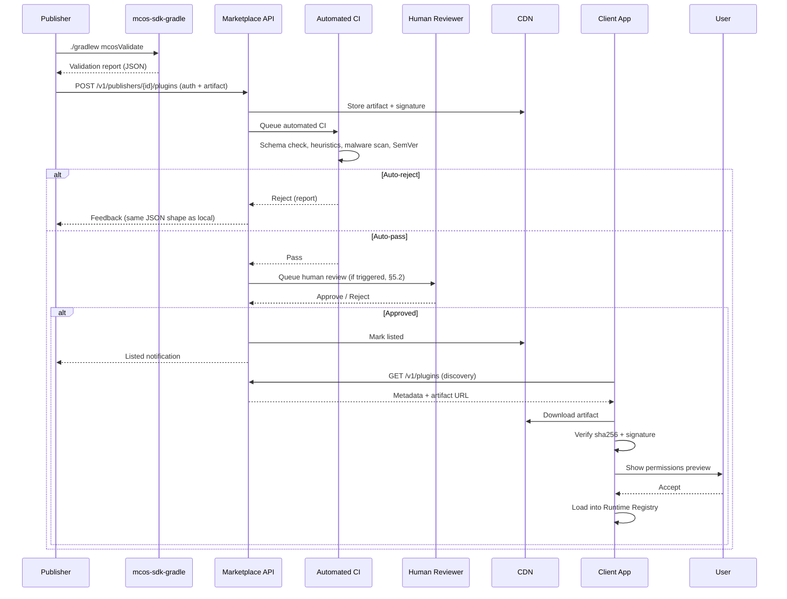
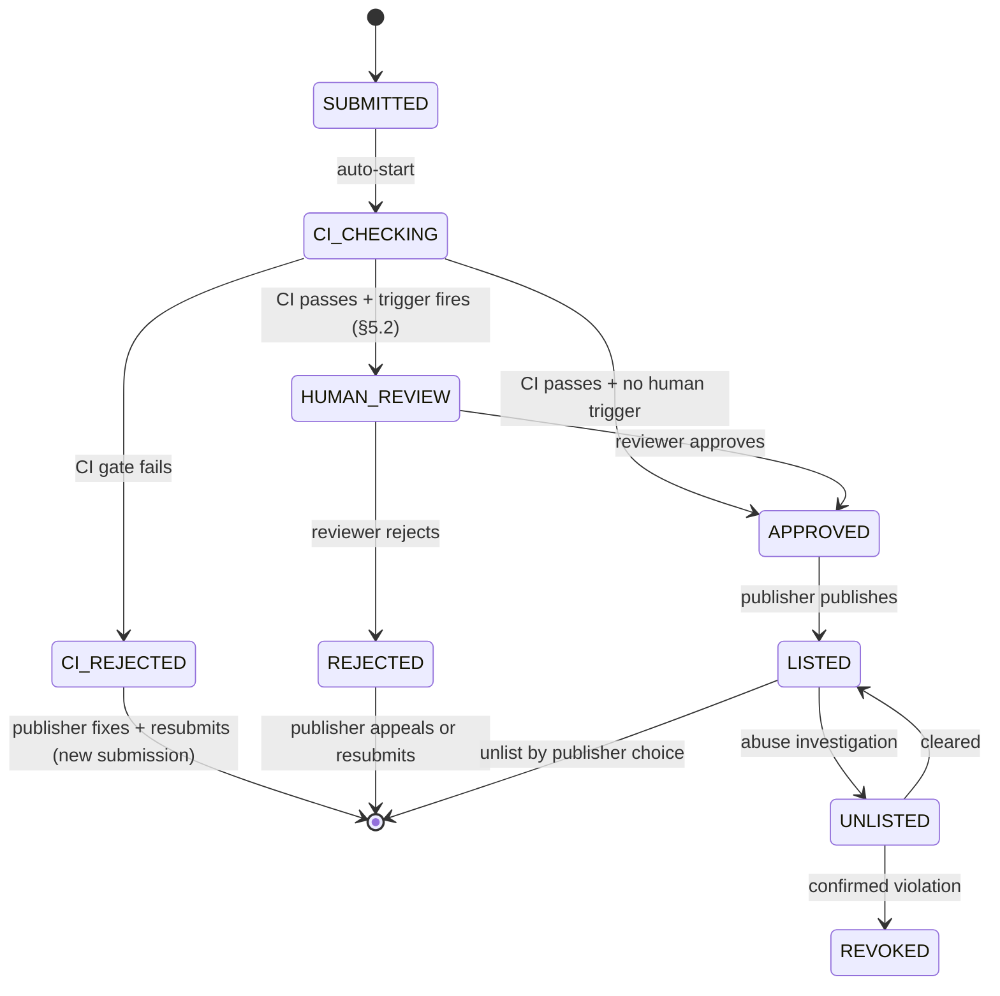
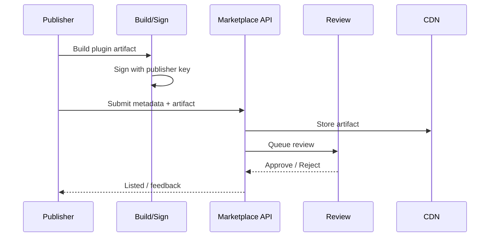
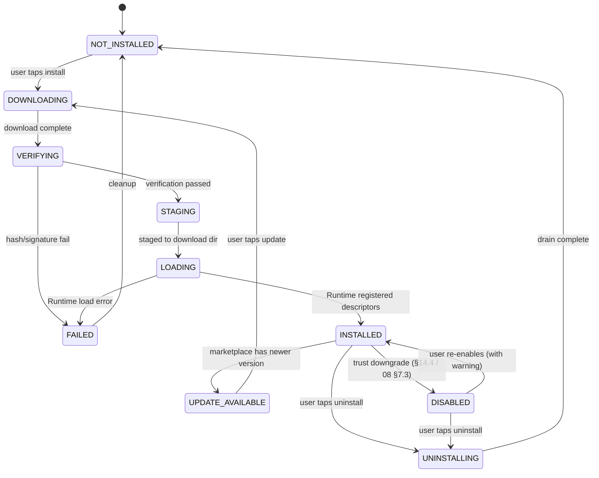

# MCOS 插件市场（Marketplace）

> **语言:** [English](../en/09-marketplace.md) · 中文（当前）

> **状态:** 草案
> **版本:** 0.1.0
> **最后更新:** 2026-08-24  
> **依赖:** [01-architecture.md](./01-architecture.md)、[02-command-protocol.md](./02-command-protocol.md)、[03-runtime.md](./03-runtime.md)、[04-plugin-sdk.md](./04-plugin-sdk.md)、[05-workflow.md](./05-workflow.md)、[07-memory.md](./07-memory.md)、[08-security.md](./08-security.md)
> **服务:** `mcos-server` marketplace 模块

> **灵感来源:** npm registry · PyPI · Homebrew · Apple App Store review process · Certificate Transparency · VS Code Marketplace · F-Droid

> 🟡 **实现状态:** **客户端侧已交付**——信任级别、工件 / blocklist / 配方签名验证、端到端安装管线（更新同意、持久化 + 重启重验与再水合、DexClassLoader 动态加载 `.mcos`）、配方商店 + 安装向导、用户举报与 opt-in 遥测，以及 Android 应用内 UI。剩余：公共索引**服务端**部署（运营方 well-known 签名钥已落地 `TrustAnchors`，私钥离线保管；构建期一致性测试 + 发布守卫保证锚点可信）。状态见 [11-implementation-status.md](./11-implementation-status.md) §3。

---

## 1. 目的（Purpose）

### 1.0 核心目的

插件市场（Marketplace）将 MCOS 从一个应用变成一个 **生态系统**：

- 发现插件与工作流配方（Recipe）
- 验证发布者（Publisher）身份与签名
- 安装 / 更新 / 撤销
- 分享经过脱敏处理的自动化

在 **不** 使用插件市场的情况下，本地执行依然可用（仅限内置插件）。

### 1.1 插件市场在 MCOS 路线图中的阶段划分

| 阶段 | 分发能力 | 没有插件市场时能做什么 |
|--------|------------------------|--------------------------------|
| **P1（MVP）** | 仅内置插件（随 APK 发布） | 完整的本地执行；通过开发者模式侧载 |
| **P2** | 侧载调试安装（`SIDELOAD_DEBUG` 信任级别，[08 §7](./08-security.md)） | 全部 P1 能力 + 未签名开发者安装 |
| **P3（Ecosystem）** | 公共索引 + 签名 + 配方商店 + 私有注册表 | 全部 P2 能力 + 大规模第三方分发 |

插件市场不是运行时依赖项——运行时（Runtime，[03](./03-runtime.md)）无论是否安装了市场客户端，都会从下载目录加载插件。插件市场是填充该目录（用经过校验的制品）的 **可信供给通道**。

---

## 2. 设计目标

### 2.0 五大核心目标

1. **安全优先于增长手段** —— 在广泛分发前进行审核 + 签名
2. **开放 API** —— 第三方客户端可以查询索引
3. **对离线友好的元数据缓存**
4. 安装前 **清晰的权限预览（permissionsPreview）**
5. 当插件被攻破时的 **撤销** 能力

### 2.1 目标权衡

每个目标都涉及一个显式的权衡。下表使这些权衡可见，以便贡献者理解为何某些看似理所当然的功能（例如“自动批准所有提交”）并不存在：

| 目标 | 权衡 | MCOS 立场 |
|------|-----------|---------------|
| 安全优先于增长 | 审核摩擦拖慢供给 | 接受较慢的供给；5 天审核 SLA（[§5.3](#53-review-sla)）是上限而非下限 |
| 开放 API | 第三方客户端绕过审核 UI | API 对发现是只读的；即使第三方客户端下载了制品，安装也始终经过运行时的校验关卡 |
| 离线友好的缓存 | 元数据过期 | 缓存 TTL 为 24 小时（[§4.4](#44-metadata-cache-strategy)）；用户可强制刷新；关键更新（拉黑名单、撤销）通过推送通知 |
| 清晰的权限预览 | 让用户应接不暇 | 按风险层级（normal/elevated/destructive，[08 §6.0](./08-security.md)）分组权限；默认显示摘要，点击查看详情 |
| 撤销 | 已安装的插件仍会继续运行 | 启动时拉取拉黑名单（blocklist，[§14.3](#143-blocklist-distribution)），在已撤销的插件运行前强制禁用它们 |

---

## 3. 参与方（Actors）

### 3.0 参与方表

| 参与方 | 角色 |
|-------|------|
| 发布者（Publisher） | 开发并签名插件 |
| 审核者（Reviewer） | 人工 / 自动化流水线 |
| 索引（Index） | 目录 + 下载 URL + 签名 |
| 客户端应用（Client App） | 浏览、安装、更新 |
| 用户（User） | 对权限进行同意 |

### 3.1 参与方交互（发布流程）

从发布者笔记本到用户设备的端到端流程，扩展自第 5 节的时序图：



---

## 4. 包元数据（Package Metadata）

### 4.0 规范性类型

本文档是面向市场的包元数据类型的规范性来源。插件清单（内部契约）定义于 [04 §4](./04-plugin-sdk.md)；本节是市场 API 提供并由客户端渲染的 **面向索引（index-facing）** 元数据。

```kotlin
data class PackageMetadata(
    val packageId: String,              // reverse-DNS, e.g. "mcos.plugin.iot.tuya"
    val name: String,                   // display name (localized via marketplace i18n)
    val version: String,                // SemVer
    val minRuntimeVersion: String,      // SemVer — Runtime version required
    val publisherId: String,            // marketplace publisher ID
    val publisherName: String,          // display name (localized)
    val categories: List<String>,       // e.g. ["iot", "home"]
    val summary: String,                // one-line description
    val description: String?,           // long-form (markdown, optional)
    val permissionsPreview: List<PermissionEntry>,
    val commandsPreview: List<String>,  // command IDs this plugin provides
    val artifact: ArtifactRef,
    val privacyPolicyUrl: String?,
    val homepage: String?,
    val publishedAt: kotlinx.datetime.Instant,
    val updatedAt: kotlinx.datetime.Instant,
    val downloadCount: Long,            // all-time, for ranking
    val safetyScore: Float,             // 0.0–1.0, computed from permissions + review (§9.1)
)

data class PermissionEntry(
    val type: String,                   // "android" | "mcos"
    val name: String,                   // scope string, e.g. "CAMERA" or "network.api.tuya.com"
    val riskTier: String,               // "normal" | "elevated" | "destructive" (aligned with [08 §6.0](./08-security.md))
    val justification: String?,         // publisher-provided explanation for high-risk scopes
)

data class ArtifactRef(
    val url: String,                    // CDN download URL (HTTPS)
    val sha256: String,                 // hex-encoded SHA-256 of the artifact bytes
    val signature: String,              // publisher signature (base64)
    val signingKeyId: String,           // which publisher key signed this
    val sizeBytes: Long,
)
```

### 4.1 JSON 示例

```json
{
  "packageId": "mcos.plugin.iot.tuya",
  "name": "Tuya Home",
  "version": "1.2.0",
  "minRuntimeVersion": "0.1.0",
  "publisherId": "pub_tuya_community",
  "publisherName": "Tuya Community",
  "categories": ["iot", "home"],
  "summary": "Control Tuya devices via MCOS commands",
  "permissionsPreview": [
    { "type": "android", "name": "INTERNET", "riskTier": "normal", "justification": null },
    { "type": "mcos", "name": "network.openapi.tuya.com", "riskTier": "elevated", "justification": "Cloud API for device control" }
  ],
  "commandsPreview": ["iot.ac.set", "home.scene.movie"],
  "artifact": {
    "url": "https://cdn.example/plugins/tuya-1.2.0.aar",
    "sha256": "...",
    "signature": "...",
    "signingKeyId": "key_2026_01",
    "sizeBytes": 1234567
  },
  "privacyPolicyUrl": "https://...",
  "homepage": "https://...",
  "publishedAt": "2026-08-01T00:00:00Z",
  "updatedAt": "2026-08-01T00:00:00Z",
  "downloadCount": 0,
  "safetyScore": 0.85
}
```

在安装进行之前，客户端 **必须** 展示 `permissionsPreview` 与命令列表。

### 4.2 `permissionsPreview` 规范

`permissionsPreview` 数组派生自插件清单中声明的权限（[04 §4.4](./04-plugin-sdk.md)），是客户端在安装时展示的 **权威** 列表。规则：

- 每个条目都对应一个 `PermissionScope`（[08 §3.0](./08-security.md)）。`type` + `name` 字段重建作用域字符串：`android:CAMERA` 或 `mcos:network.openapi.tuya.com`。
- `riskTier` 由市场 CI（[§5.1](#51-automated-ci-gates)）根据作用域的 `sideEffectClass` 计算得出，而非由发布者自行声明。插件不能将其自身权限声明为 "normal" 来隐藏 `destructive` 作用域。
- `justification` 字段对 `elevated` 与 `destructive` 层级是 **必需的**。CI 会拒绝高风险作用域缺少理由说明的提交。
- 该预览是任何单一命令所需权限的 **超集** —— 插件可能提供多条具有不同权限子集的命令。安装时的预览展示其并集；逐命令的确认发生在运行时（[08 §6](./08-security.md)）。

### 4.3 `commandsPreview` 规范

`commandsPreview` 数组列出本插件提供的命令 ID，派生自清单的 `commands[].id` 字段（[01 §10](./01-architecture.md)）。规则：

- 每个 ID 遵循 `namespace.name` 格式（[02 §4.3](./02-command-protocol.md)）。
- 市场 CI 校验命名空间（namespace）归属（[04 §13.1](./04-plugin-sdk.md)）：每个命令 ID 的第一段必须匹配插件声明的 `namespaces[]` 之一。
- 第三方插件被禁止使用保留命名空间（`mcos.*`、`sys.*`、`mcp.*`、`std.*`，[02 §4.3](./02-command-protocol.md)）。
- 该预览驱动“你使用过的命令”推荐引擎（[§9.2](#92-recommendation-strategy-commands-used-by-you)）：当 Planner 或用户引用了一个未安装的命令 ID 时，客户端可以建议提供该命令的插件。

### 4.4 元数据缓存策略

客户端在本地缓存包元数据以支持离线浏览（设计目标 3）。缓存策略：

| 缓存条目 | TTL | 失效触发条件 |
|-------------|-----|----------------------|
| 搜索结果（分页） | 24 小时 | 用户下拉强制刷新，或新上架的推送通知 |
| 单个包详情 | 24 小时 | 用户打开时强制刷新，或版本更新推送 |
| 分类列表 | 24 小时 | 与搜索结果相同 |
| 拉黑名单（blocklist） | 1 小时（但过期仍可使用） | 撤销时推送通知（[§14.3](#143-blocklist-distribution)） |
| 发布者签名密钥 | 无限期（直至轮换） | 密钥轮换时推送通知（[§6.3](#63-key-rotation--revocation)） |

**过期缓存兜底：** 若市场不可达，客户端提供带“X 小时前更新”标记的缓存元数据。若制品已下载，缓存插件的安装照常进行；新下载会以清晰的“市场离线”消息失败。拉黑名单即使在过期状态下也可使用——一条缓存的“已撤销”条目保持撤销状态（宁可多封也不可漏封）。

---

## 5. 发布流程（Publishing Flow）

### 5.0 规范性审核状态机

```kotlin
enum class ReviewState {
    SUBMITTED,          // publisher uploaded, awaiting CI
    CI_CHECKING,        // automated CI pipeline running
    CI_REJECTED,        // CI failed — publisher can fix and resubmit
    HUMAN_REVIEW,       // CI passed, human review triggered (§5.2)
    APPROVED,           // review passed — ready to list
    REJECTED,           // human review failed — publisher can appeal or resubmit
    LISTED,             // publicly visible in the index
    UNLISTED,           // temporarily hidden (abuse investigation, §14)
    REVOKED,            // permanently removed (publisher banned, §14)
}
```



**关键迁移：**
- `CI_REJECTED` 不是终态 —— 发布者在本地修复问题并提交一个新版本。旧提交留在 `CI_REJECTED` 以供审计。
- `CI_CHECKING → APPROVED`（跳过人工审核）发生在没有任何人工审核触发条件命中时（[§5.2](#52-human-review-triggers)）。这是可信发布者进行例行更新的快速路径。
- `LISTED → UNLISTED` 是可逆的；`→ REVOKED` 是终态。被撤销的包会被加入拉黑名单（[§14](#14-abuse--takedown)）。

### 5.1 自动化 CI 检查门禁（CI Gates）

市场 CI 流水线运行与本地 `mcos-sdk-gradle` 校验器（[04 §13.2](./04-plugin-sdk.md)）相同的检查，外加市场专属的门禁。通过本地校验的作者应当通过 CI —— 报告格式完全一致。

| # | 门禁 | 来源 | 失败模式 |
|---|------|--------|--------------|
| 1 | **清单 Schema** —— 依据 [01 §10](./01-architecture.md) 的 JSON Schema 解析 | [04 §13.2](./04-plugin-sdk.md) check 1 | `CI_REJECTED` |
| 2 | **保留命名空间** —— 拒绝 `mcos.*`、`sys.*`、`mcp.*`、`std.*` | [04 §13.2](./04-plugin-sdk.md) check 2 | `CI_REJECTED` |
| 3 | **重复 ID** —— 依赖项内部或之间无冲突 | [04 §13.2](./04-plugin-sdk.md) check 3 + [02 §4.4](./02-command-protocol.md) | `CI_REJECTED` |
| 4 | **sideEffectClass 诚实性** —— 启发式检查标记不匹配 | [04 §13.2](./04-plugin-sdk.md) check 4 | 警告（容忍度见 [§5.2](#52-human-review-triggers)） |
| 5 | **SemVer 合规** —— 版本正则 + 耦合 + 单调性 | [04 §13.1](./04-plugin-sdk.md) rules | `CI_REJECTED` |
| 6 | **i18n 完整性** —— 每个语言环境都有标题/描述 | [04 §13.2](./04-plugin-sdk.md) check 6 | `CI_REJECTED` |
| 7 | **密钥包含检查** —— bodyTemplate 中无 `{{secret.*}}` | [04 §13.2](./04-plugin-sdk.md) check 7 | `CI_REJECTED` |
| 8 | **签名校验** —— 制品由已注册的发布者密钥签名 | 市场专属 | `CI_REJECTED` |
| 9 | **恶意软件扫描** —— 制品由 AV 引擎扫描 | 市场专属 | `CI_REJECTED` + 标记进入人工审核 |
| 10 | **命名空间仲裁** —— 与现有市场插件无冲突 | [02 §4.4](./02-command-protocol.md) | `CI_REJECTED`（先发布者胜） |
| 11 | **最低运行时版本** —— `minRuntimeVersion` ≤ 当前运行时发布版 | 市场专属 | `CI_REJECTED`（插件面向未来运行时） |

门禁 1–7 与 `mcos-sdk-gradle` 完全一致。门禁 8–11 仅市场才有（需要中央索引状态）。门禁 4（诚实性启发式）产生 **警告**，而非硬性拒绝 —— 关于警告如何升级为人工审核，见 [§5.2](#52-human-review-triggers)。

### 5.2 人工审核触发条件

当提交匹配以下任一规则时触发人工审核。每条规则都有一个决定审核深度的 **严重程度（severity）**：

| 触发条件 | 严重程度 | 审核动作 |
|---------|----------|---------------|
| 新发布者的首次发布 | 高 | 对清单、权限与制品反编译进行完整人工审核 |
| 新增 `destructive` sideEffectClass 用法 | 高 | 对破坏性命令的处理逻辑进行人工审核 |
| 辅助功能或通知监听器用法 | 高 | 人工审核 + 用户将看到的 UX 警告截图 |
| 更新时出现大幅权限扩张（≥2 个新增 elevated/destructive 作用域） | 中 | 对新增权限与理由说明进行差异审核 |
| `sideEffectClass` 诚实性警告（CI 门禁 4） | 中 | 人工核查：声明的类别是否与实际行为一致？ |
| 用户滥用举报达到阈值（7 天内 ≥3 起） | 高 | 完整复审；可在调查期间 `UNLIST` |
| 有过 `REJECTED` 或 `REVOKED` 记录的发布者 | 中 | 强制审核（无快速路径） |

**快速路径：** 可信发布者（≥5 次已批准提交，90 天内无 `REJECTED`）提交例行更新（无新权限、无新命令、SemVer MINOR/PATCH）时，完全跳过人工审核（`CI_CHECKING → APPROVED`）。

### 5.3 审核 SLA

| 阶段 | 目标 | 上限 |
|-------|--------|---------|
| 自动化 CI（门禁 1–11） | < 5 分钟 | 15 分钟 |
| 人工审核（高严重程度） | < 3 个工作日 | 5 个工作日 |
| 人工审核（中严重程度） | < 5 个工作日 | 10 个工作日 |
| 申诉裁定 | < 5 个工作日 | 10 个工作日 |

若审核超出上限，提交会带“延长审核待定”标记自动上架（不会被无限期阻塞）。这避免市场成为合法发布者的瓶颈。

### 5.4 拒绝反馈格式

拒绝反馈使用与 `mcos-sdk-gradle` 校验器报告（[04 §13.2](./04-plugin-sdk.md)）**相同的 JSON 形态**，以便发布者将市场响应粘贴到本地 CI 中复现并修复：

```json
{
  "overall": "CI_REJECTED",
  "checks": [
    {
      "gate": 5,
      "rule": "SemVer compliance",
      "status": "fail",
      "severity": "error",
      "message": "Plugin version MAJOR bump (2.0.0) must be accompanied by a MAJOR bump on at least one command; all commands are still at 1.x",
      "location": { "field": "version", "line": 3 }
    },
    {
      "gate": 4,
      "rule": "sideEffectClass honesty",
      "status": "warning",
      "severity": "warning",
      "message": "Command 'iot.ac.set' declares sideEffectClass 'write' but manifest references http object; flagged for human review",
      "location": { "commandId": "iot.ac.set" }
    }
  ]
}
```

错误（`severity: "error"`）导致 `CI_REJECTED`；警告（`severity: "warning"`）不阻塞，但会触发人工审核（[§5.2](#52-human-review-triggers)）。

### 5.5 发布流程（原始 Mermaid，保留）



> **审核管线摘要：** 自动化检查是 [§5.1](#51-自动化-ci-检查门禁ci-gates) 的 11 项 CI 门禁；人工审核触发条件是 [§5.2](#52-人工审核触发条件) 的严重程度分级规则。

---

## 6. 签名与信任（Signing & Trust）

### 6.0 规范性密钥类型

```kotlin
data class PublisherKey(
    val keyId: String,                  // e.g. "key_2026_01" — unique per publisher
    val publisherId: String,            // marketplace publisher ID
    val publicKeyFingerprint: String,   // SHA-256 of the public key (hex)
    val algorithm: String,              // "Ed25519" (preferred) or "RSA-PSS-4096" (legacy)
    val createdAt: kotlinx.datetime.Instant,
    val rotatedFrom: String?,           // previous keyId this replaced (for audit chain)
    val status: KeyStatus,              // ACTIVE / REVOKED
)

enum class KeyStatus { ACTIVE, REVOKED }

data class SigningResult(
    val keyId: String,                  // which key signed
    val signature: ByteArray,           // signature bytes
    val algorithm: String,
    val signedAt: kotlinx.datetime.Instant,
)
```

**算法偏好（规范性）：** 所有新发布者密钥优先使用 Ed25519。RSA-PSS-4096 仅为从现有基础设施迁移的传统发布者提供支持。不支持 ECDSA（对于新密钥，Ed25519 严格更优）。`PublisherKey` 中的 `algorithm` 字段告知客户端使用哪条校验路径。

### 6.1 发布者密钥注册

```text
1. Publisher generates an Ed25519 key pair locally (or in their HSM/KMS)
2. Publisher registers on the marketplace:
   a. Creates publisher account (publisherId, display name, contact)
   b. Uploads the public key (or just the fingerprint + public key bytes)
   c. Marketplace verifies the publisher's identity (email, domain, or org)
   d. Marketplace assigns keyId and stores PublisherKey in the index
3. Publisher keeps the private key secret:
   a. Preferred: HSM (YubiKey, cloud KMS) — key never leaves the device
   b. Acceptable: encrypted local file (passphrase-protected)
   c. Never: plaintext file, git repo, or CI env var without secrets management
4. The CI build signs the artifact with the private key:
   a. ./gradlew mcosSign (uses configured key source)
   b. Outputs SigningResult { keyId, signature, algorithm, signedAt }
5. Marketplace CI (gate 8) verifies the signature against the registered public key
```

### 6.2 签名校验算法（客户端侧）

客户端在将下载的制品加载进运行时之前对其进行校验。这与运行时的签名校验缓存（[03 §16.2](./03-runtime.md)）对齐：

```text
function verifyArtifact(metadata: PackageMetadata, artifactBytes: ByteArray): VerifyResult {
    // 1. Check SHA-256 integrity
    val computedHash = sha256(artifactBytes)
    if (computedHash != metadata.artifact.sha256) {
        return REJECT("hash_mismatch", expected=metadata.artifact.sha256, actual=computedHash)
    }

    // 2. Fetch publisher public key (from cache or marketplace)
    val pubKey = keyCache.get(metadata.artifact.signingKeyId)
        ?: fetchFromMarketplace(metadata.artifact.signingKeyId)
    if (pubKey == null) {
        return REJECT("key_not_found", keyId=metadata.artifact.signingKeyId)
    }

    // 3. Check key status (not revoked)
    if (pubKey.status == REVOKED) {
        return REJECT("key_revoked", keyId=pubKey.keyId)
    }

    // 4. Verify signature
    val valid = verifySignature(
        publicKey = pubKey,
        data = artifactBytes,
        signature = metadata.artifact.signature,
        algorithm = pubKey.algorithm,
    )
    if (!valid) {
        return REJECT("signature_invalid", keyId=pubKey.keyId)
    }

    // 5. Check blocklist (§14)
    if (blocklist.contains(metadata.packageId, metadata.version)) {
        return REJECT("blocklisted", packageId=metadata.packageId)
    }

    // 6. Cache the verification result (aligned with 03 §16.2)
    keyCache.put(metadata.artifact.signingKeyId, pubKey)
    verificationCache.put(
        key = (metadata.artifact.signingKeyId, computedHash),
        value = VerifyCacheEntry(verifiedAt = now(), trusted = true),
    )

    return ACCEPT(TrustLevel.MARKETPLACE_VERIFIED, pubKey)
}
```

**离线行为（与 [03 §16.2](./03-runtime.md) 对齐）：** 第 6 步缓存 `(keyId, hash) → verifiedAt`。后续加载时，若缓存条目存在且处于撤销 TTL（默认 7 天）之内，制品无需再次联系市场即可加载。超过 TTL 的缓存条目会在下一次在线机会时重新校验；若市场不可达且 TTL 已过期，插件会带“校验已过期”警告加载（不被阻塞 —— 用户可能需要离线使用该插件；风险被显式呈现）。

### 6.3 密钥轮换与吊销（Key Rotation & Revocation）

| 场景 | 动作 | 客户端影响 |
|----------|--------|---------------|
| 例行轮换（发布者主动选择） | 发布者生成新密钥，以 `rotatedFrom: oldKeyId` 注册，用新密钥签名下一个发布 | 旧密钥在宽限期内（90 天）保持 `ACTIVE`，以便已安装的插件继续加载；新安装使用新密钥 |
| 密钥疑似泄露 | 发布者请求紧急吊销 → 市场将旧密钥设为 `status: REVOKED`，推送拉黑名单条目 | 客户端收到拉黑名单推送 → 重新校验所有由该吊销密钥签名的插件 → 强制禁用无法用新密钥重新校验的那些（[§14.4](#144-force-disable-of-installed-revoked-plugins)） |
| 发布者被封禁 | 市场吊销该发布者的全部密钥，为其所有包推送拉黑名单 | 该发布者的所有插件在下次拉取拉黑名单时被强制禁用 |
| 密钥到期（若发布者设置了到期时间） | 市场在到期时将 `status` 设为 `REVOKED` | 与泄露相同 —— 插件需要重新签名或被禁用 |

**宽限期理由：** 例行轮换不得破坏已安装的插件。90 天的重叠期让发布者能用新密钥对现有版本重新签名并推送更新，之后旧密钥才会被完全吊销。

### 6.4 透明日志（V1+）

为检测向不同客户端静默提供不同制品的恶意或被攻破的市场服务器，市场维护一个 **透明日志（transparency log）** —— 一棵仅追加的 Merkle 树，记录所有已发布的 (packageId, version, sha256, signingKeyId) 条目，仿照 Certificate Transparency（RFC 6962）。

```text
1. Every published version is appended as a leaf to the Merkle tree
2. The marketplace returns a Signed Tree Head (STH) with each metadata response:
   { treeSize, timestamp, rootHash, marketplaceSignature }
3. The client can verify (out-of-band, via a third-party monitor) that its
   received metadata appears in the publicly-auditable tree
4. A "gossip" protocol (V2+) lets clients compare STHs to detect split-view attacks
```

这是 V1+ 特性 —— MVP 市场（P3）不包含它，而是依赖市场运营方的完整性。透明日志是迈向完全无信任分发通道的路径。

### 6.5 信任级别集成

市场签名是 `TrustLevel.MARKETPLACE_VERIFIED`（[08 §7](./08-security.md)）的来源：

| 校验结果 | 分配的 `TrustLevel` |
|----------------------|----------------------|
| 签名有效 + 密钥 ACTIVE + 未被拉黑 | `MARKETPLACE_VERIFIED` |
| 签名有效但密钥 REVOKED | `UNTRUSTED`（强制禁用，[§14.4](#144-force-disable-of-installed-revoked-plugins)） |
| 签名无效或缺失 | `UNTRUSTED`（生产环境拒绝加载） |
| 被拉黑 | `UNTRUSTED`（强制禁用） |
| 内置插件（随运行时发布） | `BUILTIN`（跳过市场校验，[03 §16.2](./03-runtime.md)） |
| 侧载（仅调试构建） | `SIDELOAD_DEBUG`（无市场签名，[08 §7](./08-security.md)） |

### 6.6 原始签名规则（保留）

1. 发布者注册并获取 / 上传签名密钥
2. 对制品签名；索引存储签名 + 证书指纹
3. 客户端在加载前验证签名
4. 可选的已发布哈希 **透明日志**（V1+）

密钥泄露：吊销发布者，向客户端推送熔断指令。

---

## 7. 安装 / 更新 / 卸载

> ✅ **落地状态（item 45）：** LOADING 步骤 as-built 有两条路径。默认：`pluginFactory` 把已验证字节解码为插件实例、`PluginLoader` 注册。接入 `manifestDecoder` 时（宿主的进程隔离姿态，08 §8）：解码 manifest、`PluginLoader.loadManifest` 按 manifest-only 注册描述符——`pluginFactory` 永不被调用、本进程不加载任何插件代码；同一分支服务重启再水合（缺失工厂不再使记录失败）。解码器失败映射为 `decode_failed` 并清理 staged 工件，loader 拒绝 id 与包不匹配的 manifest（冒名防护）。

### 7.0 规范性安装状态机

```kotlin
enum class InstallState {
    NOT_INSTALLED,          // plugin not on device
    DOWNLOADING,            // artifact download in progress
    VERIFYING,              // sha256 + signature verification
    STAGING,                // copying to Runtime download dir
    LOADING,                // Runtime registering descriptors
    INSTALLED,              // active and ready
    UPDATE_AVAILABLE,       // newer version in marketplace
    DISABLED,               // installed but trust-downgraded / quarantined
    UNINSTALLING,           // drain in progress (canceling running steps)
    FAILED,                 // download/verify/load error (cleanup needed)
}
```



**关键迁移：**
- `VERIFYING → FAILED` 触发清理（删除部分下载文件、清除暂存区）。
- `LOADING → FAILED` 表示运行时拒绝了该插件（例如命名空间冲突，[02 §4.4](./02-command-protocol.md)）。制品有效但不兼容 —— 用户会看到一条具体的错误消息。
- `INSTALLED → DISABLED` 由拉取拉黑名单（[§14](#14-abuse--takedown)）或隔离（[08 §15.3](./08-security.md)）触发。插件保留在磁盘上但不被加载。

### 7.1 安装流程（规范性算法）

```text
function installPackage(metadata: PackageMetadata):
    state = DOWNLOADING
    1. Download artifact from metadata.artifact.url (HTTPS, resumable)
       on progress: emit InstallProgress(percent)
       on network error: state = FAILED, return

    state = VERIFYING
    2. Verify artifact:
       result = verifyArtifact(metadata, artifactBytes)   // §6.2
       if result is REJECT:
           state = FAILED
           show error with reason (hash_mismatch / signature_invalid / blocklisted)
           delete downloaded file
           return

    state = STAGING
    3. Stage artifact to Runtime download dir:
       path = downloadDir / "${metadata.packageId}-${metadata.version}.aar"
       write artifactBytes to path

    state = LOADING
    4. Trigger Runtime to load the new plugin:
       runtime.loadPlugin(path)   // 03 §16.3 classloader isolation
       this calls onLoad(services) → registers descriptors → RegistryChanged

    5. Check Runtime load result:
       if load failed (namespace conflict, schema error, etc.):
           state = FAILED
           show error
           delete staged file
           return

    state = INSTALLED
    6. Show permissions preview to user (if not already shown pre-download):
       - List all permissionsPreview entries grouped by riskTier
       - Highlight elevated/destructive with justification
       - User taps "Accept" or "Cancel"
       if Cancel: state = UNINSTALLING (undo install), return

    7. Grant defaults:
       - Do NOT pre-grant any permissions
       - Each command's permissions will be requested at first invoke via
         Stage 6 Authorize (08 §3.4) + ConfirmationPrompt (08 §6.0)
       - This is "install consent" (layer 2, 08 §2.0), not "runtime grant"

    8. Post-install telemetry (opt-in, §11.3):
       if user opted in:
           POST /v1/telemetry/install { packageId, version, anonymized }
```

**安装同意 ≠ 运行时授权。** 第 7 步至关重要：安装一个插件并不会授予它任何运行时权限。用户同意的是 *该插件可以请求什么*（第 2 层）；每一次实际的命令调用仍要经过第 6 阶段的确认（第 5 层）。这是纵深防御：即使用户盲目安装，每一个破坏性动作仍需逐次确认。

### 7.2 更新流程与权限差异（Permission Diff）算法

当有新版本可用时，客户端计算已安装版本与新版本之间的 **权限差异（permission diff）**。该差异决定更新是否需要新的同意，还是可以静默进行。

```kotlin
data class PermissionDiff(
    val added: List<PermissionEntry>,      // scopes in new version not in old
    val removed: List<PermissionEntry>,    // scopes in old not in new
    val changed: List<PermissionChange>,   // same scope, riskTier or justification changed
    val consentRequired: Boolean,          // true if added/changed contains elevated/destructive
)

data class PermissionChange(
    val scope: String,                     // the permission scope that changed
    val oldEntry: PermissionEntry,
    val newEntry: PermissionEntry,
    val changeType: ChangeType,            // RISK_TIER_ESCALATED / JUSTIFICATION_CHANGED
)

enum class ChangeType { RISK_TIER_ESCALATED, JUSTIFICATION_CHANGED }
```

**差异计算算法（规范性）：**

```text
function computePermissionDiff(oldMeta, newMeta): PermissionDiff {
    oldScopes = setOf(oldMeta.permissionsPreview.map { it.type + ":" + it.name })
    newScopes = setOf(newMeta.permissionsPreview.map { it.type + ":" + it.name })

    added = newMeta.permissionsPreview.filter { entry ->
        (entry.type + ":" + entry.name) !in oldScopes
    }
    removed = oldMeta.permissionsPreview.filter { entry ->
        (entry.type + ":" + entry.name) !in newScopes
    }
    changed = newMeta.permissionsPreview.filter { newEntry ->
        val key = newEntry.type + ":" + newEntry.name
        val oldEntry = oldMeta.permissionsPreview.find { (it.type + ":" + it.name) == key }
        oldEntry != null && (
            oldEntry.riskTier != newEntry.riskTier ||
            oldEntry.justification != newEntry.justification
        )
    }.map { newEntry ->
        PermissionChange(
            scope = newEntry.type + ":" + newEntry.name,
            oldEntry = oldMeta.permissionsPreview.find { ... },
            newEntry = newEntry,
            changeType = if (oldEntry.riskTier != newEntry.riskTier)
                RISK_TIER_ESCALATED else JUSTIFICATION_CHANGED,
        )
    }

    consentRequired = added.any { it.riskTier in setOf("elevated", "destructive") }
        || changed.any { it.changeType == RISK_TIER_ESCALATED }

    return PermissionDiff(added, removed, changed, consentRequired)
}
```

**更新 UI 行为：**

| 差异结果 | UI 行为 |
|-------------|-------------|
| `added` 为空（权限相同或更少） | 静默更新 —— 无提示地继续 |
| `added` 仅包含 `normal` 层级 | 轻量级提示：“更新新增：[列表]。允许？” |
| `added` 或 `changed` 包含 `elevated`/`destructive` | 完整权限预览（与安装相同，[§7.1](#71-install-flow-normative-algorithm) 第 6 步）—— `consentRequired = true` |
| 主要命令契约破坏（某命令的 SemVer MAJOR） | 警告：“此更新可能破坏使用 [命令 ID] 的现有工作流”（[05](./05-workflow.md) 钉版工作流解析） |
| `removed` 权限 | 无需提示（插件请求的更少） |

### 7.3 卸载流程

```text
function uninstallPackage(packageId):
    state = UNINSTALLING
    1. Trigger Runtime drain (03 §6.5):
       a. Stop accepting new invocations for this plugin's commands
       b. Cancel running steps (cooperative → forced, 03 §9.4)
       c. Wait for drain grace period (default 5s)
       d. Force-cancel remaining runs
       e. Unregister descriptors from all three Registry indices
       f. Release plugin classloader
       g. Emit RegistryChanged event
       h. Audit: plugin.uninstalled

    2. Revoke all grants for this plugin (08 §5):
       a. Delete GrantRecords where subject matches "plugin:<packageId>.*"
       b. This prevents stale grants if the plugin is reinstalled later

    3. Clean up SecureStore (optional, user choice):
       - Default: wipe SecureStore namespace for this pluginId (secrets are gone)
       - User can opt to "keep credentials for reinstall" (secrets preserved)

    4. Delete artifact from download dir

    5. Memory aliases:
       - Leave user Memory aliases intact (places, people, devices — user's data)
       - Unless user opts to "clean associated Memory" (removes episodic records
         referencing this plugin's commands)

    state = NOT_INSTALLED
```

**Memory 保留理由：** 用户的 Memory（偏好、地点、人物）是其自有数据，而非插件的数据。卸载一个相机插件不应删除用户存储的地点。引用该插件命令的情景记录默认保留（它们是历史事实）；用户可以选择清理。

### 7.4 依赖解析（配方安装）

安装配方（[§8](#8-workflow-recipe-store)）时，安装器解析 `requiredPlugins` 约束。配方信封（[05 §14.1](./05-workflow.md)）以 `pluginId@semverRange` 的形式声明依赖：

```text
function resolveRecipeDependencies(recipe: RecipeEnvelope): ResolveResult {
    missing = []
    for each dep in recipe.requiredPlugins:   // e.g. "com.example.photo@>=1.0.0"
        (pluginId, range) = parseSemverRange(dep)
        installed = runtime.findInstalledPlugin(pluginId)
        if installed != null && installed.version satisfies range:
            continue   // already installed and compatible
        else:
            // Look up in marketplace
            available = marketplace.findPlugin(pluginId, range)
            if available == null:
                missing.add(MissingDependency(pluginId, range, reason="not_in_marketplace"))
            else:
                missing.add(MissingDependency(pluginId, range, suggestedVersion=available.version))

    if missing.isEmpty():
        return RESOLVED   // all deps satisfied
    else:
        return UNRESOLVED(missing)   // installer refuses; user sees what's missing
}
```

**SemVer 范围语法：** `>=1.0.0`（最低版本）、`>=1.0.0 <2.0.0`（范围）、`^1.0.0`（兼容，相同主版本）、`~1.0.0`（近似，相同次版本）。解析器是标准的 semver-spec 实现。无法解析的范围会以 `SCHEMA_VIOLATION` 使配方安装失败。

如果依赖可满足但尚未安装，安装器提供一个 **批量安装** 界面：“此配方需要 [插件 A v1.2+] 和 [插件 B v2.0+]。全部安装？” 用户为该批次同意一次；每个插件仍需经过各自的权限预览（[§7.1](#71-install-flow-normative-algorithm) 第 6 步）。

### 7.5 原始安装 / 更新 / 卸载（保留摘要）

### 安装

```text
Fetch metadata → show permissions → user accepts
  → download → verify sha256 + signature
  → stage → load into Runtime Registry
  → grant default asks (still runtime-gated per command)
```

### 更新

- 展示权限 **差异**
- 主要命令契约破坏 → 警告工作流可能失败
- 服务端支持分阶段灰度比例

### 卸载

- 注销命令
- 取消该插件中正在运行的步骤
- 可选地清除插件本地的 SecureStore
- 保留用户 Memory 别名，除非用户选择清理

---

## 8. 工作流配方商店（Workflow Recipe Store）

### 8.0 Schema 归属关系

**配方信封 schema**（`recipeId`/`name`/`version`/`workflow`/`placeholders`/`requiredPlugins`/`triggerPreview` + 字段表 + 安全约束）规范性定义于 [05 §14.1](./05-workflow.md)。本节 **不** 重新定义它，而是规定 **市场专属** 的关注点：发布、签名、搜索与安装时的设置向导。

### 8.1 配方发布流程

配方通过与插件相同的审核流水线（[§5](#5-publishing-flow)），并配有配方专属的 CI 门禁：

| 门禁 | 配方专属检查 |
|------|----------------------|
| 工作流 IR 校验 | `workflow` 字段解析为有效的 `CompiledWorkflow`（[05 §4.0](./05-workflow.md)） |
| 占位符完整性 | 工作流中的每个 `{{placeholder.*}}` 令牌都在 `placeholders[]` 中有对应条目 |
| `requiredPlugins` 可满足性 | 每个 `pluginId@semverRange` 都引用市场中存在的插件 |
| 无内嵌密钥 | 工作流体被扫描以查找类密钥模式（CI 拒绝含硬编码令牌/口令的提交，[05 §14.1](./05-workflow.md) 安全约束 1） |
| 无硬编码个人标识 | 无具体设备 ID、用户 ID 或联系人引用（必须使用占位符） |

例行更新 **不** 需要人工审核触发（配方不含可执行代码 —— 仅为声明式 IR）。自动化 CI 门禁即可，除非配方被用户滥用举报标记。

### 8.2 配方搜索与发现

配方与插件一起在市场中可被搜索。发现 UX：

| 界面 | 配方如何出现 |
|---------|-------------------|
| 全文搜索 | 配方的 `name` 和 `summary` 被索引；诸如“照片压缩”的查询会匹配相关配方 |
| 分类浏览 | 配方出现在与插件相同的分类下（使用 `photo.*` 命令的配方出现在“Media”下） |
| 插件详情页 | “使用此插件的配方” —— 展示在 `requiredPlugins` 中声明此插件的配方 |
| 命令详情页 | “使用此命令的配方” —— 展示工作流调用此命令 ID 的配方 |
| Planner 建议 | 当 Planner 遇到匹配已知配方模式的目标时，它可以建议该配方（[05 §13](./05-workflow.md) Planner 发射规则：“在合成新 IR 之前优先使用已知配方”） |

### 8.3 配方安装向导

安装配方会运行一个 **设置向导**，将占位符绑定到具体值。这在 [05 §14.1](./05-workflow.md)（“占位符绑定”）中规定；市场客户端按如下方式实现：

```text
function installRecipe(recipe: RecipeEnvelope):
    1. Resolve dependencies (§7.4):
       result = resolveRecipeDependencies(recipe)
       if result is UNRESOLVED:
           show missing plugins, offer batch install
           if user declines: abort

    2. For each placeholder in recipe.placeholders:
       a. If placeholder.fromMemory is non-null:
          - Query Memory at the given path (e.g. "contacts.frequentlyMessaged")
          - Suggest the top value to the user
          - User confirms or overrides
       b. If placeholder.required is true:
          - Wizard cannot be skipped until the user provides a value
       c. If placeholder.default is set and user skips:
          - Use the default value
       d. Store the bound value in Memory at a recipe-scoped path:
          "recipes.{recipeId}.placeholders.{key}"

    3. Compile the workflow with bound placeholders:
       - The Runtime compiles the workflow IR, substituting {{placeholder.*}} tokens
         with the bound values from Memory (05 §14.1 "placeholder binding")
       - The resulting CompiledWorkflow has no {{placeholder.*}} tokens remaining

    4. Register the compiled workflow:
       - Stored in local workflow DB (05 §14)
       - Trigger registered (if recipe has a trigger, e.g. "on wifi connect")

    5. Sign the recipe envelope (marketplace signature, §6):
       - The marketplace signs the recipe at publish time
       - The Runtime verifies the signature before compiling (05 §14.1 constraint 3)
```

**Memory 绑定是关键的 UX 创新。** 一个如“Office Wi-Fi → VPN”、带 `fromMemory: "places.office.wifiSsids"` 的配方会自动建议用户存储的办公室 Wi-Fi SSID —— 用户无需输入任何内容。这使得配方感觉“智能”，同时保持透明（用户能看到并确认每一个绑定）。

### 8.4 原始配方示例（保留）

与插件并行，分发 **配方（recipe）**：

```json
{
  "recipeId": "recipe.office.vpn",
  "name": "Office Wi‑Fi → VPN",
  "workflow": { "...": "IR with placeholders" },
  "placeholders": [
    { "key": "ssid", "fromMemory": "places.office.wifiSsids" }
  ],
  "requiredPlugins": ["mcos.plugin.system", "mcos.plugin.vpn"]
}
```

规则：

- 不内嵌密钥
- 个人标识使用占位符
- 安装时由设置向导绑定 Memory

---

## 9. 搜索与发现

### 9.0 发现机制

| 机制 | 说明 |
|-----------|-------|
| 全文搜索 | 名称、摘要、命令 ID |
| 分类浏览 | IoT、媒体、生产力、开发者、MCP |
| “你使用过的命令” | 推荐提供缺失 ID 的插件 |
| 编辑精选 | 人工策展，并明确标注 |

排序不得掩盖权限的严重程度。

### 9.1 搜索排名算法（规范性）

搜索结果由一个平衡相关性、热度与安全性的复合分数排名。**安全权重（safety weight）** 确保高权限插件不会被人为推到顶部：

```text
function rank(query, package: PackageMetadata): Float {
    // 1. Text relevance (BM25-style, 0.0–1.0)
    textScore = bm25(query, [package.name, package.summary, package.commandsPreview])

    // 2. Category match bonus (0.0 or 0.2)
    categoryBonus = if (query.category in package.categories) 0.2 else 0.0

    // 3. Popularity (log-scaled download count, 0.0–1.0)
    popularity = min(1.0, log10(package.downloadCount + 1) / 6.0)

    // 4. Safety weight (0.0–1.0) — computed from permissions
    safetyWeight = computeSafetyWeight(package.permissionsPreview)

    // 5. Composite: relevance + category + popularity, then dampened by safety
    rawScore = (textScore * 0.5) + (categoryBonus * 0.2) + (popularity * 0.3)
    return rawScore * safetyWeight
}

function computeSafetyWeight(permissions: List<PermissionEntry>): Float {
    // More high-risk permissions → lower safety weight → lower rank
    val destructive = permissions.count { it.riskTier == "destructive" }
    val elevated = permissions.count { it.riskTier == "elevated" }
    val normal = permissions.count { it.riskTier == "normal" }

    val penalty = destructive * 0.15 + elevated * 0.05 + normal * 0.01
    return max(0.3, 1.0 - penalty)   // floor at 0.3 — never fully hides a plugin
}
```

**设计意图：**
- `safetyWeight` **抑制** 但从不完全隐藏一个插件（下限 0.3）。搜索照片插件的用户仍能找到需要相机权限的照片插件 —— 只是它排在需要更少权限的照片插件之下。
- `PackageMetadata` 中的 `safetyScore`（[§4.0](#40-normative-type)）是 `computeSafetyWeight` 的存储形式，在索引时预计算以便搜索快速。
- “编辑精选”策展列表绕过此排名 —— 它们显示在单独的区域，并明确标注“Curated”，让用户知道排名是编辑性的，而非算法性的。

### 9.2 推荐策略（“你使用过的命令”）

“你使用过的命令”机制会推荐提供用户引用过但未安装的命令 ID 的插件：

```text
function recommendPlugins(userMemory: MemorySnapshot): List<PackageMetadata> {
    1. Extract command IDs the user has used or referenced:
       - From episodic memory: commands invoked in the last 30 days (07 §8)
       - From pinned workflows: commands in saved workflow IR (05 §14)
       - From Planner clarification history: commands the Planner offered
         in Clarify options that the user did not have installed

    2. Find which of those are NOT currently installed:
       installed = runtime.getAllInstalledCommandIds()
       missing = referencedCommands - installed

    3. For each missing command ID:
       candidates = marketplace.searchByCommandId(commandId)
       // Returns packages whose commandsPreview contains this ID

    4. Rank candidates by:
       - Safety weight (§9.1)
       - Whether the user already has other plugins from the same publisher
         (familiarity bonus, +0.1)

    5. Return top-N (default 5) recommendations with explanation:
       "You recently tried to use 'photo.compress' — this plugin provides it."
}
```

这是 **隐私保护** 的：推荐在客户端从用户的本地 Memory 运行。客户端仅向市场发送缺失的命令 ID（而非完整使用历史）。市场无法得知用户 *使用哪些* 命令 —— 只知道客户端 *在搜索哪些* 插件。

### 9.3 元数据缓存（离线浏览）

客户端缓存搜索结果与分类列表（[§4.4](#44-metadata-cache-strategy)），以便用户离线浏览市场：

- 上一次搜索查询的结果缓存 24 小时。
- “首页”/“热门”/分类页面被缓存，并以“上次更新”标记提供过期内容。
- 仅当制品已下载时才可安装 —— 一个无缓存制品的缓存列表会显示“下载需要网络”。
- 拉黑名单始终可用（已缓存，过期仍可使用 —— 宁可多封也不可漏封）。

---

## 10. MCP 目录桥接（MCP Catalog Bridge）

### 10.0 概览

插件市场可列出 **MCP 服务器模板**：

- 配置桩（URL、鉴权类型）
- 建议的命令命名空间
- 不是 MCP 服务器二进制本身（除非单独打包）

启用时仍需经过 MCP 适配器 + 用户密钥。

### 10.1 MCP 模板发布

MCP 服务器作者可以发布一个“模板”，使其 MCP 服务器作为 MCOS 插件可被发现，而无需编写原生 Kotlin 代码。模板是一份声明式配置，由 MCP 适配器（[04 §10](./04-plugin-sdk.md)）在运行时转换为 `CommandDescriptor`：

```json
{
  "templateType": "mcp-bridge",
  "mcpServer": {
    "url": "https://mcp.example.com/sse",
    "transport": "sse",
    "authType": "bearer"
  },
  "suggestedNamespace": "example",
  "description": "Example MCP server — tools auto-discovered via MCP ListTools"
}
```

| 字段 | 用途 |
|-------|---------|
| `templateType` | 始终为 `"mcp-bridge"` —— 与原生插件包区分 |
| `mcpServer.url` | MCP 服务器端点（要求 HTTPS） |
| `mcpServer.transport` | `"sse"`（Server-Sent Events）或 `"stdio"`（本地二进制） |
| `mcpServer.authType` | `"none"` / `"bearer"` / `"oauth"` —— 决定用户设置流程 |
| `suggestedNamespace` | MCOS 命令命名空间（例如 `example` → 命令变为 `example.*`） |

### 10.2 MCP 模板 → MCOS 命令转换

在安装时，客户端连接到 MCP 服务器，调用 `ListTools`，并按照 [02 §12.4](./02-command-protocol.md) 的转换表将每个 MCP 工具转换为 MCOS `CommandDescriptor`。该转换是 fail-closed 的：任何其 schema 无法映射到 MCOS 类型的 MCP 工具都会被跳过（而非被静默强制转换），用户会看到哪些工具被排除。

生成的命令具有从 MCP 工具的注解推断出的 `sideEffectClass`（若 MCP 服务器是远程的，则默认为 `network`）。MCP 适配器（[04 §10](./04-plugin-sdk.md)）处理 MCOS IR 与 MCP 协议之间的运行时翻译。

**用户设置：** 对于 `authType: bearer` 或 `authType: oauth`，用户必须提供凭据 —— 这些进入 `SecureStore`（[08 §9.1](./08-security.md)），绝不进入模板或 IR。模板只声明鉴权 *类型*；*值* 由用户在安装时提供。

---

## 11. API 接口（API Surface）

### 11.0 规范性 REST 端点表

| 方法 | 路径 | 鉴权 | 用途 |
|--------|------|------|---------|
| `GET` | `/v1/plugins` | 无 | 搜索/列出包（[§11.1](#111-search-parameters)） |
| `GET` | `/v1/plugins/{packageId}` | 无 | 获取单个包元数据（最新版本） |
| `GET` | `/v1/plugins/{packageId}/versions` | 无 | 列出所有版本 |
| `GET` | `/v1/plugins/{packageId}/versions/{version}` | 无 | 获取特定版本的元数据 |
| `GET` | `/v1/plugins/{packageId}/artifact` | 无 | 重定向到 CDN 下载 URL（302） |
| `GET` | `/v1/plugins/by-command/{commandId}` | 无 | 查找提供某命令 ID 的包（用于推荐，[§9.2](#92-recommendation-strategy-commands-used-by-you)） |
| `POST` | `/v1/publishers/{id}/plugins` | 发布者令牌 | 提交新插件版本（[§11.2](#112-publish-endpoint)） |
| `GET` | `/v1/publishers/{id}` | 无 | 发布者资料 + 已发布的包 |
| `POST` | `/v1/publishers/{id}/keys` | 发布者令牌 | 注册新签名密钥（[§6.1](#61-publisher-key-registration)） |
| `DELETE` | `/v1/publishers/{id}/keys/{keyId}` | 发布者令牌 | 吊销签名密钥（[§6.3](#63-key-rotation--revocation)） |
| `GET` | `/v1/recipes` | 无 | 搜索/列出配方 |
| `GET` | `/v1/recipes/{recipeId}` | 无 | 获取配方信封（[05 §14.1](./05-workflow.md)） |
| `GET` | `/v1/blocklist` | 无 | 已签名的拉黑名单（[§14.3](#143-blocklist-distribution)） |
| `GET` | `/v1/keys/revoked` | 无 | 已吊销签名密钥列表（用于客户端校验，[§6.3](#63-key-rotation--revocation)） |
| `POST` | `/v1/telemetry/install` | 客户端（可选开启） | 匿名安装事件（[§11.3](#113-telemetry-endpoint)） |
| `POST` | `/v1/reports` | 客户端 | 举报滥用（[§14.1](#141-user-reporting-flow)） |
| `GET` | `/v1/transparency/sth` | 无 | Signed Tree Head（V1+，[§6.4](#64-transparency-log-v1)） |

所有端点返回 JSON。所有 `GET` 端点可缓存（ETag + Cache-Control）。API 是版本化的（`/v1/`）—— 破坏性变更需要新的主版本号。

### 11.1 搜索参数

```
GET /v1/plugins?query=photo&category=media&sort=safety&page=1&pageSize=20
```

| 参数 | 类型 | 默认值 | 约束 |
|-----------|------|---------|------------|
| `query` | string | — | 对名称、摘要、命令 ID 的全文搜索；URL 编码 |
| `category` | string | — | 取值之一：`iot`、`media`、`productivity`、`developer`、`mcp`、`home`、`system` |
| `sort` | enum | `relevance` | `relevance` / `safety` / `popularity` / `newest` |
| `page` | int | 1 | ≥1 |
| `pageSize` | int | 20 | 1–100 |
| `minRuntimeVersion` | string | — | SemVer；过滤掉需要更新运行时的包 |

**响应：**

```json
{
  "results": [PackageMetadata, ...],
  "total": 42,
  "page": 1,
  "pageSize": 20,
  "cacheTtlSeconds": 86400
}
```

当 `sort=safety` 时，结果按 `safetyScore` 降序排列（最安全的在前）。当 `sort=popularity` 时，按 `downloadCount` 降序排列。`relevance` 排序使用复合排名（[§9.1](#91-search-ranking-algorithm-normative)）。

### 11.2 发布端点

```
POST /v1/publishers/{id}/plugins
Authorization: Bearer {publisherToken}
Content-Type: multipart/form-data
```

**Multipart 部分：**

| 部分 | 内容 | 必需 |
|------|---------|----------|
| `metadata` | JSON `PackageMetadata`（不含 `downloadCount`/`safetyScore` —— 由服务端计算） | 是 |
| `artifact` | 二进制 `.aar` 文件 | 是 |
| `signature` | 二进制 `SigningResult`（签名字节 + keyId） | 是 |

服务端以审核状态响应：

```json
{
  "submissionId": "sub_abc123",
  "state": "CI_CHECKING",
  "submittedAt": "2026-08-01T10:00:00Z",
  "estimatedDecision": "2026-08-01T10:05:00Z"
}
```

发布者可轮询 `GET /v1/publishers/{id}/plugins/{packageId}/submissions/{submissionId}` 获取状态更新，或在状态迁移时接收 webhook（若已注册）。

### 11.3 遥测端点（可选开启）

```
POST /v1/telemetry/install
Authorization: Bearer {clientToken}   // anonymous, not user-linked
Content-Type: application/json
```

```json
{
  "packageId": "mcos.plugin.iot.tuya",
  "version": "1.2.0",
  "event": "install",                 // "install" | "update" | "uninstall"
  "anonymizedClientId": "hash:...",   // SHA-256 of device-bound ID, not reversible
  "timestamp": "2026-08-01T10:00:00Z"
}
```

这是 **可选开启** 的 —— 仅当用户在设置中显式启用“帮助改进市场”时客户端才发送遥测。数据仅用于 `downloadCount` 聚合与热度排名。它 **不得** 包含（[06 §15.2](./06-agent.md)）：

- 用户话语或目标
- Memory 内容（地点、人物、偏好）
- 命令参数或结果
- 除匿名哈希外任何可识别用户身份的内容

### 11.4 错误响应格式

所有错误使用一致的 JSON 形态。`code` 字段对市场 REST API 使用 HTTP 层错误码（不同于 [01 §15](./01-architecture.md) 中 DSL 命令执行的 `McosErrorCode` 枚举——后者治理应用内命令总线）；两套词表是有意分离的独立命名空间。部分错误码在两套词表中同名出现（如 `SCHEMA_VIOLATION`、`PERMISSION_DENIED`、`RATE_LIMITED`、`INTERNAL`）纯属巧合——在本表中它们描述 HTTP 层条件，而非 DSL 命令执行。错误码 `UNAUTHENTICATED`、`NOT_FOUND` 和 `ALREADY_EXISTS` **仅**存在于 HTTP 词表中，运行时 DSL `McosErrorCode` 枚举从不产生这些码。

```json
{
  "error": {
    "code": "NOT_FOUND",
    "message": "Package 'mcos.plugin.unknown' not found",
    "details": {
      "packageId": "mcos.plugin.unknown"
    }
  }
}
```

| HTTP 状态码 | `code` | 含义 |
|-------------|--------|---------|
| 400 | `SCHEMA_VIOLATION` | 查询格式错误 / SemVer 范围错误 |
| 401 | `UNAUTHENTICATED` | 缺失或无效的发布者令牌 |
| 403 | `PERMISSION_DENIED` | 发布者令牌有效但无权执行此操作 |
| 404 | `NOT_FOUND` | 未找到包/配方/密钥 |
| 409 | `ALREADY_EXISTS` | 重复提交 / 命名空间冲突 |
| 429 | `RATE_LIMITED` | 请求过多（在 `details.retryAfterMs` 后重试） |
| 500 | `INTERNAL` | 服务器错误 |

### 11.5 OpenAPI 规范位置

规范性 OpenAPI 3.1 规范位于 `mcos-server` 仓库的 `api/openapi.yaml`。本文档是人类可读的设计参考；OpenAPI 规范是 `mcos-server` 实现必须满足的可机器校验契约。客户端（包括第三方客户端，依据设计目标 2）可从 OpenAPI 规范生成类型安全的绑定。

---

## 12. 货币化（Monetization，非规范性）

### 12.0 声明

未来可能的模型 —— **V1 开源不要求支持**：

- 免费发布
- 通过与应用商店双方协商实现的付费插件
- 企业私有注册中心（registry）

无论何种情况，核心协议与运行时保持开放。

### 12.1 模型权衡

| 模型 | 优点 | 缺点 | MCOS 立场 |
|-------|-----|-----|---------------|
| **全部免费发布** | 最大化供给；最低摩擦；契合开源精神 | 对发布者或市场运营方无收入 | P3 公共索引的默认模式 |
| **付费插件** | 激励高质量插件；维持专业发布者 | 增加支付基础设施；审核必须核验“付费”声明；价格不透明损害信任 | 未来（P3 之后）；需要托管代收 + 退款政策 |
| **企业私有注册中心** | 组织可私有地分发内部插件；来自企业合同的经常性收入 | 受众较小；企业功能（SSO、审计）增加复杂性 | 从 P3 起通过 [§13](#13-private--enterprise-registry) 支持；通过 `mcos-server` 企业授权进行货币化 |
| **市场运营方抽成** | 为审核基础设施 + CDN 提供可持续资金 | 若过高可能打击发布者 | 若采用：≤5% 的付费交易额（与应用商店惯例对齐，低于 30%） |

**核心不变量：** 无论市场货币化如何，MCOS 命令协议（[02](./02-command-protocol.md)）、运行时（[03](./03-runtime.md)）与插件 SDK（[04](./04-plugin-sdk.md)）保持开源且免费。市场之外分发的插件（侧载、私有注册中心）不产生市场费用 —— 货币化针对的是 *分发与审核服务*，而非 *运行的权利*。

---

## 13. 私有 / 企业注册中心（Registry）

### 13.0 概览

使用相同的元数据格式，仅基础 URL 不同：

```text
marketplaceBaseUrl = https://mcos.corp.example/api
```

客户端可固定企业 CA / 要求 VPN。如有需要，可按策略禁用公共索引。

### 13.1 私有注册中心配置

```kotlin
data class RegistryConfig(
    val baseUrl: String,                    // e.g. "https://mcos.corp.example/api"
    val caPin: String?,                     // SHA-256 of the server's TLS certificate (for pinning)
    val requiresVpn: Boolean,               // if true, client checks VPN before connecting
    val allowPublicIndex: Boolean,          // if false, only this registry is queried
    val authType: RegistryAuth,             // how the client authenticates
    val priority: Int,                      // lower = higher priority (for multi-registry resolution)
)

enum class RegistryAuth {
    NONE,                                   // open registry (read-only, no auth)
    BEARER,                                 // bearer token from enterprise SSO
    CLIENT_CERT,                            // mutual TLS (enterprise PKI)
    OAUTH,                                  // OAuth2 (enterprise IdP)
}
```

**配置下发：** 注册中心配置通过企业策略（[08 §13](./08-security.md) `EnterprisePolicy`）下发，或由用户在设置中手动配置。通过企业策略下发时，`allowPublicIndex` 通常为 `false`（组织希望所有插件来自其受控注册中心），且 `requiresVpn` 为 `true`（注册中心是内部服务）。

### 13.2 企业策略集成

企业注册中心配置与 [08 §13.1](./08-security.md) 定义的 `EnterprisePolicy` 集成：

| EnterprisePolicy 字段 | 对注册中心的影响 |
|------------------------|-----------------|
| `allowCommands: ["camera.*"]` | 搜索中仅出现 `commandsPreview` 匹配这些 glob 的包 |
| `denyCommands: ["mcp.*"]` | 提供被禁命令的包会从结果中过滤掉 |
| `disableSideload: true` | 客户端拒绝从配置的注册中心以外的任何来源安装 |
| `forceConfirm` | 在运行时按命令施加（[08 §4.3](./08-security.md)），而非在市场层面 |

企业注册中心执行其自身的审核流水线（[§5](#5-publishing-flow)）—— 内部插件经过相同的 CI 门禁与人工审核触发，但审核者是组织自己的员工，而非公共市场团队。

### 13.3 公共 + 私有注册中心共存

客户端可被配置为同时查询 **多个注册中心**：

```text
1. For each search/discovery request:
   a. Query all configured registries in parallel
   b. Merge results by packageId
   c. If the same packageId exists in multiple registries:
      - The higher-priority registry (lower priority number) wins
      - This lets an enterprise override a public package with an internal fork
   d. Deduplicate versions (show the union of available versions)

2. For install:
   a. The artifact is downloaded from the registry that served the metadata
   b. Signature verification uses that registry's signing keys
   c. If an enterprise registry serves a modified version of a public plugin,
      it MUST have a different signing key (the enterprise's key, not the
      original publisher's) — signature mismatch is caught by §6.2
```

**覆盖用例：** 企业可派生一个公共插件（例如增加 SSO 或移除遥测调用），并以相同的 `packageId` 在其私有注册中心发布。由于私有注册中心具有更高优先级，其员工看到的是企业版本而非公共版本。企业版本用企业的密钥签名，客户端通过注册中心的 CA 固定来信任该密钥。

---

## 14. 滥用与下架（Abuse & Takedown）

### 14.0 规范性拉黑名单类型

```kotlin
data class BlocklistEntry(
    val packageId: String,              // the package to block
    val versionRange: String,           // SemVer range affected, or "*" for all
    val reason: BlocklistReason,        // why it was blocked
    val detailUrl: String?,             // link to public incident report (if any)
    val blockedAt: kotlinx.datetime.Instant,
    val expiresAt: kotlinx.datetime.Instant?,  // null = permanent
)

enum class BlocklistReason {
    MALWARE,                             // confirmed malware in artifact
    SIGNATURE_KEY_COMPROMISED,           // publisher key compromised (§6.3)
    POLICY_VIOLATION,                    // review-policy violation (e.g. hidden destructive)
    PUBLISHER_BANNED,                    // publisher account terminated
    SECURITY_VULNERABILITY,              // exploitable bug, pending fix
    LEGAL_TAKEDOWN,                      // DMCA or similar
}

data class Blocklist(
    val entries: List<BlocklistEntry>,
    val version: String,                 // monotonic version string for change detection
    val issuedAt: kotlinx.datetime.Instant,
    val signature: String,               // marketplace signature (client verifies)
)
```

### 14.1 用户举报流程

```text
1. User taps "Report" on a plugin detail page or in Settings → Installed → [Plugin] → Report
2. Client shows a report form:
   - Reason (enum: malware / privacy violation / broken / abusive behavior / other)
   - Description (free text, optional)
   - Whether to include anonymized device info (crash logs, plugin version)
3. POST /v1/reports { packageId, version, reason, description, anonymizedInfo? }
4. Marketplace acknowledges receipt; user gets a tracking ID
5. If ≥3 reports in 7 days for the same package → triggers human review (§5.2)
```

举报是 **保密的** —— 发布者看不到举报者是谁或确切的举报文本（审核后仅看到聚合的计数与类别）。

### 14.2 发布者暂停流程

| 触发条件 | 动作 |
|---------|--------|
| 任何制品中确认存在恶意软件 | 立即将该制品设为 `REVOKED` + `BlocklistEntry(MALWARE)` + 标记发布者账号 |
| 90 天内 ≥3 起确认的策略违规 | 暂停发布者账号（所有包设为 `UNLISTED`），等待申诉 |
| 发布者报告签名密钥泄露 | 吊销密钥（[§6.3](#63-key-rotation--revocation)）；包需要重新签名 |
| 发现发布者冒充他人 | 立即封禁 + 所有包设为 `REVOKED` + `BlocklistEntry(PUBLISHER_BANNED)` |

**申诉：** 被暂停的发布者可通过 `POST /v1/appeals` 申诉。申诉由与原始裁定不同的审核者审核（职责分离）。

### 14.3 拉黑名单分发

每个客户端在启动时以及周期性地（默认每 1 小时，紧急更新推送通知）拉取拉黑名单：

```text
function fetchBlocklist(): Blocklist {
    1. GET /v1/blocklist (returns signed Blocklist JSON)
    2. Verify marketplace signature over the blocklist bytes
       (uses the marketplace's well-known public key, bundled with the client)
    3. If signature invalid: refuse to update (keep previous blocklist)
    4. If signature valid: replace cached blocklist
    5. Apply blocklist to installed plugins (§14.4)
}
```

**为何签名：** 拉黑名单是高价值的攻击目标。能够注入伪造拉黑名单的恶意行为者可以禁用合法插件（拒绝服务），或更糟 —— 移除真实的拉黑名单条目以重新启用已撤销的恶意插件。签名可同时防止两者。

**推送通知：** 对于紧急撤销（恶意软件、密钥泄露），市场发送一条推送通知以触发立即的拉黑名单拉取。客户端不等待每小时轮询。若推送不可用（无 Google Play Services、FCM 被封锁），每小时轮询会在 TTL 窗口内捕获到它。

### 14.4 强制禁用已安装的被撤销插件

当拉黑名单更新且某个已安装的插件匹配到新条目时：

```text
function applyBlocklist(blocklist: Blocklist) {
    for each installedPlugin in runtime.getInstalledPlugins():
        for each entry in blocklist.entries:
            if installedPlugin.packageId == entry.packageId &&
               installedPlugin.version satisfies entry.versionRange:

                1. Transition TrustLevel → UNTRUSTED (08 §7.3)
                2. Drain the plugin (03 §6.5):
                   - Cancel running steps
                   - Unregister descriptors
                   - Release classloader
                3. Transition InstallState → DISABLED (§7.0)
                4. Notify user:
                   "Plugin '{name}' has been disabled.
                    Reason: {entry.reason}.
                    {entry.detailUrl ? 'Learn more' : ''}
                    Tap to remove or appeal."
                5. Audit: plugin.force_disabled { packageId, version, reason }
}
```

**该插件保留在磁盘上**（`DISABLED`，而非 `NOT_INSTALLED`），以便用户可申诉或等待修复版本。用户可选择完全卸载（[§7.3](#73-uninstall-flow)）或等待清除拉黑名单条目的更新。

因 `SECURITY_VULNERABILITY` 被禁用的插件会在用户安装不匹配拉黑名单 `versionRange` 的版本（即已打补丁的版本）时自动重新启用。因 `MALWARE` 或 `PUBLISHER_BANNED` 被禁用的插件无论版本如何都保持禁用 —— 用户必须以输入确认的方式手动覆盖。

---

## 15. MVP 与 V1 对比

| 特性 | P1（MVP） | P2 | P3（Ecosystem） |
|---------|----------|----|----------------|
| 内置插件（classpath） | ✅ | ✅ | ✅ |
| 侧载调试安装 | ✅ | ✅（开发者） | ✅（开发者） |
| `mcos-sdk-gradle` 本地校验器 | ✅ | ✅ | ✅ |
| 公共索引 + 搜索 API | — | — | ✅ |
| 发布者签名（Ed25519） | — | — | ✅ |
| 签名校验（带缓存） | — | — | ✅ |
| 自动化 CI 门禁（11 项检查） | — | — | ✅ |
| 人工审核流水线 | — | — | ✅ |
| 配方商店 + 安装向导 | — | — | ✅ |
| MCP 目录桥接 | — | — | ✅ |
| 私有 / 企业注册中心 | — | — | ✅ |
| 拉黑名单 + 强制禁用 | — | — | ✅ |
| 透明日志 | — | — | 可选（V1+） |
| 付费插件 | — | — | 未来（P3 之后） |

**P1 和 P2 无需市场即可工作。** 运行时从 classpath 加载内置插件，并从下载目录加载侧载插件 —— 无需市场服务器。市场（P3）是用经过校验的制品填充下载目录的 *可信供给通道*。这种阶段划分让核心 MCOS 体验（P1–P2）能在生态系统基础设施构建之前先发布并稳定下来。

---

## 16. 测试矩阵

市场服务端与客户端必须在 P3 发布前通过这些测试类。针对客户端安装/校验流程的测试使用 `mcos-sdk-testing` 工具（[04 §14.1](./04-plugin-sdk.md)）配合一个模拟市场服务器。

### 16.1 CI 门禁测试

| 测试类 | 场景 | 预期 |
|------------|----------|----------|
| `SchemaValid_Passes` | 格式良好的清单 | 全部 11 项门禁通过 → `APPROVED` |
| `ReservedNamespace_Rejected` | 第三方插件使用 `mcos.*` | 门禁 2 失败 → `CI_REJECTED` |
| `DuplicateId_Rejected` | 命令 ID 与依赖冲突 | 门禁 3 失败 → `CI_REJECTED` |
| `SemViolations_Rejected` | MAJOR 升级但无命令 MAJOR 升级 | 门禁 5 失败 → `CI_REJECTED` |
| `MissingLocale_Rejected` | 声明的语言环境缺少 i18n 键 | 门禁 6 失败 → `CI_REJECTED` |
| `SecretInBody_Rejected` | bodyTemplate 中有 `{{secret.token}}` | 门禁 7 失败 → `CI_REJECTED` |
| `UnsignedArtifact_Rejected` | 无发布者签名 | 门禁 8 失败 → `CI_REJECTED` |
| `MalwareDetected_Rejected` | AV 引擎标记制品 | 门禁 9 失败 → `CI_REJECTED` + 人工审核标记 |
| `HonestyWarning_DoesNotBlock` | sideEffectClass 启发式不匹配 | 门禁 4 产生警告，而非拒绝 |

### 16.2 签名校验测试

| 测试类 | 场景 | 预期 |
|------------|----------|----------|
| `ValidSignature_Accepts` | 正确的 Ed25519 签名 | `ACCEPT(MARKETPLACE_VERIFIED)` |
| `InvalidSignature_Rejects` | 被篡改的制品字节 | `REJECT("signature_invalid")` |
| `HashMismatch_Rejects` | sha256 与元数据不匹配 | `REJECT("hash_mismatch")` |
| `RevokedKey_Rejects` | `PublisherKey.status == REVOKED` | `REJECT("key_revoked")` |
| `Blocklisted_Rejects` | 包在拉黑名单中 | `REJECT("blocklisted")` |
| `OfflineCache_LoadsWithinTtl` | 缓存条目 < 7 天，市场离线 | 加载且不重新校验 |
| `OfflineCache_ExpiredTtl_LoadsWithWarning` | 缓存条目 > 7 天，市场离线 | 带“校验已过期”警告加载 |

### 16.3 安装 / 更新 / 卸载状态机测试

| 测试类 | 场景 | 预期状态迁移 |
|------------|----------|--------------------------|
| `HappyPath_Install` | 有效包，用户接受 | NOT_INSTALLED → DOWNLOADING → VERIFYING → STAGING → LOADING → INSTALLED |
| `DownloadFails` | 下载过程中网络错误 | → FAILED，删除部分文件 |
| `VerifyFails` | 签名错误 | VERIFYING → FAILED，删除下载 |
| `LoadFails` | 运行时命名空间冲突 | LOADING → FAILED，删除暂存文件 |
| `Update_NoPermissionChange` | 新版本，权限相同 | 静默更新（无同意提示） |
| `Update_AddsNormal` | 新版本新增 `normal` 层级作用域 | 轻量级提示 |
| `Update_AddsDestructive` | 新版本新增 `destructive` 作用域 | 完整权限预览，`consentRequired = true` |
| `Update_RiskEscalated` | 相同作用域，层级 normal→destructive | 完整预览，`consentRequired = true` |
| `Uninstall_Drains` | 卸载期间有正在运行的步骤 | 排空宽限 → 强制取消 → NOT_INSTALLED |

### 16.4 权限差异测试

| 测试类 | 旧权限 | 新权限 | `consentRequired` |
|------------|-----------------|-----------------|-------------------|
| `NoChange` | `[INTERNET]` | `[INTERNET]` | `false` |
| `AddedNormal` | `[INTERNET]` | `[INTERNET, VIBRATE]` | `false` |
| `AddedElevated` | `[INTERNET]` | `[INTERNET, network.api.x.com]` | `true` |
| `AddedDestructive` | `[INTERNET]` | `[INTERNET, file.delete]` | `true` |
| `RemovedOnly` | `[INTERNET, file.delete]` | `[INTERNET]` | `false`（权限更少） |
| `RiskEscalated` | `[{READ_MEDIA, normal}]` | `[{READ_MEDIA, destructive}]` | `true` |

### 16.5 拉黑名单测试

| 测试类 | 场景 | 预期 |
|------------|----------|----------|
| `BlocklistFetch_ValidSignature` | 正确签名的拉黑名单 | 替换缓存 |
| `BlocklistFetch_InvalidSignature` | 被篡改的拉黑名单 | 保留先前缓存（不更新） |
| `ForceDisable_InstalledMatches` | 已安装插件匹配新条目 | `DISABLED`，通知用户 |
| `ForceDisable_VersionOutOfRange` | 已安装版本超出 `versionRange` | 无动作（不受影响） |
| `AutoReenable_PatchedVersion` | `SECURITY_VULNERABILITY` 条目，用户安装已打补丁版本 | 重新启用（版本不再匹配范围） |
| `NoAutoReenable_Malware` | `MALWARE` 条目，用户安装任意版本 | 保持禁用（需要手动输入式覆盖） |

### 16.6 搜索排名测试

| 测试类 | 场景 | 预期 |
|------------|----------|----------|
| `SafetyWeight_DampensNotHides` | 高权限插件且高文本分数 | 排在文本分数相同的低权限插件之下，但仍然出现（下限 0.3） |
| `ExactMatch_BeforeWildcard` | 搜索 "camera.capture"，插件 A 的 commandsPreview 包含它 | 插件 A 排在仅在摘要中提及 "camera" 的插件之上 |
| `Recommendation_MissingCommand` | 用户使用过 `photo.compress`（未安装） | 提供 `photo.compress` 的插件出现在推荐中 |

---

## 17. 总结

插件市场是命令协议获得 **供给** 的途径：

- 带有诚实权限预览的已签名插件
- 可分享的工作流配方
- 撤销机制与企业镜像

没有它，MCOS 是一款产品。有了它，MCOS 可以成为基础设施。

下一篇：我们如何迈向这一目标 —— [10-roadmap.md](./10-roadmap.md)。
