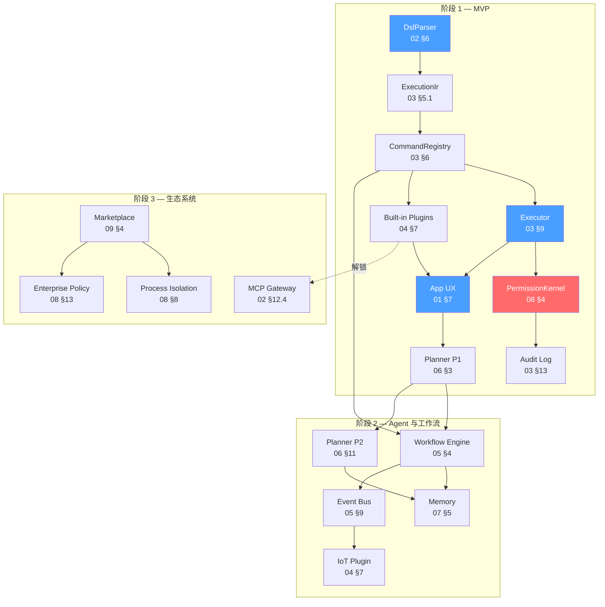
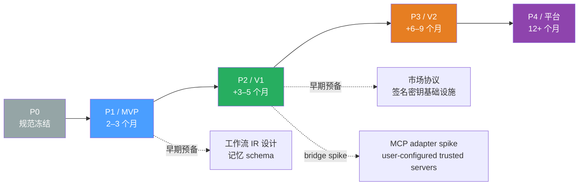
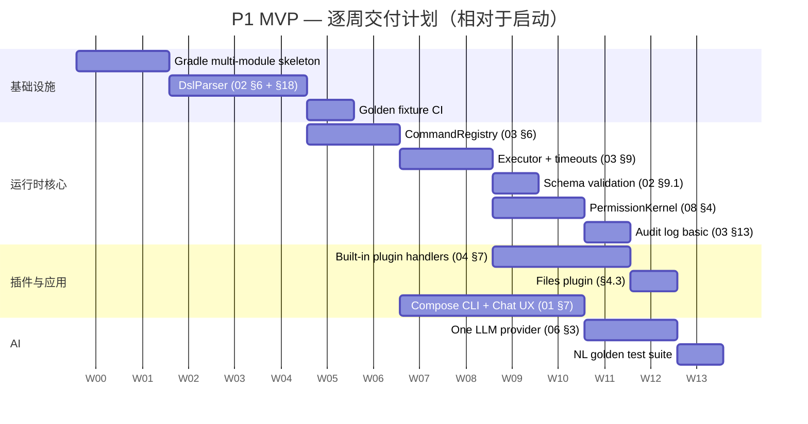
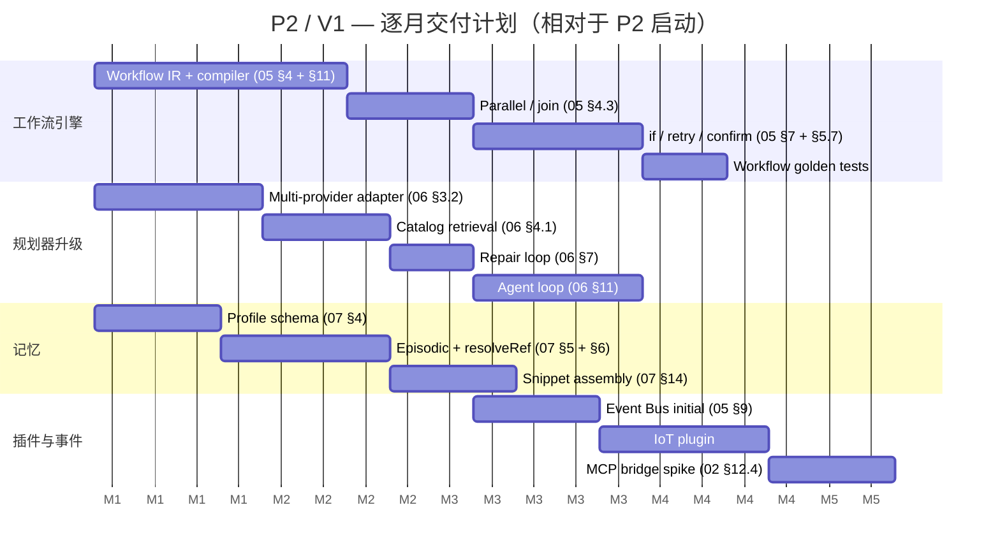

# MCOS 路线图（Roadmap）

> **语言:** [English](../en/10-roadmap.md) · 中文（当前）

> **状态:** 草案  
> **版本:** 0.1.0  
> **最后更新:** 2026-08-24  
> **依赖:** [00-vision.md](./00-vision.md)、[01-architecture.md](./01-architecture.md)、[02-command-protocol.md](./02-command-protocol.md)、[03-runtime.md](./03-runtime.md)、[04-plugin-sdk.md](./04-plugin-sdk.md)、[05-workflow.md](./05-workflow.md)、[06-agent.md](./06-agent.md)、[07-memory.md](./07-memory.md)、[08-security.md](./08-security.md)、[09-marketplace.md](./09-marketplace.md)、[11-implementation-status.md](./11-implementation-status.md)

> **灵感来源:** Apache 基础设施成熟度模型 · Kubernetes 分阶段交付（alpha → beta → GA）· Rust edition 路线图 · Stripe 年度面向用户路线图 · TypeScript "规范与代码同步演进" 方法

> ✅ **实现状态:** P1（MVP）已完成、**P2 退出标准全部落地**（[§5.6.1](#561-p2-退出标准检查清单)）——12 个 Gradle 源码模块、1028 个测试、四个内置插件、市场客户端与 `mcos-server`（见 [11-implementation-status.md](./11-implementation-status.md)）。最后两项开放标准 —— 多轮 Agent 循环与事件触发配方 —— 已于 2026-08-24/25 交付；剩余 P2 行（IoT / Intent 插件生态）属生态工作，不是退出标准。下文各时间跨度仍为示意，不构成承诺。

---

## 1. 指导策略（Guiding Strategy）

### 1.0 构建顺序

按以下顺序构建：

```text
Protocol → Runtime → Built-in Plugins → App UX → Planner → Workflow → Memory → Marketplace
```

而不是：

```text
Pretty chat UI → hard-code a few Intents → call it an Agent
```

采用 Apache 式的基础设施思维：**先做规范与内核，再做皮肤**。

### 1.1 设计原则（Design Principles）

本路线图中每一项排期与范围划定决策都源自以下五条原则：

| # | 原则 | 含义 | 理由 |
|---|-----------|---------|-----|
| 1 | **规范优先（Spec-first）** | 设计文档是事实来源；代码只是其派生物。任何代码与规范的偏离都是代码的 bug，而非规范的 bug —— 直到明确发布一次规范修订为止。 | 消除那种会让长寿基础设施腐烂的 "代码与文档渐渐脱节" 问题。每次规范变更都会提升 RFC 版本号（[02 §14](./02-command-protocol.md)），使偏离可被审计。 |
| 2 | **垂直切片可演示（Vertical-slice-demoable）** | 每个 2 周迭代（sprint）必须产出至少一个端到端可演示切片（用户输入某些内容 → 设备执行某些操作 → 展示结果）。不存在只产内部管道而无可演示物的 "奠基迭代"。 | 让项目保持诚实 —— 如果无法演示，说明你还没真正理解。强制尽早安验，避免在阶段末尾进行大爆炸式集成。 |
| 3 | **每个阶段都有安全底线（Safety floor every phase）** | 每个阶段都要交付一套完整（哪怕最小化）的安全方案：P1 = `decideConfirmation` + 审计日志 + 提示词注入编译器检查（[08 §17](./08-security.md)）；P2 = 进程隔离 + 企业策略；P3 = 市场签名 + 崩溃隔离。任何阶段都不会交付 "以后再加安全" 的承诺。 | 安全的事后补做比一开始就内建要难 10 倍。一个从第一天起就没有权限内核的命令执行 OS 是一种负债。 |
| 4 | **协议先于平台（Protocol before platform）** | 命令协议（Command Protocol，[02](./02-command-protocol.md)）和运行时 API（Runtime API，[03](./03-runtime.md)）先冻结，市场（Marketplace，[09](./09-marketplace.md)）或企业特性（Enterprise Features，[08 §13](./08-security.md)）随后再在其之上叠加。协议是契约；其他一切都是实现。 | 一个在其生态之下变动的协议会摧毁信任。P1 冻结解析器、IR 与错误码；P2 冻结工作流 IR；P3 冻结市场元数据 schema。 |
| 5 | **文档跟随代码，而非反过来** —— *冻结之后* | 在规范章节冻结之前（P0），文档先行。冻结之后（P1+），代码中任何行为变更都必须伴随一次规范修订 + CHANGELOG 条目。代码绝不会悄然偏离。 | 这就是 "活的文档" 与 "历史虚构" 之间的差别。规范是契约，不是建议。 |

### 1.2 依赖拓扑（Dependency Topology）

上面的构建顺序并非线性，而是一个有向无环图（DAG）。下图展示了哪些子系统阻塞哪些子系统，以及每条边在哪个阶段被解锁：



**阅读指南：** 蓝色节点是 P1 的硬阻塞项 —— 没有它们什么都演示不了。红色节点（`PermissionKernel`）是安全底线。箭头表示 "阻塞" —— 目标在源节点可运行之前无法启动。虚线边（`Builtin → MCP`）表示 P3 的 MCP 网关依赖于 P1 插件加载器成熟到足以承载适配器插件。

---

## 2. 阶段概览（Phase Overview）

### 2.0 阶段摘要

| 阶段 | 时间跨度（horizon） | 主题 | 成果 |
|-------|---------|-------|---------|
| **P0** | 2–4 周 | 规范冻结 + 骨架 | 设计文档 + 黄金测试用例（golden fixture，代码推迟到 P1） |
| **P1** | 2–3 个月 | **MVP 移动端 CLI** | 本地 DSL 执行真实设备动作 |
| **P2** | +3–5 个月 | Agent + 工作流（Workflow） | 多步骤自然语言（NL）目标可靠工作 |
| **P3** | +6–9 个月 | 生态系统 | 市场、MCP、共享 |
| **P4** | 12 个月+ | 平台 | 企业、多设备、推动标准 |

各时间跨度仅为示意，不构成承诺。

### 2.1 术语对齐

MCOS 用三套相互重叠的词汇指代同一时间线。下表明确给出规范化映射 —— 文档集中的每一篇（[06 §17](./06-agent.md)、[07 §16](./07-memory.md)、[08 §17](./08-security.md)、[09 §1.1](./09-marketplace.md)、[11 §5](./11-implementation-status.md)）都遵循此约定：

| 阶段标签 | 发布标签 | 含义 |
|-------------|---------------|---------|
| **P1** | **MVP** | 最小可行产品（Minimum Viable Product）—— DSL 在设备上执行，一个 LLM 提供商，内置插件 |
| **P2** | **V1** | 首个完整发布 —— 通过工作流（Workflow）+ 记忆（Memory）+ 多提供商规划器（Planner）完成多步骤目标 |
| **P3** | **V2** | 生态发布 —— 市场、第三方插件、MCP、企业 |
| **P4** | — （方向性） | 平台押注 —— 并非带标签的发布，仅为方向性研究与开发 |

> ⚠️ **记号约定：** 本仓库中的 `P1`/`P2`/`P3` 专属**实现阶段**（P1 = MVP、P2 = V1、P3 = V2），如上表所定义。[00-vision.md](./00-vision.md) §4 此前使用 `P1`–`P8` 标注设计原则，与阶段标签冲突——现已改名为 **Principle 1–8** 以消除歧义。若你在 00-vision 遇到看似指原则（非阶段）的残留 `P1`–`P8` 引用，它是遗留文本，应读作"Principle N"。

### 2.2 阶段依赖图

阶段在宏观层面是串行的，但一个阶段内部的、其 P 级阻塞项已解决的子系统可以并行推进：



虚线边代表 **早期预备** —— 可以在上一阶段开始、且不阻塞该阶段的设计工作。例如，工作流 IR schema（[05 §4](./05-workflow.md)）可以在 P1 期间就设计，尽管工作流引擎（Workflow Engine）本身是 P2 交付物；这避免了在阶段边界出现 "空白页" 起步。`bridge spike` 边是一个受控例外：一个最小 MCP 适配器（仅 [02 §12.4](./02-command-protocol.md) schema 转换、用户配置的可信 server）在 P2 期间验证生态采纳论点，无需等待完整的 P3 生产级适配器——范围护栏见 [§5.7](#57-v1-的显式非目标)。

### 2.3 成功门槛（Success Gates）

每个阶段都有 **单一主指标** 作为其退出门槛（exit gate）。在该指标达成前，阶段不算完成 —— 无论有多少功能 "大体可用"：

| 阶段 | 主指标 | 目标 | 测量方式 |
|-------|---------------|--------|-------------|
| **P0** | 规范完备度 | 全部 12 份 RFC（00–11）达到 "可实现" 细节水平 + 黄金测试用例 CI 通过 | 规范评审 + [11 §4](./11-implementation-status.md) 用例覆盖率 |
| **P1** | DSL 往返可靠性 | 100% 的黄金测试用例都能 解析 → 执行 → 产出预期 IR；≥1 个外部 `hello.world` 插件 | [02 §16](./02-command-protocol.md) 一致性矩阵 + [11 §6](./11-implementation-status.md) 开发路径第 4 步 |
| **P2** | NL→目标 准确率 | 在黄金 NL 测试集上 p85 话语到正确 IR 的准确率 ≥ 80% | [06 §16](./06-agent.md) 评测套件 |
| **P3** | 生态采用 | ≥ 10 个可被内测用户（dogfooder）安装的外部插件或 MCP 服务器；冷启动安装 → 运行 < 10 分钟 | 市场遥测 + 手动安装计时 |
| **P4** | 平台牵引力 | ≥ 1 个 OEM 预装 或 ≥ 1 份提交给标准组织的提案 | 伙伴关系里程碑（非代码） |

---

## 3. 阶段 0 —— 基础（Foundations）

### 3.0 目标与交付物

**目标**

- 冻结命令协议（Command Protocol）v0.1 草案  
- 仓库布局：`docs/` 设计集（源码模块推迟到阶段 1）  
- CI：文档发布  

**交付物（Deliverables）**

- [x] 架构文档集（`docs/00`–`10`）
- [x] 黄金 DSL 用例目录（`docs/fixtures/01`–`08`，含正例与反例）
- [x] CONTRIBUTING + LICENSE（Apache-2.0）
- [x] Kotlin 多模块骨架 —— **P1 已交付**（12 个源码模块，布局与 [REPOSITORIES.md](./REPOSITORIES.md) 一致）

> 阶段 0 设计已完成，且阶段 1 已交付骨架、DSL 解析器与完整 MVP 管线 —— 已交付清单见 [11-implementation-status.md](./11-implementation-status.md) §6。

### 3.1 P0 交付物清单

| 条目 | 状态 | 位置 |
|------|--------|----------|
| 12 份 RFC 设计文档（00–11） | ✅ 完成 | `docs/en/00-vision.md` – `docs/en/11-implementation-status.md` |
| 双语镜像（EN + ZH） | ✅ 完成 | `docs/en/` + `docs/zh/` |
| 黄金 DSL 用例（正例 + 反例） | ✅ 完成 | `docs/fixtures/01`–`08` |
| 仓库 README + 中文 README | ✅ 完成 | `README.md`、`README.zh-CN.md` |
| REPOSITORIES 模块索引 | ✅ 完成 | `docs/en/REPOSITORIES.md` |
| CONTRIBUTING（双语同步规则） | ✅ 完成 | `CONTRIBUTING.md` |
| CHANGELOG（扩充历史） | ✅ 完成 | `CHANGELOG.md` |
| 实现状态矩阵 | ✅ 完成 | [11-implementation-status.md](./11-implementation-status.md) |
| Kotlin 多模块骨架 | ✅ P1 已交付 | 12 个模块——[REPOSITORIES.md](./REPOSITORIES.md) |
| 参考实现 DSL 解析器 | ✅ P1 已交付 | `mcos-runtime-core` `parse/`（DslParser） |

### 3.2 P0 → P1 过渡门槛

下列三道门槛全部通过后，P1 实现方可开始：

1. **规范评审通过** —— 每份 RFC（01–09）都已被 ≥ 2 位评审者从头到尾读过；规范正文不再有未关闭的 "TBD" 或 "待定义" 标记。
2. **用例 CI 通过** —— 8 个黄金用例（5 个正例往返 + 3 个必须拒绝的反例）在一个轻量校验脚本中正确解析/拒绝。这在任何 Kotlin 代码存在之前就验证了文法。
3. **双语对齐已验证** —— 每份文档的 EN 与 ZH 版本拥有相同的章节计数、代码块计数，且代码内容逐字节相同（通过自动化对齐检查验证）。

---

## 4. 阶段 1 — MVP（2–3 个月）

> **目标:** 一个可运行的移动端 CLI，能在设备上执行 **经过校验的 DSL**。

### 4.1 P1 里程碑甘特图（Gantt）

来自 [11 §6](./11-implementation-status.md) 的 10 步开发路径映射到逐周排期。同一周内的条目可由团队成员并行推进。**注意：** 以下甘特图中的日期为示意性的相对周偏移（Week 1 = 项目启动），并非日历日期——排期自 P1 开发启动时开始，而非图中所示日期。



关键路径（critical path）：**骨架 → 解析器 → 注册表 → 执行器 → 插件 → 应用 → 规划器**。解析器是单一最长的杆 —— 在 DSL→IR 跑通之前，下游什么都启动不了。

### 4.1 App（`mcos-android`）

App 是面向用户的外壳，通过 AIDL IPC 承载运行时（[01 §7](./01-architecture.md)）。P1 范围：

| 交付物 | 规范引用 | 退出标准（exit criteria） |
|-------------|---------------|---------------|
| 带 CLI 输入 + 历史的 Jetpack Compose 外壳 | [01 §7](./01-architecture.md)（App↔Runtime IPC） | 用户可键入一条 DSL 命令并看到结果 |
| 聊天面板（轻量 —— 可渲染 NL + DSL 预览） | [06 §8](./06-agent.md)（确认启发式） | NL 输入在执行前产出 DSL 预览 |
| 设置：API keys、启用的插件 | [04 §6](./04-plugin-sdk.md)（`HostServices`） | 用户可输入 OpenAI key；可开关插件 |
| 运行进度 + 错误呈现 | [03 §11.5](./03-runtime.md)（`RuntimeEvent`） | 进行中的命令展示进度；错误显示 `McosErrorCode` |
| 运行时绑定（AIDL 服务连接） | [01 §7](./01-architecture.md) | App 在启动时绑定运行时服务；销毁时解绑 |

### 4.2 运行时（Runtime）

运行时是设备端的内核。P1 范围 —— 每个子系统及其规范交叉引用：

| 子系统 | 规范引用 | P1 范围 | 明确不在 P1 中 |
|-----------|---------------|----------|----------------------|
| 解析器（Parser，DSL ↔ IR） | [02 §6](./02-command-protocol.md)、[03 §5.1](./03-runtime.md) | 完整文法：命令、多语句 | 管道 `a() \| b()`（[02 §17](./02-command-protocol.md) 未来扩展） |
| CommandRegistry | [03 §6](./03-runtime.md) | 按 id 查找、版本共存、命名空间检查 | 热重载（[03 §6.5](./03-runtime.md)） |
| Executor | [03 §9](./03-runtime.md) | 派发、协作式取消、看门狗 | 速率限制（[08 §10](./08-security.md)） |
| PermissionKernel | [08 §4](./08-security.md) | `decideConfirmation` 算法、`ConfirmationPrompt`、授权缓存 | 企业策略（[08 §13](./08-security.md)） |
| 审计日志（Audit Log） | [03 §13](./03-runtime.md) | 基础的仅追加本地日志 | 加密导出、HMAC 签名（[08 §14](./08-security.md)） |
| 工作流（仅 sequence） | [05 §4](./05-workflow.md) | 多行脚本：`a(); b(); c()` | parallel、`if`、`loop`、`confirm`（[05 §15](./05-workflow.md)） |

### 4.3 SDK + 内置插件

> 权威命令清单见 [04 §17](./04-plugin-sdk.md)（单一真相源）。下表为 P1 规划摘要；如有差异以 04 §17 为准。

| 插件 | 命令 |
|--------|----------|
| System | `sys.notify`、`sys.share`、`sys.clipboard`、`sys.openUrl`、`sys.vibrate` |
| System（设备查询） | `sys.device.battery`、`sys.device.wifi`、`sys.device.screen`、`sys.device.volume`、`sys.device.location`、`sys.device.brightness` |
| Camera | `camera.capture`、`camera.scan` |
| Files | `file.list`、`file.search`、`photo.search`、`photo.compress` |
| Hello（参考示例） | `hello.world` |
| Weather（可选） | `weather.today`（联网） |

#### 4.3.1 命令数量预算

成功指标 "≥15 个有文档的内置命令"（[§11.1](#111-mvp-指标)）分解如下：

| 插件 | 命令 | 数量 |
|--------|----------|-------|
| System | `sys.notify`、`sys.share`、`sys.clipboard`、`sys.openUrl`、`sys.vibrate` | 5 |
| System（设备查询） | `sys.device.battery`、`sys.device.wifi`、`sys.device.screen`、`sys.device.volume`、`sys.device.location`、`sys.device.brightness` | 6 |
| Camera | `camera.capture`、`camera.scan` | 2 |
| Files | `file.list`、`file.search`、`photo.search`、`photo.compress` | 4 |
| Hello（示例） | `hello.world` | 1 |
| Weather（可选） | `weather.today` | 1 |
| **合计** | | **19（18 核心 + 1 可选）** |

> 这 6 个 `sys.device.*` 命令都是对 Android 系统 API 的薄封装。实现简单，但能提供 "感觉像一个真正的 OS" 的演示密度。它们位于保留的 `sys` 根命名空间下（归 `mcos.plugin.system` 所有，见 [04 §17](./04-plugin-sdk.md)）——`device` 不是保留命名空间根。

### 4.4 AI（最小化）

P1 仅交付 **规划器（Planner）** —— 一个无状态的一次性编译器（`utterance → IR`）。多轮 Agent 循环是 P2（[06 §11](./06-agent.md)）。

| 能力 | P1 范围 | P2+（推迟） |
|------------|----------|----------------|
| 提供商 | 一个 OpenAI 兼容提供商（chat → DSL） | 多提供商（[06 §3.2](./06-agent.md)） |
| 输出 | 单条命令或短序列 | 工作流 IR、结构化 Clarify/Refuse |
| 目录检索 | 仅关键词匹配 | 基于嵌入（[06 §4.1](./06-agent.md)） |
| 确认 | `sideEffectClass ≥ write` → 执行前展示 DSL 预览 | 完整置信度启发式（[06 §8](./06-agent.md)） |
| 修复循环 | — （一次性：编译失败则报错） | `maxRepair = 2`（[06 §7](./06-agent.md)） |

### 4.5 MVP 的明确非目标

| 非目标 | 推迟原因 |
|----------|-------------|
| 市场 | P3 交付物 —— 需要尚不存在的签名基础设施 + 审核流水线。P1 使用侧载调试安装。 |
| 完整工作流图（parallel、loop、switch） | P2 交付物 —— P1 仅 sequence 的路径已覆盖大多数单步与短链场景。parallel/conditional 会增加编译期复杂度。 |
| 无障碍 RPA | 不在任何阶段范围内（[00 §6](./00-vision.md) 非目标）—— 相对于屏幕抓取，更倾向于 App Functions 桥接。 |
| 云同步 | P3 交付物 —— 记忆云同步需要一个尚不存在的后端。P1 记忆仅本地。 |
| 完美 NL | 从来不是目标 —— MCOS 是一个命令 OS，不是聊天机器人。规划器是一个便利层；DSL 始终可作为兜底。 |

### 4.6 MVP 演示脚本

```text
> camera.capture()
> photo.search(date="today")
> photo.compress(quality=80)
> sys.notify(title="MCOS", text="MVP works")

NL: 帮我拍张照
→ camera.capture()
```

#### 4.6.1 MVP 退出标准检查清单

只有当 **所有** 复选框都勾选时，阶段才算退出 —— 而不是当演示脚本 "在我机器上能跑" 时：

- [ ] **用例通过** —— 100% 的黄金用例（正例 + 反例）通过 `DslParser`（[02 §16](./02-command-protocol.md)）
- [ ] **外部插件** —— 一位外部开发者（非核心团队）能通过 SDK 实现 `hello.world` 并从 CLI 调用它（[04](./04-plugin-sdk.md)）
- [ ] **DSL 预览** —— 任何 `sideEffectClass ≥ write` 的命令在执行前展示其 DSL 形式（[06 §8](./06-agent.md)）
- [ ] **权限流程** —— `camera.capture` 触发一个 `ConfirmationPrompt`；授权/拒绝端到端可用（[08 §6](./08-security.md)）
- [ ] **审计日志** —— 每条执行过的命令（成功 + 失败）都带 时间戳 + 参数 + 结果出现在本地审计日志中（[03 §13](./03-runtime.md)）
- [ ] **NL 单命令** —— `帮我拍张照` → `camera.capture()` 通过至少一个 LLM 提供商可用（[06 §3](./06-agent.md)）

---

## 5. 阶段 2 — Agent 与编排（Agent & Orchestration，3–5 个月）

> **目标:** AI 借助工作流（Workflow）+ 记忆（Memory）完成 **多步骤** 任务。

### 5.0 P2 里程碑甘特图

> **注意：** 日期为示意性的相对月偏移（Month 1 = P2 启动），并非日历日期。排期自 P2 开发启动时开始。



### 5.1 工作流引擎（Workflow Engine）

| 特性 | 规范引用 | P2 范围 | 推迟到后续 |
|---------|---------------|----------|-------------------|
| Sequence | [05 §4.2](./05-workflow.md) | ✓ （在 P1 已交付） | — |
| Parallel `all` join | [05 §4.3](./05-workflow.md) | ✓ | — |
| `$ref` 绑定 | [05 §6](./05-workflow.md) | ✓ | — |
| 逐步重试 | [05 §7.1](./05-workflow.md) | ✓ 基础（固定退避） | 完整 `backoffMs[]`/`retryOn[]` |
| `confirm` 门控 | [05 §5.7](./05-workflow.md) | ✓ | — |
| `if` / `switch` | [05 §15](./05-workflow.md) | ✓ 基础 `if` | `switch` + `loop` + `wait_event` |

> 与 [05 §15](./05-workflow.md) "MVP vs V1 Feature Gate" 对齐。P2 = V1。

### 5.2 规划器（Planner）

| 特性 | 规范引用 | P2 范围 | 推迟到 P3 |
|---------|---------------|----------|----------------|
| 多提供商 | [06 §3.2](./06-agent.md) | ✓ （≥ 3 个提供商） | — |
| 目录检索 | [06 §4.1](./06-agent.md) | ✓ 基于嵌入 | + 约束解码 |
| 修复循环 | [06 §7](./06-agent.md) | ✓ `maxRepair = 2` | — |
| 结构化 Clarify/Refuse | [06 §5.5](./06-agent.md) | ✓ | — |
| 多轮 Agent 循环 | [06 §11](./06-agent.md) | ✓ （`maxProbeSteps = 3`） | — |
| 语音 STT | [06 §12](./06-agent.md) | ✓ | + 部分假设 UX（P3） |
| 设备端模型 | [06 §13](./06-agent.md) | — | 实验 → 受支持（P3） |

### 5.3 记忆（Memory）

| 特性 | 规范引用 | P2 范围 | 推迟到 P3 |
|---------|---------------|----------|----------------|
| Profile（地点/人物/设备） | [07 §4](./07-memory.md) | ✓ | — |
| 显式 "记住" + 情节记忆（episodic） | [07 §7](./07-memory.md) + [§8](./07-memory.md) | ✓ | — |
| `resolveRef`（模糊/嵌入） | [07 §6](./07-memory.md) | ✓ | — |
| 片段组装（Snippet assembly） | [07 §14](./07-memory.md) | ✓ | — |
| 云同步 | [07 §11](./07-memory.md) | — | ✓ P3 |

### 5.4 插件

| 插件 | 命令 | 规范引用 |
|--------|----------|---------------|
| Intent / Deep Link | `intent.start`、`deeplink.open` | [02 §12.5](./02-command-protocol.md) |
| App Functions 桥接 | `appfn.invoke` | [02 §12.5](./02-command-protocol.md) |
| IoT（Home Assistant / Tuya） | `home.light.*`、`home.ac.*`、`home.curtain.*` | [04 §7](./04-plugin-sdk.md) |
| 连接性配方 | `wifi.connect`、`vpn.connect` | [08 §12](./08-security.md)（出站） |

### 5.5 事件总线（Event Bus，初始）

| 事件 | 触发条件（trigger） | 工作流用途 |
|-------|---------|-------------|
| `battery.low` | Android `ACTION_BATTERY_LOW` 广播 | 建议省电模式 |
| `wifi.connected` | SSID 变化检测 | 自动运行预授权配方（如在办公室连 VPN） |
| `screen.on` / `screen.off` | 显示状态广播 | 门控昂贵的同步操作 |

> 事件通过 `$memory` 事件过滤器接入工作流触发器（[05 §9.2](./05-workflow.md)）。后台事件触发器若 `sideEffectClass ≥ write`，需提升确认级别（[08 §6.3](./08-security.md)）。

### 5.6 退出标准

```text
NL: 打开观影模式
→ parallel home.light.dim + tv.on + curtain.close + ac.set

NL: 导航回公司
→ resolves Memory office

Event: SSID=Office → suggest/run vpn.connect (pre-authorized recipe)
```

#### 5.6.1 P2 退出标准检查清单

- [x] **NL→目标 准确率** —— 在黄金 NL 测试集上 p85 准确率 ≥ 80%（[06 §16](./06-agent.md)）—— NL→IR 黄金套件全绿（已交付 fixture 集上 100% 结构准确率）
- [x] **工作流并行** —— "观影模式" 多设备并行场景正确执行 —— `WorkflowEngineTest` W21 home-movie 场景
- [x] **记忆解析** —— `导航回公司` 无需用户重新指明即可从记忆中解析出 "office" —— `resolveRef` 模糊解析 + §8.3 命名实体合并
- [x] **多提供商** —— ≥ 3 个 LLM 提供商可在设置中互换 —— `LlmProviderRegistry` + 健康/回退链
- [x] **Agent 循环** —— 多轮 探查→重规划→执行 对 ≥ 3 步目标可用（[06 §11](./06-agent.md)）—— `McosAgent`（2026-08-24）
- [x] **事件触发** —— `wifi.connected` 事件端到端触发一个预授权配方 —— `EventTriggerManager` + 预授权 stamp + Android 装配方即布防（2026-08-25）

### 5.7 V1 的显式非目标

镜像 [§4.5](#45-mvp-的显式非目标)（MVP 非目标）。V1 增加了工作流 + 记忆 + 事件，但刻意推迟了生态层。MCP bridge spike（[§5.0](#50-p2-里程碑甘特图) 任务 `p2-14`）是**唯一**的跨阶段例外——一个受控 spike，不是生产功能：

| 非目标 | 推迟原因 |
|--------|----------|
| 生产级 MCP 适配器（连接管理、重连、逐服务器密钥 UI） | P3 交付物——远程 MCP server 是网络工具；安全的出网管控（[08 §12](./08-security.md)）需要进程隔离（[08 §8](./08-security.md)），而进程隔离是 P3。P2 spike 验证 schema 转换 + 采纳论点，不验证生产级连接处理。 |
| MCP 公开目录 / 市场浏览 | P3 交付物——依赖市场签名基础设施（[09 §6](./09-marketplace.md)）+ 公开索引。P2 spike 仅限用户手动配置的可信 server（无目录、无发现）。 |
| 第三方插件进程隔离 | P3 交付物——V1 仅交付 builtin + sideloaded-debug 插件。权限内核决策算法（`decideConfirmation`、`decideEgress`）与 P1 相同；P3 增加的是*强制力*（进程边界），不是新逻辑。 |
| 记忆云同步 | P3 交付物——V1 记忆仅本地。云同步需要尚不存在的后端 + 认证。 |
| 端侧基础模型 | P3+——V1 使用云端 LLM 提供商（≥ 3 个可互换）。端侧模型是后续的电池 / 延迟优化。 |

> **Spike 范围护栏：** P2 MCP bridge spike 限于 (a) [02 §12.4](./02-command-protocol.md) schema 转换（规范已定义）、(b) 连接**用户手动配置的可信 server**（无公开目录）、(c) 密钥经 config/env 注入（无逐服务器密钥 UI）、(d) 手动调用（无自动发现）。其目的是在 P3 *之前*回答战略问题"协议会不会被采纳？"（[00 §2](./00-vision.md)）——不是交付生产级 MCP 客户端。若 spike 表明论点不成立，P3 的 MCP 投资可重新评估。

---

## 6. 阶段 3 — 生态系统（Ecosystem，6–9 个月）

> **目标:** 第三方交付能力；MCP 成为一等公民。

### 6.0 P3 关键路径

P3 的关键路径（critical path）是：**市场签名基础设施 → 公共索引 → 第三方插件入驻**。没有签名包校验（[09 §6](./09-marketplace.md)），运行时无法安全加载第三方代码，因此进程隔离（[08 §8](./08-security.md)）与企业策略（[08 §13](./08-security.md)）都依赖于市场密钥基础设施先行就位。

### 6.1 市场（Marketplace）

| 特性 | 规范引用 | P3 范围 |
|---------|---------------|----------|
| 公共索引 + 签名 | [09 §6](./09-marketplace.md) | 发布者密钥注册、Ed25519 签名、安装时签名校验 |
| 安装 / 更新 / 权限差异 | [09 §7](./09-marketplace.md) | `InstallState` 状态机、`PermissionDiff` 算法、每次更新征求用户同意 |
| 配方（Recipe）商店 | [09 §8](./09-marketplace.md) | 配方发布、搜索、带占位符绑定的安装向导 |

> P3 分发模型：社区插件走公共索引，企业走私有 registry。P1/P2/P3 市场阶段划分表见 [09 §1.1](./09-marketplace.md)，P1/P2/P3 特性门控见 [09 §15](./09-marketplace.md)。

### 6.2 MCP 网关（MCP Gateway）

| 特性 | 规范引用 | P3 范围 |
|---------|---------------|----------|
| `mcos.plugin.mcp` 适配器 | [04 §10](./04-plugin-sdk.md) | 成熟适配器：逐服务器启用、密钥经 `SecureStore` |
| MCP 工具 → MCOS schema 映射 | [02 §12.4](./02-command-protocol.md) | 转换表，对未映射类型 fails-closed（已由 P2 spike 验证） |
| 逐服务器密钥 | [04 §6.4](./04-plugin-sdk.md) | API keys 存于 `SecureStore`，通过 `{{secret.*}}` 模板注入 |

> **为什么这是 P3 而非 P2：** P2 bridge spike（[§5.7](#57-v1-的显式非目标)）已用用户配置的可信 server 验证了 schema 转换 + 生态论点。本节的生产级适配器新增三件 spike 刻意省略的东西——稳健的连接管理（重连 / 退避）、经 `SecureStore` 的逐服务器密钥 UI、以及对远程 MCP server 的出网管控——三者都依赖进程隔离（[08 §8](./08-security.md)，P3）才能对联网工具可信而非"安全剧场"。

### 6.3 平台加固（Platform Hardening）

| 特性 | 规范引用 | P3 范围 |
|---------|---------------|----------|
| 第三方插件进程隔离 | [08 §8](./08-security.md) | 非内置插件采用绑定服务隔离（P3 默认） |
| 加密审计导出 | [08 §14](./08-security.md) | HMAC 签名的 JSONL 导出，用于企业合规 |
| 企业白名单 | [08 §13](./08-security.md) | `EnterprisePolicy` 数据类（12 字段），最严格者胜出的合并规则 |
| 崩溃隔离（crash quarantine） | [08 §15.3](./08-security.md) | 60 秒内崩溃 3 次 → 隔离 + 回滚或禁用 |

> 与 [08 §17](./08-security.md) 安全阶段划分对齐：P3 = 第三方隔离 + 加密审计 + 企业策略 + 崩溃隔离。P1/P2 的决策算法（`decideConfirmation`、`decideEgress`）保持不变 —— P3 增加的是 *执行强度*，而非新的决策逻辑。

### 6.4 社区

- **插件模板** —— 预接好 `mcos-sdk-gradle` 的起步仓库（[04 §13.2](./04-plugin-sdk.md)）
- **一致性测试套件（Conformance test suite）** —— 作为可执行制品发布；市场 CI 门控镜像它（[09 §5.1](./09-marketplace.md)）
- **公开的路线图 issue** —— 社区可看到并对即将到来的特性投票
- **开发者文档** —— 入门指南、cookbook、从规范生成的 API 参考

### 6.5 退出标准

- ≥ 10 个外部插件或 MCP 服务器被内测用户在用  
- 冷启动安装 → 浏览 → 安装 IoT 插件 → 运行场景 < 10 分钟  

---

## 7. 阶段 4 — 平台（Platform，12+ 个月）

### 7.0 方向性押注（Directional Bets）

方向性押注：

| 押注 | 描述 |
|-----|-------------|
| 多设备 | 手机规划；平板/手表执行子集 |
| OEM 伙伴关系 | 预装运行时 + OEM 命令包 |
| 标准 | 推动命令协议获得更广泛采用 |
| 设备端模型 | 强离线规划器 SKU |
| 持久云端运行 | 企业编排封装 |
| iOS 探索 | 若协议成功 —— 独立的运行时研究 |

不要让这些押注阻塞 P1–P3。

### 7.1 触发条件（Trigger Conditions）

每个方向性押注都有一个前置条件，必须先满足才投入。这些不是截止日期 —— 它们是就绪信号：

| 押注 | 触发条件（trigger condition） | 依赖 |
|-----|-------------------|------------|
| 多设备 | P3 市场稳定 + ≥ 1 个 OEM 表达兴趣 | 需要跨设备记忆同步（[07 §11](./07-memory.md)） |
| OEM 伙伴关系 | 协议在 v1.0 冻结 + ≥ 5k 活跃内测用户 | 需要企业策略（[08 §13](./08-security.md)）+ 崩溃隔离（[08 §15.3](./08-security.md)） |
| 推动标准 | 协议规范被 ≥ 2 个独立实现采用 | 需要公共一致性套件（[§6.4](#64-社区)） |
| 设备端模型 | 简单意图的设备端模型延迟 < 800ms p95（[06 §15.1](./06-agent.md)） | 需要 P2 的设备端实验 → 生产化 |
| 持久云端运行 | 企业对长时间（数小时）运行工作流的需求 | 需要持久工作流运行日志（[05 §15](./05-workflow.md)） |
| iOS 探索 | 命令协议被证明可移植（≥ 1 个非 Android 概念验证） | 独立代码库；仅协议层面的投入 |

---

## 8. 仓库交付顺序

### 8.0 时间线

```text
Week 0–2     docs + skeletons
Week 2–6     runtime parser/registry/executor + system/camera plugins
Week 6–10    Compose CLI/Chat + permissions UX + audit
Week 10–12   first LLM provider + golden NL tests
Month 4–6    workflow parallel + memory + IoT
Month 6–9    MCP + marketplace beta
```

随团队规模调整；保持每 2 周都有 **垂直切片（vertical slice）** 可演示。

### 8.1 垂直切片演示节奏

每个 2 周迭代交付一个可演示的端到端切片。切片不是 "特性 X 已实现" —— 而是 "用户能在 App 中做 Y 并看到结果"：

| 迭代（sprint） | 切片 | 演示命令 | 解锁 |
|--------|-------|-------------|----------|
| S1（P1 wk 2） | 骨架 + `hello.world` | `hello.world()` → "Hello, MCOS!" | 插件加载器 |
| S2（P1 wk 4） | 解析器 + `sys.notify` | `sys.notify(title="Hi", text="It works")` | DSL→IR 路径 |
| S3（P1 wk 6） | `camera.capture` + 执行器 | `camera.capture()` → 照片已保存 | 真实 Android API 集成 |
| S4（P1 wk 8） | 权限流程 + `photo.compress` | 确认提示 → 压缩 → 结果 | 安全底线 |
| S5（P1 wk 10） | Compose CLI + 审计 | 带历史的完整 CLI 会话 | 面向用户的 App |
| S6（P1 wk 12） | NL → DSL（1 个提供商） | `帮我拍张照` → `camera.capture()` | MVP 退出门槛 |
| S7（P2 wk 8） | 工作流并行 + 记忆 | "观影模式" 多设备场景 | V1 核心门槛 |
| S8（P2 wk 12） | MCP bridge spike | `mcp.<server>.<tool>()` 对可信 server 跑通 | 生态论点信号 |

### 8.2 依赖解锁图

派生自 [11 §6](./11-implementation-status.md) 推荐开发路径。每行展示某一步解锁了什么：

| 步骤（[11 §6](./11-implementation-status.md)） | 解锁 |
|------|---------|
| 1. Gradle 骨架 | 一切 |
| 2. `DslParser` | 步骤 3–6、所有插件、规划器 |
| 3. `CommandRegistry` | 步骤 4（Executor）、步骤 8（插件处理器） |
| 4. `Executor` | 步骤 6（PermissionKernel）、步骤 7（审计）、步骤 8（插件） |
| 5. Schema 校验 | 规划器（编译正确性） |
| 6. `PermissionKernel` | 步骤 7（审计记录授权/确认）、真实设备命令 |
| 7. 审计（基础） | 合规演示、P2 加密审计 |
| 8. 真实插件处理器 | 可演示切片（camera、system） |
| 9. `files` 插件 | `photo.search` / `photo.compress` 演示 |
| 10. 一个 LLM 提供商 | NL 路径、MVP 退出门槛 |

> **解析器是单一最长的杆。** 步骤 3–10 全都依赖步骤 2。若解析器延后 1 周，整个 P1 排期就延后 1 周。

---

## 9. 人员配置草案（仅供参考）

### 9.0 角色矩阵

| 角色 | 关注点 |
|------|-------|
| 运行时负责人 | 协议、执行器、安全内核 |
| Android 应用 | Compose UX、语音、商店 UI |
| 插件工程 | Camera/files/IoT/MCP |
| AI 工程 | 提供商、编译器、评测集 |
| 后端 | 市场/同步（自 P3 起） |
| 技术写作 | 让 RFC 保持诚实 |

只要范围纪律严守，小团队（3–5 人）即可达成 MVP。

### 9.1 阶段人员配置爬坡

| 阶段 | 团队规模 | 新增 | 理由 |
|-------|-----------|-----------|-----------|
| **P0** | 1–2（兼职） | — | 设计 + 规范撰写；尚无代码 |
| **P1** | 3–5 | 运行时负责人、Android 应用、插件工程（共享 AI） | 核心路径：解析器 → 执行器 → 应用 |
| **P2** | 4–6 | + 专职 AI 工程 | 多提供商 + Agent 循环 + 工作流需要专注的 AI 专长 |
| **P3** | 5–7 | + 后端工程（市场/同步） | 市场服务器、签名基础设施、企业特性 |
| **P4** | 可变 | + 伙伴关系 / 标准角色 | 非代码角色占主导；团队规模取决于押注 |

> 这些数字假设工程师经验丰富、能端到端拥有一个子系统。一个更大的初级团队每个阶段会需要更多时间。

---

## 10. 风险登记册（Risk Register）

### 10.0 核心风险

| 风险 | 缓解措施（Mitigation） |
|------|------------|
| NL 期望超出 MVP | 以命令 OS 定位；CLI 优先演示 |
| 无障碍诱惑 | 明确记为非目标；优先 App Functions |
| LLM 成本 / 延迟 | 缓存规划；简单意图用设备端 |
| 商店政策（Play） | 清晰声明权限；避免欺骗性自动化 |
| 命令 id 碎片化 | 保留命名空间 + 市场审核 |
| 经由插件的安全事件 | 签名、隔离、撤销通道 |
| 平台竞争（Google App Functions + Gemini / Apple App Intents + Apple Intelligence） | OS 厂商拥有结构性优势（预装、OS 级权限、强制应用厂商合作）。MCOS 差异化于开放标准 + 跨平台 + 模型可替换。尽早推进 MCP bridge spike（§5.7）+ dogfood，在 OS 整合关闭窗口之前证明采纳。 |

### 10.1 风险严重程度（Severity）× 概率（Probability）矩阵

| 风险 | 严重程度 | 概率 | 优先级 |
|------|----------|-------------|----------|
| NL 期望超出 MVP | 高 | 高 | 🔴 关键 —— 通过定位来管理 |
| 商店政策（Play） | 高 | 中 | 🟡 关注 —— 监控 Play 政策变化 |
| 经由插件的安全事件 | 高 | 低 | 🟡 预备 —— 从 P1 起纵深防御 |
| LLM 成本 / 延迟 | 中 | 高 | 🟡 管理 —— 设备端路由（P3） |
| 无障碍诱惑 | 中 | 中 | 🟢 已记录 —— 非目标已明确 |
| 命令 id 碎片化 | 中 | 低 | 🟢 市场 CI 门控（P3） |
| 平台竞争（Google/Apple） | 高 | 高 | 🔴 关键 —— 以开放标准差异化；尽早 MCP spike + dogfood |

### 10.2 附加风险

| 风险 | 缓解措施 |
|------|------------|
| LLM 提供商锁定 | 从 P2 起多提供商抽象（[06 §3.2](./06-agent.md)）；设备端模型作为 P3 兜底（[06 §13](./06-agent.md)） |
| 设备端模型碎片化 | 初期仅面向 ≥ 2 个 Android 版本；记录 NPU/GPU 要求；优雅降级到云 |
| 监管（AI Act / GDPR 自动化决策） | 所有 `sideEffectClass ≥ write` 的命令都要求显式用户确认（[08 §4](./08-security.md)）；审计日志即合规记录（[08 §14](./08-security.md)）；企业策略支持按地区限制（[08 §13](./08-security.md)） |

---

## 11. 成功指标回顾（Success Metrics Recap）

### 11.0 术语

本节使用 [§2.1](#21-术语对齐) 中确立的阶段↔发布规范化映射：**P1 = MVP**、**P2 = V1**、**P3 = V2**。这取代了先前含糊的 "V1（P2/P3 桥梁末端）" 标签 —— V1 即 P2，不是桥梁。

### 11.1 MVP 指标

| 指标 | 目标 | 测量 |
|--------|--------|-------------|
| 内置命令 | ≥ 15 个有文档 | 注册表中的命令计数（[§4.3.1](#431-命令数量预算)） |
| DSL 往返可靠性 | 100% 黄金用例通过 | [02 §16](./02-command-protocol.md) 一致性矩阵 |
| 冷启动 | < 2s 到 CLI 就绪 | 基准套件（`mcos-runtime/benchmarks`） |
| 命令执行 p95 | < 500ms（不含插件 I/O） | 基准套件 |
| 外部示例插件 | ≥ 1（`hello.world`） | 发布到市场侧载或仓库 |

### 11.2 V1（P2）指标

| 指标 | 目标 | 测量 |
|--------|--------|-------------|
| NL→IR 准确率 | 在黄金 NL 测试集上 p85 ≥ 80% | [06 §16](./06-agent.md) 评测套件 |
| 工作流并行场景 | "观影模式" 正确执行 | E2E 测试：`home.light.dim + tv.on + curtain.close + ac.set` |
| LLM 提供商 | ≥ 3 个可互换 | 提供商适配器测试 |
| 记忆解析的 NL | `导航回公司` 解析出 "office" | 带预置记忆的 E2E 测试 |
| MCP 适配器 | 可用（≥ 1 个 MCP 服务器） | 手动安装 + 调用 |

### 11.3 V2（P3 / 生态系统）指标

| 指标 | 目标 | 测量 |
|--------|--------|-------------|
| 外部插件 / MCP 服务器 | ≥ 10 个被内测用户在用 | 市场安装遥测 |
| 冷启动安装 → 运行 | < 10 分钟 | 手动计时：安装 App → 浏览 → 安装 IoT 插件 → 运行场景 |
| 一致性套件采用 | 被 ≥ 1 位外部贡献者使用 | 一致性仓库的 GitHub star / fork |
| 签名的第三方安装 | ≥ 5 个不同发布者 | 市场发布者计数 |

---

## 12. 文档维护

### 12.0 节奏

| 节奏 | 动作 |
|---------|--------|
| 每次协议变更 | 提升 RFC 版本 + 用例 |
| 每次发布 | 更新路线图复选框 |
| 每季度 | 架构评审 vs 代码现实 |

文档若不被测试强制就会撒谎 —— 黄金用例是强制的伴生物。

### 12.1 双语同步（Bilingual Sync）规则

MCOS 维护两棵语言树：

| 树 | 角色 | 路径 |
|------|------|------|
| **English** | 权威事实来源 | `docs/en/` |
| **Chinese** | 镜像翻译 | `docs/zh/` |

规则（由 [CONTRIBUTING.md](../../CONTRIBUTING.md) 强制执行）：

1. **EN 领先，ZH 跟随。** 任何规范变更先以 EN 写就，再镜像到 ZH。
2. **代码完全相同。** 所有代码块、JSON、类型名、字段名、枚举值、ABNF、mermaid 图与交叉引用链接在 EN 与 ZH 之间逐字节相同。仅翻译散文。
3. **首次出现术语表。** 当某个概念在 ZH 中首次出现时，使用 "中文（English）" 格式。
4. **CHANGELOG 记录每次扩充。** 每次文档扩充在 `CHANGELOG.md` 中都有一条 `### Docs — <Topic> expansion` 条目，记录新增了什么以及为何。
5. **对齐已验证。** 合并任何文档变更前，运行对齐检查：H2/H3 计数、代码栅栏计数与 mermaid 计数必须在 EN 与 ZH 之间匹配。

---

## 13. 即刻后续动作

### 13.0 行动清单

1. ✅ 选择 LICENSE（Apache-2.0）—— 已提交为 `LICENSE`
2. ✅ 创建与仓库拓扑匹配的 Gradle 多模块骨架 —— 12 个模块已落地（见 [REPOSITORIES.md](./REPOSITORIES.md)）
3. ✅ 实现参考实现 DSL 解析器 + 黄金测试 —— `DslParser` + 8 个黄金用例全绿（[02 §16](./02-command-protocol.md)）
4. ✅ 交付 `hello.world` + `camera.capture` 垂直切片 —— 四个内置插件在 Android 外壳端到端运行并写审计日志
5. 🟡 每日为一条真实的个人工作流内测（dogfood）CLI —— Android 演示已覆盖全流程；持续每日内测仍在进行

### 13.1 验收标准（Acceptance Criteria）

| # | 动作 | 完成于… |
|---|--------|-----------|
| 1 | LICENSE | `LICENSE` 文件已提交；`build.gradle.kts` 引用 Apache-2.0 |
| 2 | Gradle 骨架 | `./gradlew projects` 列出 [REPOSITORIES.md](./REPOSITORIES.md) 中的所有模块；空模块可编译 |
| 3 | DSL 解析器 | `./gradlew :mcos-runtime:test` 通过全部黄金用例（[02 §16](./02-command-protocol.md)） |
| 4 | 垂直切片 | `hello.world()` 与 `camera.capture()` 从 CLI 端到端执行并写入审计日志 |
| 5 | 每日内测 | 至少 1 名核心团队成员每天使用 CLI ≥ 1 周；为每个摩擦点提交 issue |

---

## 14. 摘要（Summary）

MCOS 以基础设施方式交付：

| 阶段 | 一句话 |
|-------|-----------|
| P1 MVP | **DSL 在手机上跑起来** |
| P2 | **目标变成工作流** |
| P3 | **他人发布命令** |
| P4 | **协议成为一个平台** |

护城河是 **命令协议 + 运行时 + 生态** —— 而非某个单一的聊天模型。

---

## 15. 交叉引用索引（Cross-Reference Index）

本路线图的章节级索引把每个路线图章节映射到定义它的详细规范。用这张表从 "我们在建什么" 跳转到 "它是如何规范的"：

| 路线图 § | 主题 | 详细规范 |
|-----------|-------|---------------|
| §4.1 | App 交付物 | [01 §7](./01-architecture.md)（App↔Runtime IPC）、[04 §6](./04-plugin-sdk.md)（`HostServices`） |
| §4.2 | 运行时 P1 范围 | [03 §5–§9](./03-runtime.md)、[11 §6](./11-implementation-status.md) |
| §4.3 | SDK + 内置插件 | [04 §7](./04-plugin-sdk.md)、[04 §13](./04-plugin-sdk.md)（`mcos-sdk-gradle`） |
| §4.4 | 规划器 P1 范围 | [06 §3](./06-agent.md)、[06 §17](./06-agent.md)（P1/P2/P3 表） |
| §4.6 | MVP 退出标准 | [02 §16](./02-command-protocol.md)、[11 §6](./11-implementation-status.md) 第 4 步 |
| §5.1 | 工作流 P2 范围 | [05 §15](./05-workflow.md)（MVP/V1 门控） |
| §5.2 | 规划器 P2 范围 | [06 §17](./06-agent.md)（P1/P2/P3 表） |
| §5.3 | 记忆 P2 范围 | [07 §16](./07-memory.md)（P1/P2/P3 表） |
| §5.5 | 事件总线 | [05 §9](./05-workflow.md)（`$memory` 事件过滤器） |
| §5.7 | V1 非目标 + MCP spike 护栏 | [08 §8](./08-security.md)（进程隔离）、[08 §12](./08-security.md)（出网管控）、[09 §6](./09-marketplace.md)（市场依赖） |
| §6.1 | 市场 P3 范围 | [09 §15](./09-marketplace.md)（P1/P2/P3 表） |
| §6.2 | MCP 网关（P3 生产；P2 spike 见 §5.7） | [02 §12.4](./02-command-protocol.md)、[04 §10](./04-plugin-sdk.md) |
| §6.3 | 平台加固 P3 | [08 §17](./08-security.md)（安全阶段划分） |
| §7.1 | 阶段 4 触发条件 | [07 §11](./07-memory.md)、[08 §13](./08-security.md)、[05 §15](./05-workflow.md) |
| §8.2 | 依赖解锁图 | [11 §6](./11-implementation-status.md)（开发路径） |
| §10 | 风险登记册 | [08 §4](./08-security.md)（安全底线）、[06 §13](./06-agent.md)（设备端） |
| §11 | 成功指标 | [06 §16](./06-agent.md)（评测套件）、[09 §6.5](./09-marketplace.md)（采用） |

---

## 16. 测试与验证策略

### 16.0 黄金用例 CI 门控

从 P1 到 P3，每次协议变更在合并前都必须通过完整的黄金用例套件：

| 用例类型 | 位置 | 数量 | 规范 |
|-------------|----------|-------|------|
| 正例（往返 DSL → IR） | `docs/fixtures/01`–`05` | 5 | [02 §16](./02-command-protocol.md) |
| 反例（必须拒绝） | `docs/fixtures/06`–`08` | 3 | [02 §16](./02-command-protocol.md)、[11 §4](./11-implementation-status.md) |

用例 CI 对每个用例运行 `DslParser`，并断言解析成功/失败 + IR 相等。这是抵御协议漂移的 **第一道防线**。

### 16.1 端到端演示验证

每个阶段的退出标准都包含一个可运行的演示脚本（不是 "感觉对了"，而是 "这条脚本通过"）：

| 阶段 | 演示脚本 | 通过条件 |
|-------|------------|----------------|
| P1 | `camera.capture() → photo.compress() → sys.notify()` | 端到端运行并写入审计日志 |
| P2 | `打开观影模式 → parallel home.light.dim + tv.on + ...` | 全部并行命令在 10s 内成功 |
| P3 | 冷启动安装 → 浏览市场 → 安装 IoT 插件 → 运行场景 | < 10 分钟墙上时钟 |

### 16.2 性能回归门槛（Performance Regression Gate）

性能预算通过基准套件（`mcos-runtime/benchmarks`）强制执行。超出阈值的回退会阻塞合并：

| 指标 | P1 目标 | P2 目标 | 测量 |
|--------|-----------|-----------|-------------|
| 命令执行 p95 | < 500ms | < 500ms | 基准（不含插件 I/O） |
| 冷启动 → CLI 就绪 | < 2s | < 2s | 插桩启动 trace |
| NL → IR 编译 p95 | — （P1 为一次性） | < 3s | [06 §15.1](./06-agent.md) 规划器预算 |
| 设备端模型 p95 | — | < 800ms | [06 §15.1](./06-agent.md)（P3 目标） |
| 记忆片段组装 | — | < 100ms | [07 §14](./07-memory.md) 组装算法 |

---

## 文档索引（Document Index）

| # | 文档 |
|---|-----|
| 00 | [愿景（Vision）](./00-vision.md) |
| 01 | [架构（Architecture）](./01-architecture.md) |
| 02 | [命令协议 RFC（Command Protocol RFC）](./02-command-protocol.md) |
| 03 | [运行时（Runtime）](./03-runtime.md) |
| 04 | [插件 SDK（Plugin SDK）](./04-plugin-sdk.md) |
| 05 | [工作流引擎（Workflow Engine）](./05-workflow.md) |
| 06 | [AI 规划器（AI Planner）](./06-agent.md) |
| 07 | [记忆（Memory）](./07-memory.md) |
| 08 | [安全（Security）](./08-security.md) |
| 09 | [市场（Marketplace）](./09-marketplace.md) |
| 10 | [路线图（Roadmap）](./10-roadmap.md)（本文件） |
| 11 | [实现状态（Implementation Status）](./11-implementation-status.md) |
