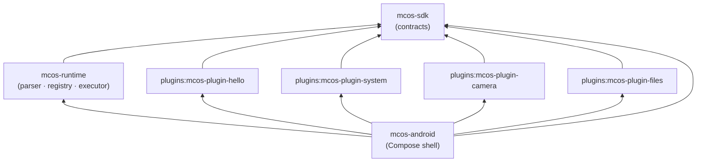

# MCOS 仓库与模块索引

> **状态：** 参考性文档（目标设计）
> **最后更新：** 2026-08-06
> **作为规范的依据：** 未来实现阶段必须按本文档创建的模块拓扑。

MCOS 当前是一个**纯设计仓库**——尚无任何构建产物或源码模块。本文档规定了目标模块划分、依赖图与约定，以便进入实现阶段（P1）时，Gradle 多模块布局与规范保持一致。

各子系统的实现阶段划分，见 [11-implementation-status.md](./11-implementation-status.md)。

---

## 1. 依赖图（目标）

从下往上读：`mcos-sdk` 是最底层的契约层，所有模块都依赖它。`mcos-android` 聚合了运行时、SDK 与全部插件。

---

## 2. 模块清单（目标）

### `mcos-sdk` — 插件契约（叶子层）

| | |
|---|---|
| 路径 | `mcos-sdk/` |
| 包名 | `com.mcos.sdk` |
| 职责 | 宿主侧契约层：`McosPlugin`、`CommandHandler`、`CommandDescriptor`、`SideEffectClass`、`CommandResult`、`ExecutionContext`。 |
| 依赖 | （无——叶子层）`api` kotlinx-serialization-json、kotlinx-coroutines-core |
| 技术栈 | Kotlin/JVM · JDK 17 · kotlinx.serialization |
| 规范 | [04-plugin-sdk.md](./04-plugin-sdk.md) §5 |

### `mcos-runtime` — Command Bus 内核

| | |
|---|---|
| 路径 | `mcos-runtime/` |
| 包名 | `com.mcos.runtime.*`（`ir`、`parse`、`registry`、`permission`、`scheduler`、`executor` 等） |
| 职责 | 解析 DSL → IR；Registry（注册表）、Permission Kernel（权限内核）、Scheduler（调度器）、Workflow Engine（工作流引擎）、Executor（执行器）、Audit（审计）。 |
| 依赖 | `api(project(":mcos-sdk"))`；serialization-json、coroutines-core |
| 技术栈 | Kotlin/JVM · JDK 17 · kotlinx.serialization |
| 规范 | [02-command-protocol.md](./02-command-protocol.md)、[03-runtime.md](./03-runtime.md) |

### `mcos-android` — Compose 客户端外壳

| | |
|---|---|
| 路径 | `mcos-android/` |
| 包名 | `com.mcos.android` |
| 职责 | Jetpack Compose 客户端：DSL/Chat 输入、计划预览、确认交互、插件商店、设置、审计查看器。 |
| 依赖 | `:mcos-runtime`、`:mcos-sdk`、各插件；AndroidX（core-ktx、lifecycle、activity-compose）、Compose BOM |
| 技术栈 | Kotlin/Android · Compose · compileSdk 35 / minSdk 26 · JDK 17 |
| 规范 | [01-architecture.md](./01-architecture.md) §6.1、[10-roadmap.md](./10-roadmap.md) §4.1 |

### `plugins:mcos-plugin-hello` — 参考示例

| | |
|---|---|
| 路径 | `plugins/mcos-plugin-hello/` |
| 包名 | `com.mcos.plugin.hello` |
| 职责 | 标准示例插件。`hello.world(name)` 返回一句问候。附带 `plugin.json` 清单。 |
| 依赖 | `api(project(":mcos-sdk"))`；serialization-json、coroutines-core |
| 技术栈 | Kotlin/JVM · JDK 17 |
| 规范 | [04-plugin-sdk.md](./04-plugin-sdk.md) §16 |

### `plugins:mcos-plugin-system` — 系统命令

| | |
|---|---|
| 路径 | `plugins/mcos-plugin-system/` |
| 包名 | `com.mcos.plugin.system` |
| 职责 | `sys.notify` / `sys.share` / `sys.intent.start` 命令。 |
| 依赖 | `api(project(":mcos-sdk"))` |
| 技术栈 | Kotlin/JVM · JDK 17 |
| 规范 | [04-plugin-sdk.md](./04-plugin-sdk.md) §17 |

### `plugins:mcos-plugin-camera` — 相机命令

| | |
|---|---|
| 路径 | `plugins/mcos-plugin-camera/` |
| 包名 | `com.mcos.plugin.camera` |
| 职责 | `camera.capture` / `camera.scan` 命令。 |
| 依赖 | `api(project(":mcos-sdk"))` |
| 技术栈 | Kotlin/JVM · JDK 17 |
| 规范 | [04-plugin-sdk.md](./04-plugin-sdk.md) §4.1、§17 |

### `plugins:mcos-plugin-files` — 文件 / 媒体命令

| | |
|---|---|
| 路径 | `plugins/mcos-plugin-files/` |
| 包名 | `com.mcos.plugin.files` |
| 职责 | `file.list` / `file.search` / `photo.search` / `photo.compress` 命令。 |
| 依赖 | `api(project(":mcos-sdk"))` |
| 技术栈 | Kotlin/JVM · JDK 17 |
| 规范 | [04-plugin-sdk.md](./04-plugin-sdk.md) §17 |

---

## 3. 计划模块（后续阶段）

| 模块 | 职责 | 目标阶段 |
|--------|------|--------------|
| `mcos-plugin-iot` | `home.*`、`iot.*`（Home Assistant / Tuya / Matter） | P2 |
| `mcos-plugin-mcp` | MCP 客户端适配器 → `mcp.*` 命令 | P2 spike / P3 production |
| `mcos-server` | 同步、市场索引、远程策略 | P3 |

---

## 4. 推荐的构建坐标

针对未来（P1）将要创建的 Gradle 构建。建议使用版本目录（`gradle/libs.versions.toml`）。

| 坐标 | 建议值 |
|------------|-----------------|
| Kotlin | 2.0.21+ |
| AGP | 8.7.3+ |
| Compose BOM | 2024.12.01+ |
| compileSdk / minSdk / targetSdk | 35 / 26 / 35 |
| JVM toolchain | 17 |
| kotlinx.serialization | 1.7.3+ |
| kotlinx.coroutines | 1.9.0+ |
| group（JVM 模块） | `com.mcos` |
| version（JVM 模块） | `0.1.0-SNAPSHOT` |

> 以上为建议值，非承诺；首次真实构建可能锁定不同的兼容版本。

---

## 5. 约定

- **包根：** `com.mcos.<module>`——Android、runtime、sdk；插件为 `com.mcos.plugin.<name>`。
- **官方插件 ID：** `mcos.plugin.<name>`（示例插件 `example.hello` 除外）。
- **清单约定：** 每个插件**应当**附带一份符合 [04-plugin-sdk.md](./04-plugin-sdk.md) §4 的 `plugin.json`。
- **DSL / IR / Workflow 版本：** 见 [02-command-protocol.md](./02-command-protocol.md) §14（`dslVersion` 为 `MAJOR.MINOR`；命令契约为 SemVer）。
