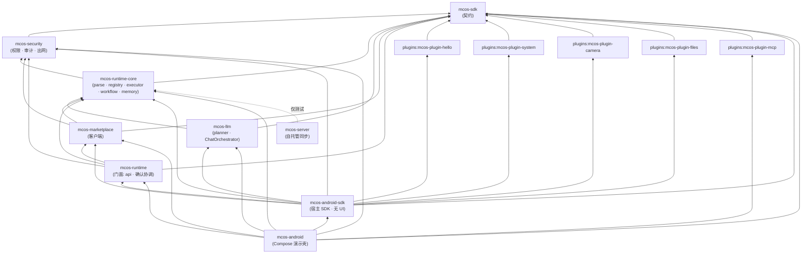

# MCOS 仓库与模块索引

> **状态：** 参考性文档（实际结构）
> **最后更新：** 2026-08-30
> **作为规范的依据：** 实现所遵循的模块拓扑；边界变更必须同步更新本文档与 [01-architecture.md](./01-architecture.md)。

MCOS 是一个**已实现**的多模块仓库——下述 Gradle 布局是*实际*结构（P1 首批模块、后续 `mcos-runtime` / `mcos-runtime-core` 拆分出的 `mcos-security` / `mcos-llm` / `mcos-marketplace`，`mcos-server`，以及 `mcos-android-sdk` / `mcos-android` 宿主 SDK 与演示壳拆分），而非提案。本文档仍是模块边界、依赖图与命名约定的规范性参考。

各子系统的实现阶段划分，见 [11-implementation-status.md](./11-implementation-status.md)。

---

## 1. 依赖图（实际）

从下往上读：`mcos-sdk` 是最底层的契约层，所有模块都依赖它。`mcos-runtime-core`（连同 `mcos-security`）承载内核子系统；`mcos-runtime` 是门面，以 `api` 导出 `sdk`/`security`/`runtime-core`/`marketplace`；`mcos-llm` 刻意**只**依赖 `sdk` + `runtime-core`（绝不依赖门面——Planner 必须可以脱离外壳独立使用，见 [01 §7](./01-architecture.md)）；`mcos-server` 无编译期项目依赖（runtime-core 仅出现在测试中，虚线）；`mcos-android-sdk` 聚合门面、llm、marketplace 与参考内置插件集，但**不含任何 UI 代码**——它是集成方 App 嵌入的库；`mcos-android` 是构建其上的 Compose 演示壳（对 ViewModel/测试代码用到的模块保留直接边，外加 MCP 适配插件）。

---

## 2. 模块清单（实际）

### `mcos-sdk` — 插件契约（叶子层）

| | |
|---|---|
| 路径 | `mcos-sdk/` |
| 包名 | `com.morainet.mcos.sdk` |
| 职责 | 宿主侧契约层：`McosPlugin`、`CommandHandler`、`CommandDescriptor`、`SideEffectClass`、`CommandResult`、`ExecutionContext`。 |
| 依赖 | （无——叶子层）`api` kotlinx-serialization-json、kotlinx-coroutines-core |
| 技术栈 | Kotlin/JVM · JDK 17 · kotlinx.serialization |
| 规范 | [04-plugin-sdk.md](./04-plugin-sdk.md) §5 |

### `mcos-runtime` — 运行时门面

| | |
|---|---|
| 路径 | `mcos-runtime/` |
| 包名 | 门面 `com.morainet.mcos.runtime`（`api`：`McosRuntime`、`RunManager`、`ConfirmationCoordinator`）；内核子系统在 `mcos-runtime-core` 的 `runtime.core.*`（`ir`、`parse`、`registry`、`memory`、`executor`、`workflow` 等） |
| 职责 | 宿主侧入口：把内核组装成可用的 `McosRuntime`，持有 run 生命周期（`RunManager`）与确认协调。以 `api` 导出 `sdk`/`security`/`runtime-core`/`marketplace`，宿主只需依赖这一个模块。另持有 `PackageBoundariesTest` 守卫测试。 |
| 依赖 | `api(project(":mcos-sdk"))`、`api(project(":mcos-security"))`、`api(project(":mcos-runtime-core"))`、`api(project(":mcos-marketplace"))`；serialization-json、coroutines-core |
| 技术栈 | Kotlin/JVM · JDK 17 · kotlinx.serialization |
| 规范 | [02-command-protocol.md](./02-command-protocol.md)、[03-runtime.md](./03-runtime.md) |

### `mcos-security` — 安全内核

| | |
|---|---|
| 路径 | `mcos-security/` |
| 包名 | `com.morainet.mcos.security`（`audit`、`validate`、`permission` 等） |
| 职责 | 权限内核（`decideConfirmation`）、`AuthStampSigner`（HMAC）、`SchemaValidator`（Draft 2020-12 + MCOS 扩展）、`RateLimiter`（阶段 5.5）、出网策略（`decideEgress`，阶段 6.5）、`FileGrantStore`（授权持久化 + HMAC 防篡改）、`FileAuditLog` + 脱敏遍历器、`CrashQuarantine`、`Canonicalizer`。 |
| 依赖 | `api(project(":mcos-sdk"))`；serialization-json（公开签名暴露 `JsonObject`） |
| 技术栈 | Kotlin/JVM · JDK 17 · kotlinx.serialization |
| 规范 | [08-security.md](./08-security.md) |

### `mcos-runtime-core` — 内核子系统

| | |
|---|---|
| 路径 | `mcos-runtime-core/` |
| 包名 | `com.morainet.mcos.runtime.core`——`core.api`（`RuntimeGateway`、类型）、`core.ir`、`core.parse`（`DslParser`）、`core.registry`、`core.executor`（管线：Resolve → Validate → **5.5 限流** → Authorize → **6.5 出网** → Invoke → Audit）、`core.workflow`、`core.memory`、`core.events`、`core.plugin`、`core.error` |
| 职责 | Command Bus 内核：DSL→IR 解析、带版本选择的 Registry、Executor 管线、WorkflowEngine（顺序/并行/条件/循环/重试/补偿）、memory 子系统（`MemoryStore`、情景记忆、向量钟同步）。 |
| 依赖 | `api(project(":mcos-sdk"))`、`api(project(":mcos-security"))`；coroutines-core |
| 技术栈 | Kotlin/JVM · JDK 17 · kotlinx.serialization |
| 规范 | [02-command-protocol.md](./02-command-protocol.md)、[03-runtime.md](./03-runtime.md)、[05-workflow.md](./05-workflow.md)、[07-memory.md](./07-memory.md) |

### `mcos-llm` — Planner 技术栈

| | |
|---|---|
| 路径 | `mcos-llm/` |
| 包名 | `com.morainet.mcos.llm` |
| 职责 | `ChatOrchestrator`（多供应商、健康探测、隐私门、事件超时）、PlanModes、NL→IR 计划评估、触发配方。刻意**不**依赖 `mcos-runtime` 门面——Planner 必须可以脱离外壳独立使用（见 [01 §7](./01-architecture.md)）。 |
| 依赖 | `api(project(":mcos-sdk"))`、`api(project(":mcos-runtime-core"))` |
| 技术栈 | Kotlin/JVM · JDK 17 · kotlinx.serialization |
| 规范 | [06-agent.md](./06-agent.md) |

### `mcos-marketplace` — 市场客户端

| | |
|---|---|
| 路径 | `mcos-marketplace/` |
| 包名 | `com.morainet.mcos.marketplace` |
| 职责 | 插件市场的客户端侧：索引拉取/解析、签名链验证（`TrustAnchors`，真实运营方密钥为 fail-closed 占位）、包下载并安装进插件注册表。 |
| 依赖 | `api(project(":mcos-sdk"))`、`api(project(":mcos-security"))`、`api(project(":mcos-runtime-core"))` |
| 技术栈 | Kotlin/JVM · JDK 17 · kotlinx.serialization |
| 规范 | [09-marketplace.md](./09-marketplace.md) |

### `mcos-android-sdk` — Android 宿主 SDK（无 UI 库）

| | |
|---|---|
| 路径 | `mcos-android-sdk/` |
| 包名 | `com.morainet.mcos.android` —— 根包（`CompositionRoot`/`AppDeps`、`RuntimeBootstrap`、`ScheduleAlarmReceiver`、`BootReceiver`、`DynamicPluginLoader`、`MarketplacePluginFactory`、`PluginPermissionBootstrap`、`TrustAnchors`、`McosHostApp`、`McpServerController` + `McpServerBridge` 端口与结果类型、`TriggerMaintenance`、`MarketplaceTrust`）+ `host`（`AndroidHostServices`、`ActivityResultBridge`、`RuntimePermissionBridge`、`AlarmManagerWakeScheduler`、`AndroidLlmHttpTransport`、`AndroidMarketplaceHttpTransport`）+ `host.isolation`（纯 Kotlin 隔离 RPC，08 §8：`IsolationChannel`/`IsolationOps`/`IsolationCodec` 线 codec、`BinderIdentityPolicy`、`IsolatedFacadeServer`、`IsolatedHostServicesProxy`、`TransportIsolationHost`、`IsolatedPluginRunner`——Binder 适配器为后续切片） |
| 职责 | Android App 托管 MCOS 运行时所需的**全部无 UI 能力**：组合根（生产安全姿态，内置插件集可经 `CompositionRoot.create(context, builtIns)` 注入替换）、无头进程引导与持久调度重挂接收器、接收器经 `McosHostApp` 缝隙取宿主 `AppDeps`、activity-result / 运行时权限桥、HTTP 传输适配器，以及宿主自有 UI 之下的**宿主控制器**——MCP 服务管理（`McpServerController` 经 builtin 信任的 runtime 安装管线驱动持久化/密钥/启用停用，发现经 `McpServerBridge` 端口注入、库因此零 MCP 客户端依赖）、卸载撤防清扫（`TriggerMaintenance`）、吊销刷新（`MarketplaceTrust`）、安装期激活（`PluginPermissionBootstrap.activate`）——以及**隔离 RPC 层**（08 §8）：插件进程边界的纯 Kotlin 两半——facade server 与在插件进程内执行 invocation 的 `IsolatedPluginRunner`——端到端（真实 Executor → 通道 → runner → proxy → 宿主服务之上的 facade）可 JVM 测试，Binder 传输留作日后的薄适配器。库 manifest 携带全部宿主权限、接收器与 FileProvider，合并进任意集成方 App。 |
| 依赖 | `:mcos-sdk`、`:mcos-security`、`:mcos-runtime-core`、`:mcos-runtime`、`:mcos-llm`、`:mcos-marketplace`、四个内置插件；AndroidX core-ktx + activity-ktx（刻意**不引** Compose/ViewModel） |
| 技术栈 | Kotlin/Android library · compileSdk 35 / minSdk 26 · JDK 17 |
| 规范 | [01-architecture.md](./01-architecture.md) §6.1、[04-plugin-sdk.md](./04-plugin-sdk.md) §6.3、[10-roadmap.md](./10-roadmap.md) |

### `mcos-android` — Compose 演示壳

| | |
|---|---|
| 路径 | `mcos-android/` |
| 包名 | `com.morainet.mcos.android.demo`（`applicationId` 保持 `com.morainet.mcos.android` 不变） |
| 职责 | `mcos-android-sdk` 的参考消费者：可整体替换的 Jetpack Compose 外壳（DSL/Chat 输入、计划预览、确认交互、插件商店、设置、审计查看器）及其 ViewModel。任何 App 都可嵌入 SDK 并完全自研 UI——本模块的存在是验证这条缝隙，而非作为 UI 复用。 |
| 依赖 | `:mcos-android-sdk` + ViewModel/测试代码直接用到的边（`sdk`、`security`、`runtime-core`、`runtime`、`llm`、`marketplace`、`plugins:mcos-plugin-mcp`；四个内置插件作为测试夹具）；AndroidX（core-ktx、lifecycle、activity-compose）、Compose BOM |
| 技术栈 | Kotlin/Android application · Compose · compileSdk 35 / minSdk 26 · JDK 17 |
| 规范 | [01-architecture.md](./01-architecture.md) §6.1、[10-roadmap.md](./10-roadmap.md) §4.1 |

### `plugins:mcos-plugin-hello` — 参考示例

| | |
|---|---|
| 路径 | `plugins/mcos-plugin-hello/` |
| 包名 | `com.morainet.mcos.plugin.hello` |
| 职责 | 标准示例插件。`hello.world(name)` 返回一句问候。附带 `plugin.json` 清单。 |
| 依赖 | `api(project(":mcos-sdk"))`；serialization-json、coroutines-core |
| 技术栈 | Kotlin/JVM · JDK 17 |
| 规范 | [04-plugin-sdk.md](./04-plugin-sdk.md) §16 |

### `plugins:mcos-plugin-system` — 系统命令

| | |
|---|---|
| 路径 | `plugins/mcos-plugin-system/` |
| 包名 | `com.morainet.mcos.plugin.system` |
| 职责 | `sys.notify` / `sys.share` / `sys.intent.start` 命令。 |
| 依赖 | `api(project(":mcos-sdk"))` |
| 技术栈 | Kotlin/JVM · JDK 17 |
| 规范 | [04-plugin-sdk.md](./04-plugin-sdk.md) §17 |

### `plugins:mcos-plugin-camera` — 相机命令

| | |
|---|---|
| 路径 | `plugins/mcos-plugin-camera/` |
| 包名 | `com.morainet.mcos.plugin.camera` |
| 职责 | `camera.capture` / `camera.scan` 命令。 |
| 依赖 | `api(project(":mcos-sdk"))` |
| 技术栈 | Kotlin/JVM · JDK 17 |
| 规范 | [04-plugin-sdk.md](./04-plugin-sdk.md) §4.1、§17 |

### `plugins:mcos-plugin-files` — 文件 / 媒体命令

| | |
|---|---|
| 路径 | `plugins/mcos-plugin-files/` |
| 包名 | `com.morainet.mcos.plugin.files` |
| 职责 | `file.list` / `file.search` / `photo.search` / `photo.compress` 命令。 |
| 依赖 | `api(project(":mcos-sdk"))` |
| 技术栈 | Kotlin/JVM · JDK 17 |
| 规范 | [04-plugin-sdk.md](./04-plugin-sdk.md) §17 |

### `mcos-server` — 自托管同步端点

| | |
|---|---|
| 路径 | `mcos-server/` |
| 包名 | `com.morainet.mcos.server` |
| 职责 | 独立自托管同步端点：`SyncBlobTransport` REST 契约（`PUT|GET|DELETE /blobs/{id}`）+ 强制 Bearer token 认证；磁盘持久化存储不透明（已加密）blob，绝不解析内容。 |
| 依赖 | 无（JDK `com.sun.net.httpserver`）；测试复用 `:mcos-runtime-core` 做真实 transport 互操作验证（拆分后 memory 包位于该模块） |
| 技术栈 | Kotlin/JVM · JDK 17 · 零第三方运行时依赖 |
| 规范 | [07-memory.md](./07-memory.md) §11.0 |

---

## 3. 计划模块（后续阶段）

| 模块 | 职责 | 目标阶段 |
|--------|------|--------------|
| `mcos-plugin-iot` | `home.*`、`iot.*`（Home Assistant / Tuya / Matter） | P2 |
| `mcos-plugin-mcp` | MCP 客户端适配器 → `mcp.*` 命令 | P2 spike / P3 production |

`mcos-server` 已作为 `mcos-server/` 落地（见 §2），覆盖「同步」职责；市场索引与远程策略仍为 P3。

---

## 4. 构建坐标（实际）

Gradle 构建已存在，并通过版本目录（`gradle/libs.versions.toml`）固定以下坐标。

| 坐标 | 实际值 |
|------------|-----------------|
| Kotlin | 2.0.21+ |
| AGP | 8.7.3+ |
| Compose BOM | 2024.12.01+ |
| compileSdk / minSdk / targetSdk | 35 / 26 / 35 |
| JVM toolchain | 17 |
| kotlinx.serialization | 1.7.3+ |
| kotlinx.coroutines | 1.9.0+ |
| group（JVM 模块） | `com.morainet.mcos` |
| version（JVM 模块） | `0.1.0-SNAPSHOT` |

> 以上为建议值，非承诺；首次真实构建可能锁定不同的兼容版本。

---

## 5. 约定

- **包根：** 每个模块独占 `com.morainet.mcos.<module>.*`（sdk、security、llm、marketplace、android、server 等）；运行时内核对为 `com.morainet.mcos.runtime`（门面）与 `com.morainet.mcos.runtime.core.*`（core）；插件为 `com.morainet.mcos.plugin.<name>`。映射由 `PackageBoundariesTest` 强制。
- **官方插件 ID：** `mcos.plugin.<name>`（示例插件 `example.hello` 除外）。
- **清单约定：** 每个插件**应当**附带一份符合 [04-plugin-sdk.md](./04-plugin-sdk.md) §4 的 `plugin.json`。
- **DSL / IR / Workflow 版本：** 见 [02-command-protocol.md](./02-command-protocol.md) §14（`dslVersion` 为 `MAJOR.MINOR`；命令契约为 SemVer）。
